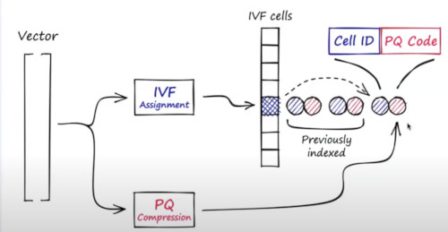

# LECTURE 8: THE PINECONE VECTOR DATABASE SYSTEM

¬ Edo Liberty

https://www.youtube.com/watch?v=8LXotdzX_84&list=PLSE8ODhjZXjbDOFN4U4-Uv95-N8sgzs5D&index=8&t=1501s

- WHAT IT IS A VECTOR DATABASE?
  - THE ANSWER
  - SEMANTIC SEARCH
- VECTOR INDEX
  - A NEW KIND OF SEMANTIC QUERY
  - LOCAL SENSITIVITY HASHING (LSH)

## WHAT IT IS A VECTOR DATABASE?

Today
- Simple objects, text tables, json
- Simple questions - keywords, SQL, filters

Tomrrow
- Complex objects, natural language, images
- Complex questions, meaning similarity

### THE ANSWER
The answer has emerged from deep learning models

Represent your data into semantic vectors, 
- as well as the query

This is already the standard
- encode meaning
- semantic search
  

You already are using it
- google search
- Amazon
- facebook

The query is represented as a semantic vector instead of text

### SEMANTIC SEARCH
Find Zeus's siblings  (dog)

so you would insert first the entire database
- then embed those images
- and do the search
  

## VECTOR INDEX
Recap from machine learning
- the linear classifier

### A NEW KIND OF SEMANTIC QUERY
How to scan the data?

QUERY = CLASSIFIER
- half plane (dot product)
- cone (cosine similirty)
- ball (euclidian distance)

**MAIN IDEA**
same as a regular database,
- but instead of foreign keys, use a semantic vector key.
- better, you have regular primary keys, but indexes are semantic vectors

#### WHY IS VECTOR SEARCH HARD?
As you increase the dimmension, it becomes harder to select a specific position.
- any naive partition of the space is going to break your computer power.
  

The search vectors strongly depends on the type of data that you have

### LOCAL SENSITIVITY HASHING (LSH)
How to partition the space?

Think about 2 points in space
- they have some angle between them

What would happen to your space if you cut the entire space in half
- by a random hyperplane

How likely is, that your random cut is going to split those 2 points
- so they live in different sides of the hyperplane

The answer is exactly proportional to the angle
- if the angle is zero, they will always lie in the same side.
- if the angle is 180º, they will always lie in different sides.
- if they are 90º apart, there would be 50/50 percent.

What Happen if now we split 10 times the space
- each point is then converted into this 2^10, so like 10 bits hash value
- which bakes into this nice property that i can mathematically calculate
  - the probability of 2 points having the exact same hash,
  - based on what's the angle between them.

You can boost that
- instead of hashing every point you hash into a bucket.
- but i'll hash every vector to a bunch of buckets
- and make sure that i have boosted the probability such that
  - if 2 things are close enough (angle-wise)
  - they would colide with high probability
  - that means looking for them in the same bins
  - which is start to looking like a geometric search
  - or like an inverted index
- buckets ids = LSH

### INVERTED FILE (IVF) OR CLUSTERING
it's not very efficient 
- you cut things with random hyperplanes

we can do better using clusters.
- if you take the data that you have, and you cluster it into points that are geometrically closer to each others

In this case you delievered some points that don't match the requirements
- and you have wasted some compute
  

This database is now approximated.
- it don't always return what you expect

Note that i have to compute the dot product of each sample with each center.
- you would have many thousands of centers.
- you might want to use navigation centers.

### NAVIGATION CENTERS
Instead of computing each center
- create this **navigation graph** on points
- you start from a random center
- and move towards centers that improves their proximity

A traversal graph, where each edge is the distance between one center and the next one.
- to efficiently avoid computing that many centroids dot products

It generalizes the idea of a skip list.

However it performs really well in some datasets,
- and poorly in other ones.

### PRODUCT QUANTIZATION (PQ)
Can i scan through all points faster?
- instead of computing the full dot product, can i do less?
- can i discard points that are further away?
  - with had degree of certainty

Product quantization
- chuck it to say 100 sections of length 10

Actually do clustering on each of those 10 dimensional sections
- round off, tose sections into their nearest neighbors
  

Then when you compute the quantization in real time
- instead of doing the dot product for those 100 sections
  - i would just keep the ID of the center of those sections
 
Now i have huge compressions,
- instead of 1000 floats, i have 100 things

In real time you can figure out each section, where it maps to.
- and which is the dot product to which one of those centers
- populate a list of values

And then the approximate dot product would turn into 
- a look up and an add

If the look up table is small, you can fit it in the smallest caches.
- sometimes registers
- that would be incredible efficient

### ANYSOTROPIC PRODUCT QUANTIZATION
Note that not all the results are created equally
- if some point far far away from the centroid of the ball
- i'm not interested gauging that distance very accurately
  - i just want to know that i'm too far away to actually care about it
- you actually want to do a good approximation to points that you are likely to return
  

That creates a very tight coupling between  query distribution and point distribution

The right thing to do, is not to cluster points to the nearest cluster center
- in fact that centroid may not be the center at all

### PROJECTIVE CLUSTERING PRODUCT QUANTIZATION
A method to take those anysotropic allocation correctly
- you get about 5-10 % of boost over the previous scheme

### IVF-PQ (combining the two ideas)
combining those 2 techniques are quite challanging
- you would have to search through fewer chunks of data
- and for each chunk you have to compute it more efficiently

### THE MISSING WHERE CLAUSE IN VECTOR SEARCH
FILTERING

we don't only want to answer traditional vector search queries.
- but figure it out, how to combine with traditional queries.

You can have 2 different approaches,
- First filter, with your traditional post-filter solution.

But then you would pre-filter.
- saves computation
- reduce the set of vectors to look up
- but horrible inefficient

## VECTOR CLOUD DATABASE

### COMPLEX INDEX CREATION AND UNKEEP
The structure of the index can be laid out on disk and memory
- vector database, breaks even more patterns of other databases out there

We have this geometrical content based on sharding and layout on disk
- maybe a geospatial dataset

commonly is not time based,
- or just random sharding

It's very dependent on which things goes where, which data point goes into each cluster or database partition

The data itself is huge,
- the record is not a just a small json, it could be 1kb of floats

Colors may represent different clusters

now you want to create the index,
- the index is not just an append to an inverted index
- not building a B+Tree neither
- it's a computationaly heavy process
- you compute clusters, compute regressions
- they are heavy enough that you would delegate GPUs to that.

So the creating of the index, looks more like running some very heavy machine learning training process.

And to top everything off
- you unfortunatelly have to deal with OLTP like point updates.
- it's not just a pure append.
- it's a really heavy append operation
- but there are a lot of use cases where what you have to do is point updates

Think about it as a recomendation engine,
- where somebody views something  or says they rate something very highly
- then you wouldn't really update your representation of their preferences
- which will immediatelly reflect next things to be recomended

### OLAP LIKE QUERY CANDIDATE GENERATION
The vector databases indexes approximate, doesn't pin point exactly what needs to be retrieved
- but rather they give you a set of candidates
- there's this scan operation, that you pinpoint the set of clusters you want to look at
- that fraction is huge
- you are not looking at 1 or 2 clusters, your are looking at 10% or 5% of the entire data

The query is then very scan heavy, very CPU demanding

which actually generates candidates,
- to which you actually have to go and fetch the metadata in raw vectors
- and first they would verify that they actually match the condition
- then you have to return the metadata, and the vectors themselves
  

There's a second phase, the multi-fetch
- sometimes for thousands of records (they are not small records)
- all of that has to conclude in 50 to 100 miliseconds on a lot of data

### ELASTICITY AND STORAGE-COMPUTE SEPARATION

### FUTURE CHALLANGES
- Generalizing ANN to arbitrary similarity measures
- Learning Query distributions and improving indexes
- Retraining and refining vectors embeddings
- Improving vector indexes
- Optimize storage hierarchies better
- Using specialized hardware
- Auto embedding of complex data
