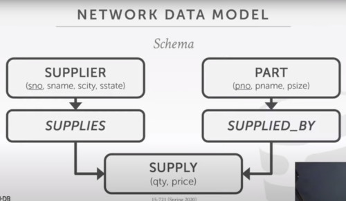

# Introduction

For each class you have to read a paper and submit a synopsis before class of:

1. overview of main idea (three sentences, like the overview)
2. Main findings/takeaway of paper
3. System used and how it was modified (one sentence)
4. Workloads evaluated

---

Papers of this class.
1. What goes around comes around
2. What's really new with newsql

Old debate SQL vs NOSQL 1970'
- Relational model always wins

### Integrated Data Store (IDS) 1960
Developed by General Electric, then sold to Honeywell in 1969

One of the first DBMSs
- Network data model
- Tuple at a time queries. (loops iterating each data)

### CODASYL 1960
Cobol People proposed a standard of how programs should access a database
- Network data model
- Tuple at a time time queries

-> Integrated Data Manadgement System (IDMS) 1970

## Network data model

