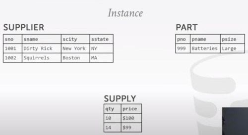
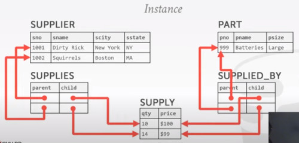
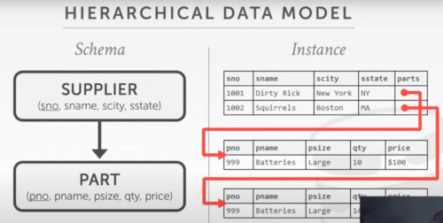
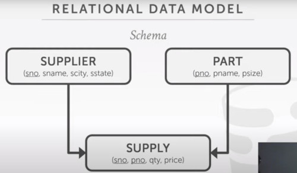
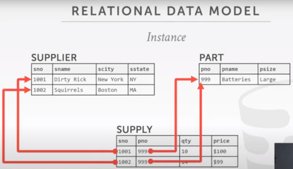
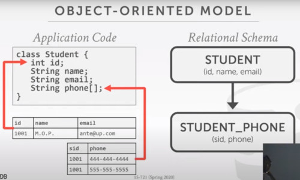
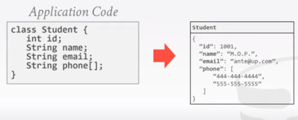

# Introduction

For each class you have to read a paper and submit a synopsis before class of:

1. overview of main idea (three sentences, like the overview)
2. Main findings/takeaway of paper
3. System used and how it was modified (one sentence)
4. Workloads evaluated

---

Papers of this class.
1. What goes around comes around
2. What's really new with newsql

Old debate SQL vs NOSQL 1970'
- Relational model always wins

### Integrated Data Store (IDS) 1960
Developed by General Electric, then sold to Honeywell in 1969

One of the first DBMSs
- Network data model
- Tuple at a time queries. (loops iterating each data)

### CODASYL 1960
Cobol People proposed a standard of how programs should access a database
- Network data model
- Tuple at a time time queries

-> Integrated Data Manadgement System (IDMS) 1970

 
## Network data model
Suppose we have to model a large company 
- keep track of all different parts we have to buy from different suppliers
- which supplier supplies which part

First we model the system

Then we instanciate those items

Finally we have to tell which part correspond to which supplier

Issues
- The traversal of this schema requires a lot of for loops.
- These tables are easily corruptible (old disks gotten corrupted, you won't recover from an error)

## Information Management System (IMS) IBM 1960
Developed to keep track of purchase orders for apollo moon mission.
- Hierarchical data model (instead of the networking model)
- Programmer-defined physical storage format
- Tuple-at-a-time queries

They have programmer defined physical storage formats. So when you declare a table you also define
what will be the underlying data structure you would use physically.

It's also like the networking model, you have to travel with some sort of for loops and operate a single tuple at a time.

## Hierarchical Data Model
- The schema has simplified into 2 collections
- But in the instance we have a lot of redundant information
- 

If multiple suppliers provides the same part, i have to have different instances of that record. If the name of that part i have to find each instances and replace them all.
- There's no independence between the physical data structure of the databases and the logical abstraction that programmers interacted with.

## Relational Model 1970 by Codd
Database abstraction to avoid this maintenance
- Store databases in simple data structures
- Access data through high level language
- Physical storage left up to implementation

DBMS handles the physical implementation while queries are now independant of them.

## Relational model wins 1980
SQL becomes the standard
- IBM->DB2
- Oracle (won marketplace)
- Informix
- Tandem
- Sybase
- Teradata
- Ingres
- Interbase

Stonebraker creates Postgres

## Object Oriented Databases 1980
'avoid relational-object impedance mismatch' by tightly coupling objects and databases.
Bottleneck for storing complex objects with arrays, etc. Solution was Json, XML.

Versant
ObjectStore
MarkLogic

Suppose you want to store some student information
- you have to do 2 queries for the student in order to get both fields
- this is called the relational-object impedance mismatch
  

So why won't you store into a Json file instead

It's easy for one student, but how does it scales those queries?
- You have to traverse the hierarchy of every single record
- Also you have to join across these multiple records with many formats.
- Also there's no standard API
  - MongoDB is quite a standard, tho

## Boring Days 1990
No major advancements in database systems.
- Microsoft forks Sybase and created SQL server
- Postgres gets SQL support
- SQLite has born in early 2000

Embeded Databases are now also possible

## Data Warehouses 2000
The existing database of that time couldn't do analytics
- Distributed / Shared-nothing
- Relational / SQL
- Usually closed source

Significant performance benefits from using columnar data storage model.
- Netezza
- Paraccel
- monetdb
- greenplum
- DATAllegro
- Vertical

## NoSQL Systems Late 2000
Companies like google recognized for applications they want to support on the web they cared morea about:
- data system gets always available
- They could scale to port large amount of users

They have dropped traditional ideas like
- transactions
- joints
- SQL support
  
Focus on high availability & high scalability
- schemaless
- Non-relational data models (document, key/values)
- No ACID transactions
- Custom APIs instead of SQL
- Usually Open source

Examples
- MongoDB
- cassandra
- Amazon DynamoDB
- Apache HBase
- NOSQL
- redis
- rethinkdb
- Couchbase
- riak
- neo4j
- couchdb
- Aerospike
- RavendB

## NewSQL 2010
Provides the same performance of OLTP workloads as NoSQL DBMS without giving up ACID:
- relational SQL
- distributed
- Closed source

Examples
- dbshards
- H-store
- Clustrix
- cockroach labs
- ScaleArc
- SAPHana
- VoltDB
- nuodb
- comdb2
- google spanner
- MEMSQL
- HyPer
- YugaByte
- Ti-

## Hybrid Systems 2010s
It supports some analytics, you can run it on a warehouse
- Instead of maintaining two servers databases (one for transactions and one for analytics)
- you could push some  of those analytics operations directly into the frontend system
- and extrapolate new knowledge, new information in the data as it arrives into the database system
Hybrid Transactional Analytical Processing (HTAP)

Execute fast OLTP like a NewSQL while also executing complex OLAP queries like a data Warehouse system.
- Distributed / shared nothing
- Relational / SQL
- Mixed Open/closed source

Examples
- MEMSQL
- HyPER
- Snappy
- Justone
- Splice Machine
- Peloton
- Sa---

## Cloud Systems 2010s
Just get the existing database and put into a VM container.
- The latency is now considered
  
First database as a service (DBaas) offerings were 'containerized' versions of existing DBMS
There are new DBMS that are designed from scratch explicitly for running in a cloud environment

Examples.
- SlicingDice
- Snowflake
- Fauna
- Amazon redshift
- Amazon Dynamodb
- Amazon Aurora
- Xeround
- google spanner

## Shared Disk Engines
Instead of writing custom storage manager, the DBMS leverages distributed storage
- Scale execution layer independently of storage
- Favors log-structured approaches

This is what people most think when they talk about Data Lakes

In this environments the storage layer is usually append only
- log structure

Examples:
- Apache Drill
- presto
- splice machine
- snowflake
- amazon redshift
- cloudera imapala
- apache spark

Because you have separated the physical layer from the compute layer
- you can scale them independently
- The execution is stateless
  The final state of the disk is always on the shared disk, so if i can't process queries fast enough
  Then i can just keep adding new computes nodes and start more queries in parallel.
- like if you need to scale out more machines, you can add a new disk of the shared disk layer.

## Graph systems
Systems for storing and quering graph data
their main advantage over data models is to provide graph-centric query API.
- recent research demostrated that this is unclear whether there is a benefit to using graph-centric execution engine and storage manageer

Examples
- neo4j
- graphbase.ai
- memgraph
- terminusDB
- Dgraph
- TigerGraph
- IndraDB
- JanusGraph

## Timeseries Systems 2010s
Specialized systems that are designed to store timeseries / event data.
The design of these systems make deep assumptions about the distribution of data and workload query patterns.

Examples
- M3
- Timescale
- Victoria Metrics
- ClickHouse
- InfluxDB

## Specialized Systems
Embedded DBMS
Multi-model DBMS
Blockchain DBMS
Hardware acceleration
