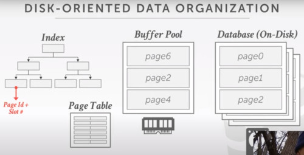
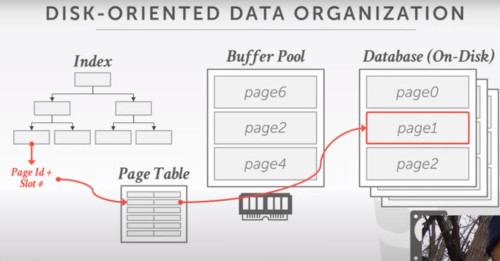
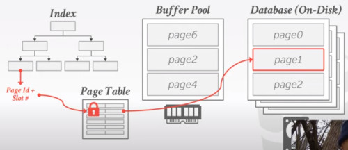
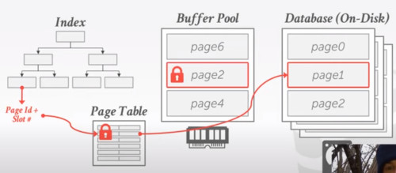
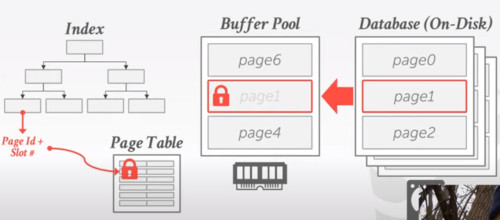
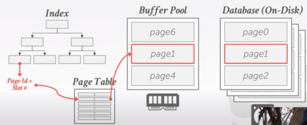
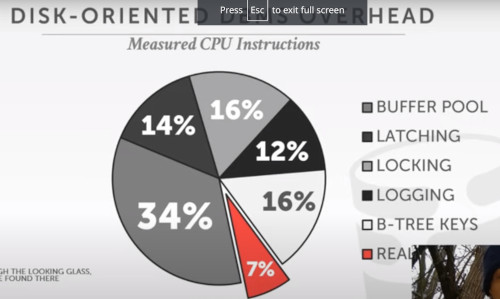
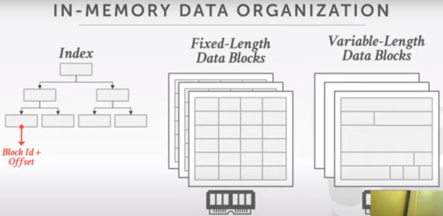
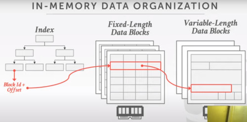

# Lecture 2

## Background
Hardware was much different when the original DBMSs were designed
- Uniprocessor CPU
- Ram was severely limited
- The database had to be stored on disk
- Disk were even slower than they are now.

You always want to run databases on new hardware and get the best performance you can get out of it

But the high level of ideas from back then is almost the same, but limitations are not the same.

- Back then, machines didn't have lot of sockets

**Nowadays**, DRAM capacities are large enough that most databases can fit in memory.
- Structured datasets are smaller
  - Well defined schema
- Unstructured or Semi-structured data sets are larger

We need to understand, why we can't always use a traditional disk oriented DBMS with a large Cache to get best performance.

Many databases are not as large as you think they actually are.

There's no magic in structured data to do vectorized query execution in video data. You have to convert your video data in structured data and run your queries on it.

If my database can mostly fit on main memory, can i take a traditional disk or a database system.
Can we run that on a machine with a large enough v-ram and set a buffer cached size to be big enough 
so that everything is going to fit in memory. And the spoiler is going to be no. We need to understand why.

Today's agenda is 
- Disk oriented DBMS
- In-memory DBMS
- Concurrency Control Bottlenecks

## Disk-Oriented DBMS
The primary storage location of the database is on non-volatile storage (HDD, SSD)

The database is organized as a set of fixed-length **pages** (aka blocks)

The system uses an in-memory **Buffer Pool** to cache pages fetched from the disk
- its **job** is to manage the **movement** of those pages back and forth between **disk** and **memory**

### Buffer Pool
When a Query access a **page**, the DBMS checks to see if that page **is** already in **memory**.
- If it's not, then the DBMS must **retrieve** it from the disk and copy it into a **frame** in its buffer pool.
- If there are **no free frames**, then find a page to evict (free).
  (LRU algorithm, clock any policy to evict frames)
- If the page being **evicted** is **dirty**, then the DBMS must **write** it back to the disk. (more slow stuff to do)

Once the page is in memory, the DBMS translates any on disk addresses to their in memory addresses.

### High level disk oriented data organization
Suppose we are doing a query, that's going to look up an index.
- it wants to find a record
- The record is inside a page
- and we have to fetch it from disk.
  

To simplify our discussion, lets say the index is not backed by buffer pool pages. It's just sitting in memory.
- in most systems that's actually not true.
- The index pages themselves would be backed up by the powerful manager.
- So we have to go check to see whether those pages are in memory as well. and do this entire process.

So the first thing to do is to look up into the index to find our record
- What the index will give us is the **page id** and the **slot number**
- And then we can use that page ID to look on a **page table** and find the location of the page we are looking for.

- So let's say we are looking for **page 1**, and then we would **not** find the entry in our page table or we'd see an entry that says oh it's not in memeory it's **on disk**. And here is where to go find it on disk
- In order to bring the page on **memory**, we have to go **pick** an **existing page** to vicked.
- So we **latch** this page table, to make sure nobody else is trying to bring it in the same time we are.

- Then we have to pick one of those pages to evict, so lets evict **page 2**

- But Page 2 is dirty, so we gotta write it out to **disk**, and flush it.
- And when it's done, then we can use the free frame to copy in **page 1**

- At this point now we update our **page table** to be able to say, hey if you look in for page 1, here's the frame.
- And once that has been done, we can **release** our **latches**.

So what's the **problem** with this.
Let's give our database a **lot of memory**, and now everything is going to **fit** into memory.
- well we still going to the **entire process** to go look up the page
- and try to do a translation of like the **record id** to its memory location, every single time we access a tuple.
- and we have to take **latches** and protect things, because we don't want us to be accessed in the page 
- while have **another** to try **evict** that page.

If everything fits into memory all this latching is a wasting of work.
- and then running all those metrics of **eviction policy** to updating all internal metrics about how
pages are going to be access that's a waste of work too.

This sort of answers his strawman question at the beginning that, "can't we just give it a lot of memory and that be enough for getting about the same performance as we would get in an in-memory system.
- The answer is no, because we're doing this extra work just to access a single page.
 
- Every tuple access goes through the buffer pool manager regardless of whether that data will always be in memory.
- Always translate a tuple's record id to its memory location
- Worker thread must **pin** pages that it needs to make sure that they are not swapped to disk

This is going to cascade to other issues as well
### Concurrency Control
The systems assumes that a transaction could **stall** at any time whenever it tries to **access data** that is **not in memory**.
- Execute **other txns** at the same time so that if one txn **stalls** then others **keep running**
- set **locks** to provide **ACID** guarantees for txns
- **Locks** are stored in a **separate data** structure to avoid being swapped to disk.

- Concurrency protocol that could be setting locks in our own records or objects in the database, to make sure we provide the asset guarantees that you want for transactions.
- If now a transaction modifies a page,then that page gets written on the disk before that transaction commits,
  before some other transaction evict that page. Then we got to make sure that we keep track of all the section
  information, and if we crash and come back, the uncommited transactions changes don't persist.

So in a disk or any system, if it's using lockinga, it's going to maintain this locking information in separate data structure. In a memory hash table, in the lock manager to avoid those the lock information getting swapped out to disks that way i don't have to determine whether i can ever hold the lock on a tuple to go got the disk and figure out, go fetch that lock information, everything is going to be in memory.

## Logging and Recovery
Other problems with in-memory systems is Logging and recovering.

Most DBMS use **Steal + No-Force** Buffer pool policies, so all modifications have to be flushed to disk to the WAL before
a txn can commit.

Each log entry contains the before and after image of record modified

Lots of work to keep track of LSNs all throughout the DBMS

Now in memory systems we don't have dirty pages anymore, so maybe we don't want to use the exact same protocol.
And maybe our log entry don't need to store the exact same information as we have in disk oriented systems

we don't need to keep track of the logs sequence numbers, again maintaining the undo information, again dirty pages didn't get rid of disks, everything fits in memory.

## Disk Oriented DBMS overhead
There was an MIT study back in 2008, where they took an old tv database system, and they've instrumented
so they can measure the number of instructions that the data system was spending in differents parts of 
the current querry execution while you are running TPC-C.

The idea is to break down the system into different components and just **measure** how much **time** we are spending in each of them.

- Okay,this is for a database that everything **fits into memory**, nothing is flushed to disk
- What is the **cost** of **accessing** data that's in **memory**?

- The First overhead is in the buffer manager this is about 34% of the CPU instructions spent doing updates
or looks ups into the page table. Keep track of all the metadata you have for the eviction policy.

- Then 14% of the time is spent doing latching, for this could be by the data structure such as the page table with the lock manager ran anytime, the low level constructor we need protect.

- 16% of the time is spent locking, so this particular system it was called 'sure' and uses **two-phases locking**, so this is the overhead of updating the lock information for transactions while they run.

- 12% of the instructions are spent in the log manager, so this is not the cost of running out the disk, this is the cost of preparing the log records that we're going to write down.

- 16% are spent doing a comparison of keys, doing traversals in the B+ tree, but this is sort unavoidable,
if i'm trying to find the record that i want through the D+ tree, this is the cost of comparing keys.

- 7% so this is going to leave us with a paltry 7% of the CPU instructions actually doing what they would call
real work like executing the logic for transactions, getting back to the data and then performing the commit operation.

So this is showing that if you take a disk system and you give it all memory that it wants you are not going to get potentialy the best performance, because everything could still have pain the penalty for all this internal architecture that assumes the data in not on disk, and there's all this protection mechanisms for that assumption.

## In-memory DBMSs
Assume that the primary Storage location of the database is **permanently in memory**
Early ideas  proposed in 1980s but it is now feasible because DRAM prices are low and capacities are high

First comercial In-memory DBMS were relased in 1990
- Times Ten
- Data Blitz
- Altibase

### Data Organization
An In-Memory DBMS does not need to **store** the database in slotted pages but it will still organize tuples
in **blocks** or **pages**.
- direct **memory pointers** vs **record ids**
- **Fixed length** vs **variable length** data pools
- Use **checksums** to detect software errors from trashing the database

The OS organize in memory too.

If everything lays in memory there's a thread that anybody can wrongly write the database data.

### High Level Example
- We have a query that access a tuple
- then go through an index to look it up.

Now our index, instead of returning back a **record id** or **page ID** in an offset,
We're now gonna get a **Block id** and an offset.
- And the Block id could either be the **direct memory** address of a fixed length block
- or it could be an additional mechanism that allows us to look it up and see you've convert that block id
  to a memory location
  

So the primary search locations database again is in memory, or every tuple in memory, 
- But we're going to **organize** them in this **fixed length records**

It doesn't matter what we are assuming a row or a column.

When we want to do a lookup to find the tuple within the offset of that block we just do some simple memory arithmetic to take the size of the tuple, multiplied by our offset and then tell us where to be jump in memory to that block and regret it.

Now to handle **variable length data**, this is going to be much different than what we would do in a disk
based system.
- Instead of storing the data in line of the fixed length data block 
- for most of the time restore a pointer to some other memory location
- in a very length data pool
- where that's a direct access to the data that corresponds to this attribute within this tuple

The idea is that we can guarantee that all tuples, and the fixed length data blocks are fixed length
and then for everything that's variable length we shove into the very lengthy data block.

Again this is different from the slotted page design you would see in a disk coordinate system, 
because in there, we're trying reduce the number of disk reads, so therefore we try to pack in all
variable length data for a tuple within the tuple itself all the fixed length data.
Doesn't always happen and if its spillover to another page, we can do that but most of the time.

In this world, **in memory system** were actually want to **store** the **variable length data**, **separately**.
- So that way we can do deterministic lookups, to find memory addresses for tuples

### Indexes
How we're actually store indexes? which data structure?
- Spoiler is B+ trees is going to be the best datastructure to use
- Originally B+ trees were designed for disk based databases, they're still really good for in memory data as well.

The other difference between indexes in that
- in a disk based system you would also write log records and write out pages for the index disk so you can
  recover them after the system restarts.
- An in-memory system, we're not actually going to record any log record to not write indexes out of the disk.
  Because, the cost of rebuilding the index after restart is going to be super low.

Specialized main-memory indexes were proposed in 1980s when cache and memory access speeds were roughly 
equivalent.

But then Cache got faster than main memory.
- Memory optimized indexes performed worse than the B+ trees because they were not cache aware.

Indexes are usually rebuilt in an in-memory DBMS after restart to avoid logging overhead.

### Query Procesing
- In the disk based operating system the disk I/O was always the most expensive thing.
  Who cares how you computed the data, or organize the access of the data once it was in memory.
- In an in-memory based system, we are going to care now the overhead of doing function calls and branches,
  so you need more carefull, how you organize the system and do query processing.
- Sequential scans are also not significantly faster in an in-memory system
  maybe there's certain algorithms to join other things that we don't have to worry making optimal that schedule    access, because random access will be enough.
  
The best strategy  for executing a query plan in a DBMS changes when all of the data  is already in memory.
- Sequential scans are no longera significantly fater than random access.

The traditional **Tuple-at-a-time** iterator model is too slow because of functions calls.
- this problem is more significant in OLAP DBMS

### Logging and Recovery
Now that all is in-memory, there's no dirty pages to flush into disk.
- we can be more conservative
- we can end up recording less data, than we need in a disk based system.
- So standard techiniques like Root camp, we'll use the batch of logs and amortize **fsync**, that's applicable
  to disk based systems too.
- but being able to use a more lightweight logging scheme is a definite advantage for an in-memory system.

No dirty pages-
we don't need to do any undos-
writing into the disk as part of a checkpoint

The DBMS still needs a WAL on non-volatile storage since the system could halt at anytime.
- Use **groupt commit** to batch log entries and flush them together to amortize **fsync** cost.
- May be possible to use more lightweight logging schemes (i.e. only store redo information)

Since there are no 'dirty pages', there is no need to track LSNs  throught the system

### Bottlenecks
If the disk I/O is no longer the slowest resource, what are the other bottlenecks we have to take account of?
- Locking/latching
- Cache-line misses
- Pointer chasing
- Predicate evaluations
- Data Movement & Copying
- Networking (between application & DMBS)

How to deal with these other issues when we design a database system

### Concurrency Control
Concurrency control is the protocol that allows you **execute** multiple **transactions** at the same time.
- And each of these **transactions** are going to have this illusion that they're executing on the system by themself.
- so they don't worry about reading the effects of other transactions occuring at the same time.
  
Provides **Atomicity** + **Isolation** in ACID

For in-memory DBMS, the cost of a **transaction acquiring** a **lock** is the same as accessing data.
- in a disk loading system, all the locks would be stored in memory, kind of data structure. and separated from actual tuples.

The other important thing to understand is that in a disk running system, the stalls are due to transactions trying to access the data that wasn't in memory, so you have to get out to disk and get them.
- now those kinds of stalls are going away.
- yes there are going to be memory stalls, but they are going to be much more infrequent than just stall.

But what we are going to have is a way more cores, and now the contention is going to be in the system of 
many transactions to read and write to the same objects at the same time. And they are not stalling, because there's a disk

New **bottleneck** is contention caused from **transactions** trying to **access data** at the **same time**.

The DBMS can store locking information about each tuple together with its data.
- this helps CPU cache locality
- Mutexes are too slow. Need to use **compare and swap (CAS)** instructions

Mutexes are too slow to protect tuples, instead we are going to use this atomic operation called 'compare and swap'.

### Compare and swap
This is covered in other lectures, so this is just an overview.

