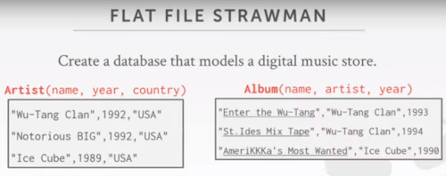
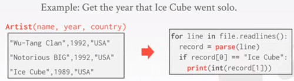

# Lecture 1: Introduction

## Course Overview
- This course is about the design / implementation of DBMS
- This course is not about how to use and administer DBMS -> See CMU 95-703 (Heinz college)

- Database Applications (15-415/615) is not offered this semester

### Course outline
- Relational Databases
- Storage
- Concurrency Control
- Recovery
- Distributed Databases
- Potpourri

### Textbook
**Database  System Concepts**, 7th edition, Silberaschatz, Korth, Sudarshan

### Projects
- build your own database engine from scratch
- each projects builds from the previous one
- we will not teach you how to write in c++17

### Bustub
- Disk based storage
- Volcano style query processing
- Pluggable API
- currently doens't support SQL
- Modular implementation

### database research
Vaccination Database tech talk
db.cs.cmu.edu/seminar2021-dose2
people from
- rqlite
- dbt
- Pinecone
- zerowatt
- [tile]db
- google
- Amazon redshift
- fluree
- arrow
- bodo.ai
- trino
- dremio
- firebolt

## What is a Database
Is an organized collection of inter-related data that models some aspect of real world

Databases are the core component of most computer application

### Database example
SQLite is the most deplot database system, deployed in phones.
- used in chrome and safari to store data
- skype also use sqlite

Let's create a database that models a digital music store, to keep track of artists and albums.
Things we need to our store:
- information about albums
- what albums those artists have released

### Flat file strawman
Store our database as a comma-separated values (CSV) file, that we manage ourselves in our application code.
- Use a separate file per entity
- The application must parse the file each time you want to read/write records

So each row will represent each entity (artist or album)
- each column will represent an individual attribute about that entity

Let's say that we want to query on the data that we have.
- we want to know the year that icecube went solo.

What we could do with these CSV files is:
- open up the file
- iterate over read lines
- take the string line and parse it as a record
- Then try to check if the value at position 0 corresponds to the key you are searching for 'Ice cube'

What issues this may have?
- if the data gets really large, you have to open the file and iterate throught all the lines
  - You can modify that script to return the value as soon as it finds it
- There could be duplicate entries for 'ice cube', and there's no way to ensure that noone put another method with the same name.
  - no way to maintain this structure
 
#### Data Integrity
- How do we ensure that the 'artist name' is the same for each album's entry.
- What is someone overwrites the album year with an invalid string?
- what is there are **multiple artist** on an album
  - in this case, you may want to change the format, instead of being a single string, it could be a list of strings.
 
- What happens if we delete an artist that has albums?

#### Flat File Implementation
How do you find a particular record?
- like the code i've already show you, where you iterate over all records
  many ways to optimize that:
  - data can be sorted
  - you can do binary search or something
  - a hash table, to index directly the record.

What if we now want to create a new application that uses the same database?
- when someone is trying to access the same csv file
- 

  

