# Lecture 1: Introduction


## Course Overview
- This course is about the design / implementation of DBMS
- This course is not about how to use and administer DBMS -> See CMU 95-703 (Heinz college)

- Database Applications (15-415/615) is not offered this semester

### Course outline
- Relational Databases
- Storage
- Concurrency Control
- Recovery
- Distributed Databases
- Potpourri

### Textbook
**Database  System Concepts**, 7th edition, Silberaschatz, Korth, Sudarshan

### Projects
- build your own database engine from scratch
- each projects builds from the previous one
- we will not teach you how to write in c++17

### Bustub
- Disk based storage
- Volcano style query processing
- Pluggable API
- currently doens't support SQL
- Modular implementation

### database research
Vaccination Database tech talk
db.cs.cmu.edu/seminar2021-dose2
people from
- rqlite
- dbt
- Pinecone
- zerowatt
- [tile]db
- google
- Amazon redshift
- fluree
- arrow
- bodo.ai
- trino
- dremio
- firebolt


## What is a Database
Is an organized collection of inter-related data that models some aspect of real world

Databases are the core component of most computer application

### Database example
SQLite is the most deplot database system, deployed in phones.
- used in chrome and safari to store data
- skype also use sqlite


Let's create a database that models a digital music store, to keep track of artists and albums.
Things we need to our store:
- information about albums
- what albums those artists have released

### Flat file strawman
Store our database as a comma-separated values (CSV) file, that we manage ourselves in our application code.
- Use a separate file per entity
- The application must parse the file each time you want to read/write records

So each row will represent each entity (artist or album)
- each column will represent an individual attribute about that entity


Let's say that we want to query on the data that we have.
- we want to know the year that icecube went solo.

What we could do with these CSV files is:
- open up the file
- iterate over read lines
- take the string line and parse it as a record
- Then try to check if the value at position 0 corresponds to the key you are searching for 'Ice cube'


What issues this may have?
- if the data gets really large, you have to open the file and iterate throught all the lines
  - You can modify that script to return the value as soon as it finds it
- There could be duplicate entries for 'ice cube', and there's no way to ensure that noone put another method with the same name.
  - no way to maintain this structure
 
#### Data Integrity
- How do we ensure that the 'artist name' is the same for each album's entry.
- What is someone overwrites the album year with an invalid string?
- what is there are **multiple artist** on an album
  - in this case, you may want to change the format, instead of being a single string, it could be a list of strings.
 
- What happens if we delete an artist that has albums?

#### Flat File Implementation
How do you find a particular record?
- like the code i've already show you, where you iterate over all records
  many ways to optimize that:
  - data can be sorted
  - you can do binary search or something
  - a hash table, to index directly the record.

What if we now want to create a new application that uses the same database?
- when someone is trying to access the same csv file concurrently

What if 2 threads try to write to the same file at the same time?
- you have to implement a concurrency layer


What happens if the machine crashed while our program is updating a record?
- What happens if the data is inconsistent

What is we want to replicate our database into multiple machines for high availability?
- how do we handle concurrent right between different machines?
- Now machine has to be syncronized across them all.


Those are the reasons that why we should write a database management system,
- so we don't have to handle all of this complexity.

## Database Management System
A DBMS is a software that allows applications to store and analyze information in a database.

A general purpose DBMS is designed to allow the definition, creation, quering, update and administration of databases.

### Early DBMS 
First one came in 1965, at general electric called 'idm'

Database Applications were difficult to build and maintain. 
- Tight coupling between logical and physical layers

You have roughly know that queries your app would execute before you deployed the database.

## Data Model Overview
The relational model was Founded by, Edgar Codd. in 1969.
'A relational model of data for large shared data banks'

The relational model is:
- A Database Abstraction to avoid this maintenance.
  - store database in simple data structures
  - Access Data through high level language
  - DBMS figures out the best strategy
  - Physical storage left up to DBMS implementation
- A relation represents a relation between attributes stored in the table.


#### Data Model
A **Data Model** high level **collection** of **concepts** for **describing** the data in the database.

Types:
- Relational       -> SQL
- Key/Value        -> NoSQL
- Graph            -> NoSQL
- Document         -> NoSQL
- Column-family    -> NoSQL
- Array/Matrix     -> Machine Learning
- Hierarchical     -> Obsolete/Legacy/Rare
- Network          -> Obsolete/Legacy/Rare
- Multi-Value      -> Obsolete/Legacy/Rare

-> The relational model can in fact, model any other data model.


NoSQL it's more than just a data model.
- but are more restrictive compared to the traditional data model.
- and don't give you as many guarantees in terms of different properties.
- There are many applications that these models makes sense:
  - Storing Video data
  - log data
  - or you just want to store the key,values and it's perfectly valid.

Arrays and Matrix are kind of specialized structures for data science


#### Schema
A **schema** is a **description** of a particular **collection** of data, using a given data model.

it defines exactly what are we going to store in the database.


## Relational Model
**Structure**, the relations inside the database.

**Integrity**, ensures that the database contents satisfy some constraints


**Manipulation**, Interface for accessing and modifying the database's content.

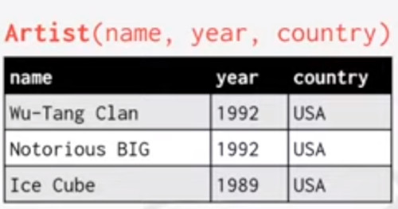

- A **relation**  is an unordered set that contain the relationships of attributes that represents entities.
  - An N-ary relation means a table with N columns / attributes.
    

- A **Tuple** is a set of attributes values known as 'domain' in the relation.
  - values are normally atomic/scalar
  - The special value Null is a member of every domain.
 

- A **Primary Key** is a relation that uniquely identifies a single tupple.
  - Every relation should have one of this
  - some DBMS automatically creates an internal primary key by enumeration.
    ``` 
    SEQUENCE (SQL:2003)
    AUTO_INCREMENT (MySQL)
    ```

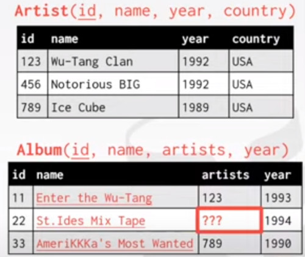

- A **Foreign Key** specifies that an __attribte__ from one relation, hast to __map__ to a tupple in another relation.
  - For example each album has an artist.
  - but what if you wanna have multiple artists on a single album?
  - we just have one attribute to store the artist information, this is how you solve it in a relational model.

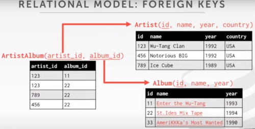

You have an aditional __join table__, who maps the artist table with the album table.
- Note you have rid of the artist column in the Album column

## Data Manipulation Languages (DML)
Method to store and retrieve information from a database.

- **Procedural**, 
  - **How** the DBMS should compute the result.
  - **Relational Algebra**

- **Non-Procedural (declarative)**, 
  - Only **What** data to retrieve
  - **Relational Calculus** (important for query optimization)


### Relational Algebra
There are 7 fundamental operators proposed by Codd.
- They are based on set algebra
  
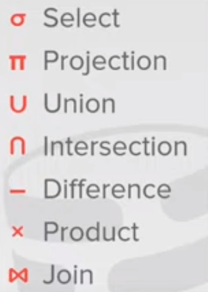

Each __operator__ takes one or more **relations** as input and it's going to output a new relation.
- we can chain operators together to create complex operations.

#### SELECT
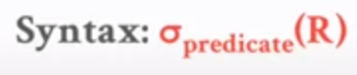

Choose a subset of the tuples from a relation that satisfies a selection predicate.
- Predicates acts as a filter to retain only tuples that fulfill its qualifying requirements.
- Can combine Multiple predicates using conjunctions / disjunctions

it was called 'restrict' in the original paper.

Example:
- SELECT * FROM R WHERE a_id = a2;
- SELECT * FROM R WHERE a_id = a2 AND b_id > 102;

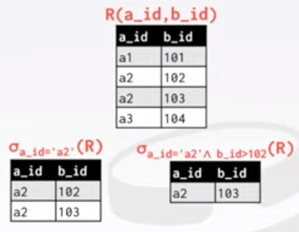


#### PROJECTION
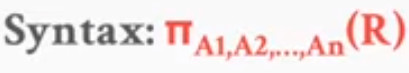

Generate a relation with tuples that contains only the attributes you ask for
- can rearrange attributes ordering
- Can manipulate values

In this example
- you first select the a2 attribute
- and then substract 100 to b_id 

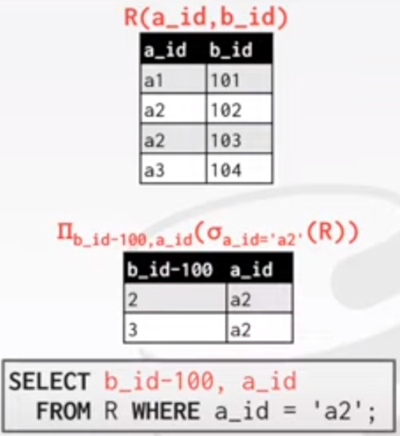

- The Select operator maps to the where clause.
- The projection operator maps to the selected elements.


#### UNION
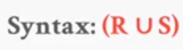

Generate a __relation__ that contains all tuples that appear in either one or both input __relations__
- The order is not important

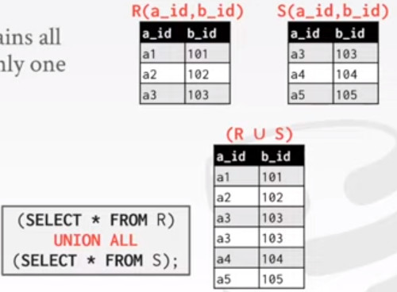

#### INTERSECTION
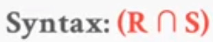

Generates a __relation__ that contains only the tuples that appear in both of the imput relations

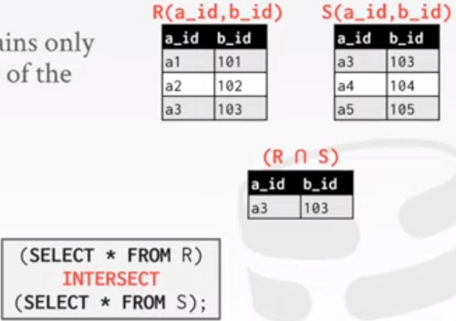

It could be particular interesting:
- if we have one relation representing, Rap Artists, and the other one rock artists.
- and we want to know which artists have both rap albums and rock albums


#### DIFFERENCE
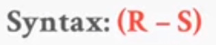

Generate a __relation__ that contains only the tuples that appear in the first relation but not in the second.

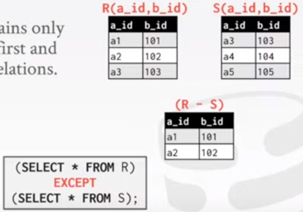

#### PRODUCT
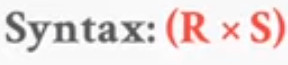

Also known as the carthesian product.

Generate a __relation__ that contains all possible combinations of tuples from the input relations

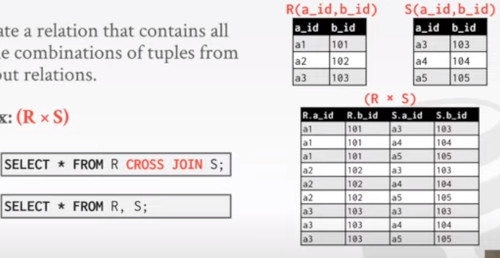

It found to be useful from a conceptual or theoretical perspective.
- it let us model our next operator which is the join


#### JOIN
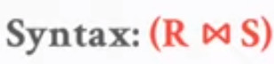
Also known as Pair-wise combination

Generate a __relation__ that contains all tuples that are a combination of two tuples with common values for one or more attributes.
- one from each input relation


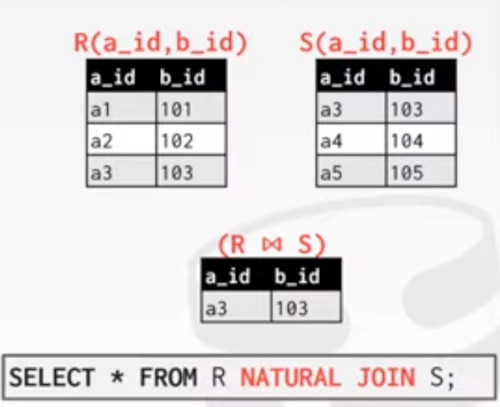

### Relational Extra operators

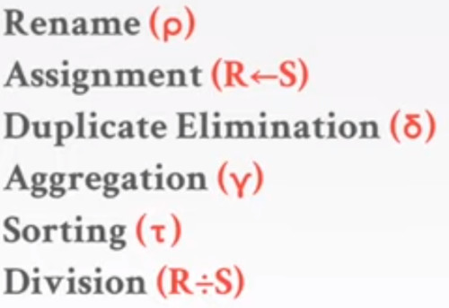

**Sorting**, so you can impose some kind of ordering

## Observation
Relational Algebra still defines the high level steps of how to compute a query
- it's still defining the High level steps of how you should compute the query.

In the left side, we are doing the join between **R** and **S** first, then performing a filter of tuples with b_id=102.

And on the other side, we are filtering **S** for tuples with b_id=102, and then perform a Join with **R**

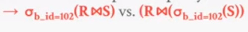

One would be more efficient than the other.

If you have a billion tuples in the relation, you might want to do the filtering first.

So **Relational Algebra** is still **PROCEDURAL** and not declarative.

So what we want is a declarative language like SQL.
- leave the low level details to the implementation.

### RELATIONAL MODEL: QUERIES
The **Relational Model** is  **independent** of any query language **implementation**.

SQL is the standard, but there are many dialects


If we rewrite our first query, we get.

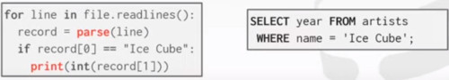

## Conclusion
- Databases are Ubiquitous

- Relational Algebra defines the primitives for processing queries on a relational Database.

- We will see relational databases again when we talk aobut query optimization and execution.
