# LECTURE 10: JOIN ALGORITHMS

## INTRODUCTION
Why do we need to join?

we **normalize** tables in a relational database to avoid **unnecessary** **repetition** of information.
- i.e. students and enrollments
- we could repeat student name, graduation year
- or we can split them out using the relational model where,

We can then use the **join operator** to reconstruct the original tuples without any information loss.

When the NoSQL systems were coming out, they said.
- well joins are slow, we are not having them
- nowadays every system supports some form of join operation

There's one study that found that almost all OLAP systems that found,
- nearly 80% of the query run time is spend doing joins
-> it's really important that we have an efficient implementation.

## JOINS ALGORITHMS
We will focus on peforming **binary joins** (two tables) using __inner equijoin__ algorithms.
- These algorithms can be tweaked to support other joins

In general, we want the smaller table to always be the left table ('outer table') in the query plan.

There are multi-way joins, not very practical to implement.
- they exists primarily in research literature

There are other types of joins,
- Anti Join, elements from one table, doesn't join with elements in the other table
- Theta join, an arbitrary condition for example greather or less than condition
- Inner Equijoin
- Left Outer Join

Techiniques we are going to see can generalize to other types of joins.

we want the smallest table, to be the left (outer) table.
- it's not the fewer the one with fewer number of tuples or records.
- but the table with fewer number of **Pages**

## JOIN OPERATOR
Here we have 2 tables, R and S.
- they have some shared id.
- There are some selection condition filtering values greather than 100.
- we are doing some projection step in the middle
- we are asking for R.id and S.cdate

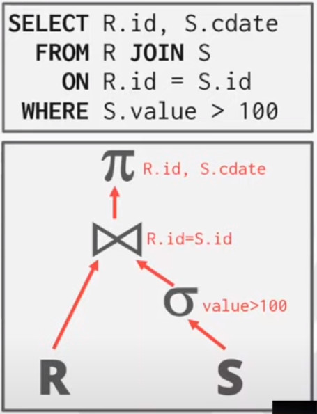

DECISION 1. Output.
- What's going to be the output of the join operator?
- by output we mean, what the join operator is going to emit ot it's parent operator in the query plan tree.
  
DECISION 2. Cost analysis Criteria.
- How do we determine whether one join algorithm is better than other?

### OPERATOR OUTPUT
Every time we have a tuple $r\in R$ and tuple $s\in S$ when we the join attributes match,
- we need to concatenate **r** and **s** together
- and return a new tuple that represent their joined representation.

What kind of factors go into this decision?
- Depends on processing model,
  - are we returning one tuple at a time or several
  - an array of tuples
- Depends on storage model
  - if we have a row storage model, we can get all the tuple values at once.
  - in the column storage model, we have this late materialization idea,
    - store the key plus a pointer
- Depends on data requirements in query
  - we only need these two columns in the final projection,
  - we could apply an early filtering of attributes (projection push down)

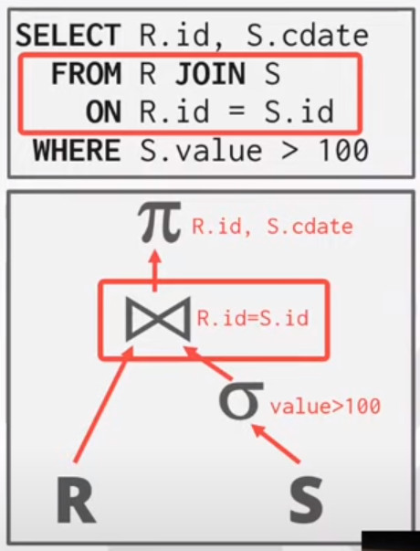

#### OPERATOR OUTPUT: DATA
**EARLY MATERIALIZATION**, 
- copy the values for the attributes in outer and inner tuples,
- into a new output table.

advangages,
- you never have to go back and fetch the columns that you needed
- so no pointers, the data is right there.

disadvantages,
- bad idea for wide tuples, (many columns that you are not going to use)
- excess copying

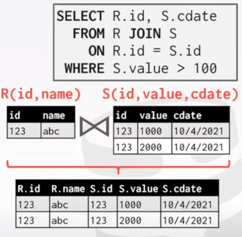

Subsequent operators in the query, (like the projection) 
- never have to go back to the base table to get more data

Do you store the intermediate result into the Buffer pool?
- yes,

#### OPERATOR OUTPUT: RECORD IDS
**LATE MATERIALIZATION**,
- Only copy the join keys along with the RECORD ID of the matching tuples.
- you want to materialize the data as late as possible so you would be sure you use all the information.

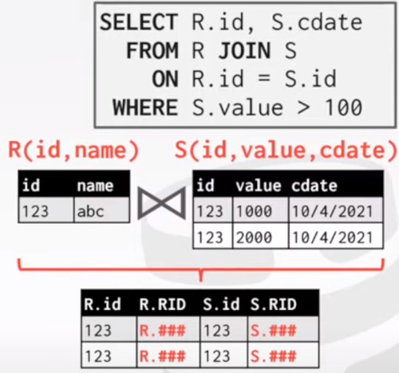

In this example we just need the S.cdate column

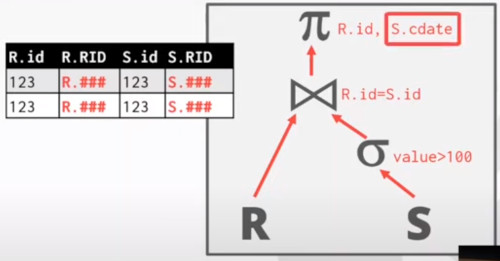

Ideal for column stores because the DBMS does not copy data that is not needed for the query.

### COST ANALYSIS CRITERIA
We have to have some cost model, or formulas to decide when a particular algorithm is going to be better than other one.

Assume, 
- **M** pages in table **R**, m tuples in R
- **N** pages in table **S**, n tuples in S

Cost metric:
- Number of IOs to compute Join

We will ignore output costs since that depends on the data and we cannot compute that yet. 

#### JOIN VS CROSS PRODUCT
R⨝S is the most common operator and thus it has to be carefully optimized

R×S followed by a selection is inefficient because the cross products is large.

There are many algorithms for reducing join cost, but no algorithm works well in all scenarios.

## JOIN ALGORITHMS
NESTED LOOP JOIN
- Simple / Stupid
- Block
- Index

SORT-MERGE JOIN

HASH JOIN

### NESTED LOOP JOIN
Two loop, one for outer, and one for inner.
- for every tuple in r, we iterate over s.
- if there's a match, we are going to emit that match as a result of our operation.

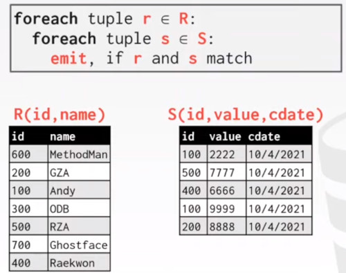

The outer relation has to have fewer number of pages.

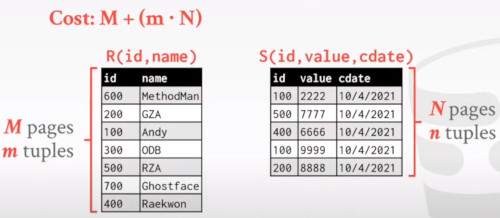

- Time complexity is O(N^2).
- Multiple passes for multiple disk pages.

The algorithm doesn't know anything about locality (disk pages).
- it's just a brute force search.

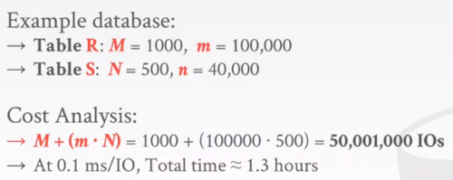

If we switch the order of tables, 

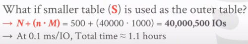

The other thing here,
- we are assuming that there are going to be 2 buffers for streaming the tables and 1 for storing the output.

### BLOCK NESTED LOOP JOIN
Rather than performing a full scan of the inner relation.
- we are going to break it up into blocks.
- A block is the size of a disk page.

Essentially, the algorithm now goes from these 2 nested loops,
- to 4 nested loops.

For each block in **R**,
- we are going to look at each block in **S**.
- and for each tuple in block r
- we are going to match to each tuple in block s.

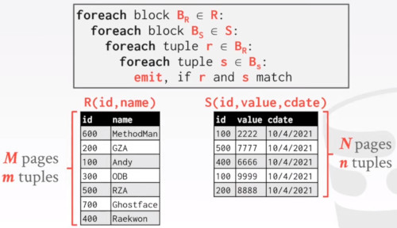

This algorithm performs fewer disk accesses.
- for every block in **R**, it scans **S** once.

COST: M+(N·M)

The smaller table should always be the outer table.

Example.
- so instead of waiting 1.1 h,
- we reduce the time to 50 sec.
  
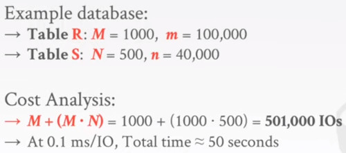

What if we have **B** buffers available?
- Use **B-2** buffers for scanning the outer table
- Use one Buffer for the inner table,
- one buffer for storing the output

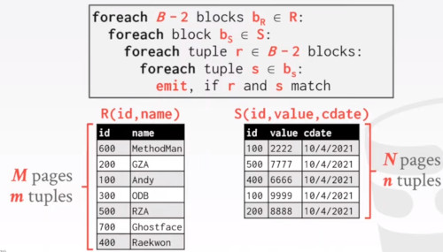

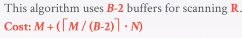

What if the outer relation fits entirely in memory?
- $B>M+2$
- you get it reduced to 0.15 sec.

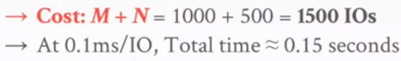

So by allocating more memory for this join operation, 
- you can get 2 orders of magnitude of reduced time

Why is the basic nested loop so bad?
- For each tuple in the outer table,
- we must do a sequential scan to check for a match in the inner table.

we can use an index, to reduce matches for the inner table!.
- we already have an existing index built.

### INDEX NESTED LOOP JOIN
For each tuple in the outer table **R**,
- we are going through the index and ask if it contains a match.
  

Now if this is a hash index, and the time complexity is O(1).
If it's a B+TREE the time complexity is O(log N)

Assuming the cost of each index probe is some constant **C** per tuple.
- then COST = $M+(m·C)$

If the entire index fits in memory then it's going to be very different than if the entire index is much larger than memory.

### SUMMARY
**KEY TAKEWAYS**, 
- Pick the smaller table as the outer table
- Buffer as much of the outer table in memory as possible.
- Loop over the inner table (or use an index)

**ALGORITHMS**
- Simple
- Block
- Index

## SORT MERGE JOIN
PHASE 1, SORT.
- Sort Both tables on the join keys.
- We can use the external merge sort algorithm from last lecture.

PHASE 2, MERGE.
- Step through the two sorted tables with cursors and emit matching tuples
- May need to backtrack depending on the join type.

First we are going to sort, 
- so we get these two sorted cursors over 'r' and 's'
- if cursor 'r' is greather than the value of cursor 's', we increment cursor 's'
- same for incrementing cursor 'r'
- if there's a match, we are going to emit match and then increment cursor 's'.
  

So let's do a visual example.
- First step is to sort.

Now we start the cursors at the beginning at each of our sorted tables.
- in this case we see, a match in both keys,
- so we append it to our output buffer
 
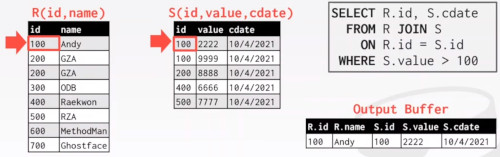

And we increment cursor 's'.
- we still have a match, and we are going to append it to the output buffer.

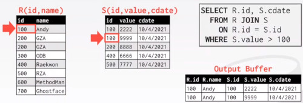

Next step is to move cursor 'r' because is the lower one.

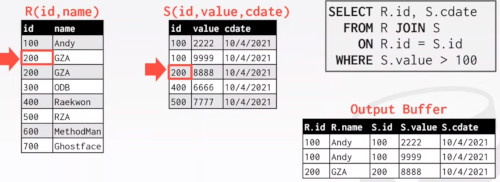

Next step, we are incrementing 'r' again, and we found a problem.
- the new 'r' is repeated, that means
- you have to go back cursor 's' to process again 's'

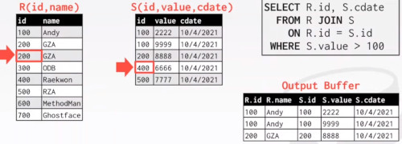

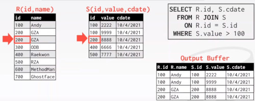

The cost is,
- The cost of sorting R and S,
- The cost of Merge
- Deprecated the cost of going back

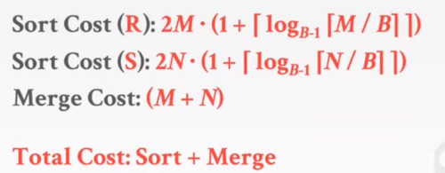

So the time we spent now is 0.75sec.
- its better than the last 50 sec.
  
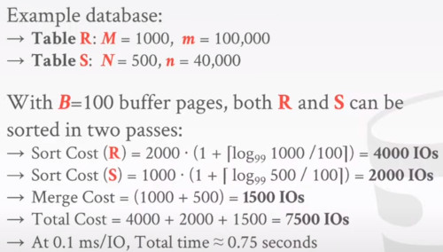

The worst case for merging is when,
- the join attribute of all the tuples in both relations contains the same value.
- COST: (M·N) + (sort cost)

### WHEN TO USE MERGE JOIN
One or both tables are already sorted on join key.
- output must be sorted on join key.

The input relations may be sorted either by an explicit sort operator, 
- or by scanning the relation using an index on the join key.

## HASH JOIN
If a tuple $r\in R$ and a tuple $s\in S$ satisfy the join condition,
- then they have the same value for the join attributes

If that value is hashed to some partition **i**, 
- the **R** tuple must be in $r_i$ and the **S** tuple in $s_i$.

So rather than have this nested loop,
- we know that all the tuples that are in $r_i$ only need to be compared with the tuples in $s_i$.
- tuples with the same key, are going to be mapped to the same partition.
  
Therefore, **R** tuples in $r_i$ need only to be compared with **S** tuples in $s_i$.

Basically we are breaking the hash algorithm down into these two phases.
**PHASE 1**, BUILD,
- Scan the outer relation
- and populate a hash table using the hash function $h_1$ on the join attributes

**PHASE 2**, PROBE
- Scan the inner relation
- and use $h_1$ on each tuple to jump to a location in the hash table and find a matching tuple.

### BASIC HASH JOIN ALGORITHM
We build a hash table for **R**,
- So for each tuple in **S**
- we are going to try to probe a value the hash table that you built if you have a match

So first, We are going to scan over the **R** side.
- Apply a hash function to populate all the buckets in the hash table.

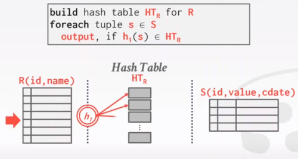

Now in the **S** side.
- we can kind of step through each of the keys that we have
- and hash them using the same hash function

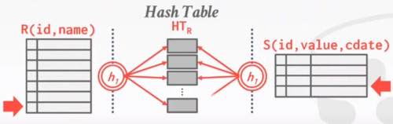

### HASH TABLE CONTENTS
The contents of the hash table are:

The KEY, 
- The attributes that the query is joining the tables on.

The Value, (varies per implementation)
- Depends on what the operations above the join in the query plan expect as its input.

Trade off between early and late implementation.

#### HASH TABLE VALUES
Why to prefer one over the other.

Approach 1. Full Tuple,
- Avoid having to retrieve the outer relation's tuple contents on a match
- Takes up more space in memory

Approach 2. Tuple identifier.
- Could be either the base table or the intermediate output from child operators in the query plan.
- Ideal for column stores, because the DBMS does not fetch data from disk that does not need.
- Also better if join selectivity is low.

### PROBE PHASE OPTIMIZATION
We can use the **BLOOM FILTER** during the build phase when the key is likely to not exist in the hash table.
- Threads check the filter before probing the hash table
  - This will be faster since the filter will fit in CPU caches.
- Sometimes called 'sideways information passing'

The Bloom Filter is a probabilistic data structure.
- is going to tell whether or not, the value in contained in the set.

So A is going to build up this hash table.
- during the build phase.
  
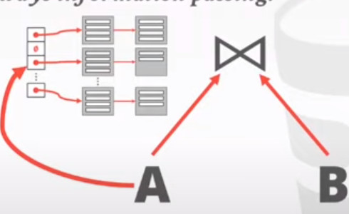

At the same time is going to populate this bloom filter
- True or False, is the key contained in the hash table?
  

Once the Bloom Filter is built up, 
- we can pass it over to the B side of the join

And rather than having to probe the hash table all the time,
- instead of having to fetch them from the disk
- B can just instead ask to this Bloom Filter, whether or not, the key is going to be there

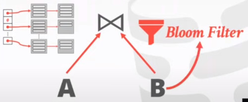

If it is, then go grab it from the hash table.

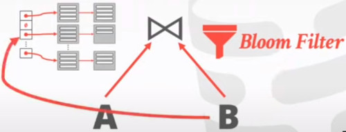

### BLOOM FILTER
You can think about it like a bitmap, that's going to answer membership queries.
- False Negatives will never occur
- False Positives will sometimes occur
- Sometimes it will say that something is in the table even though it doesn't
- But it never is going to telling you that something isn't in the hash table and actually it is in there.

**INSERT(x)**,
- Use k hash functions to set bits in the filter to 1

**LOOKUP(x)**, 
- Check whether the bits are 1a for each hash function

Suppose we have this 8 bits bloom filter.
- we want to insert this key 'RZA' and we use 2 hash functions
  

Now we are inserting the key 'GZA'

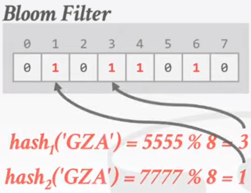

Now we are going to look up this key 'Raekwon'
- we see that, because one of the bits is zero. then this is false.
- so this key is not in the table.
  
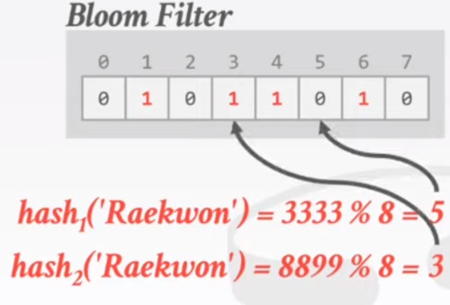

Finally we try to look 'ODB' either than we never inserted it.
- this is a false positive.

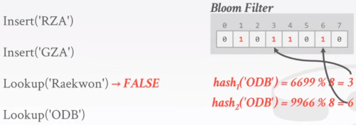

We do BLOOM Optimization, 
- because the hash table might be larger than memory

#### COST ANALYSIS
How Big of a table can be hashed using this approach?
- **B-1** spill partitions in phase 1.
- Each should be no more than **B** blocks 

Answer:
$B·(B-1)$
- The table of **N** pages needs about $\sqrt(N)$ buffers.
- Assumes hash distributes records evenly.
  use a 'fudge factor' $f>1$ for that:
  we need
  
  $B\cdot \sqrt(f\cdot N)$

## GRACE HASH JOIN
Named after the GRACE database machine from japan 1980.

If we don't have enought memory to fit the entire hash table.

We do not want to let the buffer pool manager, 
- swap out the hash table pages at random
- The Buffer pool doesn't know about the access patterns.

We want to manage how pages are evicted ourselves.

An algorithm for when tables don't fit in memory.
**BUILD PHASE**, 
- Hash both tables on the join attribute, 
- put them in partitions

**PROBE PHASE**, 
- Compares tuples in corresponding partitions for each table.

Rather than hashing one side and probing the other side,
- we are hashing both sides of the join
- and only compare the partitions.

There are specific machines for managing databases.
- they cost millions of dollars.
- if you can afford it, you want to buy purpose-built specialized hardware that's tuned for DBMS

### EXAMPLE
We are going to hash **R** into a number of buckets
- then we are going to hash **S** into the same number of buckets.
- we use the same hash function
  
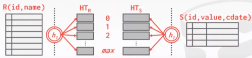

The way we are going to perform the join now is,
- a nested loop join on each pair of matching buckets in the same level
  
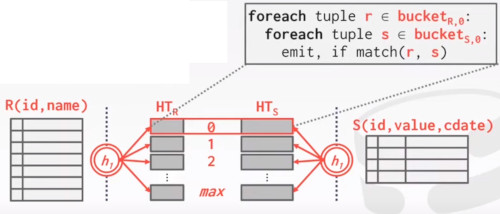

### RECURSIVE PARTITIONING
If the buckets do not fit in memory, then use **recursive partitioning**
- Build another hash table, for BUCKET{R, i} using hash function $h_2$ different from $h_1$
- Then probe it for each tuple of the other table's bucket at each level

Let's say we have this partitions here,
- partition 1 have more pages that some threshold.

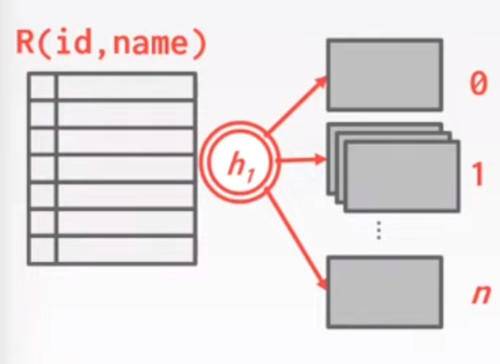

So we are going to do a second round of hashing.
- for this particular 1 partition.
- with different hash function
    
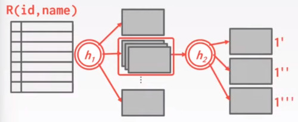

Then we are going to wind up, with all those many partitions.

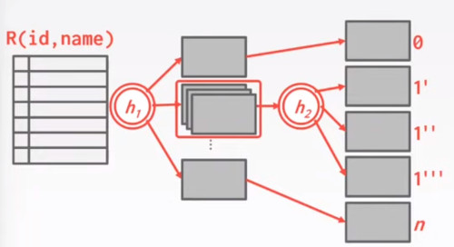

We also have to do the same thing in the other side.

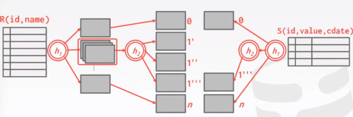

In practice it doesn't go beyond 2 rounds

### COST ANALYSIS
The cost of Hash JOIN is
- Assume that we have enough buffers.
- COST: $3(M+N)$

PARTITIONING PHASE,
- Read + Write both tables
- $2(M+N) IOs$

PROBING PHASE,
- Read both tables
- $M+N$ IOs

we get 0.45 sec.

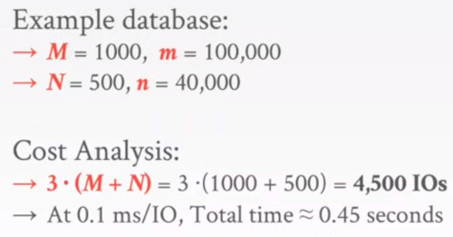

#### OBSERVATION
If the DBMS knows the **size** of the outer table,
- then it can use a **static hash table**
(less computational overhead for build / probe operations)

If we do not know the size, then we must use a dynamic hash table
- or allow for overflow pages.

## SUMMARY
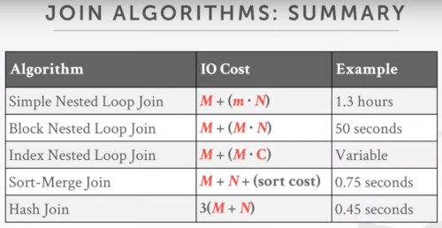

Hashing is almost always better than sorting for operator execution

Caveats,
- Sorting is better on non-uniform data
- Sorting is better when results needs to be sorted

Good Databases use either or both
