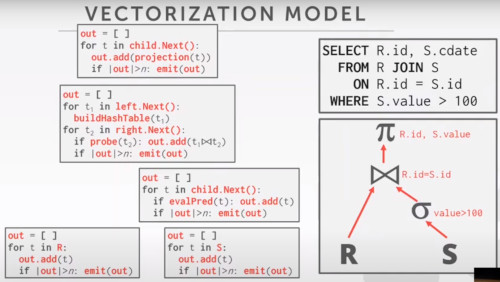
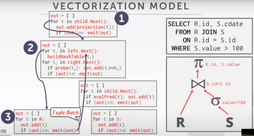
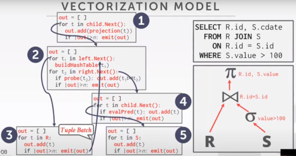

# LECTURE 11: QUERY EXECUTION (I)

## INTRODUCTION

Part 1 is the basics
Part 2. is Parallel Query execution.

## QUERY PLAN
Is a collection of operators arraged in a tree.
- directed acyclic graph

you can translate the SQL query to,
- some kind of logical plan tree

- Data flows from the leaves up towards the root.
- The output of the root node is the result of the query.
  

For example, the join operator we need to decide its implementation,
- it would be a nested loop join
- or hash join
- or merge join

## TODAY'S AGENDA
- PROCESSING MODELS, how actually we are going to implement the passing of results between queries operators
- ACCESS METHODS, table scans, index scans
- MODIFICATION QUERIES, read, insert, delete queries, retrieve information from database
- EXPRESSION EVALUATION, arbitrary complex expressions in your WHERE clause, PROJECT clause. we need a way to evaluate this expression. 
  adding things, modifying values, comparison. Support arbitrary conditions.

### PROCESSING MODEL
A DBMS **processing model** defines,
- how the system **executes** a particular **query plan**.

Different trade-offs for different workloads

Different ways to passing results between different query operators.
- each operator is implemented in isolation
- we need to move intermediate results between the operators.

APPROACH 1. ITERATOR MODEL
APPROACH 2. MATERIALIZATION MODEL
APPROACH 3. VECTORIZED / BATCH MODEL

#### ITERATOR MODEL
Also called 'VOLCANO' or 'PIPELINE' model.

Each Query Plan operator implements a **NEXT()** function.

On each invocation of the next function,
- the operator if going to return either a **single tuple** or a NULL marker (if there are no more tuples).
  
The operator implements a loop that calls **NEXT()** on it's children,
- to retrieve their tuples and then process them.

If we imagine what's going on inside each operator,

At very high level,
- we have this loops, that implementing the **next** function call for each operator.
- so emit the first projection operator

We now have a JOIN operator,
- which is building a hash table for left operator
- and probing the right side into the table.

The projection calls the join.
- The join calls these two parts (build and probe phases)
- Se selection operator is just filtering all tuples that doesn't match the predicate

Each of those code blocks are the implementations of the **NEXT**  function call.

#### RUNTHROUGH
First you wrap over all the child nodes.

As soon you get one tuple, you flow back up.
- This keeps going until all the tuples in R are produced in that first loop.

We are going to do the same for the right side
- in the selection scan (4), we are only returning tuples that match.
  

For every single time, we are going to emit back a tuple to its parent operator.

#### SUMMARIZE
This is used in almost every DBMS.
- Allows for **tuple pipelining**

Every single tuple you emit is going to be push/pull from its parent operator
- all the way through the query plan.

What that's going to allow us to do is to kind maximize the locality of the data.
- getting a page and extracting a tuple from it, is really expensive.
- so we are maximizing the amount of work we are able to perform once we go get it from the disk.

so we are going to propagate this tuple through all the operators that we have in our query plan.

Some operators just block until their children emit all tuples.
- JOINS
- SUBQUERIES
- ORDER BY

In the last example, we have to wait the left branch to finish populating its hash table in order to probe it later.

Output control works easily with this approach
- LIMIT (breaking main loop)

### MATERIALIZATION MODEL (aka operator time model)
Each operator processes its input all at once and then emits its output all at once.
- The operator 'Materializes' its output as a single result
- The DBMS can push down hints (e.g. LIMIT)
- Can send either a materialized row or a single column

The output can be either Whole Tuples (NSM, normalized storage model) or subsets of columns (DSM, denormalized storage model)
- you can materialize a full row, or a full column

#### RUN THROUGH
Basically,
- The root operator is going to call its child's output

So long so forth until you get the left output.
- But instead of returning 1 tuple at a time
- you return all tuples at once.
- you save them in the 'out' buffer
  

Build the hash table and move to the right side.

#### SUMMARIZE
For small number of tuples, we can access all at a time for optimal performance.
- not that many function calls.

  
Better for OLTP workloads.
- Lower Execution / Coordination Overhead
- Fewer Function calls

Not Good for OLAP queries with large intermediate steps.
- you have to compute an entire join, materilize that.
- it can grow quite large.

This function calls doesn't really matter to (D)isk systems. (they are masked by other stuff)
- They do matter for In-Memory systems

 
Is the materialization model, easy to model if you aggressively pre-fetch pages?
- probably it makes pre-fetch easier.
- if everything is a sequential scan.
- drawback is that depends on how much you have in your buffer pool.

### VECTORIZATION MODEL (aka. Batch model)
Like the Iterator model, where each operator implements a **NEXT()**  function, but...

Each operator emits a **BATCH** of tuples instead of a single tuple.

- The Operator's internal loop processes multiple tuples at a time.
- The size of the batch can vary based on hardware or query properties.

CONSIDERATIONS IF YOU ARE IN MEMORY.
- you might want to align your batch sizes with your 'CACHE' size
- or align it with your memory pages.

Doing so, 
- you amortize the amount of function calls over several tuples
- if you are disk bounded, the call overhead doesn't matter that much.
- it matter if you are partially/full in memory.

#### RUN THROUGH
It looks like an hybrid between the iterator tuple at a time, and the materialization approach.

Again we have this output buffers.
- but rather than being entire materilized output, they are going to be a fixed size. (100-200 tuples at a time)

And we are going to call 'child.next' the same way we did for the iterator model.
- but each time we call next, we are going to get a batch of tuples,
- rather than a single tuple at a time.

At step (3) we are waiting the full batch to load, so then you commit the next batch.
- the parent (2) has to wait the entire hash table to update, before it can move into the next branch.
  

Can you run into problems where you have sort of these partially utilized batches sitting around in different operators?
- No, we flush the data at the end.
- If the output page is for the size of the page, we are allocating one page for those operators.

#### SUMARIZE
Ideal for OLAP models, because it reduces the number of invocations per operator
- Aggregations 
- Ad-hoc joins

For transactional workloads OLTP,
- you want to start working on tuples as soon as possible.
- waiting to fill up these buffers gives you this additional overhead.
  
Allows operators to more easily use vectorized (SIMD) instructions to process batches of tuples.
- Single Instruction Multiple Data (SIMD)
- CPU instructions that allows you operate into several data at once.
- SIMD is usefull for using the column model (DSM) used for example for average.
  

### OBSERVATION.
All examples shown had, this top-down paradigm.

APPROACH 1. TOP-TO-BOTTOM
- Start with the root node, and pull data from its childrens
- Tuples are always passed with function calls
- aka 'pull model' as you pull data from your function calls.

APPROACH 2. BOTTOM-TO-TOP.
its less implemented as it's hard to reason about. but has its advantages.
- Start with leaf nodes and push data to their parents
- Allows for tighter control of __caches__/registers in pipelines.
- the childrends are pushing their results to its parents.

## ACCESS METHODS
