# LECTURE 11: QUERY EXECUTION (I)

## INTRODUCTION

Part 1 is the basics
Part 2. is Parallel Query execution.

## QUERY PLAN
Is a collection of operators arraged in a tree.
- directed acyclic graph

you can translate the SQL query to,
- some kind of logical plan tree

- Data flows from the leaves up towards the root.
- The output of the root node is the result of the query.
  

For example, the join operator we need to decide its implementation,
- it would be a nested loop join
- or hash join
- or merge join

## TODAY'S AGENDA
- PROCESSING MODELS, how actually we are going to implement the passing of results between queries operators
- ACCESS METHODS, table scans, index scans
- MODIFICATION QUERIES, read, insert, delete queries, retrieve information from database
- EXPRESSION EVALUATION, arbitrary complex expressions in your WHERE clause, PROJECT clause. we need a way to evaluate this expression. 
  adding things, modifying values, comparison. Support arbitrary conditions.

### PROCESSING MODEL
A DBMS **processing model** defines,
- how the system **executes** a particular **query plan**.

Different trade-offs for different workloads

Different ways to passing results between different query operators.
- each operator is implemented in isolation
- we need to move intermediate results between the operators.

APPROACH 1. ITERATOR MODEL
APPROACH 2. MATERIALIZATION MODEL
APPROACH 3. VECTORIZED / BATCH MODEL

#### ITERATOR MODEL
Also called 'VOLCANO' or 'PIPELINE' model.

Each Query Plan operator implements a **NEXT()** function.

On each invocation of the next function,
- the operator if going to return either a **single tuple** or a NULL marker (if there are no more tuples).
  
The operator implements a loop that calls **NEXT()** on it's children,
- to retrieve their tuples and then process them.

If we imagine what's going on inside each operator,

At very high level,
- we have this loops, that implementing the **next** function call for each operator.
- so emit the first projection operator

We now have a JOIN operator,
- which is building a hash table for left operator
- and probing the right side into the table.

The projection calls the join.
- The join calls these two parts (build and probe phases)
- Se selection operator is just filtering all tuples that doesn't match the predicate

Each of those code blocks are the implementations of the **NEXT**  function call.

#### RUNTHROUGH
First you wrap over all the child nodes.

As soon you get one tuple, you flow back up.
- This keeps going until all the tuples in R are produced in that first loop.

We are going to do the same for the right side
- in the selection scan (4), we are only returning tuples that match.
  

For every single time, we are going to emit back a tuple to its parent operator.

#### SUMMARIZE
This is used in almost every DBMS.
- Allows for **tuple pipelining**

Every single tuple you emit is going to be push/pull from its parent operator
- all the way through the query plan.

What that's going to allow us to do is to kind maximize the locality of the data.
- getting a page and extracting a tuple from it, is really expensive.
- so we are maximizing the amount of work we are able to perform once we go get it from the disk.

so we are going to propagate this tuple through all the operators that we have in our query plan.

Some operators just block until their children emit all tuples.
- JOINS
- SUBQUERIES
- ORDER BY

In the last example, we have to wait the left branch to finish populating its hash table in order to probe it later.

Output control works easily with this approach
- LIMIT (breaking main loop)

### MATERIALIZATION MODEL (aka operator time model)
Each operator processes its input all at once and then emits its output all at once.
- The operator 'Materializes' its output as a single result
- The DBMS can push down hints (e.g. LIMIT)
- Can send either a materialized row or a single column

The output can be either Whole Tuples (NSM, normalized storage model) or subsets of columns (DSM, denormalized storage model)
- you can materialize a full row, or a full column

#### RUN THROUGH
Basically,
- The root operator is going to call its child's output

So long so forth until you get the left output.
- But instead of returning 1 tuple at a time
- you return all tuples at once.
- you save them in the 'out' buffer
  

Build the hash table and move to the right side.

#### SUMMARIZE
For small number of tuples, we can access all at a time for optimal performance.
- not that many function calls.

  
Better for OLTP workloads.
- Lower Execution / Coordination Overhead
- Fewer Function calls

Not Good for OLAP queries with large intermediate steps.
- you have to compute an entire join, materilize that.
- it can grow quite large.

This function calls doesn't really matter to (D)isk systems. (they are masked by other stuff)
- They do matter for In-Memory systems

 
Is the materialization model, easy to model if you aggressively pre-fetch pages?
- probably it makes pre-fetch easier.
- if everything is a sequential scan.
- drawback is that depends on how much you have in your buffer pool.

### VECTORIZATION MODEL (aka. Batch model)
Like the Iterator model, where each operator implements a **NEXT()**  function, but...

Each operator emits a **BATCH** of tuples instead of a single tuple.

- The Operator's internal loop processes multiple tuples at a time.
- The size of the batch can vary based on hardware or query properties.

CONSIDERATIONS IF YOU ARE IN MEMORY.
- you might want to align your batch sizes with your 'CACHE' size
- or align it with your memory pages.

Doing so, 
- you amortize the amount of function calls over several tuples
- if you are disk bounded, the call overhead doesn't matter that much.
- it matter if you are partially/full in memory.

#### RUN THROUGH
It looks like an hybrid between the iterator tuple at a time, and the materialization approach.

Again we have this output buffers.
- but rather than being entire materilized output, they are going to be a fixed size. (100-200 tuples at a time)

And we are going to call 'child.next' the same way we did for the iterator model.
- but each time we call next, we are going to get a batch of tuples,
- rather than a single tuple at a time.

At step (3) we are waiting the full batch to load, so then you commit the next batch.
- the parent (2) has to wait the entire hash table to update, before it can move into the next branch.
  

Can you run into problems where you have sort of these partially utilized batches sitting around in different operators?
- No, we flush the data at the end.
- If the output page is for the size of the page, we are allocating one page for those operators.

#### SUMARIZE
Ideal for OLAP models, because it reduces the number of invocations per operator
- Aggregations 
- Ad-hoc joins

For transactional workloads OLTP,
- you want to start working on tuples as soon as possible.
- waiting to fill up these buffers gives you this additional overhead.
  
Allows operators to more easily use vectorized (SIMD) instructions to process batches of tuples.
- Single Instruction Multiple Data (SIMD)
- CPU instructions that allows you operate into several data at once.
- SIMD is usefull for using the column model (DSM) used for example for average.
  

### OBSERVATION.
All examples shown had, this top-down paradigm.

APPROACH 1. TOP-TO-BOTTOM
- Start with the root node, and pull data from its childrens
- Tuples are always passed with function calls
- aka 'pull model' as you pull data from your function calls.

APPROACH 2. BOTTOM-TO-TOP.
its less implemented as it's hard to reason about. but has its advantages.
- Start with leaf nodes and push data to their parents
- Allows for tighter control of __caches__/registers in pipelines.
- the childrends are pushing their results to its parents.

## ACCESS METHODS
An **access method** is the way that the DBMS accesses the data stored in a table.
- Not defined in relational algebra
- but it's something we want to consider when implementing the physical operators
  
Three basic approaches.
- SEQUENTIAL SCAN
- INDEX SCAN
- MULTI-INDEX SCAN / 'bitmap' scan

So how are we going to access the data stored in **R** and **S**?

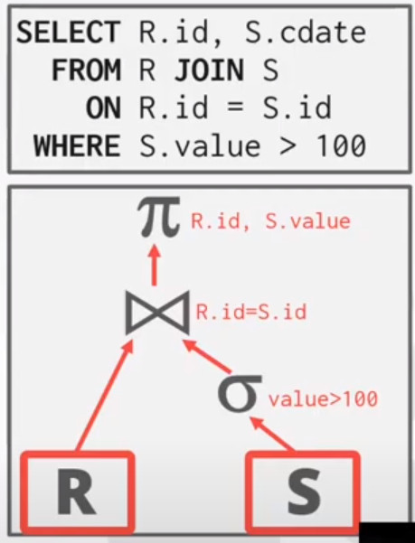

### SEQUENTIAL SCAN
For each page in the table,
- retrieve it from the buffer pool.
- Iterate over each tuple and check whether to include it

The DBMS maintains an internal **CURSOR** that tracks the last page/slot if examined.

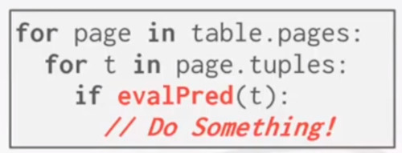

you have to scan the entire table 
- just to find the value you are looking for.

#### OPTIMIZATIONS
PREFETCHING, 
- get pages from disk that you are going to need in the near future.

BUFFER POOL BYPASS, 
- rather than going to the usual buffer pool mechanism,
- you have a separated buffer area
- that you can fill up for intermediate results for your query.

PARELLELIZATION,
- next class
- how to paralellize all aspect of a query.

ZONE MAPS,
- Precomputes some aggregates per page

LATE MATERIALIZATION,

HEAP CLUSTERING,

#### ZONE MAPS (aka small materializaton aggregate SMA)
Pre computed aggregates for the attribute values in a page.
- DBMS checks the zone to map first
- to decide whether it want to access that page.

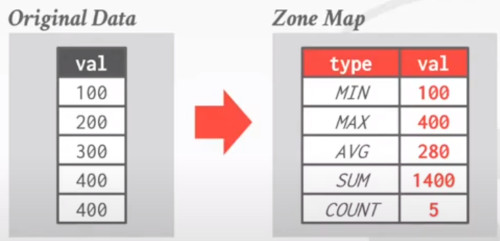

You are looking at all the attribute values on a page.
- and you precomputing some kind of  aggregates about it
- so you don't need necesesarily access the page
- you can check and decide
- whether or not you want to access the page before you have to go and get it.

If you are applying some query like this,
- where you are filtering all values greather than 600.
- we can just look at the zone map
- and don't even have to access the data in the page,
- as the maximum value in the page is 400

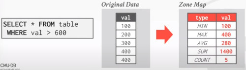

Typically they are stored in a **separated** zone maps **page**.
- otherwise you can store them in the header of each page.
- but you already are paying the cost to go into the I/O
- and get the page.

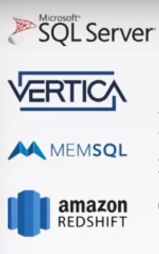
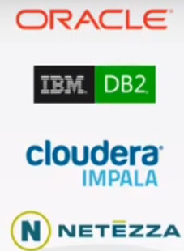

Advantages,
- let you prune out pages early

Disavantages,
- every time you update a value, you have to update all aggregates too.
- worst writting overhead
  
#### LATE MATERIALIZATION
Denormalized Storage Managers (DSM), can Delay stitching together tuples until the upper parts of the query plan.
- Columns Store Model. All values in individual columns.

When we are accessing a page,
- we get all the values for a particular column from a whole bunch of different tuples.
- so we get those values,
- and let's say we are doing a SELECTION

For example, all we need for this output is C.
- if we were an N-ary or row based storage model,
- then we have get all the 'A', 'B', 'C' columns together.

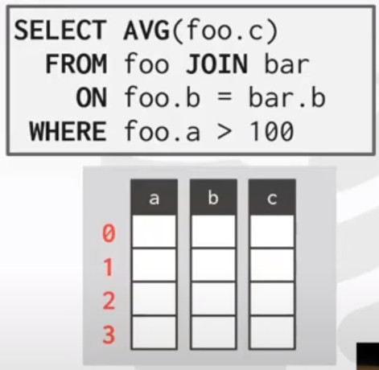

As we are in a DSM storage model
- we can just grab the column that we need.

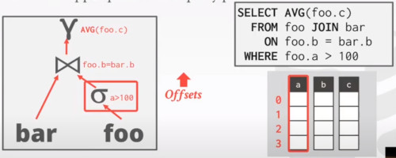

Also we grab the offsets of the columns that match.
- so we are going to pass those **offsets** up to the parent,
- rather the actual values themselves.

Next we are going to perform a JOIN operation with the 'B' column
- and moving those offsets further up to their parent.
  
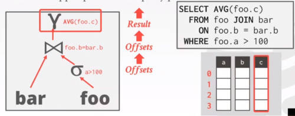

Finally we are going to retrieve those values,
- using their offsets
- and compute the average aggregate.

#### HEAP CLUSTERING
???????????????

### INDEX SCAN
we talked about this in previous lectures...

The DBMS picks an index to find the tuples that the query needs.
- rather than having to scan the whole table,
- if you have an index sitting around
- you can leverage to get just the tuples that you want

Which index to use, depends on:
- What attributes the index contains
- What attributes the query references
- The attribute's value domains
- How the Predicate is composed
- Whether the index has unique or non-unique keys.

In lecture 13 we are going to talk about how to decide between all different options.

#### RUN THROUGH
Let's say we have this example query.
- imagine a single tuple with 100 tuples.
- and 2 indexes.
  - Index 1. AGE
  - Index 2. DEPT

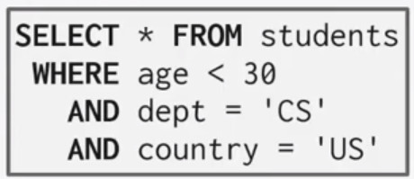

Which index do we want to use?
- whetever is the most selective.
- it depends on the exact data that we have.
  - If Age < 30 is more selective or
  - 'dept=cs' is the more selective.

SCENARIO 1.
- we choose the DEPT index
  
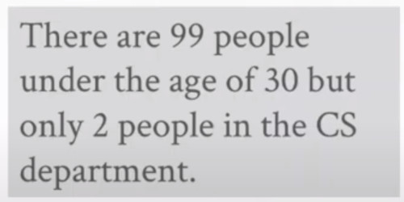

SCENARIO 2.
- we choose the AGE index.

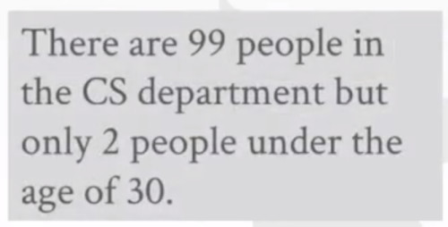

### MULTI-INDEX SCAN
If there are **multiple indexes**, use all of them
- compute sets of RECORD IDs using each matching index
- combine these sets based on the query's predicates
  - if it's an OR predicate use an union
  - if it's an AND predicate use an intersection
- Retrieve the records and apply any remaining predicates-

Postgres call this BITMAP SCAN

#### RUN THROUGH
With an index on AGE and an index on DEPT
1. We can retrieve the RECORD IDs satisfying 'AGE<30'
2. Then we can retrieve the RECORD IDs satisfying 'DEPT=CS'
3. Take their internal intersection
4. Retrieve records and check 'COUNTRY = US'

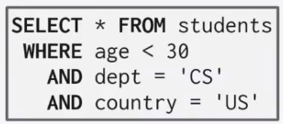

The SET INTERSECTION can be done with,
- Bitmaps
- Hash tables
- Bloom filters

So basically you are producing the records IDS from each index independently

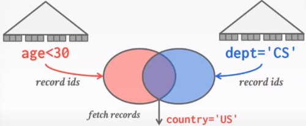

And then perform the final intersection
- and finall selection step.

