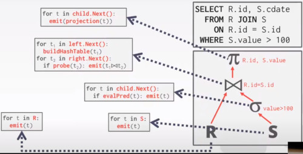

# LECTURE 11: QUERY EXECUTION (I)

## INTRODUCTION

Part 1 is the basics
Part 2. is Parallel Query execution.

## QUERY PLAN
Is a collection of operators arraged in a tree.
- directed acyclic graph

you can translate the SQL query to,
- some kind of logical plan tree

- Data flows from the leaves up towards the root.
- The output of the root node is the result of the query.
  

For example, the join operator we need to decide its implementation,
- it would be a nested loop join
- or hash join
- or merge join

## TODAY'S AGENDA
- PROCESSING MODELS, how actually we are going to implement the passing of results between queries operators
- ACCESS METHODS, table scans, index scans
- MODIFICATION QUERIES, read, insert, delete queries, retrieve information from database
- EXPRESSION EVALUATION, arbitrary complex expressions in your WHERE clause, PROJECT clause. we need a way to evaluate this expression. 
  adding things, modifying values, comparison. Support arbitrary conditions.

### PROCESSING MODEL
A DBMS **processing model** defines,
- how the system **executes** a particular **query plan**.

Different trade-offs for different workloads

Different ways to passing results between different query operators.
- each operator is implemented in isolation
- we need to move intermediate results between the operators.

APPROACH 1. ITERATOR MODEL
APPROACH 2. MATERIALIZATION MODEL
APPROACH 3. VECTORIZED / BATCH MODEL

#### ITERATOR MODEL
Also called 'VOLCANO' or 'PIPELINE' model.

Each Query Plan operator implements a **NEXT()** function.

On each invocation of the next function,
- the operator if going to return either a **single tuple** or a NULL marker (if there are no more tuples).
  
The operator implements a loop that calls **NEXT()** on it's children,
- to retrieve their tuples and then process them.

If we imagine what's going on inside each operator,

At very high level,
- we have this loops, that implementing the **next** function call for each operator.
- so emit the first projection operator

We now have a JOIN operator,
- which is building a hash table for left operator
- and probing the right side into the table.

The projection calls the join.
- The join calls these two parts (build and probe phases)
- Se selection operator is just filtering all tuples that doesn't match the predicate

Each of those code blocks are the implementations of the **NEXT**  function call.

#### RUNTHROUGH
First you wrap over all the child nodes.

As soon you get one tuple, you flow back up.
- This keeps going until all the tuples in R are produced in that first loop.

We are going to do the same for the right side
- in the selection scan (4), we are only returning tuples that match.
  

For every single time, we are going to emit back a tuple to its parent operator.

#### SUMMARIZE
This is used in almost every DBMS.
- Allows for **tuple pipelining**

Every single tuple you emit is going to be push/pull from its parent operator
- all the way through the query plan.

What that's going to allow us to do is to kind maximize the locality of the data.
- getting a page and extracting a tuple from it, is really expensive.
- so we are maximizing the amount of work we are able to perform once we go get it from the disk.

so we are going to propagate this tuple through all the operators that we have in our query plan.

Some operators just block until their children emit all tuples.
- JOINS
- SUBQUERIES
- ORDER BY

In the last example, we have to wait the left branch to finish populating its hash table in order to probe it later.

Output control works easily with this approach
- LIMIT (breaking main loop)

### MATERIALIZATION MODEL (aka operator time model)
Each operator processes its input all at once and then emits its output all at once.
- The operator 'Materializes' its output as a single result
- The DBMS can push down hints (e.g. LIMIT)
- Can send either a materialized row or a single column

The output can be either Whole Tuples (NSM) or subsets of columns (DSM)
- you can materialize a full row, or a full column

#### RUN THROUGH
Basically,
- The root operator is going to call its child's output

So long so forth until you get the left output.
- But instead of returning 1 tuple at a time
- you return all tuples at once.
- you save them in the 'out' buffer
  

Build the hash table and move to the right side.

#### SUMMARIZE
Better for OLTP workloads because Queries only access a small number of tuples at a time.
- Lower Execution / Coordination Overhead
- Fewer Function calls

Not Good for OLAP queries with large intermediate steps

