# LECTURE 12: QUERY EXECUTION (II)

## INTRODUCTION
Last class we've discussed
- How to compose operators together into a plan to execute an arbitrary query.
- we've assumed that the queries execute with a single worker (e.g. a thread)
- we will discuss now, how to execute queries using multiple workers.

Remember that we go from a SQL query.
- which gets translated to a logical plan, something with this abstract operators.
- Finally to a physical plan, to describe how we are going to execute each operator.

Again we are not specifying which implementation of the JOIN operation we are using.

### WHY DO WE CARE ABOUT PARALLEL EXECUTION
**FIRST PART. SYSTEM LEVEL.**
parallel execution can give us increased performance.
- **THROUGHPUT**, we can execute more queries in our system draining all available resources
- **LATENCY**, on the other hand we might want to speed up the time a single query is processed.

If you have a transactional workload (OLTP),
- you care more about THROUGHPUT
- you would have a lot of transactions coming in, and you want to execute as many as you can.

If you are in the analytical side workload (OLAP),
- then you care more about LATENCY
- so any long running query, you want to complete as quickly as possible.

**SECOND PART. USER LEVEL.**
What users wants from your application is an increased
- RESPONSIVENESS. What the user sees (e.g. faster web pages)
- AVAILABILITY. 

**THIRD PART. ADMIN LEVEL**
Potentially lower **TOTAL COST OF OWNERSHIP (TCO)** 
- try to use fewer machines
- be more energy efficient

### PARALLEL VS DISTRIBUTED
**PARALLEL DBMS**, means how are we going to execute a single query concurrently
- Resources are physically close to each other
- Resources communicate over high-speed interconnect.
- Communication is assumed to be cheap and reliable.
  
**DISTRIBUTED DBMS**, is the specific case
- Resources can be far from each other
- Resources communicate using slower interconnect.
- Communication cost and problems cannot be ignored.

They share a number of similarities,
- in both cases, the database is spread out across multiple **resources**.
- in both cases, the database appear as a single logical database instance to the application.

## TODAY'S AGENDA
PROCESS MODELS, how we handle concurrent workers in our system.
- how to break up queries execution into multiple concurrent pieces
  
EXECUTION PARALLELISM, how we can achieve execution parallelism using a particular process model

I/O PARALLELISM, also how do we achieve I/O parallelism
- how to leverage parallelism for disk or other store media
  
## PROCESS MODELS
How the system we are building is architected,
- in order to support concurrent request
- from a multi-user application

A **worker**, is the DBMS component that
- is responsible for executing tasks
- on behalf of the client
- and then returning the result to the client.

A worker is not necessary always a thread.

APPROACH 1. PROCESS PER DBMS WORKER
- one process per dbms worker
  
APPROACH 2. PROCESS POOL
- use pools

APPROACH 3. THREAD PER DBMS WORKER
- use threads
  
### PROCESS PER WORKER
Each worker is a **separate** OS **process**
- relies on OS scheduler
- Use Shared memory for global data structures
- A crash in the process doesn't take down the entire system

At a high level, is.
- So the application at the left is going to submit it's request (a query)
- to have executed to the dispatcher layer
- the dispatcher is going to fork off a new process, specifically to handle this query.
- Then this worker is going to manage all of the logic needed to execute the query.
- and its going to communicate back-and-forth the results to the client.

So this worker is going to manage all the reads and writes,
- and the different query operators

Examples
- IBM DB2, postgres, Oracle

So Why these systems are using this system.
- when those systems came out, there weren't really a portable threading library like p-threads (common standars)
- this is a legacy architecture compared to newer options
 
if systems wanted to execute on a bunch of different platforms,
- they would kind of re-implement some threading implementation.

### PROCESS POOL
We are still using processes to handle clients.
- rather than forking a new process for each client that connects to the dispatcher
- we allocate this worker pool of processes.

when one of our proceses comes in,
- the dispatcher can route it to any free worker process in the pool

 
A worker uses any free process from the pool.
- This is still going to rely on OS scheduler, interprocess communication and shared memory
- Bad for CPU cache locality
  - if we don't any control over when processes are being scheduled/descheduled
  - you know there's this pool kind of working on the different queries.
  - there's no way for us to control what is running concurrently.
  - different processes could be flashing the cpu cache.

Examples:
  - IBM DB2
  - PostgreSQL (2015)
    
### THREAD PER DBMS WORKER
Rather than using processes, we are going to use a single thread for each worker.
- one DBMS process
- we spawn up multiple threads
- for each individual worker

The DBMS manage its own schedule
- How many threads
- which threads

it may or may not use a dispatcher thread.

Trade off.
- If a thread crash, it might cause the entire system to crash
- there's not this isolation anymore.

There's a lot lower overhead using threads than processes.

### SUMMARY
Advantage of multi-threaded architecture
- less overhead per context switch
  - switching between different threads
  - switching between different proceses
- **do not have** to worry about dealing with **shared memory**

The **thread per worker** model does not mean,
- that the DBMS supports intra-query parallelism
  - there are many different ways to parallelize a query.
  - running many threads, doesn't mean that we can take a single query
  - and split up its execution into multiple different parallel pieces.
 
we may be able to support multiple concurrent unit,
- from completely different users

### NOTE ABOUT SCHEDULING
For each query plan, the DBMS decides where, when, and how to execute it.
- How many tasks should it use.
- How many CPU cores should it use.
- What CPU core should the tasks execute on.
- Where should a task store its output

The DBMS always knows more than the OS

## DIFFERENT TYPES OF PARALLELISM
**INTER-QUERY**, different queries are executed concurrently
- increases throughput and reduces latency
- queries don't block each others

**INTRA-QUERY**, Execute the operations of a single query in parallel.
- Decreases latency for long-running queries.

### INTER-QUERY PARALLELISM
Improve overall performance by allowing multiple queries to execute simultaneously

If queries are **read only**, then this requires **little coordination** between queries.

If multiple queries are **updating** the database at the same time, then this is **hard** to do correctly.
- we are dealing with this at lecture 15.

### INTRA-QUERY PARALLELISM
Improve the performance of a single query by executing its **operators** in **parallel**.

Think of organization of operations in terms of a **producer/consumer** paradigm

There are parallel versions of every operator.
- Implementation 1. Can either have multiple threads access centralized data structures (a big concurrent hash table)
  - Shared data structure
- Implementation 2. Partitioning scheme to divide up the work.
  - we parallelize the work
  - then we merge the results

#### PARALLEL GRACE HASH JOIN

Use a separate worker to perform the join for each level of buckets for **R** and **S** after partitioning.

GRACE HASH JOIN,
- we scan on **R**, we  scan on **S**,
- we do this partitioning phase, we split the tuples into dijoint partitions
  - using our $h_1$ hash function
- then for each one of this partitions,
- we do a join one-to-one
  - R-partition-0 with S-partition-0

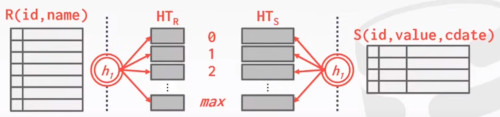

In a parallel setting,
- we can have all of our separate workers
- each worker is going to get a disjoint partition
- all the other workers can do their local join without worrying about of what's going on in other's partition.

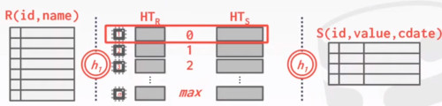

### INTRA QUERY PARALLELISM: IMPLEMENTATION
APPROACH 1. INTRA-OPERATOR (HORIZONTAL)

APPROACH 2. INTER-OPERATOR (VERTICAL)

APPROACH 3. BUSHY PARALLELISM (HYBRID APPROACH)

Techniques are not exclusive

#### INTRA-OPERATOR PARALLELISM (HORIZONTAL)
For each operators that we have,
- selection
- join
- projection
- aggregation

we are going to decompose each of those operators into independent **fragments**
- that perform the **same function** on **different subsets** of **data**.

The DBMS inserts an **exchange** operator
- (VOLCANO PROCESSING MODEL.)
- dummy operator
- responsible of coalescing or splitting up results from multiple children/parent operators.

If you have a bunch of child operators,
- that are split up into different fragments
- we insert an exchange operator
- that's going to coalesce all together,
- group them all together for the next operator in the query plan.

Similarly if you need to split up the result of individual operators,

##### RUN THROUGH
we have this simple query that is selecting everything from A.
- where some value is greather than 99
  
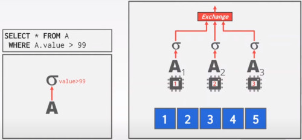

Let's say we have 3 workers,
- we want to split this process
- we are going to have smaller table scans (A1, A2, A3)
- They are going to read disjoint partitions
- and the selection is going to proceed in parallel

And then, they are going to get fed up to this exchange operator.
- the exchange operator is going to call the NEXT call to each of its childs fragments
- The first fragment is going to pull out the first page table from the disk
  
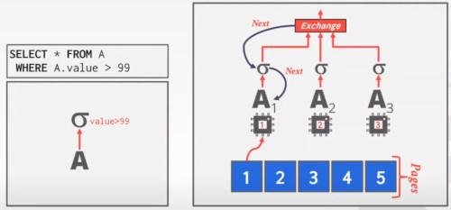

When they are done,
- A1 and A2 can grab pages from disk

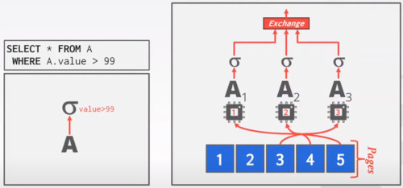

We have to make sure, 2 workers don't take the same page.
- A1 could take every mod 3
- so you don't have to track the current next page.

Is this parallel or is this concurrent?
- is the exchange operator blocking on the next call?
  - so no, calls to next in the exchange operator are going to be non-blocking

###### EXCHANGE OPERATORS
There were different types of exchange operators depending if you want to coalesce or split.
- the previous slide was calling the gather operator.

EXCHANGE TYPE 1. GATHER.
- Combine the results from multiple workers into a single output stream
- in the previous slide, we were combining our different selection operators
  
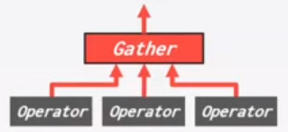

EXCHANGE TYPE 2. DISTRIBUTE
- take a single input stream and you are going to
- Split it up into multiple output streams
- that can be handled in parallel.

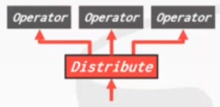

EXCHANGE TYPE 3. REPARTITION.
- we are shuffling multiple input streams across multiple output streams

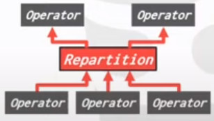

Things get complicated for the JOIN operator.

##### INTRA-OPERATOR PALLELISM: JOIN: RUN THROUGH  
Here we are going to scan on A.
- we split A into this different worker fragments
- that can scan in parallel on A
- they are assigned to their different workers

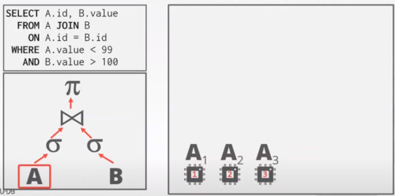

we perform the selection over each fragment

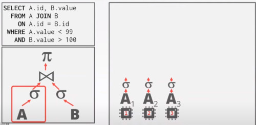

we can also perform a projection right ahead of time
- we filter A.id and B.value
- (see query optimizations)

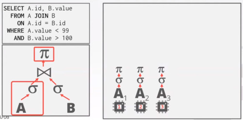

We have to build some **independent hash tables**
- then use an exchange operator to combine those hash tables
The other option would be to implement some concurrent data structure
- with all of those fragments updating and inserting at the same time.

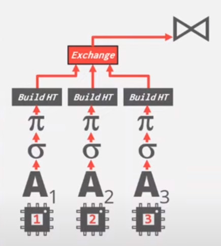

We need those exchange operator to present one unified stream.

Next we have to do the same for the **B** side.
- with the difference that **B** has to probe into the hash table.

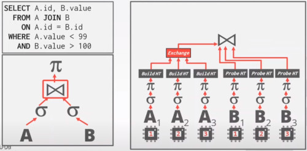

we are not worrying to combining results right here,
- we are going to put the exchange operator at the end of the join operation

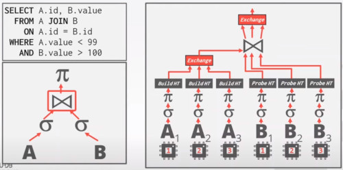

Its going to take all 3 values that are coming into the probe,
- so each of those fragments produces their own output.
- and gets streamed into the final exchange operator.

What does the exchange operator, operates on?
- different exchange operators depends on what you want to achieve.
- some combining logic to merge streams.

If you have a concurrent hash table, 
- then you don't need an exchange operator.

#### INTER-OPERATOR (aka PIPELINE) PARALLELISM (VERTICAL)
Operations rather than breaking into smaller fragments,
- the operations are going to be overlapped,
- in order to pipeline data from one stage to the next
- without materializing.

Each worker is executing a segment of operators (query plan) at the same time.

##### RUN THROUGH
Let's take the join,
- we are going to split that up.
- assign one worker to process the join part
- it will just running in this nested loop doing the join

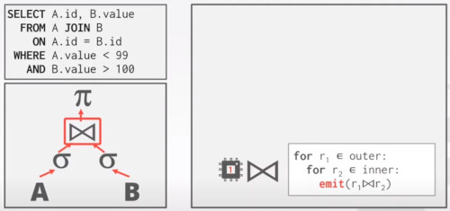

And then we are going to have a separate worker
- that is going to perform the projection operator
- every time it gets the result from the join, is going to apply the projection
  
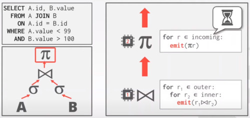

The challange here is that the projection operation,
- has to wait the join to finish, as it is more time consuming.
- so the projection operation is going to be idle almost all the time

#### BUSHY PARALLELISM (HYBRID APPROACH)
Hybrid of intra-parallelism and inter-parallelism.
- where workers execute multiple operators from different segments of a query plan at the same time

Still need to exchange operators to combine intermediate results from segments

For example this query

we could split it up, 
- using a combination between intra- and inter- parallelism
  
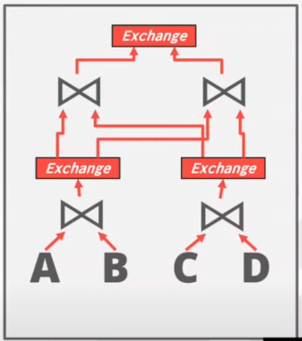

to get something like this

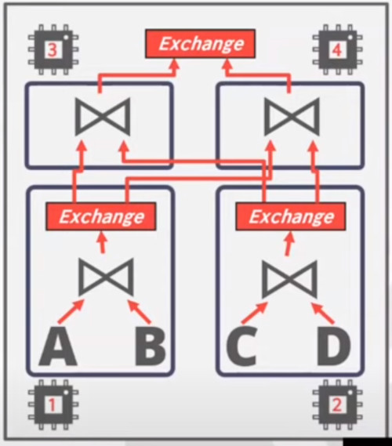

where you have 4 workers, doing 
- join between A and B
- join between C and D
- mixed intermediate joins

we have intra-query operations (the exchanges)

we have inter-query operations (workers assigned to operators)

#### OBSERVATION
Using additional proccesses/threads to execute queries in parallel,
- won't help if the disk is the main bottleneck

In fact, it can makea things worse if each worker is working on different segments of the disk.

## I/O PARALLELISM
Split the DBMS across multiple storage devices.
- Multiple disks per database
- One Database per disk
- One relation (table) per disk
- split relations across multiple disks

### MULTI-DISK PARALLELISM
Configure OS/hardware to store the DBMS's files across multiple storage devices.
- storage appliances
- RAID configuration

This is transparent to the DBMS
