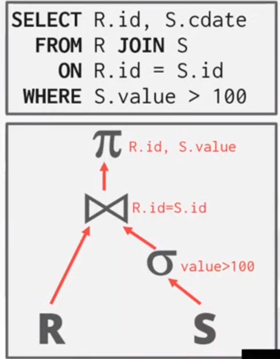
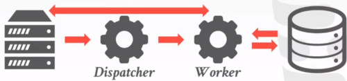
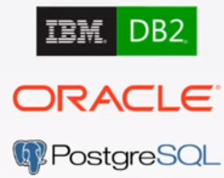
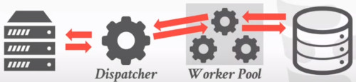
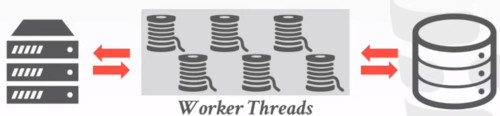
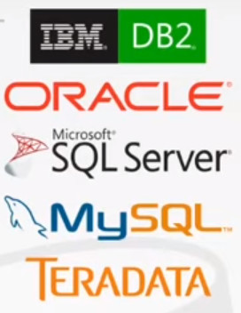

# LECTURE 12: QUERY EXECUTION (II)

## INTRODUCTION
Last class we've discussed
- How to compose operators together into a plan to execute an arbitrary query.
- we've assumed that the queries execute with a single worker (e.g. a thread)
- we will discuss now, how to execute queries using multiple workers.

Remember that we go from a SQL query.
- which gets translated to a logical plan, something with this abstract operators.
- Finally to a physical plan, to describe how we are going to execute each operator.

Again we are not specifying which implementation of the JOIN operation we are using.

### WHY DO WE CARE ABOUT PARALLEL EXECUTION
**FIRST PART. SYSTEM LEVEL.**
parallel execution can give us increased performance.
- **THROUGHPUT**, we can execute more queries in our system draining all available resources
- **LATENCY**, on the other hand we might want to speed up the time a single query is processed.

If you have a transactional workload (OLTP),
- you care more about THROUGHPUT
- you would have a lot of transactions coming in, and you want to execute as many as you can.

If you are in the analytical side workload (OLAP),
- then you care more about LATENCY
- so any long running query, you want to complete as quickly as possible.

**SECOND PART. USER LEVEL.**
What users wants from your application is an increased
- RESPONSIVENESS. What the user sees (e.g. faster web pages)
- AVAILABILITY. 

**THIRD PART. ADMIN LEVEL**
Potentially lower **TOTAL COST OF OWNERSHIP (TCO)** 
- try to use fewer machines
- be more energy efficient

### PARALLEL VS DISTRIBUTED
**PARALLEL DBMS**, means how are we going to execute a single query concurrently
- Resources are physically close to each other
- Resources communicate over high-speed interconnect.
- Communication is assumed to be cheap and reliable.
  
**DISTRIBUTED DBMS**, is the specific case
- Resources can be far from each other
- Resources communicate using slower interconnect.
- Communication cost and problems cannot be ignored.

They share a number of similarities,
- in both cases, the database is spread out across multiple **resources**.
- in both cases, the database appear as a single logical database instance to the application.

## TODAY'S AGENDA
PROCESS MODELS, how we handle concurrent workers in our system.
- how to break up queries execution into multiple concurrent pieces
  
EXECUTION PARALLELISM, how we can achieve execution parallelism using a particular process model

I/O PARALLELISM, also how do we achieve I/O parallelism
- how to leverage parallelism for disk or other store media
  
## PROCESS MODELS
How the system we are building is architected,
- in order to support concurrent request
- from a multi-user application

A **worker**, is the DBMS component that
- is responsible for executing tasks
- on behalf of the client
- and then returning the result to the client.

A worker is not necessary always a thread.

APPROACH 1. PROCESS PER DBMS WORKER
- one process per dbms worker
  
APPROACH 2. PROCESS POOL
- use pools

APPROACH 3. THREAD PER DBMS WORKER
- use threads
  
### PROCESS PER WORKER
Each worker is a **separate** OS **process**
- relies on OS scheduler
- Use Shared memory for global data structures
- A crash in the process doesn't take down the entire system

At a high level, is.
- So the application at the left is going to submit it's request (a query)
- to have executed to the dispatcher layer
- the dispatcher is going to fork off a new process, specifically to handle this query.
- Then this worker is going to manage all of the logic needed to execute the query.
- and its going to communicate back-and-forth the results to the client.

So this worker is going to manage all the reads and writes,
- and the different query operators

Examples
- IBM DB2, postgres, Oracle

So Why these systems are using this system.
- when those systems came out, there weren't really a portable threading library like p-threads (common standars)
- this is a legacy architecture compared to newer options
 
if systems wanted to execute on a bunch of different platforms,
- they would kind of re-implement some threading implementation.

### PROCESS POOL
We are still using processes to handle clients.
- rather than forking a new process for each client that connects to the dispatcher
- we allocate this worker pool of processes.

when one of our proceses comes in,
- the dispatcher can route it to any free worker process in the pool

 
A worker uses any free process from the pool.
- This is still going to rely on OS scheduler, interprocess communication and shared memory
- Bad for CPU cache locality
  - if we don't any control over when processes are being scheduled/descheduled
  - you know there's this pool kind of working on the different queries.
  - there's no way for us to control what is running concurrently.
  - different processes could be flashing the cpu cache.

Examples:
  - IBM DB2
  - PostgreSQL (2015)
    
### THREAD PER DBMS WORKER
Rather than using processes, we are going to use a single thread for each worker.
- one DBMS process
- we spawn up multiple threads
- for each individual worker

The DBMS manage its own schedule
- How many threads
- which threads

it may or may not use a dispatcher thread.

Trade off.
- If a thread crash, it might cause the entire system to crash
- there's not this isolation anymore.

There's a lot lower overhead using threads than processes.

### SUMMARY
Advantage of multi-threaded architecture
- less overhead per context switch
  - switching between different threads
  - switching between different proceses
- **do not have** to worry about dealing with **shared memory**

The **thread per worker** model does not mean,
- that the DBMS supports intra-query parallelism
  - there are many different ways to parallelize a query.
  - running many threads, doesn't mean that we can take a single query
  - and split up its execution into multiple different parallel pieces.
 
we may be able to support multiple concurrent unit,
- from completely different users

### NOTE ABOUT SCHEDULING
For each query plan, the DBMS decides where, when, and how to execute it.
- How many tasks should it use.
- How many CPU cores should it use.
- What CPU core should the tasks execute on.
- Where should a task store its output

The DBMS always knows more than the OS
