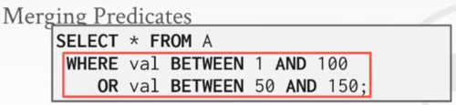

# LECTURE 13: QUERY OPTIMIZATION (I)

## INTRODUCTION
Remember that SQL is declarative
- User tells the DBMS what answer they want,
- no how to get that answer

There can be a big difference in performance based on plan is used

### HISTORY
First implementation of Query optimizer from 1970.
- people had argued that the DBMS could never choose a query plan better that a human could write

Many concepts and design decisions from the **system R** optimizer are still used today

### ALGORITHMS

**HEURISTICS** (aka RULES) 
- Rewrite the query to remove inefficient stuff
- These techniques may need to examine a **catalog**
- They do **not** need to examine the **data**

The idea is to approximate what would be a preferred way to execute a query.

**COST BASED SEARCH**
- use a model to estimate the cost of executing a plan
- it uses an enumeration mechanisms to explore different alternatives
- then figure it out the best of those
- Evaluate multiple equivalent plans for a query and pick the one with the lowest cost.

The complex things that you cannot easily deside,
- which 2 tables you are going to draw for first,
- which 2 tables you are going to join next
- whether you should use a soft-merge-join or a loop join or a hash join

Mature systems would have both of those systems in place.
- but some newer databases that are still in the early day early stage of the development
- they usually have the first type just because they are easier.

### ARCHITECTURE OVERVIEW
At this point everything would be kind of abstract.

Let's say you write a SQL query
- when the SQL query first arrives at the database
- you inmediatelly have an option.
  - to look at just the raw string of the query.
  - maybe tweak things a little bit
  - rearrange the position of different tokens
- of course, it would be very difficult at this stage
  - to rewrite the SQL to be at a very efficient form
  - there's not much information in the SQL raw string
- in practice nobody optimize in that early stage of the proccess

People would typically just parse this SQL query
- to an abstract syntax tree.
  (straightforward approach from any compiler course)
- you look at the tokens
- what will be the keywords
- would be tokens for the tables and columns
  

Then you would bind this syntax tree
- with information in the database
- There would be a component in every system called **CATALOG**
  - esentially its metadata about the system

At this point you already know the semantics of the query.
- at a high level you already know what the query is trying to do

The Binder would be
- just a straightforward compiler technique to look at the query
- and then try to understand the syntax of the query

The result of the step we would call,
- the **logical plan** of the query.
- that's where you would start optimization

An important thing to emphasize,
- for one specific query
- there could be multiple possible valid logical plans

For example a multi-way join, 
- A JOIN B JOIN C
- if you specify the join order to be as that one
- at this point it will perform (A JOIN B) JOIN C
- we will not try to order things
- we are not trying to optimize the predicates-

At this point it just gives you a valid logical plan from many possible.

The next step is the tree rewriter,
- its pretty common
- it usually needs to look again the information in the system catalog
- look at what would be the columns and the tables
- and start to apply simple heuristics
- to prune down obvious stupid execution choices
- at this point we are not looking at the data, just the query structure
    

Then after the logical rewrite,
- this optimized logical plan is sent to the **query optimizer**
- it represents the cost based,
  - plan emulation
  - it will be the most complicated step by the way
  - to generate an advanced organization

And with the information,
- system catalog
- Cost Model (statistics about the data)

And lastly this physical plan,
- is sent back to the system to execute

### LOGICAL vs PHYSICAL PLAN
The **optimizer** generates a mapping of,
- a **logical algebra expression** to
- the **optimal** equivalent **physical algebra expression**.

At the physical level,
- there's many choices that the system can explore,
- that the search space is so huge
- different orders of joins
- different methods, (sort-merge join, hash join)

Before we go into these complex organization choices,
- if looking at this high level what this query is trying to do
- if there are simple rules to eliminate the stupid choices
- shrink down the search space as much as possible.
- that will help later the physical enumeration to be much more targeted and much more efficient

Another note is that there would be a 1 to 1 mapping from logical to physical operators,
- table A is going to join table B
- but Not always a 1:1 mapping,
  - a multiple JOIN operator but then ordered by some column
    - if you choose to use a sort-merge join in your physical operator
    - then you can perform the **join** and the **order by**,
      - the two steps together in a single physical implementation

### QUERY OPTIMIZATION IS NP-HARD
This is the hardest part of building a DBMS
- if you are good at this, you would get paid $$$

people starting to look at employing ML to improve the accuracy and efficacy of optimizers.
- IBM DB2 tried this with LEO in early 2000
  - problem called 'cardinality estimation' 
  - they abandon this project,
    - if it work fine,
    - if it doesn't, impossible to fix
    
Microsoft SQLServer's optimizer has more than a million lines of code
  
### TODAY'S AGENDA
HEURISTICS and its RULES:
- RELATIONAL ALGEBRA EQUIVALENCES, 

- LOGICAL QUERY OPTIMIZATION, how do we expand nested queries

- NESTED QUERIES

- EXPRESSION REWRITTING

COST MODEL

## RELATIONAL ALGEBRA EQUIVALENCES
if you want to optimize a query.
- you have to guarantee that no matter how  you optimize
- the query is still correct
  
Two relational algebra expressions are __equivalent__ if they generate the same set of tuples

The DBMS can identify better querry plans withouta a cost model

This is often called **Query Rewriting**

### PREDICATE PUSHDOWN
Let's say we have this simple query
- where we are just joining 2 tables.
- and then we do a filter on the grade of the students

That expression could be view as a tree.
- This logical plan we are seeing here
- is what it would show up immediately after the binder step
- we pick any logical plan and optimize from there
  

We can optimize by pushing the predicate
- which is going to filter grades based on the grid level A
- before we execute the Join

RELATIONAL ALGEBRA EQUIVALENCE

### SELECTION OPTIMIZATION
What if we have multiple filters?
- perform filters as **early** as possible
- Break a complex predicate into individual predicates and push down
  

Simplify a complex predicate

### JOIN OPTIMIZATION
you can rewrite the  Join using its algebraic properties,
- commutative
- associative
  

The number of different join orderings for an n-way join is a 
- CATALAN NUMBER ($\approx 4^n$)
- exhaustive enumeration will be too slow

Those are going to be reviewed in the COST MODEL section of this lecture

### PROJECTION OPTIMIZATION
This is not important for column store
- useful for row stores

If you have a final projection (S.id, or s.name)

Perform them **early** to create smaller tuples and reduce intermediate results (duplicates are eliminated)

Project out all attributes except the ones requested or required (e.g. joining keys)

### SUMMARY
Transform a logical plan into an equivalent logical plan using pattern matching rules

The goal is to increase the likelihood of enumerating the optimal plan in the search

Cannot compare plans because there is no cost model,
- but can 'direct' a transformation to a desired side
  
## LOGICAL QUERY OPTIMIZATION
More involved organiztion we can do includes, 
- SPLIT CONJUNCTIVE PREDICATES
- PREDICATE PUSHDOWN
- REPLACE CARTESIAN PRODUCTS WITH JOINS
- PROJECTION PUSHDOWN

### SPLIT CONJUNCTIVE PREDICATES
If a query that have a predicate,
- that contains multiple filters
- then one thing we can do is

DECOMPOSE the multiple filters into the bracket,
- into this predicate so that
- we can have more opportunities for optimization

This is a 3-way JOIN

A naive logical tree is difficult to optimize,
- so we split the filter predicate

### PREDICATE PUSHDOWN
After that we are going to look at each filter individually
- and then we try to move this filter to the lowest possible point

### REPLACE CARTESIAN PRODUCTS WITH JOINS
This would also enable us to 
- exchange the cartesian product for the inner product
- that would be more efficient
- Note that we have combined our filters with the cartesian product to give us the inner JOIN operator

### PROJECTION PUSHDOWN
Earlier projection
- you look at the columns you are eventually going to read,
- then push these projections down to the lowest possible point in your query plan.

## NESTED QUERIES
Another organization you can do in this logical query phase,
- The DBMS treats nested sub-queries in the WHERE clause,
- as functions that take parameters
- and return a single value or set of values

Two approaches:
- FLATTEN, Rewrite this inner-query to de-correlate and/or so there would be no nesting anymore
- DECOMPOSE nested query and store result into a temporary table

### FLATTEN
In this example we are seeking for sailors that have any reservation on a specific date.
- we can see that the inner query is actually a JOIN
- referencing a column in the outer query.

So instead of writting them as a nested query,
- you can just look at both tables togethers
- and have an inner join between these two tables

Benefit:
- In the first query, you have to re-execute the inner query for each individual query
  from the outer table.
- using an inner join would be more efficient

 
### DECOMPOSE
In this complex example of the same dataset,
- we are trying to figure out, the Sailor with the highest ratings
- and for the sailors that have at least 2 red boats reservations.
- we want to project the sailor id, and the earliest date on which
- the sailor has a reservation for a red boat.

It doesn't that much, what's this query is trying to do

The inner query is just trying to figure out,
- the max rating among all the sailors in the table
- and the outer table would have a filter table based on that

Instead of computing that inner query over and over again,
- we might pull over that inner query out.
- and then execute this inner query ahead of time once,
- and store the result into a temporary table

For harder queries, the optimizer breaks up queries into blocks and then concentrates on one
block at a time

sub-queries are written to a temporary table that are discarded after the query finishes

## EXPRESSION REWRITTING
An optimizer transforms a query's expression (e.g. WHERE clause predicates)
- into the optimal /minimal set of expressions

Implemented using IF/THEN/ELSE clauses or a **pattern matching** rule engine.
- search for expressions that match a pattern
- When a match is found, rewrite the expression
- Halt if there are no more rules that match.

Let's say we have a simple table
- id is the primary key
- val is an integer
  

Impossible predicates,
- they never match anything
    

Unnecesary predicates,
- they always match, or they can be simplified

Also there could be other simple things,

JOIN elimination
- doing join with itself can be simplified
  

There is a case where you can combine the organization of the join and the sub-query
- same as before, you are joining the same table with itself
  

Merging predicates together
- we observe a superposition in values.
- it can be simplified
  

## COST MODEL
We need a cost model, in order to compare different query plan alternatives.

Generate an estimate of the cost 
- of executing a particular query plan for the current state of the database.
- estimates are only meaningful internally

This is independent of 
- the plan enumeration step
- that we will talk about next class.

### COMPONENTS
CHOICE 1. PHYSICAL COSTS, depends heavily on hardware
- Predict CPU cycles
- I/O
- Cache misses
- RAM consumption
- pre-fetching
- for specialized hardware, in terms of time
  
CHOICE 2. LOGICAL COST
- Estimate result sizes per operator
- Independent of the operator algorithm
- Need estimations for operator result sizes
- just consider the theoretical computational cost, in terms of operators
  
CHOICE 3. ALGORITHMIC COSTS
- Complexity of the operator algorithm implementation
- in terms of input

