# LECTURE 14: QUERY PLAN (II)

## OVERVIEW
We continue our discussion about COST MODELS for query optimization

For the cost model, we talked about 3 components of the cost model.
- PHYSICAL COST, related to hardware factors, usually used in comercial specialized systems.
- LOGICAL COST, define the cost in terms of operators
- ALGORITHMIC COST, which kind of algorithm are you using? how do you sort?

### STATISTICS 
The DBMS stores internal statistics about tables, attributes and indexes in its internal catalog.
- different systems update them at different times.

Manual invocations.
- postgres/SQLite: **ANALYZE**
- Oracle/MySQL: **ANALYZE TABLE**
- SQLserver: **UPDATE STATISTICS**
- DB2: **RUNSTATS**

#### BASIC STATISTICS
let's define the first two most basic statistics.

For every relation **R**, the DBMS maintains the following information.
- **$N_R$** number of tuples in **R**
- **V(A,R)** Number of distincts values of attribute **A**

For example, the number of tuples is needed to estimate the cost of a sequential scan

If your query has a SELECT DISTINCT, and you have a hash join operation, then you want to know what would possible be the size of the hash table

#### DERIVABLE STATISTICS
The **Selection cardinality** **SC(A,R)** is the average number of records with a value for an attribute **A** given **$N_R$/V(A,R)**
- Divide the number of tuples by the number of distinct values.
- it represents the average number of records with a given value **A**

When we are calculating this average number of records for a given value of a given attribute.
- we are making a huge assumption **data uniformity**
- where every value has the same frequency as all other values
- example, 10000 students in 10 colleges. rarely distribution.

#### LOGICAL COSTS
The primary goal of these statistics is to help calculate the logical cost in our database system

in some simple cases, you may actually need the complicated statistics,
- assuming that you have a simple select query on the primary key 
- with the Equality predicates on the primary key.

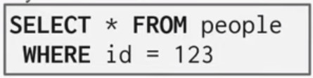

In this case, you actually don't need those statistics
- at most you would get one tuple to be matched.

In most other cases, statistics are much appreciated

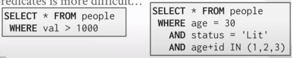

#### COMPLEX PREDICATES
We are formally define the fraction of tuples we are going to get,
- after each operator
- as the selectivity

The selectivity **SEL** of a predicate **P** is the fraction of tuples that qualify.

Let's say we have an operator that is going to scan a table, 
- but with a predicate that would select 10 attributes out of a table of 100 records
- then the selectivity of this operator or this predicate
- would be 0.1
- because you for this operation are going to look at 10 percent of the total data.

Then for different predicates you are going to use different formulas.
- Equality
- Range
- Negation
- Conjunction
- Disjunction

##### SELECTION
Assume that **V(age, people)** has five distincts values (0-4) and **$N_R=5$**

Equality Predicate,
- A=Constant
- SEL(A=constant) = SC(P) / $N_R$

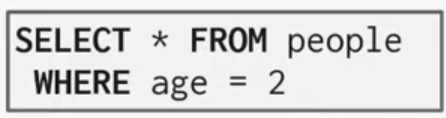

If the table has 5 age groups, each of them have 1 tuple,
- then the selectivity  of this query would be 1

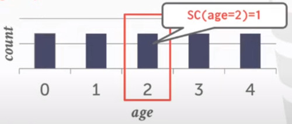

In this other example, we have a more complex curve right.

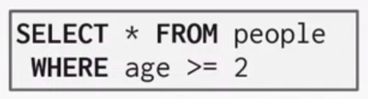

Then the selectivity of this case would be
- sel(age>=2) = 3/5
  
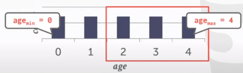

And the general formula is:

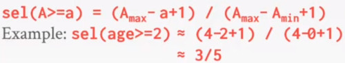

For the Negation Predicate, 
  

You first search the one who fits the selection

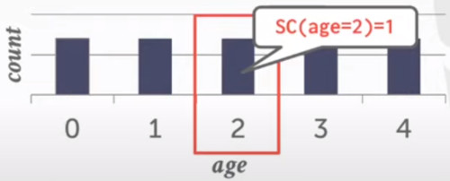

And the just compute the opposite of that.

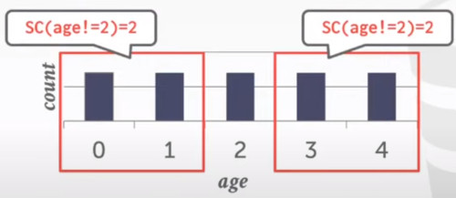

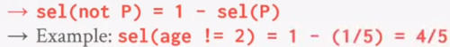

One observation we probably would have is.
- SELECTIVITY is similar to PROBABILITY

so what's the **probability** that a certain **tuple** would **satisfy** my **Predicate**.

CONJUCTION PREDICATES
- SEL( P1 AND P2 ) = SEL (P1) · SEL(P2)
- This assumes that the predicates are independent
  
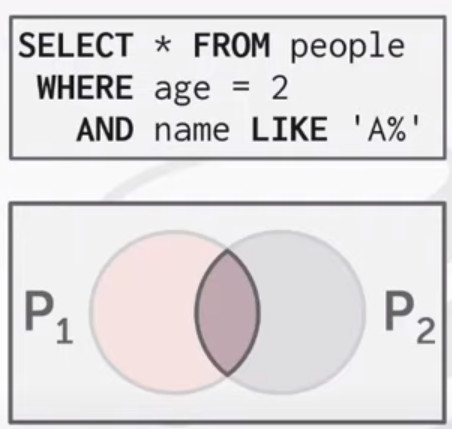

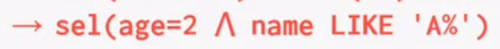

DISJUNCTION PREDICATES

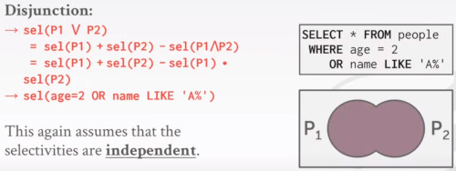

### TODAY'S AGENDA
- MOE COST ESTIMATION (statistics)

- PLAN ENUMERATION

## MOE COST ESTIMATION

## PLAN ENUMERATION
