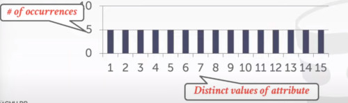
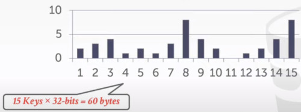
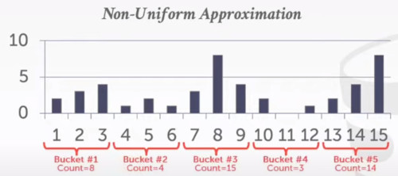
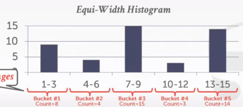
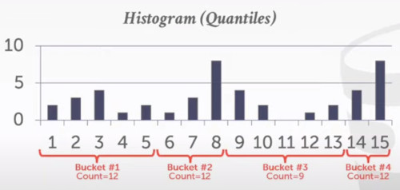
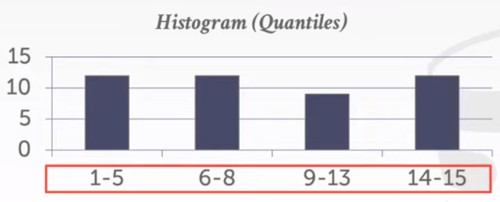
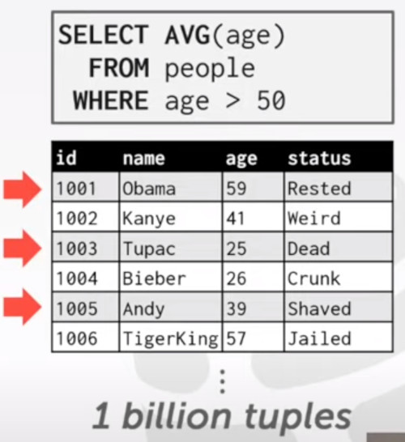
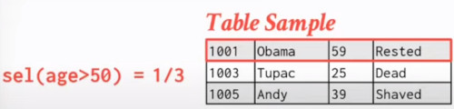
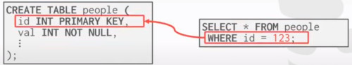

# LECTURE 14: QUERY PLAN (II)

## OVERVIEW
We continue our discussion about COST MODELS for query optimization

For the cost model, we talked about 3 components of the cost model.
- PHYSICAL COST, related to hardware factors, usually used in comercial specialized systems.
- LOGICAL COST, define the cost in terms of operators
- ALGORITHMIC COST, which kind of algorithm are you using? how do you sort?

### STATISTICS 
The DBMS stores internal statistics about tables, attributes and indexes in its internal catalog.
- different systems update them at different times.

Manual invocations.
- postgres/SQLite: **ANALYZE**
- Oracle/MySQL: **ANALYZE TABLE**
- SQLserver: **UPDATE STATISTICS**
- DB2: **RUNSTATS**

#### BASIC STATISTICS
let's define the first two most basic statistics.

For every relation **R**, the DBMS maintains the following information.
- **$N_R$** number of tuples in **R**
- **V(A,R)** Number of distincts values of attribute **A**

For example, the number of tuples is needed to estimate the cost of a sequential scan

If your query has a SELECT DISTINCT, and you have a hash join operation, then you want to know what would possible be the size of the hash table

#### DERIVABLE STATISTICS
The **Selection cardinality** **SC(A,R)** is the average number of records with a value for an attribute **A** given **$N_R$/V(A,R)**
- Divide the number of tuples by the number of distinct values.
- it represents the average number of records with a given value **A**

When we are calculating this average number of records for a given value of a given attribute.
- we are making a huge assumption **data uniformity**
- where every value has the same frequency as all other values
- example, 10000 students in 10 colleges. rarely distribution.

#### LOGICAL COSTS
The primary goal of these statistics is to help calculate the logical cost in our database system

in some simple cases, you may actually need the complicated statistics,
- assuming that you have a simple select query on the primary key 
- with the Equality predicates on the primary key.


In this case, you actually don't need those statistics
- at most you would get one tuple to be matched.

In most other cases, statistics are much appreciated


#### COMPLEX PREDICATES
We are formally define the fraction of tuples we are going to get,
- after each operator
- as the selectivity

The selectivity **SEL** of a predicate **P** is the fraction of tuples that qualify.

Let's say we have an operator that is going to scan a table, 
- but with a predicate that would select 10 attributes out of a table of 100 records
- then the selectivity of this operator or this predicate
- would be 0.1
- because you for this operation are going to look at 10 percent of the total data.

Then for different predicates you are going to use different formulas.
- Equality
- Range
- Negation
- Conjunction
- Disjunction

##### SELECTION
Assume that **V(age, people)** has five distincts values (0-4) and **$N_R=5$**

Equality Predicate,
- A=Constant
- SEL(A=constant) = SC(P) / $N_R$


If the table has 5 age groups, each of them have 1 tuple,
- then the selectivity  of this query would be 1


In this other example, we have a more complex curve right.


Then the selectivity of this case would be
- sel(age>=2) = 3/5
  


And the general formula is:


For the Negation Predicate, 
  


You first search the one who fits the selection


And the just compute the opposite of that.


One observation we probably would have is.
- SELECTIVITY is similar to PROBABILITY

so what's the **probability** that a certain **tuple** would **satisfy** my **Predicate**.


CONJUCTION PREDICATES
- SEL( P1 AND P2 ) = SEL (P1) · SEL(P2)
- This assumes that the predicates are independent
  


DISJUNCTION PREDICATES


### TODAY'S AGENDA
- MOE COST ESTIMATION (statistics)

- PLAN ENUMERATION


## MOE COST ESTIMATION

### JOIN RESULT SIZE ESTIMATION
Given a join of **R** and **S**,
- what is the range of possible result sizes in number of tuples?

In other words, for a given tuple **R**, how many tuples of **S** will it match?

Assume each key in the inner relation will exist in the outer table
- so we multiply the number of tuples in **R** with the selection cardinality of **S**

Estimate the number of tuples of S
- $estSize \approx N_R\cdot N_S  / V(A,S)$
or symertrically
- $estSize \approx N_R\cdot N_S  / V(A,R)$

Overall, you have to search the smaller table.
- $estSize \approx N_R\cdot N_S  / max(V(A,S), V(A,R) )$

### SELECTION CARDINALITY OVERVIEW
Assumption 1. Uniform data.
- the distribution of values (except for the heavy hitters) is the same

Assumption 2. Independent Predicates.
- The predicates on attributes are independent

Assumption 3. Inclusion principle.
- The domain of join keys overlap such that each key in the inner relation will also exist in the outer table


#### CORRELATED ATTRIBUTES
Let's talk about the independent assumption.

Consider a database of automobiles.
- 10 different makes of the cars
- with 100 different models

Now consider this query.
```
(make = 'Honda' AND model='Accord')
```
With the independence  and uniformity assumptions, the selectivity is:
- 1/10 * 1/100 = 0.001

But since Honda is the only one who makes accords the real selectivity is 1/100 = 0.01

To solve this issule you can define a correlated column statistics on multiple attributes in the database.
- you cannot define statistics on every combination of attributes
- the database just offloads to the users to manage how the attributes should be correlated


#### UNIFORM ASSUMPTION
We have assumed that the attributes were uniformly distributed



But in practice,  the number of occurencies of each value in the table would not be uniformly distributed



In this case, one naive approach we can do is,
- instead of recording, the total number of distinct values. (selectivity cardinality)
- you can record the occurence of each single value.
- but it can become pretty large


A better approach, without paying that huge overhead, 
- you can keep track of multiple values together
- in other words perform an histogram



All buckets have to have the same width
- in this case, each bucket has a range of 3.




#### EQUI-DEPTH HISTOGRAMS
An optimization we can do here is,
- instead of divide this total amount of values into buckets by the number of values
- we can group these values based on the number of occurrences

So we divide our values into buckets,
- such that the total number of occurrences in each bucket will be almost the same




Instead of having 'Equi-width' say 3 values per sample,
- we have instead 'Equi-depth' or 'equi-frecuency'



This way it allows you to sample like an uniform distribution.

### SKETCHES
So far we have talked about most of common approaches to maintain statistics for the attributes in the table
- there simple ones,
  - like the number of tuples
  - Histograms

Now we are going to talk some less common ones.

Cost-model can replace histograms with sketches to improve its selectivity estimate accuracy.
- Count-min Sketc, 1988: approximate frequency count of elements in set
- HyperLogLog, 2007: Approximate the number of distinct elements in a set.

### SAMPLING
Another option less common,
- instead of maintain the different histograms, skteches about the probability of the data
- why not keep certain samples of the data
- then when a query comes,
- just look in the reserved samples
- and see how many tuples satisfy a certain predicate
- and extrapole from there





Modern DBMS also collect samples from tables to estimate selectivities.


One very disadvantage of this,
- first you have to generate the sample
- keep it as a temporary table
- you have to execute another mini-query
- after that execution you use that information to start optimizing our plan enumeration

You don't have to update those tables continuously,
- just Update samples when the underlying tables changes significantly.


### OBERVATION
Now that we can estimate selectivity of predicates,
- and subsequently the cost of query plans,
- what can we do with them?

## PLAN ENUMERATION
After performing rule-based rewriting, the DBMS will enumerate different plans for the query and estimate their costs.
- Single relation
- Multiple relations,
  - queries with joins involved, more complicated search mechanism
- Nested Subqueries

It chooses the best plan it has seen for the query after exhausting all plans or some timeout

### SINGLE RELATION QUERY PLANNING
Often simple rules/heuristics would be enought for this type of simple queries.
- heuristics here are different from last time to generate a logical query organization

Pick the best access method
- Sequential scan
- Binary search (clustered indexes)
- Index scan

Predicate evaluation ordering

Simple heuristics are often good enough for this.

OLTP queries are especially easy
- insert a tuple or look up at specific record

#### OLTP QUERY PLANNING
Query planning for OLTP queries is easy because they are **SARGABLE** (Search Argument able)
- It is usually just picking the best index
- Joins are almost always on foreign key realtionships with a small cardinality
- Can be implemented with simple heuristics

An index that can help accelerate the search of this query.

a single relationship query would be like 'people that certify a particular age group'
- then if you build and age index, ç
- then this query is very likely to be executed in a very efficient way already.



### MULTI RELATION QUERY PLANNING
What the Join order should be?

As numbers of joins increases, number of alternative plans grows rapidly
- we need to restric the search space

Fundamental decision in SYSTEM R:
- only left-deep join trees are considered
- Modern DBMS do not always make this assumption anymore

- 
