# LECTURE 15: CONCURRENCY CONTROL

## OVERVIEW

The DBMS concurrency control and recovery components permeate throughout the design of its entire architecture

### MOTIVATION
so far we talked about how we execute queries
- but what if the database could have many clients

**LOST UPDATES**, Concurrency control

We both **change** the **same record** in a table at the same time.

**DURABILITY**, recovery

You transfer $100 between bank accounts but there is a power failure
- what is the correct database state?

### PROPERTIES
Based on concepts of transactions with **ACID** properties
- let the developers conveniently handle the data
- without worrying about those values got overwritted by another user

There are different metrics of different properties to worry about

Let's talk about transactions

## TRANSACTIONS
A transaction is the execution of a sequence of one or more operations (e.g. SQL queries)
- on a database to perform some higher level functionality

It is the basic unit of change in DBMS,
- partial transactions are not allowed

### EXAMPLE
Move $100 from Lin's bank account to his promotor's account

Transaction:
- Check whether Lin has $100
- Deduct $100 from his account
- Add $100 to his promotor account

### STRAWMAN SYSTEM
Execute each txn one-by-one as they arrive at the DBMS
- one and only one txn can be running at the same time in the DBMS

Before a txn starts, copy the entire database to a new file and make all changes to that file.
- if the txn completes successfully, overwrite the original file with the new one.
- if the txn fails, just remove the dirty copy.

### PROBLEM STATEMENT
A (potentially) better approach is to allow  concurrent execution of independent transactions
- Better utilization/throughput
- Increased response times to users

but also we want.
- Correctness
- Fairness, every transaction has the opportunity to be executed

Arbitrary interleaving of operations can lead to:
- Temporary Inconsistency (ok, but unavoidable)
- Permanent Inconsistency (bad!)

We need formal correctness criteria to determine whether an interleaving is valid

### DEFINITIONS
A txn may carry out many operations on the data retrieved from the database
- like read or write from different records
  
The DBMS is only concerned about the content of the data is red/written from/to the database
- changes to the 'outside world' are beyond of the scope of the DBMS

#### FORMAL DEFINITIONS
**DATABASE**, a Fixed set of named data objects (e.g. A, B, C)
- we don't need to define what these objectsa are now

**TRANSACTION**, A sequence of read and write operations (R(A), W(B) )
- DBMS's abstract view of a user program

#### TRANSACTIONS IN SQL
A new txn starts with the **BEGIN** command.

The txn stops with either **COMMIT** or **ABORT**,
- if commit, the DBMS either saves all the txn's changes or aborts it
- If abort, all changes are undone so that it's like as if the txn has never executed at all

Abort can be either self-inflicted or caused by the DBMS

### CORRECTNESS CRITERIA: ACID
**Atomicity**, all actions in the txn happen, or none happen
- ALL OR NOTHING
  
**Consistency**, if each txn is consistent and the DB starts consistent, then it ends up consistent.
- IT LOOKS CORRECT TO ME
  
**Isolation**, Execution of one txn is isolated from that of other txn.
- AS IF ALONE
  
**Durability**, If a txn commits, its effect persist
- SURVIVE FAILURES

## ATOMICITY OF TRANSACTIONS
Two possible outcomes of executing a txn,
- Commit after completing all its actions
- Abort (or be aborted by DBMS) after executing some actions

DBMS guarantees that txns are atomic.
- from user's point of view,
  - txn always either executes all its actions or executes no action at all.
 
### EXAMPLES
**SCENARIO 1**
- we take $100 out of Lin's account but then the DBMS abort the txn before we transfer it.

**SCENARIO 2**
- we take $100 from Lin's account but then there is a power failure before we trasnfer it.

What should be the correct state of Lin's account after both txn abort?

### MECHANISMS FOR ENSURING ATOMICITY
**APPROACH 1.** LOGGIN.
- DBMS logs all actions so that it can undo the actions of aborted transactions
- maintain undo records both in memory and on disk
- Think of this like the black box airplanes

Loggin is used by almost every DBMS.
- audit trail
- Efficiency reasons

**APPROACH 2.** SHADOW PAGING
- DBMS makes copies of pages of and txns make changes to those copies, only when thx txn commits is the page visible to others.
- Originally from system R

Few systems do this.
- CouchDB
- LMDB (openLDAP)

## CONSISTENCY
The world represented by the database is logically correct.

DATABASE CONSISTENCY
- integrity constrains
- transaction in the future see the effects of transactions commited in the past inside of the database
  
TRANSACTION CONSISTENCY
- if the database is consistent before the transaction starts (running alone), it will also be consistent after
- transaction consistency is the application's responsability. DBMS cannot control this (we won't discuss this issue further)

## ISOLATION OF TRANSACTIONS
User submits txns and each txn executes as it was running by itself.
- easier programming model to reason about

But the DBMS achieves concurrency by interleaving the actions (reads/writes of DB objects) of txns

We need a way to interleave txns but still make it appear as if they ran one-at-a-time

### MECHANISMS TO ENSURE ISOLATION
A **concurrency control protocol** is how the DBMS decides the proper interleaving of operations from multiple transactions.

Two categories of protocols.
- **pesimistic**, Don't let problems arise in the first place
- **optimistic**, Assume conflicts are rare, deal with them after they happen

### EXAMPLE
Assume at first **A** and **B** each have $1000, 
- T1 transfers $100 from **A**'s account to **B**'s
- T2 credits both account with 6% interest.

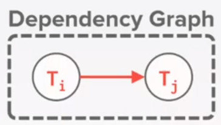

What are the possible outcomes of running T1 and T2?
- Many, but **A+B** should be:
- $2000*1.06=$2120

There is no guarantee that **T1** will execute before **T2** of viceversa if both are submited together.
- but the net effect must be equivalent to these two transactions running serially in some order

So legal outcomes are, depending on whether T1 executes before T2 or not
1. **A=954 and B=1166**
2. **A=960 and B=1160**

#### SERIAL EXECUTION EXAMPLE
Let's say T1 starts before T2 or vice-versa
- after all, the total amount of money should be the same
  
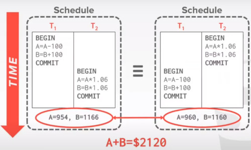

### INTERLEAVING TRANSACTIONS
We interleave txns to maximize concurrency
- slow disk/network I/O
- Multi-core CPU

When one txn stalls because of a resource (e.g. page fault) another txn can continue execute and make forward progress

We want
- Improve Throughput
- Reduce Latency

#### EXAMPLE
We can first in T1, substract $100
- then start T2, computing its interest
- and then finish T1,  adding 100 to B
- finally computing interest on B

Even when those operations are interleaved,
- we get the same result at the end of the day

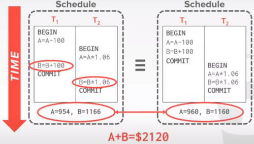

But if interleaving was done wrong, then you might have missed money in the way

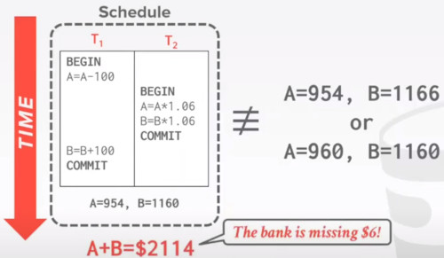

For the purpose of the transaction let we analyze the previous example
- the only matters here is what record has to be read or written

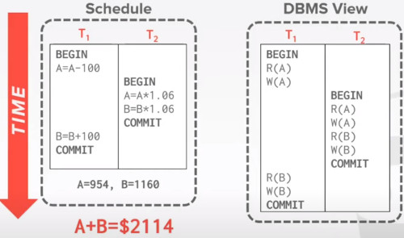

### CORRECTNESS
How do we judge whether a schedule is correct?

we define a transaction scheduling 
- Is correct, if the schedule is equivalent to some serial execution

### FORMAL PROPERTIES OF SCHEDULES
**SERIAL SCHEDULE**
- a schedule that does not interleave the actions of different transactions

**EQUIVALENT SCHEDULES**,
- For any database state, the effect of executing the first schedule is identical to the effect of executing the second schedule
- doesn't matter what the arithmetic operations are.

**SERIALIZABLE SCHEDULE**
- A schedule that is equivalent to some execution of the transactions

If each transaction preserves consistency, every serializable schedule preserves consistency

Serializable is a less intuitive notion of correctnessc compared to txn initiation time or commit order,
- but it provides the DBMS with additional flexibility in scheduling operations.

More flexibility means better parallelism

### CONFLICTING OPERATIONS
How do we ensure this serializable properties?

How are we going to analyze a specific schedule of a transaction?

We need a formal notion of equivalence that can be implemented efficiently based on the notion of **"conflicting" operations**
- what can we do, and what we cannot do

Two operations conflic it
- They are by different transactions
- They are on the same object and at least one of them is a write.

### INTERLEAVED EXECUTION ANOMALIES

**Read-Write conflicts (R-W)**

**Write-Read conflicts (W-R)**

**Write-Write conflicts (W-W)**

There's also a phantom conflict.

#### READ WRITE CONFLICT
You cannot repeat the read of a transaction
- you are violating the isolation principle
  
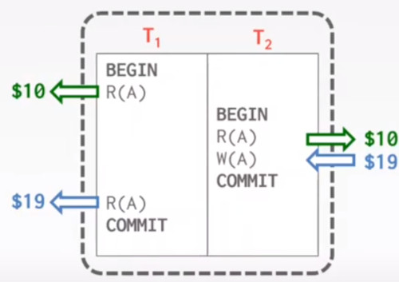

#### WRITE READ CONFLICT
Reading uncommited data (dirty reads)
- if T1 aborts, then what has done by T2 should be undone
  
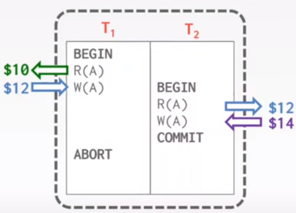

#### WRITE WRITE CONFLICT
Overwritting Uncommited data
- you can have A=$10, B=Andrew, or A=$19, B=Lin
- but you cannot have a mixture of both. as you break the isolation principle.
  
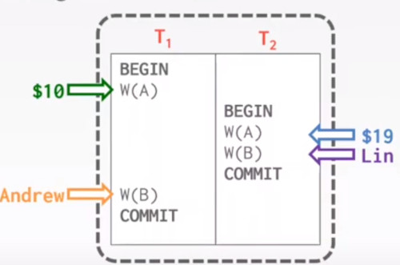

### FORMAL PROPERTIES OF SCHEDULES
Database is not trying to build a clever schedule
- it just allows the transaction and operations and then check if there were any conflict

Given these conflicts, we now can understand what it means for a schedule to be serializable
- this is to check whether schedules are correct
- This is nota how to generate a correct schedule

There are different levels of serializability
- Conflict serializability (most dbms tryies to support)
- View serializability (rarely view)
  - systems more efficient, but requires the understanding of the semantic of the application.
 

Two schedules are **conflict equivalent** if and only if.
- They involve the same actions of the same transactions and
- Every pair of conflicting action is ordered the same way

Schedule **S** is **conflict SERIALIZABLE** if.
- **S** is conflict equivalent to some serial schedule

-> Same conflicts at the same order.

### CONFLICT SERIALIZABLE INTUITION
Schedule **S** is conflict serializable if you can transform **S** into a serial schedule by swapping consecutive non-conflicting operations of different transactions.

Assume this schedule transaction between T1 and T2
- If T1 abort, T2 is reading register changed by T1 so there is a R-W conflict
- we don't know if both transaction are conflict equivalent

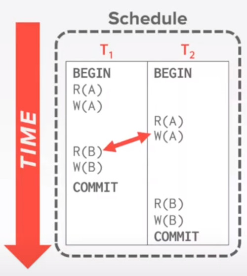

we swap those non-conflict operations

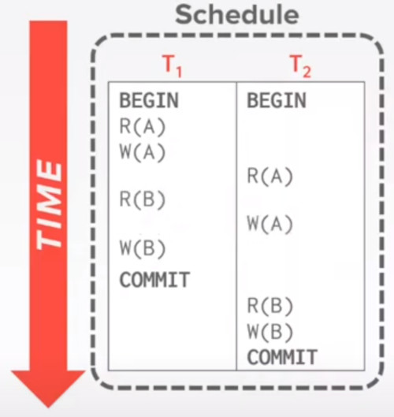

we swap again 2 non-conflict operations

we reapeat until we get the operations serialized

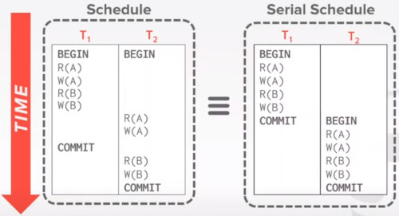

Let's try a different example,
- if we just want to swap W(A)
- you again are at the same situation
  
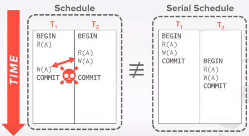

### SERIALIZABILITY
Swapping operations is easy when there are only 2 txns in the schedule.
- it's cumbersome when there are many txns.

Are there any faster algorithms to figure this out, other than transposing operations?

### DEPENDENCY GRAPHS
For every transaction, we are going to define a node.

We are going to define a directed Edge from **Ti** to **Tj** if:
- There's an operation **Oi** of **Ti** conflicts with an operation **Oj** and **Tj** and
- **Oi** appears earlier in the schedule than **Oj**.

Also known as **precedence graph**

A schedule is conflict serializable if and only if its dependency graph is acyclic

#### EXAMPLES
**EXAMPLE 1**
We have transactions T1 and T2
- our first conflict is when you write on **A**, and also read on **A** in T2

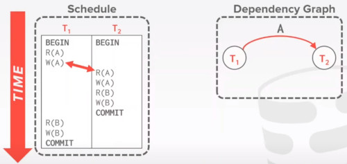

Then, there's another Write on **B**, Read on **B**
- we have found a cycle and terminate
  
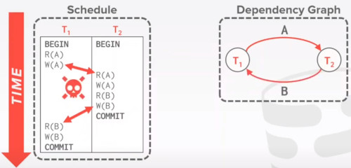

**EXAMPLE 2**

Lets have a more complex example between 3 transactions.
- we first have a conflict between Write on **B** Read on **B**
- as Write happens first, the arrows start from T2 up to T1.
  
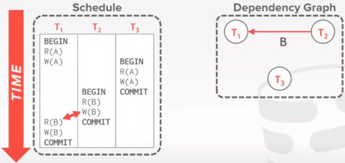

We also have found another W-R conflict between T1 and T3

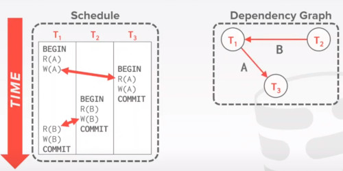

But as it's acyclical, this is equivalent to a serial execution.
- the sequence is. (T2, T1, T3)
- Notice that T3 should go after T2, although it starts before it.

**EXAMPLE 3** inconsistent analysis
Assume that, not only i'm denoting the READ and WRITE operations 
- but also the operation my application it is doing.

we substract 10 from A,
- T2 sums A
- T2 echo the sum out

We have a Write Read Conflict

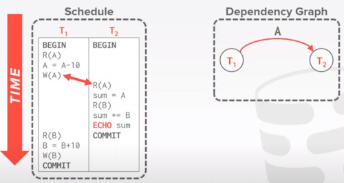

we also have a Read Write conflict on B

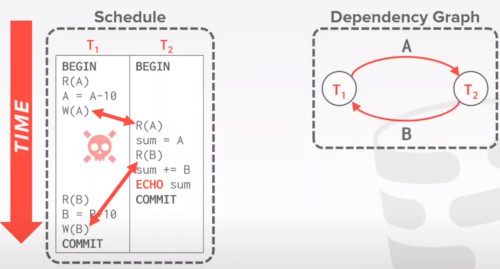

But what if instead of looking for the Sum of A
- what if we just care about how many values are greater than zero

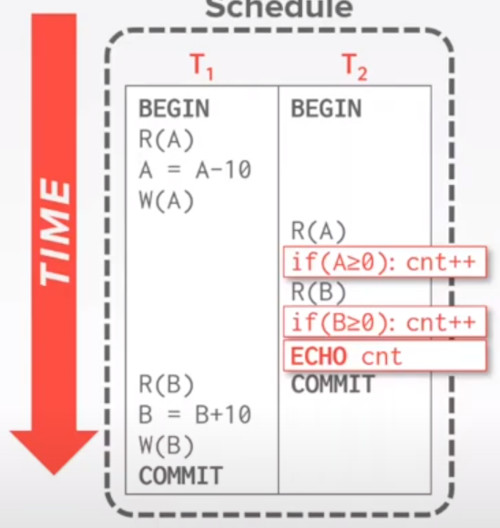

Even if this transaction is not conflict serializable
- the result is actually correct
- in practice, because its really difficult the system to know what do you really want to do with those records
  - you are breaking isolation.
  - view serializability

### VIEW SERIALIZABILITY
Alternative (weaker) notion of serializability.

Schedules **S1** and **S2** are view equivalent if
- T1 reads initial value of **A** in **S1** then **T1** also reads initial value of **A** in **S2**
- If T1 reads value of **A** written by **T2** in **S1** then **T1** also reads value of **A** written by **T2** in **S2**
- If T1 writes final value of **A** in **S1** then **T1** also writes final value of **A** in **S2**

Say we have 3 transactions here

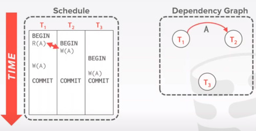
