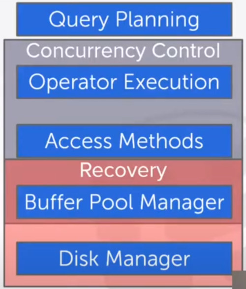

# LECTURE 15: CONCURRENCY CONTROL

## OVERVIEW

The DBMS concurrency control and recovery components permeate throughout the design of its entire architecture

### MOTIVATION
so far we talked about how we execute queries
- but what if the database could have many clients

**LOST UPDATES**, Concurrency control

We both **change** the **same record** in a table at the same time.

**DURABILITY**, recovery

You transfer $100 between bank accounts but there is a power failure
- what is the correct database state?

### PROPERTIES
Based on concepts of transactions with **ACID** properties
- let the developers conveniently handle the data
- without worrying about those values got overwritted by another user

There are different metrics of different properties to worry about

Let's talk about transactions

## TRANSACTIONS
A transaction is the execution of a sequence of one or more operations (e.g. SQL queries)
- on a database to perform some higher level functionality

It is the basic unit of change in DBMS,
- partial transactions are not allowed

### EXAMPLE
Move $100 from Lin's bank account to his promotor's account

Transaction:
- Check whether Lin has $100
- Deduct $100 from his account
- Add $100 to his promotor account

### STRAWMAN SYSTEM
Execute each txn one-by-one as they arrive at the DBMS
- one and only one txn can be running at the same time in the DBMS

Before a txn starts, copy the entire database to a new file and make all changes to that file.
- if the txn completes successfully, overwrite the original file with the new one.
- if the txn fails, just remove the dirty copy.

### PROBLEM STATEMENT
A (potentially) better approach is to allow  concurrent execution of independent transactions
- Better utilization/throughput
- Increased response times to users

but also we want.
- Correctness
- Fairness, every transaction has the opportunity to be executed

Arbitrary interleaving of operations can lead to:
- Temporary Inconsistency (ok, but unavoidable)
- Permanent Inconsistency (bad!)

We need formal correctness criteria to determine whether an interleaving is valid

### DEFINITIONS
A txn may carry out many operations on the data retrieved from the database
- like read or write from different records
  
The DBMS is only concerned about the content of the data is red/written from/to the database
- changes to the 'outside world' are beyond of the scope of the DBMS

#### FORMAL DEFINITIONS
**DATABASE**, a Fixed set of named data objects (e.g. A, B, C)
- we don't need to define what these objectsa are now

**TRANSACTION**, A sequence of read and write operations (R(A), W(B) )
- DBMS's abstract view of a user program

#### TRANSACTIONS IN SQL
A new txn starts with the **BEGIN** command.

The txn stops with either **COMMIT** or **ABORT**,
- if commit, the DBMS either saves all the txn's changes or aborts it
- If abort, all changes are undone so that it's like as if the txn has never executed at all

Abort can be either self-inflicted or caused by the DBMS

### CORRECTNESS CRITERIA: ACID
**Atomicity**, all actions in the txn happen, or none happen
- ALL OR NOTHING
  
**Consistency**, if each txn is consistent and the DB starts consistent, then it ends up consistent.
- IT LOOKS CORRECT TO ME
  
**Isolation**, Execution of one txn is isolated from that of other txn.
- AS IF ALONE
  
**Durability**, If a txn commits, its effect persist
- SURVIVE FAILURES

## ATOMICITY OF TRANSACTIONS
Two possible outcomes of executing a txn,
- Commit after completing all its actions
- Abort (or be aborted by DBMS) after executing some actions

DBMS guarantees that txns are atomic.
- from user's point of view,
  - txn always either executes all its actions or executes no action at all.
 
### EXAMPLES
**SCENARIO 1**
- we take $100 out of Lin's account but then the DBMS abort the txn before we transfer it.

**SCENARIO 2**
- we take $100 from Lin's account but then there is a power failure before we trasnfer it.

What should be the correct state of Lin's account after both txn abort?

### MECHANISMS FOR ENSURING ATOMICITY
**APPROACH 1.** LOGGIN.
- DBMS logs all actions so that it can undo the actions of aborted transactions
- maintain undo records both in memory and on disk
- Think of this like the black box airplanes

Loggin is used by almost every DBMS.
- audit trail
- Efficiency reasons

**APPROACH 2.** SHADOW PAGING
- DBMS makes copies of pages of and txns make changes to those copies, only when thx txn commits is the page visible to others.
- Originally from system R

Few systems do this.
- CouchDB
- LMDB (openLDAP)
