# LECTURE 16: TWO PHASE LOCKING CONCURRENCY CONTROL

## OVERVIEW
last time we have talked about how transactions are going to execute correctly
- Conflict serializable
  - verify using either 'swapping method' or 'dependency graphs'
  - Any DBMS that says that they support 'serializable' isolation does this
- View serializable
  - no efficient way to verify
  - the instructor doesn't know of any dbms that supports this

Observation
- We need a way to guarantee that all execution schedules are correct (i.e. serializable)
- without knowing the entire schedule ahead of time

Solution
- use locks to protect database objects

### EXECUTING WITH LOCKS
we are assuming that there also be a centralized location that would manage all those locks
- hey, what are the locks currently out there.
- which transaction owns which lock
- which transaction is waiting for a lock
  
Here T1 ask lock for A

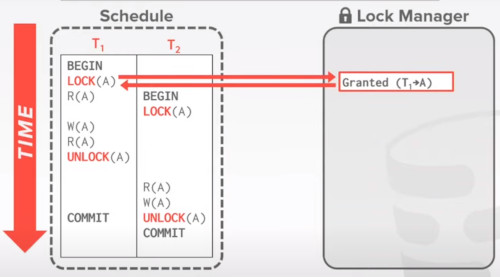

Then it comes T2 and ask again a lock for A, 
- which is denied
- and T2 has to wait
  
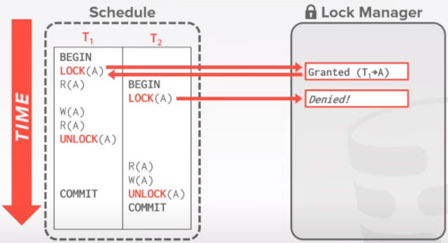

Once T1 release the lock for A
- that's when the lock manager grant access of A to T2

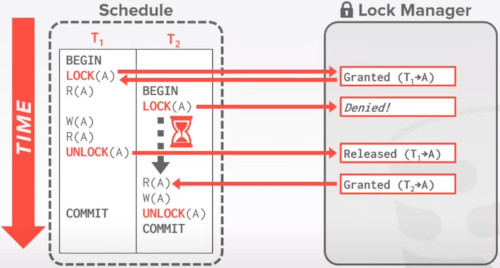

### TODAY'S AGENDA
LOCK TYPES, definition, set terminology
TWO-PHASE LOCKING, very used algorithm to achieve a concurrency control
DEADLOCK DETECTION + PREVENTION, issues of 2-phase locking
HIERARCHICAL LOCKING, heads up on hierarchical locking

## LOCK TYPES
There's actually 2 types of objects to protect records in the database system
- LOCKS
- LATCHES,
  - you have seen it before, they are
  - protection mechanisms on the internal data structure
  - if multiple threads are trying to acces an B+ index, then you would protect the records, and nodes

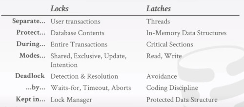  

### BASIC LOCK TYPES
**S-LOCK**, Shared locks for reads
**X-LOCK**, Exclusive locks for writes.

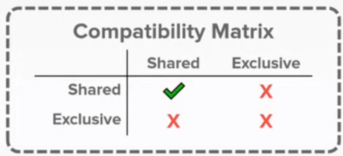

### EXECUTING WITH LOCKS
The procedure of the lock manager to grant locks is that,
- while transactions are executing
- if they realize it needs a specific record
- it will first request the transaction manager to grant that lock
- either or update a share lock to a exclusive lock
- after its done, it can release its lock
  

Lock manager updates its internal lock-table
- it keeps track of what transactions hold what locks and what transactions are waiting to acquire any locks

#### RUN THROUGH
Here because T1 needs both Read and Write on A, 
- it would request an exclusive lock

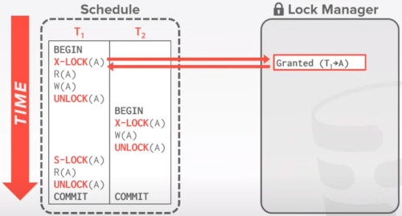

After T1 is done with this record A, it release this lock
- and later on, transaction T2 would need to acquire this lock

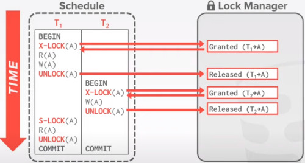

And finally T1 just only needs to read Lock A,
- so it doesn't need to acquire a lock

There's a problem here,
- T1 performs 2 reads of record A
- but between the 2 reads, T2 comes along and change record A

So this procedure is actually wrong.

This is just telling us, that simply locking records,
- while you need to access them
- that doesn't prevent cycles in the dependency graph

## TWO-PHASE LOCKING
It doesn't schedule things ahead of time, 
- decides to grant or not a lock on the fly.

**PHASE 1**, GROWING,
- Each txn request the locks that it needs from the DBMS's lock manager
- you only **acquire locks**
  
**PHASE 2**, SHRINKING,
- Thx txn is allowed to only release locks that it previously acquired.
- It cannot acquire new locks
- you only **release locks**

The txn is not allowed to acquire/upgrade locks after the growing phase finishes.

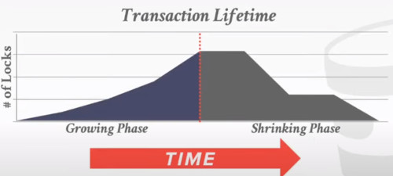

### RUN THROUGH

In this example, 
- T1 is Reading and Writting,
- while T2 is only reading

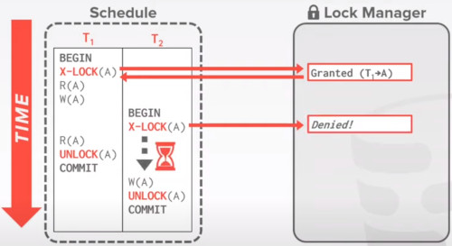

T2 has to wait until T1 release the lock on A
- Note that T1 hasn't released the lock yet.
  
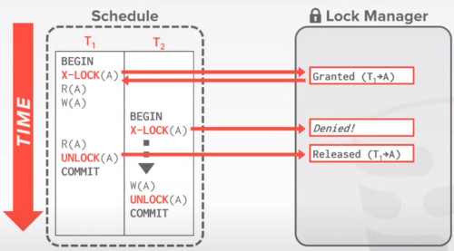

By defining a growing phase, and a shrinking phase
- we are avoiding the problem that happened before (read on A by T1 while T2 has changed that record)

### ISSUE
2-Phase-Lock on its own is sufficient to guarantee conflict serializability
- it grantes schedules whose precedence graph is acyclic

but it's subject to **CASCADING ABORTS**

In this example, T1 operates on A,
- then T2 continue operating on A.
- But T1 aborts
- that makes trigger the T2 abortion.

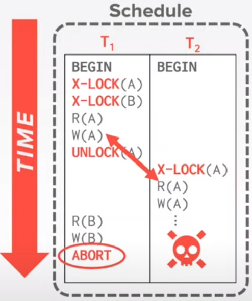

Any information about T1 cannot be leaked to the world if T1 has aborted

Also there's a lot of work wasted aborting T2.

### OBSERVATION
There are potential schedules that are serializable but would  not be allowed in 2PL.
- locking limits concurrency

May still have 'dirty reads'
- solution is **STRONG STRICT 2PL** (aka rigorous 2PL)

May lead to deadlocks
- Solution is **DETECTION** or **PREVENTION**

### STRONG STRICT 2 PHASE LOCKING
The transaction is **only** allowed to **release** locks after it has **ended**. (commited or aborted)

Allows only conflict serializable schedules, but it is often stronger than needed for some apps.

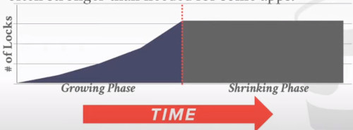

#### DEFINITION
A schedule is **strict**,
- if a **value written** by a txn
- is **not read** or **overwritten** by **other txn**
- until that txn **finishes**.

Advantages:
- Does not incur in cascading aborts
- Aborted Txn can be undone by just restoring original values  of modified tuples

EXAMPLE
- T1 move $100 from Lin's account (A) to his promoter's account (B)

- T2 computes the total amount in all accounts and return it to the application

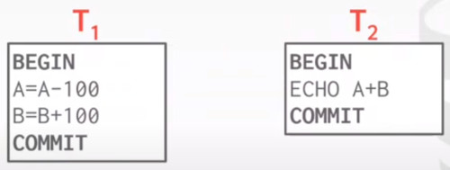

EXAMPLE: NON-2PL 
- The T2 S-lock has to wait T1 to finish.
  
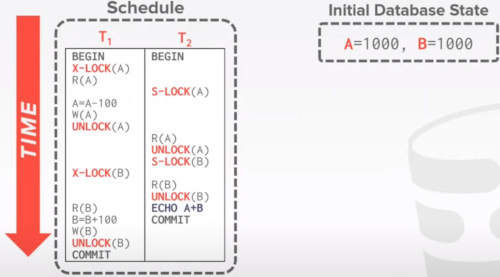

After a while, 
- T1 releases the lock on **A** in favor of T2
- and also T1 waits to the lock T2 has on **B**.
  
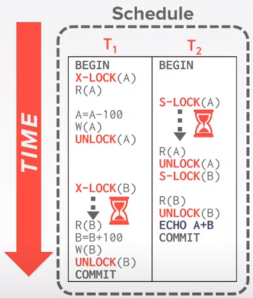

At this point T1 also deducted $100 from **A**
- and is waiting to give it to **B**
- but happens that T2 is running and return a wrong total result

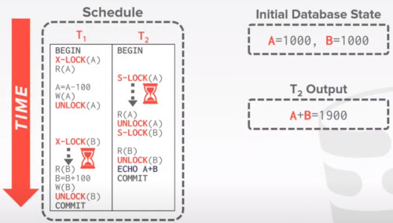

EXAMPLE: 2PL-LOCKING
There's going to be a growing phase and a shrinking phase

At first T1 requires lock on A.
- and T2 has to wait for release
  
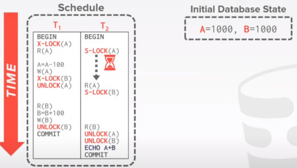

Also, T1 is going to require lock on **B**, 
- so T1 cannot release lock on **A** yet 
- just because you are not at the SHRINKING PHASE yet

So B has to wait again.
- T1 reaches the shrinking phase, and releases **A** first, **B** second
  
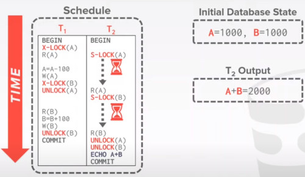

EXAMPLE: STRICT 2PL-LOCKING

T1 just never releases locks until the very end
- there will be no cascate aborts in this case

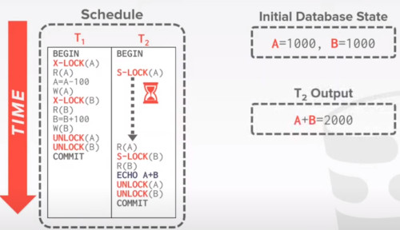

### UNIVERSE OF TRANSACTION SCHEDULES
At the different level we found a No-cascading of aborts zone.
- and the overlap with conflict serializable leads to the **strong strict 2PL**
  
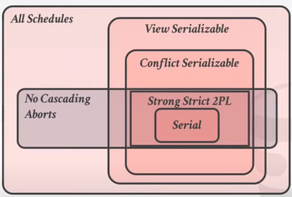

### QUESTIONS
under regular 2-phase locking, how do we know we entered this shrinking phase?
- it's actually why most people use **strong stric 2PL**
- the algorithm exists in the textbook
- the advantage of this is that you can release some locks earlier

## DEADLOCK DETECTION + PREVENTION
## HIERARCHICHAL LOCKING

