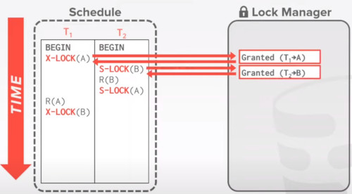
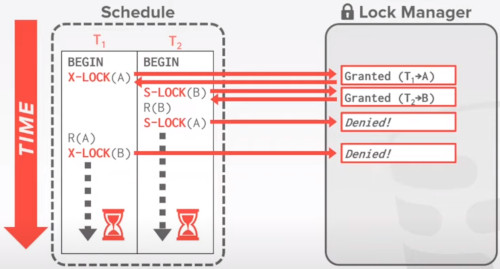
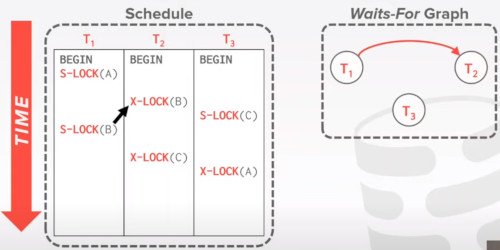
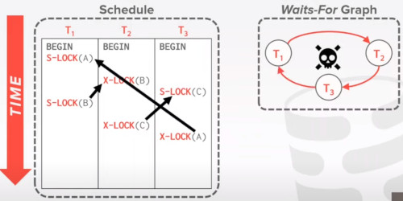
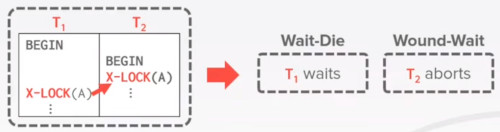
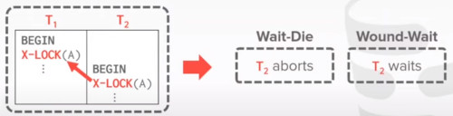
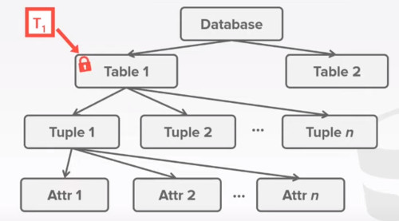
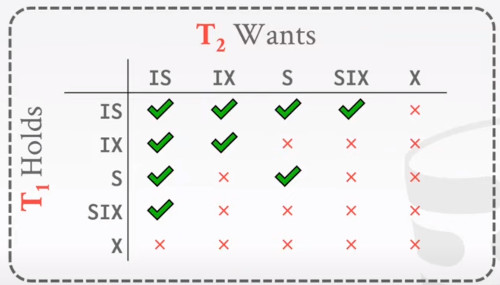

# LECTURE 16: TWO PHASE LOCKING CONCURRENCY CONTROL

## OVERVIEW
last time we have talked about how transactions are going to execute correctly
- Conflict serializable
  - verify using either 'swapping method' or 'dependency graphs'
  - Any DBMS that says that they support 'serializable' isolation does this
- View serializable
  - no efficient way to verify
  - the instructor doesn't know of any dbms that supports this

Observation
- We need a way to guarantee that all execution schedules are correct (i.e. serializable)
- without knowing the entire schedule ahead of time


Solution
- use locks to protect database objects


### EXECUTING WITH LOCKS
we are assuming that there also be a centralized location that would manage all those locks
- hey, what are the locks currently out there.
- which transaction owns which lock
- which transaction is waiting for a lock
  
Here T1 ask lock for A


Then it comes T2 and ask again a lock for A, 
- which is denied
- and T2 has to wait
  


Once T1 release the lock for A
- that's when the lock manager grant access of A to T2


### TODAY'S AGENDA
LOCK TYPES, definition, set terminology
TWO-PHASE LOCKING, very used algorithm to achieve a concurrency control
DEADLOCK DETECTION + PREVENTION, issues of 2-phase locking
HIERARCHICAL LOCKING, heads up on hierarchical locking

## LOCK TYPES
There's actually 2 types of objects to protect records in the database system
- LOCKS
- LATCHES,
  - you have seen it before, they are
  - protection mechanisms on the internal data structure
  - if multiple threads are trying to acces an B+ index, then you would protect the records, and nodes

  

### BASIC LOCK TYPES
**S-LOCK**, Shared locks for reads
**X-LOCK**, Exclusive locks for writes.


### EXECUTING WITH LOCKS
The procedure of the lock manager to grant locks is that,
- while transactions are executing
- if they realize it needs a specific record
- it will first request the transaction manager to grant that lock
- either or update a share lock to a exclusive lock
- after its done, it can release its lock
  

Lock manager updates its internal lock-table
- it keeps track of what transactions hold what locks and what transactions are waiting to acquire any locks

#### RUN THROUGH
Here because T1 needs both Read and Write on A, 
- it would request an exclusive lock


After T1 is done with this record A, it release this lock
- and later on, transaction T2 would need to acquire this lock


And finally T1 just only needs to read Lock A,
- so it doesn't need to acquire a lock


There's a problem here,
- T1 performs 2 reads of record A
- but between the 2 reads, T2 comes along and change record A

So this procedure is actually wrong.

This is just telling us, that simply locking records,
- while you need to access them
- that doesn't prevent cycles in the dependency graph

## TWO-PHASE LOCKING
It doesn't schedule things ahead of time, 
- decides to grant or not a lock on the fly.

**PHASE 1**, GROWING,
- Each txn request the locks that it needs from the DBMS's lock manager
- you only **acquire locks**
  
**PHASE 2**, SHRINKING,
- Thx txn is allowed to only release locks that it previously acquired.
- It cannot acquire new locks
- you only **release locks**

The txn is not allowed to acquire/upgrade locks after the growing phase finishes.


### RUN THROUGH

In this example, 
- T1 is Reading and Writting,
- while T2 is only reading


T2 has to wait until T1 release the lock on A
- Note that T1 hasn't released the lock yet.
  


By defining a growing phase, and a shrinking phase
- we are avoiding the problem that happened before (read on A by T1 while T2 has changed that record)

### ISSUE
2-Phase-Lock on its own is sufficient to guarantee conflict serializability
- it grantes schedules whose precedence graph is acyclic

but it's subject to **CASCADING ABORTS**

In this example, T1 operates on A,
- then T2 continue operating on A.
- But T1 aborts
- that makes trigger the T2 abortion.


Any information about T1 cannot be leaked to the world if T1 has aborted

Also there's a lot of work wasted aborting T2.

### OBSERVATION
There are potential schedules that are serializable but would  not be allowed in 2PL.
- locking limits concurrency

May still have 'dirty reads'
- solution is **STRONG STRICT 2PL** (aka rigorous 2PL)

May lead to deadlocks
- Solution is **DETECTION** or **PREVENTION**

### STRONG STRICT 2 PHASE LOCKING
The transaction is **only** allowed to **release** locks after it has **ended**. (commited or aborted)

Allows only conflict serializable schedules, but it is often stronger than needed for some apps.


#### DEFINITION
A schedule is **strict**,
- if a **value written** by a txn
- is **not read** or **overwritten** by **other txn**
- until that txn **finishes**.

Advantages:
- Does not incur in cascading aborts
- Aborted Txn can be undone by just restoring original values  of modified tuples


EXAMPLE
- T1 move $100 from Lin's account (A) to his promoter's account (B)

- T2 computes the total amount in all accounts and return it to the application


EXAMPLE: NON-2PL 
- The T2 S-lock has to wait T1 to finish.
  


After a while, 
- T1 releases the lock on **A** in favor of T2
- and also T1 waits to the lock T2 has on **B**.
  


At this point T1 also deducted $100 from **A**
- and is waiting to give it to **B**
- but happens that T2 is running and return a wrong total result


EXAMPLE: 2PL-LOCKING
There's going to be a growing phase and a shrinking phase

At first T1 requires lock on A.
- and T2 has to wait for release
  


Also, T1 is going to require lock on **B**, 
- so T1 cannot release lock on **A** yet 
- just because you are not at the SHRINKING PHASE yet

So B has to wait again.
- T1 reaches the shrinking phase, and releases **A** first, **B** second
  


EXAMPLE: STRICT 2PL-LOCKING

T1 just never releases locks until the very end
- there will be no cascate aborts in this case


### UNIVERSE OF TRANSACTION SCHEDULES
At the different level we found a No-cascading of aborts zone.
- and the overlap with conflict serializable leads to the **strong strict 2PL**
  


### QUESTIONS
under regular 2-phase locking, how do we know we entered this shrinking phase?
- it's actually why most people use **strong stric 2PL**
- the algorithm exists in the textbook
- the advantage of this is that you can release some locks earlier


## DEADLOCKS
Consider the following example
- T1 acquires a lock on A
- T2 acquires a lock on B
  


T2 then tries to get a lock on A,
- but got denied, because it was held by T1

Also T1 tries to get a lock on B,
- but got denied as it was held by T2



This case is called a 'deadlock',
- a cyclic lock loop

### DEFINITION
A deadlock is a cycle of transactions waiting for locks to be released by each other

Two ways of dealing with deadlocks
- DETECTION, optimistic. Just let transaction to acquire locks, then try to detect that deadlock and terminate one transaction
- PREVENTION, pesimistic approach. assumed locks happen very often. so prevent deadlocks ahead of time


### DEADLOCK DETECTION
The DBMS creates a **waits for** graph to keep track of what lock each txn is waiting to acquire.
- nodes are transactions
- Edge from Ti to Tj if Ti is waiting for Tj to release a lock

The system periodically checks for cycles in the **waits for** graph and then decides how to break it.
- it runs in a separated thread using txn metadata

#### RUN THROUGH
In this example
- T1 gets a lock on A
- T2 gets a lock on B
- T3 gets a lock on C.
- Then T1 also wants a lock on B
  


So then, 
- T2 also ask a lock on C
- T3 also ask a lock on A
- being a wait for cycle
  


#### DEADLOCK HANDLING
The way we are going to handle this deadlock when it happens is
- we are going to select a transaction we called 'victim'
- and kill that transaction, showing it back
- breaking the cycle in the process

The victim txn will either restart or abort (more common)
- depending on how it was invoked

There is a trade-off between frequency of checking for deadlocks 
- and how long txn have to wait before deadlocks are broken.


#### VICTIM SELECTION
Selecting the proper victim depends on a lot of different variables
- black art, no specific algorithm do to this.
- simple heuristic rules.
- By age (lowest timestamp), the oldest transaction may need the most number of locks. If you release that many locks potentially release the deadlock
- By progress (least/most queries executed), you may not want to kill that transaction that did a ton of work
- By the number of locks the transaction already locked.
- By the number of transactions that we have rollback to it. (cascade effect, for non strict 2pl)

We also should consider the number of times a transaction has been restarted in the past,
- to prevent starvation

#### ROLLBACK LENGTH
After selecting a victim transaction to abort,
- the DBMS can also decide on how far to rollback the txn's changes.

When a transaction abort, we actually have 2 options.

APPROACH 1. COMPLETELY abort the transaction

APPROACH 2. MINIMALLY, try to go back query by query.
- then find the minimal amount of queries that i have to rollback so my withdrawal graph does not have any cycle anymore


#### DEMO
Before we start, we have our database,
```
SELECT * FROM txn_demo;
+----+-----+
| id | val |
+----+-----+
| 1  | 100 |
| 2  | 200 |
+----+-----+
```

In MySQL deadlock detect is ON by default but we overwrite it anyways,
- we set a lock wait timeout of 50 seconds.
  
```
# MySQL
SET GLOBAL innodb_deadlock_detect = ON;

SET GLOBAL innodb_lock_wait_timeout = 50;
```

Then we are going to start 2 transactions.
- so far all good, we have started 2 transactions
- one is operating on id=1
- the other one on id=2
```
# TERMINAL 1
SET SESSION TRANSACTION ISOLATION LEVEL SERIALIZABLE;
BEGIN;
UPDATE txn_demo SET val = val+1 WHERE id=1;
```

```
# TERMINAL 2
SET SESSION TRANSACTION ISOLATION LEVEL SERIALIZABLE;
BEGIN;
UPDATE txn_demo SET val=val+1 WHERE id=2;
```

Then on transaction 1, also change record id=2
- T1 is waiting
- update T2 to request a lock on id=1 -> raise deadlock error
```
# TERMINAL 1
UPDATE txn_demo SET val=val+1 WHERE id=2;
-> is waiting for lock
```

```
# TERMINAL 2
UPDATE txn_demo SET val=val+1 WHERE id=1;
ERROR. Deadlock found when trying to get lock, try restarting the transaction.
```

if you instead of requesting lock id=1 on T2 you would commit;
- you would release lock id=1
- that would unlock T1
```
# TERMINAL 2
COMMIT;
```

---

Same example in postgres
```
# POTGRES
SELECT * FROM txn_demo;
id | val
---+-----
 1 | 100
 2 | 200

SET deadlock_timeout TO '10s';
```

```
# TERMINAL 1
BEGIN TRANSACTION ISOLATION LEVEL SERIALIZABLE;
UPDATE txn_demo SET val=val+1 WHERE id=1;
```

```
# TERMINAL 2
BEGIN TRANSACTION ISOLATION LEVEL SERIALIZABLE;
UPDATE txn_demo SET val=val+1 WHERE id=2;
```

Now update id2 in T1
```
# TERMINAL 1
UPDATE txn_demo SET val=val+1 WHERE id=2;
-> is waiting
```

```
# TERMINAL 2
UPDATE txn_demo SET val=val+1 WHERE id=1;
<after we wait 10 seconds>
ERROR deadlock detected. 
```
If you try to commit after the deadlock,
- it will perform a rollback
```
# TERMINAL 2
COMMIT;
-> rollback
```

You can actually access metadata of transaction in postgres.

### DEADLOCK PREVENTION
When a txn tries to acquire a lock that is held by another txn,
- the DBMS kills one of them to prevent a deadlock

This approach does not require a **wait for** graph or detection algorithm

### TYPES
Assign priorities based on timestamps:
- Older timestamp = higher priority

**WAIT-DIE**,
- old waits for young
- If requesting a txn has higher priority than holding a txn,
- then requesting a txn waits for __holding__ a txn.
- otherwise requesting  txn aborts.

**WOUND-WAIT**
- young waits old
- if requesting a txn has a higher priority than holding a txn,
- then holdin a txn aborts and releases lock.
- otherwise requesting txn waits.

#### RUN THROUGH
Here are T1 and T2.
- Assume that T2 acquired the lock first
- But T1 is the older transaction



Then we can retrieve what each strategy would do
- wait-die, will wait T1 or die
- wound-die, will abort the younger T2

In the following example 
- T1 acquires early a lock
- also T1 is the older one
  


Result would be
- Wait-die, will wait T1 then kill T2
- wound-wait, would make T2 to wait

#### QUESTIONS
why do these schemes guarantee no deadlocks?
- Only one 'type' of direction is allowed when waiting for a lock
- we don't need transaction graphs.
  
When a txn restarts, what is its (new) priority?
- Its original timestamp
- it would give it enought priority to avoid starvation in the future.


## HIERARCHICHAL LOCKING
If a txn wants to update one billion tuples,
- then it must acquire one billion locks
- Acquiring locks is a more expensive operation than acquiring a latch even if the lock is available.

Another way to do this is acquiring locks at a higher level.
- if we know that a transaction would need to acquire locks on an entire table
- then why not acquire a GIANT LOCK
- lock the entire table

The problem with that, if you only have a table locks
- then every transaction is going to lock the entire table

Given this there is a trade-off
- how many locks
- what size each lock

most system would do different sizes for different locks

### LOCK GRANULARITIES
When a txn wants to acquire a 'lock', the DBMS can decide the granularity of that lock.
- Attribute?
- Tuple?
- Page?
- Table?

The DBMS should ideally obtain the fewest numbers of locks that a txn needs.

Trade off between **parallelism** vs **overhead**
- fewer locks, larger granularity vs more locks, smaller  granularity

### RUN THROUGH
Let's say we have transaction T1
- that wants to access all the tuples in the entire table
- so it locks an entire table



Or alternativelly it can just lock each tuples
- it would be more expensive
- but allows more flexible schedules


### INTENTION LOCKS
An **intention lock**, allows a higher-level node to be locked in **shared** or **exclusive** mode 
- without having to check all descendent nodes

If a node is locked in an intention mode, 
- then some txn is doing explicit locking at lower level in the tree

#### TYPES
**INTENTION SHARED (IS)**
- Indicates explicit locking at lower level with shared locks

This is trying to say,
- my transaction will all acquire a share lock
- at a lower level of this node
- but for the other nodes at the lower it may not be acquired locked 


**INTENTION EXCLUSIVE (IX)**
- Indicates explicit locking at lower level of this node with explicit locks

To give other people a heads up,
- this node is not entirely locked
- but some turning of thie node is locked in the exclusive node


**SHARED + INTENTION EXCLUSIVE (SIX)**
- The subtree rooted by that node
- is locked explicity in **shared** mode
- and explicitly locking is being done at a lower level with **exclusive-mode** locks

My entire transaction will acquire a lock,
- for the entire node (i. e. the entire table)

but in the meantime,
- down below of this node
- there could be one or a few leaves
- that would be acquire with an exclusive lock

so you can use the other leaves i'm not currently using.
- but you can't acquire the entire table anymore

#### COMPATIBILITY MATRIX
For the exclusive **X** lock,
- then nothing can be really shared
  


For other intention locks we found different compatibilies locks
