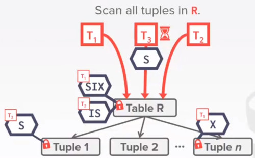

# LECTURE 17: TIMESTAMP ORDERING CONCURRENCY CONTROL

## OVERVIEW
Last time we talked about this canonical concurrency control protocol called 2 phase locking
- also its variant 'strong strict 2 phase locking'

we have talked a little bit of hierarchical locking,
- to acquire locks for tables or pages instead of just records
- to coordinate those locks at different levels we introduced intention locks
  - Intention Shared, we are not locking at the current level, but we lock a few locks below this current level
  - Intention Exclusive, we are not locking anything at the current level, but we lock a few locks below this current level with an exclusive lock
  - Shared+Intention Exclusive, we are going to lock the current level with a shared lock, but in the meantime i may also want to acquire exclusive locks on the levels below
 

### LOCKING PROTOCOL
Each txn obtains appropiate lock at highest level of the database hierarchy.

To get **S** or **IS** lock on a node, 
- the txn must hold at least **IS** on parent node

To get **X**, **IX** or **SIX** on a node, 
- must hold at least **IX** on parent node.

#### EXAMPLE
T1- Get the balance of Lin's bank account
T2- Increase Andrew's bank account balance by 1%

What locks should these txn obtain?
- Exclusive locks + shared for leaf nodes of lock tree
- Special intention locks for higher levels

Then T1 comes alone, wants to read tuple 1.

So first acquire an IS lock for the table
- then it require an S lock for reading tuple 1.

Conversely, T2 arrives and wants to update Andrew's record

so first it has to acquire an intention exclusive lock
- then an exclusive lock in the tuple

**Note** that **IS** is compatible with **IX**

EXAMPLE,
Assume there are 3 txns executing at the same time.
- T1 scan **R** and update a few tuples
- T2 read a single tuple in **R**
- T3 scan all tuples in **R**

So the first transaction tries to read and update a few tuples, 
- so it acquires an **SIX** lock

It follows T2, that wants to read a single tuple in R
- it first acquire a shared intention lock **IS**
- then it acquires a Shared lock **S** on tuple 1
  

Note **SIX** and **IS** are compatible intention locks

Finally T3 comes alone, 
- it wants to scan every tuple in **R**
- it also wants to acquire an **S** lock on table **R**
- but that's incompatible with **SIX** as there's something being updated downhill

### MULTIPLE LOCKS GRANULARITIES
Hierarchical locks are useful in practice as each txn only needs a few locks

Intention locks help improve concurrency:
- Inention shared **IS**, Intent to get **S** locks at finner granularity
- Intention exclusive **IX**, Intent to get **X** locks at finner granularity
- Shared Intent Exclusice **SIX**, Like **S** and **IX** at the same time

### LOCK ESCALATION
Lock escalation dynamically asks for coarsergrained locks,
- when too many low-level locks acquired

This reduces the number of requests that the lock manager must process

The system automatically detect, you have acquired too many tuple locks,
- so better it grants you a table lock

### LOCKING IN PRACTICE
Systems will not allow you to actually specify these locks manually.
- the whole point in database systems is to guarantee the ACID properties
- sometimes you have to provide the DBMS with hints to help it improve concurrency

#### LOCK TABLE
Explicit locks are also useful when doing major changes in the database
- There are different ways to do this in different systems
- Not part of SQL standard

POSTGRES/DB2/ORACLE: **SHARE**, **EXCLUSIVE**
MYSQL: **READ**, **WRITE**

#### LOCK HINTS
It's more common to perform a select,
- and then sets an exclusive lock on the matching tuples

can also set shared locks.
- POSTGRES: FOR SHARE
- MYSQL: LOCK IN SHARE MODE

### CONCURRENCY CONTROL APPROACHES
So far we have talked about 2 Phase concurrency control.
- determine the seriability order of conflicting operations at runtime while executing txns.
- pessimistic,
  - you assume conflicts are going to happen very often
  
Timestamp ordering (T/O)
- determine seriability order of txns before they execute
- Optimistic,
  - you assume conficts are rare

### T/O CONCURRENCY CONTROL
Use timestamps to determine the seriability order of txns.

if TS(Ti) < TS(Tj),
- then the DBMS must enfure that the execution schedule
- is equivlent to a serial schedule where Ti appears before Tj

Note that in some cases,
- you can actually come back and modify the timestamp
- but in most cases the timestamp would be fixed

### TIMESTAMP ALLOCATION
Each txn Ti is assigned a unique fixed timestamp 
- that is monotonically **increasing**.

Let TS(Ti) be a timestamp allocated to txn Ti
- Different schemes assign timestamps at different times during the txn

Multiple implementation strategies
- System Clock
- Logical counter
- Hybrid,
  - common in distributed systems.
  - a Logical counter is fixed in a physical machine.
  - so you would have a fixed clock defined at each of the systems
  - and a logical clock without relying all the systems' clocks to be synced
  
### TODAY'S AGENDA
BASIC TIMESTAMP ORDERING T/O PROTOCOL

OPTIMISTIC CONCURRENCY CONTROL

ISOLATION LEVELS

Note that all these timestamp concurrency control talked in this class will belong to the category of optimistic concurrency control
- they all rely on timestamp to perform the protocol
- but there are also specific implementations called 'basic timestamp ordering protocol'
- and another implementation called 'optimistic concurrency control protocol'
- So name convention is confusing

## BASIC TIMESTAMP ORDERING T/O PROTOCOL
Txns are read and write objects **without locks**, instead:

Every txn when accessing object **X** is tagged with a **timestamp** of the last txn that successfully did read/write.
- it maintain 2 timestamps.
- **W-TS(X)** Write timestamp on **X**
- **R-TS(X)** Read timestamp on **X**

after a read/write operation,
- timestamps gets updated
- if txn tries to access an object 'from the future' it aborts and restart.

### READS
IF **TS(Ti)** < **W-TS(X)**, this violates timestamp order of Ti (with regard to the writter of X)
- Abort Ti
- restart it with a new TS.

ELSE:
- Allow Ti to **read** **X**
- Update **R-TS(X)** to **max(T-TS(X), TS(Ti))**
- Make a local copy of **X**
  - to a private workspace
  - to ensure repeatable reads of X in that **Ti** 

### WRITES
IF **TS(Ti)** < **R-TS(X)** OR **TS(Ti)** < **W-TS(X)**
- abort and restart Ti

ELSE
- Allow **Ti** to write **X**
- UPDATE **W-TS(X)**
- Also make a local copy of **X** to ensure repeatable reads

#### EXAMPLES
**EXAMPLE 1**
In this example, Transaction T1
- has a read on B
- then read on A
- and again read on A

T2 is doing
- Read on A
- Write on A
- Read on B
- Write on B

All timestamps records starts at zero
- Transaction T1 has a timestamp of 1
- Transaction T2 has a timestamp of 2

First step
- we read on B
- and update the R-TS(B) record with the timestamp of T1
  

Second step
- T2 is also reading on B
- and has updated his own timestamp

Then we have to write on B
- we also update the W-TS(B) record to the timestamp of T2
- of course we have to check the timestamp conflict...
  

Next step, Transaction T1
- we read on A

Then T2
- also read on A
- updates R-TS(A) = 2

But then, T1 wants to read on A.
- Even though this timestamp is higher than the T1 has
- as we are performing a read operation, nothing should have changed
- but of course, we **don't modify** that **timestamp**.
  

Finally T2 writes on A,
- and updates W-TS(A)=2

we found no issues in this scheduling example

--- 

**EXAMPLE 2**
In this example T1 is Read Write Read on A, while T2 is Writing on A

First step,
- we read on A

Then,
- T2 writes on A
- and updates **W-TS(A)**=2

When it comes back to T1,
- T1 also wants to write on A
- but because T1 has a Writting-TimeStamp of 2
- it cannot really update A
- and has to restart with a new tiemstamp

In actuality, 
- it doesn't really matter if T2 has changed **A**
- The final result would be the same
- T2 is really doing a **blind write**

In the View-seriability we have seen this kind of result
- this transaction would be 'view seriability' valid, no need to actually restart

### THOMAS OPTIMIZATION WRITE RULE
When a transaction wants to write,

IF **TS(Ti)** < **R-TS(X)**:
- if the writing timestamp is smaller than the recorded read timestamp
  - A read on the future,
  - someone already read the record i haven't even written
- Abort and restart Ti

IF **TS(Ti)** < **W-TS(X)**:
  - if someone in the future, already had written this record, just don't write it now. Either way it will be overwritten in the future 
- Ignore the write to allow the txn to continue executing without aborting
- This violates the timestamp order of Ti
ELSE
- Allow Ti to write **X** and update **W-TS(X)**

So in the previous example, 
- we are going to ignore this writting, as it would be overwritten anyways
  

### SUMMARY
Basic T/O timestamp ordering protocol
- generates a schedule that is **conflict serializable** if you do not use the **Thomas Write Rule**
- no deadlocks, because no txn ever waits
- Possibility of starvation for long txns is short txns keep causing conflicts
  - the longer a transaction is, the higher probability of a conflict has
  - if you abort, there is no guarantee in the future you would still have the same problem with this long txn
    
Permits **schedules** that are **not recoverable**

Its optimistic as conflicts are assumed to be rare

### RECOVERABLE SCHEDULES
Similar to the CASCADE ABORTING problem seen in the previous lecture in the 2phase locking protocol.
- if you do not keep track of what transactions have read what records in which transaction
- you will generate schedules that are not recoverable.

A schedule is recoverable if txns commit only 
- after all txns whose changes they read, commit.

Otherwise, the DBMS cannot guarantee that txns read data
- that will be restored after recovering from crash.

In this example,
- T1 is writing on A
- T2 first Read on A, then Writes on B

In this step, T2 can't read or write until T1 finish
- Timestamp 2 is higher than TS of T1
  

After a while, 
- assume T2 has already commited
- if T1 aborts, how would you undo a commited transaction?
- Remember T2 has read a ghost of T1 on A
  

So nobody implements this basic T/O protocol.
- they usually implement a variant of the optimistic concurrency control

### PERFORMANCE ISSUES
High overhead, 
- from copying data to transactions' workspace 
- and from updating timestamps (you have to read them now)

Long running txns can get starved
- The likelihood that a txn will read something from a newer txn increases

## OPTIMISTIC CONCURRENCY CONTROL
The DBMS creates a private workspace for each transaction.
- Any object read is copied into workspace
- Modifications are applied to workspace

When a txn commits, 
- the DBMS will start to look at records that have been read or written in the private space.

If there are no conflicts, 
- The system would apply those changes
- the write set is installed into the 'global' database.
- Otherwise throw changes away

### OBSERVATION
The premises of the Optimistic control are.
- conflicts between txns are rare,
- and that most txns are **short-lived**,
- then forcing txns to wait to acquire locks adds a lot of overhead

A better approach is to optimize for the non-conflict case
- just don't update the read timestamp
- and don't do so much conflict checks
- we still need to update the write timestamp

We only check the correctness of the transaction at the end of commit.
- we do all the checks in a batch all together

### OCC PHASES
1. READ PHASE
- Track the read/write sets of txns and store their writes in  a private workspace
  
2. VALIDATION PHASE
- when a txn commits, check whether it conflicts with other txns
  
3. WRITE PHASE
- If validation succeeds, apply private changes to database
- otherwise abort and restart txn

#### EXAMPLE
In this case, we don't need the read timestamps 'R-TS'

T1 first enter the read phase
- it reads the value of the record A
- and copy that into its private workspace

T2 arrives, and computes its own private workspace

Then, T2 enters its Validation phase.
- as nothing has changed, T2 succeeds
- also at this time T2 is assigned the first timestamp

Timestamp is assigned just before you are goint to write in the database
- there's no need to assign a timestamp for manipulating the internal workspace
- also after the validation is when you are certain you are going to commit that new information

So you write nothing and finish transaction T2

Then T1 continues with a Write on A 
- in its private workspace

At the validation step timestamp 2 is assigned
- finally you write on the global database
- also update its timestamp
  

#### READ PHASE
Track the Read/Write records it wants
- and then keep a copy of them in private workspace

#### VALIDATION PHASE
When a txn Ti invokes **COMMIT** , immediatelly enters this validation phase
- the DBMS checks if its in conflict with other txns.
- The DBMS needs to guarantee only serializable schedules are permitted
- Checks other txns for R-W and W-W conflicts
  - and ensure that conflicts are in one direction. (e.g. older-> younger or younger->older)
  - otherwise would be a cycle of conflicts

Two methods for this phase.
- Backward Validation
- Forward Validation

##### BACKWARD VALIDATION
When a txn tries to commits,
- it just checks whether the read and write set of this transaction will be overlapped with other transactions

In the first example, we are going to check
- whether it has the read and write stamp of my current commiting transaction
- has overlapped with the read/write set of transactions that has already being commited
- as we are checking with older transactions that's called **BACKWARD** validation

Consider the following physical time progress,
- Assume that we are looking at Transaction T2
- T1 has commited
- T3 has not commited yet
  

looking at the validation scope
- we are looking for whether my current transaction
- has any conflict or overlap with the transaction that was commited earlier

we only allow conflicts from older transaction to younger txns

##### FORWARD VALIDATION (I)
Checks whether the commiting txn conflicts its read/write sets,
- with any active txn that have not yet commited

if there is any overlap, you need to abort

##### FORWARD VALIDATION (II)
Analyzing the Backward validation is similar but reversed

Each txn's **timestamp** is assigned at the beginning of the validation phase.
- we are assuming the running transaction (not commited yet) would have a higher (infinite) timestamp rather that the current one
  
Check the timestamp ordering of the commiting txn with all other running txn

IF **TS(Ti)** < **TS(Tj)** THEN  one of the following three conditions must hold.

**STEP 1**, Ti completes all three phases before Tj begins

**STEP 2**,
- Ti completes before Tj its **WRITE** phase and
- Ti does not write to any object read by Tj

$Writeset(Ti) \cap ReadSet(Tj)= \Phi$

In this case, T1 has to abort (even when T2 has never written in the database)
- T2 has not started its validation step yet.
- T1 has written into a record that is used by a current running transaction T2
 

Assume now another case,
- T2 has finished its validation step earlier, its timestamp has been assigned
- Only after that T1 comes from its validation step

Its safe to commit T1, because T2 commits logically before T1

**STEP 3**
- Ti completes its **read** phase before Tj completes its **read** phase
- and Ti does not write to any object that is either read or written by Tj.

$WriteSet(Ti) \cap ReadSet(Tj) = \Phi$

$WriteSet(Ti) \cap WriteSet(Tj) = \Phi$

At this validation point of T1,
- T2 hasn't read anything of record A
- so T1 is committing safely with timestamp TS(T1)=1
  

now T1 writes its result in the database
- also updates its W-timestamp
  

When T2 comes back and has to read record A
- updates its workspace

As we are just reading in T2, it validates all the rules and finally commits

#### WRITE PHASE
The DBMS propagates the changes in the txn's write set to the database and makes them visible to other txns.

Assume that only one txn can be in **write** phase at a time-
- Use write latches to support parallel validation/writes

### OBERVATIONS
OCC works well when the number of conflicts is slow
- all txns are read-only (ideal)
- Txns access disjoint subsets of data

If the database is large and the workload is not skewed,
- then there is a low probability of conflict
- so again locking is wastefull

## ISOLATION LEVELS
