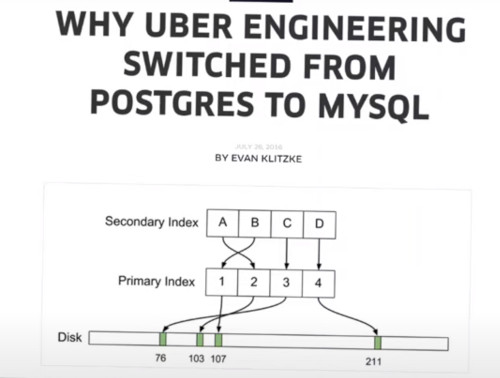
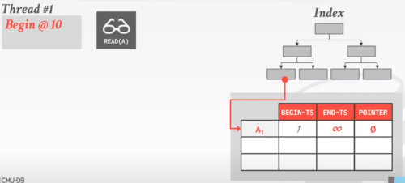

# LECTURE 18: MULTI-VERSION CONCURRENCY CONTROL

## OVERVIEW
This lecture is going to be the last one about concurrency control.

Last time, we've talked about a technique of doing Optimistic Concurrency Control
- There some specific algorithms to talk about
  - OPTIMISTIC: Basic Timestamp Ordering and OCC
  - PESSIMISTIC: concurrency control with locking

### ISOLATION LEVELS (I)
beyond the fundamental theory of serializability
- there are some cases where you are going to insert or delete tuples
- in that case there would be some additional issues like phantom
  - that make the result of your query incorrect
  - there are many different potential issues, even without considering phantom
  - that would increase the overhead of the transactions

Many systems allows users to specify the ISOLATION LEVEL
- SERIALIZABILITY, you don't allow phantom and you don't allow any of those conflicts
- In the second level REPEATABLE READS, you actually allow phantom but then you ensure there's no cycle in the dependency graph
- In the next level READ COMMITED, you even allow repeatable reads, enables more schedules but with potentially problematic result
- READ UNCOMMITED, allows anything to happen
  


Depending of what anomally you may allow, we have the following compatibility matrix.


Note that,
- when a system is set to be in a lower isolation level
- then its just possible that the system would have unrepeatable read or phantom
- it doesn't have to have
- some systems even when you specify a lower isolation level, the system actually gives you something stronger

As you are allowing lower isolation levels you can do fewer checks, then allow more potential scheduling of the transactions

### ISOLATION LEVEL (II)
**SERIALIZABLE**
If you are using 2 phase locking as the concurrency control protocol
  - You are going to check for phantoms
  - for example using the index lock we have talked about last class
  - for example strict 2 Phase locking

**REPEATABLE READS**
But then if you only want repeatable reads
- you only need strict 2 PL
- you don't need this Index Lock on the phantom problem

**READ COMMITED**
- you still use strict 2PL
- but you can release the **S**hare lock immediately after you use it
- then you would achieve this read commited isolation level

**READ UNCOMMITED**
- No share locks

### ISOLATION LEVELS (III)
SQL has included Isolation Levels on its standard (SQL-92)

You set a txn's isolation level **before** you execute any queries in the txn.


Not all DBMS support all isolation levels in all execution scenarios.
- Replicated environments


If you don't specify the isolation level, different systems defaults different settings
- notice that only 2 systems defines its isolation level to 'serializable' as default
- just because of performance issues.

For many systems, they don't even provide serializability isolation level
- hard to implement
- restrict performance


### ISOLATION LEVELS SURVEY
A survey across many DBMS about what isolation level you are using in your actual system.
- the most used isolation level is the read commited
  


### ISOLATION LEVELS (IV)
You can actually provide in the SQL-92 standard command to give hints
- on wether a transaction is entirely read-only or not
- if the DBMS knowing the balance that this entire txn is read-only,
  - then it could be a potential organization scheme

**ACCESS MODES**
- **READ WRITE** (default)
- **READ ONLY**


It's not implemented by all systems.
- but you can specified it anyways

## MULTI-VERSION CONCURRENCY CONTROL (MVCC)
We are not talking about a specific concurrency control protocol
- instead what we are going to talk about is actually an OPTIMIZATION
- that many systems would apply
- in combination with 'locking', 'optimistic timestamp', etc

The fundamental Idea of multi-version concurrency control is that
- instead of the database having a centrelized copy of the record

The DBMS maintains multiple **physical** versions of a single **logical** object in the database
- When a txn writes to an object, the DBMS creates a new version of that object
- When a txn reads an object, it reads the newest version that existed when txn started


When every transaction writes a new object
- instead of writting that object in place in the global centralized location

what if we keep all the original records intact
- and just write a new copy of the new records

Then we have a different copies of this records
- and other transactions can read either read the current copy created by myself
- or the older copies

That would allow more flexible scheduling

### HISTORY
Protocol was first proposed in 1978 by MID PHD dissertation

First implementation was Rdb/VMS and InterBase at DEC in early 1980's
- both were by Jim Starkey, co-founder of NuoDB
- DEC Rdb/VMS is now 'Oracle Rdb'
- InterBase was open-sourced as **Firebird**


### OVERVIEW
The main advantage of MVCC
- **WRITERS** AND **READERS** Don't BLOCK each other

**WRITERS** and **WRITERS**, do indeed affect each others
  
Say for example you have a writing transaction,
- then when you write a new record
- then if there are other transactions that are still reading the earlier version of this tuple, they are not affected
  - because you are not deleting any records
 

Specifically Read only-txns can read a consistent __snapshot__ without acquiring any lock.
- Use timestamps to determine visibility

When a transaction are trying to access tuples
- it could access tuples at a consistent version at a particular point of time

Easily support **time-travel** queries

A snapshot means, that the transaction is reading the state of a database at a particular time point
- that it can only see the versions of the tuples commited by transactions
- earlier than that, but nothing after.

Note that the SNAPSHOT ISOLATION LEVEL
- is not serializable
- even it won't have the basic conflicts we saw in the concurrency class
  - dirty read, dirty write and writting into the uncommited data
- it would have a problem called Write skew.
- at least is a pretty strong isolation level.

Lastly with this multi-version idea.
- it's also easy to support a type of query called 'time-travel' queries.
- you can ask this query to check the state of the database at a particular point back in time.

This is straightforward
- with different versions
- and with a snapshot isolation

you can easily specify a timestamp,
- and try to read tuples with versions before or exactly at this timestamp

### EXAMPLE (I)
Let's say we have 2 transaction and we are going to look at one record A
- T1 reads A, T2 writes A
- for illustration purpose we will maintain a **version** field
  - in actuality databases don't maintain this field

What a database will maintain are the **begining** and **end** Timestamp
- for each version of a particular Record.
 

  
We are going to assign a timestamp at the begining of the execution
- even thought last class in OCC, we say you only need to produce a timestamp at the validation step

At the begining, we read Record A,
- and because the timestamp of T1 is between the begining and end of this particular record.
- is that you can read the record and continue your schedule


Here T2 comes along, and wants to Write on A
- so instead of overwritting this version 0
- we are going to recreate a new version for this tuple.
- With a different value and different timestamp


Also this earlier version of the database would be updated its end-timestamp


Another thing to note, beyond this beginning and end timestamp
- another thing to have is a **Separate location** to keep track of the status
- of all the transactions,
- whether they have commited or not


If T2 writes a new version of this record A,
- before it commits,
- other transactions depending on this isolation level couldn't really see this version.
- as it's not commited yet.


Here Transaction T1 comes back
- because T1 has a timestamp of 1
- now it wants to read the record A
- but here the timestamp is only between the range 0 and 2


This would not generate unrepeatable reads.

Lastly T1 and T2 commits 

### EXAMPLE (II)
Here T1 is reading A, writting A


Here T1 creates a new version of A
- with a beginning timestamp of 1
 


also it has to modify it previous version timestamp for ending at 1


Later on, T2 comes along, and start by reading tuple A
- then which version is going to read?
- well is going to read the first version, just because we see that in the transaction status table
  - T1 hasn't commited yet
 


Now assume T2 is still writting on A
- for example with a locking protocol
- T2 has to wait T1 to release its lock


Meanwhile T1 continues its execution 
- reading the same record it has previously written by itself
- Then T1 goes commit


Now Lock on A is released.
- T2 can continue its execution writting a new version of A
- and ofc update the previous versioning table


Depending on the isolation level you specify
- under the highest level serializable
  - you may not be able to commit this transaction
- but under the snapshot isolation you actually can commit as well.

### IMPLEMENTATION
MVCC is more than just a concurrency control protocol.
- it completely affects how the DBMS manages transactions and the database

Most of the systems implement this optimization


### DEMONSTRATION
```
# POSTGRES: TERMINAL 1
SELECT ctid, xmin, xmax, * FROM txn_demo;
 ctid | xmin | xmax | id | val
------+------+------+----+-----
(0,1) | 498  | 0    | 1  | 100
(0,2) | 498  | 0    | 2  | 200

SELECT * FROM txn_demo;
  id | val
-----+-----
  1  | 100
  2  | 200
```
The additional 3 fields are 
- ctid = location of this tuple (page_id, slot_number)
- xmin/xmax = begin/end timestamp of this particular tuple
With this is obvious that postgres is using MVCC

All tuples had the same xmin and xmax,
- that means that all those tuples were created in the same transaction with a timestamp of 498
- xmax is just a place holder. 0 or infinity. not an actual value.


we are going to first, 
- look at the tuples for this transaction
```
# TERMINAL 1
BEGIN TRANSACTION ISOLATION LEVEL READ COMMITED;
~# BEGIN
SELECT ctid, xmin, xmax, * FROM txn_demo WHERE id=1;
ctid | xmin | xmax | id | val
-----+------+------+----+-----
(0,1)| 498  | 0    | 1  | 100

SELECT txid_current();
txid_current
------------
499
```

Different transactions ids.
```
# TERMINAL 2
BEGIN TRANSACTION ISOLATION LEVEL READ COMMITED;

SELECT txid_current();
txid_current
------------
500
```

Now we are going to do an update query
- only update the record with the id=1
- so the first record would have 2 versions
```
# TERMINAL 1
UPDATE txn_demo SET val=val+1 WHERE id=1;
SELECT ctid, xmin, xmax, * FROM txn_demo;
 ctid | xmin | xmax | id | val
------+------+------+----+-----
(0,3) | 498  |   0  | 1  | 101
```
Let's see what have we got in terminal 2.
- notice that xmax has changed from 0 to 499
```
SELECT ctid, xmin, xmax, * FROM txn_demo;
 ctid | xmin | xmax | id | val
------+------+------+----+-----
(0,1) | 498  | 499  | 1  | 100
```

Even though the first transaction updated these tuple,
- because the first transaction hasn't commited yet
- the second transaction has a higher transaction, when it comes back it can only see the original version of this record.

What if we select that uncommited tuple explicitly
- it cannot see that record
- even though we know there is a tuple at that location.
- but logically the first transaction hasn't commited yet.
```
# TERMINAL 2
SELECT * FROM txn_demo WHERE ctid='(0,3)';
id | val
---+----
 0 | 0
```

What if i update this tuple again in terminal 2?
- terminal 2 is waiting T1 to release its lock on id=1
```
# TERMINAL 2
UPDATE txn_demo SET val=val+1 WHERE id=1;
... and it waits
```

so go into terminal 1 and commit
```
# TERMINAL 1
commit;
```
Then terminal 2 has updated its command.
```
# TERMINAL 2
commit;
```

we can come back and then select everything out.
- note postgres uses 500 also to denote infinity in the end timestamp
```
# TERMINAL 1
SELECT ctid, xmin, xmax, * FROM txn_demo;
 ctid | xmin | xmax | id | val
------+------+------+----+-----
(0,2) | 498  |   0  |  2 | 200
(0,4) | 500  | 500  |  1 | 102
```

---
**PART 2**

What if we increase the isolation level
```
# TERMINAL 1
BEGIN TRANSACTION ISOLATION LEVEL SERIALIZABLE;
SELECT txid_current();
501
```
```
# TERMINAL 2
BEGIN TRANSACTION ISOLATION LEVEL SERIALIZABLE;
SELECT txid_current();
502
```

Now we are going to update T1
```
# TERMINAL 1
UPDATE txn_demo SET val=Val+1 WHERE id=1 RETURNING txid_current();
txid_current
------------
  501
```
i do the same on terminal 2
- but the second transaction stop, waiting for T1 to commit.
```
# TERMINAL 1
UPDATE txn_demo SET val=Val+1 WHERE id=1;
```

Now we effectively commit T1
```
# TERMINAL 1
commit;
```
but T2 throws an error
```
# TERMINAL 2
ERROR: could not serialize access due to concurrent update
```

---

Final example we will try different isolation levels.

```
# TERMINAL 1
BEGIN TRANSACTION ISOLATION LEVEL SERIALIZABLE;
SELECT ctid, xmin, xmax, * from txn_demo;
ctid | xmin | xmax | id | val
-----+------+------+----+-----
(0,2)| 498  | 0    |  2 | 200
(0,5)| 501  | 0    |  1 | 103
```

```
# TERMINAL 2
BEGIN TRANSACTION ISOLATION LEVEL READ UNCOMMITED;
```

Then we update T2
```
UPDATE txn_demo SET val=val+1 WHERE id=2 RETURNING txid_current();
txid_current
-----------
503
```

```
# TERMINAL 1
UPDATE txn_demo SET val=val+1 WHERE id=1 RETURNING txid_current();
txid_current
------------
504

SELECT ctid, xmin, xmax, * FROM txn_demo;
ctid | xmin | xmax | id | val
-----+------+------+----+-----
(0,2)| 498  | 0    |  2 | 200
(0,7)| 504  | 0    |  1 | 104
```
What we get here, 
- for the first tuple id = 1 it is seen the lastest value that is written
- but then, for the other id=2 value, it doesn't see the updated value.


Meanwhile in the second terminal, we are trying to read all transaction as an uncommited read.
- it should see the transaction done by T1,
  - but as it's not obligated to do so, it gives you a better isolation level
- T1 has a current_id of 504
```
# TERMINAL 2
SELECT ctid, xmin, xmax, * FROM txn_demo;
ctid | xmin | xmax | id | val
-----+------+------+----+-----
(0,6)| 501  | 504  |  1 | 103
(0,6)| 503  | 0    |  2 | 201
```

## MVCC DESIGN DECISIONS
CONCURRENCY CONTROL PROTOCOL

VERSION STORAGE

GARBAGE COLLECTION

INDEX MANAGEMENT

DELETES

### CONCURRENCY CONTROL PROTOCOL
**APPROACH 1** TIMESTAMP ORDERING,
- Assign txns timestamps that determine serial order

**APPROACH 2** OPTIMISTIC CONCURRENCY CONTROL
- Three phase protocol from last class
- modification is to install new versions into the private workspace 

**APPROACH 3** TWO PHASE LOCKING
- Txns acquire appropiate lock on physical version before they can read/write a logical tuple
- Instead of locking a single physical copy of this tuple,
  - you are going to lock the specific version of the tuple that you are trying to access
 
### VERSION STORAGE
How you actually storage those additional versions,
- and how do you actually traverse them
- how do you clean them up

Different physical versions of the same tuple,
- we are going to 'chain' them together using pointers.

in each physical copy of a variant of that tuple, 
- we are going to have a specific field
- where to store a pointer, pointing to the next version of this logical tuple.

The another thing to note is,
- that the index, because in many cases, for example you have a B+Tree index or hash index
- the value of that leaf node (record) in the index would point to the head of this variant chain.

The DBMS uses the tuples' pointer field to create a **version chain** per logical tuple
- This allows the DBMS to find the versions that are visible to a particular txn at runtime
- indexes always point to the 'head' of the chain

Then, there are Different storage schemes
- determine where/what to store for each version

#### STORAGE SCHEMAS
**APPROACH 1** APPEND ONLY STORAGE
- The simplest approach,
- New versions are appended to the end of the same table
  
**APPROACH 2** TIME TRAVEL STORAGE
- Similar but in reverse,
- new versions are kept in the database
- old versions are copied to a separated table

So every time you write a record,
- older versions are copied down
- so the location of the current version never changes but get updated

**APPROACH 3** DELTA STORAGE
- rather than copying the entire tuple,
- just update those particular attributes.
- The original values of the modified attributes are copied into a separate delta record space
- this approach is more advantageous,

#### APPEND-ONLY STORAGE
All the physical versions of the tuple are stored in the same table.
- The versions are inter-mixed

Let's say we want to add a new variant of tuple A
- there's already an A0 and A1 version of it.


What we do is to append a new version at the end of the table
- and also adjust the pointers to the next version
  


On every update, append a new version of the tuple into an empty space in the table.


#### VERSION CHAIN ORDERING
Hey what's the order of this version's chain?

**APPROACH 1**, OLDEST TO NEWEST (O2N)
- Easy to Append a new version at the end of the chain
- Must traverse chain on look ups for accessing the new record

**APPROACH 2**, NEWEST TO OLDEST (N2O)
- Must update index pointers for every new version
- Do not have to traverse chain on look ups

#### TIME-TRAVEL STORAGE
we are assuming we are using newest to oldest ordering approach.

Here we are doing a time-travel every time we want to update a record in the database
- we are going to copy the old record to a separate table


Say we want to update record A to a new version.
- first we find a spot in the time-travel table
- and then copy the current value into that table
- also update the pointer


And finally we are going to overwrite the master version 
- to its new value
- and update the pointer too


#### DELTA STORAGE
It's just an extension of the time-travel storage
- instead of copying the entire tuple
- you just copy the specific values


Then if you update once more its value
- you just copy again the value
- and update the pointer too


if you update many attributes, you just copy all of them in the same delta-record

If you are updating 1000 tuples from a 2 fields table,
- just by avoiding writing 1 field, that query would execute twice as fast

When the transaction wants to access those tuples, traverse
- you need to apply the chain in the current tuple

People usually apply the N2O ordering
- in order to acquire a specific version of the tuple
- you always have to apply the changes to that tuple back to that top tuple
- from the newest to the oldest
- so you always have to go to the oldest version of the tuple and apply all changes back

its redundant if you go from oldest to newest.

### GARBAGE COLLECTION
The DBMS needs to  remove **reclaimable** physical versions from the database over time.
- no active txn in the DBMS can 'see' that version (SI)
- The version was created by an aborted txn

Two additional design decisions
- How to look for expired versions?
- How to decide when it is safe to reclaim memory?

**APPROACH 1**, TUPLE LEVEL
- you examine each individual tuple, and check if you can reclaim each one or not
- Find old versions by examining tuples directly
- **Background Vacuuming** vs **Cooperative Cleaning**
  - Look upon each individual tuple with a background thread
  - or when different txn are reading those version chains, you can remove the unnecessary tuple while you are trying to traverse those version chains.
    
**APPROACH 2**, TRANSACTION LEVLE
- look for each txn, what kind of new  versions it created, what kind of old versions are overwritten.
- txns keep track of their old versions
- so that the DBMS does not have to scan tuples to determine visibility

#### TUPLE LEVEL
Let's say you have 2 threads with different ids.
- we also have 3 tuples, 1 variant for tuple A, and 2 for tuple B

##### BACKGROUND VACUUM
We are going to look at the **Background Vacuum** first
- Separate threads periodically scan the table and look for reclaimable versions.
- works with any storage


Whether there any transaction that would fit into
- the begin and end timestamp


It's very costly to scan the entire table once in a while.

Postgres do instead.
- instead of just blindly scan all tuples.
- it maintains a dirty  block bitmap

from the last time i've reclaimed.
- what are the pages that has changed from last scan
- so the next time you have to do the vacuum, just scan the bitmap dirty pages


##### COOPERATIVE CLEANING
Worker threads identify reclaimable versions as they traverse the version chain.
- Only works with O2N
  - otherwise the newest version is always read and the older ones never.

So instead of looping through all the dirty pages,
- we can let different transactions to identify versions that are no longer useful
- while traversing the version chain.

Let's say we have this 2 transactions.
- T1 is trying to access tuple A
- while traversing it can identify that, that specific version of the tuple
  - may have a timestamp that is smaller than any of my current running transactions.
- so you can destroy the older version while doing the scan


Then you would redirect the index to the newest versions


#### TRANSACTION LEVEL
Each txn keeps track of its read/write set.

The DBMS determines when all versiosns created by a finished txn are no longer visible.

May still require multiple threads to reclaim the memory fast enough for the  workload

Let's say we have a transaction with 2 tuples.
- so first we update the value of A


So we create a new version A3,
- while keep track of the older version A2
- at some point in time, we know we are going to reclaim this.
  


Similarly Update on B comes along,
- create a new version of B
- Keep in track for further reclaim of the older version


When this transaction commits,
- it will send 2 different versions
- to the specific vacuum component of the database system
- so we actually need a vacuum thread.


Instead of the vacuum thread to go into each individual tuple,
- it just go through over the transactions that have finished

Then you can reclaim, all those set of tuples created by the transaction
- whose commit id is smaller than 15, can all be freed
- no other transaction will need to access those anymore.


### INDEX MANAGEMENT
Because you now have different variants of the tuple,
- you now need to manage them how to interact with them.

when we try to update a version of a tuple, 
- we need to update the corresponding pointer in the index that is pointing to the header value of the chain.
- so what we do is a DELETE followed by an INSERT
  - deleting the tuple and inserting it back with the correct head


Primary keys indexes point to a version chain head.
- how often the DBMS must update the pkey index depends on whether the system creates new versions when a tuple is updated.
- if a txn updates a tuple's pkey attributes then this is treated as a **DELETE** followed by an **INSERT**

Secondary indexes are more complicated
- there are different choices you can make

That's why UBER swithched all their database
- from postgres to MySQL



Postgres has an inefficient way to manage pointers, 
- especially in the secondary indexes for this different version of tuples

#### SECONDARY INDEXES
The Primary index, always points to the head of the version chain
- delete follow by an insert

For the secondary index you can choose to do it logically or physically
- logical pointer, instead of directly pointing to the head of the version chain
  - you can store of restore a logical identifier of these tuple
  - either it could be the primary key or some inderection tuple id.
  - so when you are updating the head of the version chain you only need to update that in direction
  - based on this tuple id instead of updating the actual value in every secondary index.
- the second approach you just update the value,
  - then when you are changing the head of the version chain
  - you actually have to go through all the secondary indexes including the primary indexes
  - and do a deletion followed by an insertion, which could be potentially costly
**APPROACH 1**, LOGICAL POINTERS
- use a fixed identifier per tuple that does not change
- Requires an extra unidirection layer
- Primary keys vs Tuple ID


**APPROACH 2**, PHYSICAL POINTERS
- usa a physical address to the version chain head.

##### INDEX POINTERS
Assume we are going to do an append only newest to oldest.

Let's say the primary index is trying to get this value A
- then the primary index always has to store its physical address
  


Then for the secondary index
- you can either directly store the physical address
- but if you have many secondary indexes, you have to maintain a pointer for each of them


Instead what you can do, is to use the physical pointer of the primary pointer of the primary key
- after that you do another look up on the primary index to look at the tuple


You can also use a separate data structure to store logical structure
- another indirection layer
- it is less common


### MVCC ISSUES
When you are storign this Multi-version of tuples in the index
- the index doesn't really know that you have different versions of the tuple.
- if you try to insert a tuple in that index address, there already exists a tuple in there.

MVCC indexes (usually) do not store version information about tuples with their keys
- exception: Index-organized tables (e.g. MySQL)

Every index must support duplicate keys from different snapshots
- The same key may point to different logical tuples in different snapshots

#### MVCC DUPLICATE KEY PROBLEM
Here, let's say that you have this table with one tuple on it.
- then you have this one transaction that has a Read on A



Then another transaction comes along that tryies to update A


Now let's say that T2 is now deleting tuple A
- so far its fine, we mark A as a deletion


What if a new transaction comes by
- and tries to insert this version A


because we are doing multiversioning
- when we delete this second record
- there still be other transactions still reading record A
- we cannot just delete this version right away.
  - we have to wait to the garbage collection proccess to reclaim this process

but now, when T3 tries to insert this new record A,
- it can insert
- but then in the index there actually 2 versions of chains of A
- you can deal with that, but it would be an additional complication


so it could be duplicate keys for this specific record

#### SUMMARIZE
Each index's underlying data structure must support the storage of non-unique keys.

Use additional execution logic to perform conditional inserts for pkey / unique indexes
- Atomically check whether the key exists and then insert.

Workers may get back multiple entries for a single fetch.
- they then must follow the pointers to find the proper physical version


### DELETES
The solution we are going to do is to lock this transactions.

when we delete a key from this table we are not going to allow 
- any new transaction to insert anything to this table
- unless we commit

The DBMS physically deletes a tuple from the database only when all versions of a logically deleted tuple are not visible
- if a tuple is deleted, then there cannot be a new version of that tuple after the newest version
- No write-write conflicts / first writer wins

We need a way to denote that tuple has been logically delete at some point in time

#### TYPES
**APPROACH 1**, DELETED FLAG
- Maintain a flag to indicate that the logical tuple has been deleted after the newest physical version
- Can either be in tuple header or a separate column

**APPROACH 2** TOMBSTONE TUPLE
- Create an empty physical version to indicate that a logical tuple is deleted
- Use a separate pool for tombstone tuples  with only a special bit pattern in version chain pointer to reduce the storage overhead.

### IMPLEMENTATIONS


## CONCLUSION
MVCC is the widely used scheme in DBMSs 
- even systems that do not support multi-statement txns (e.g. no sql) use it

