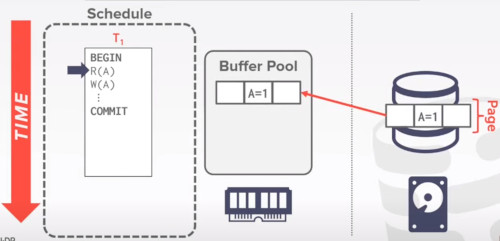
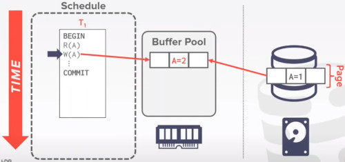
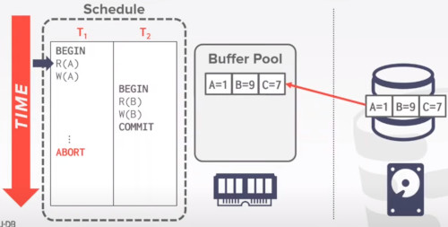
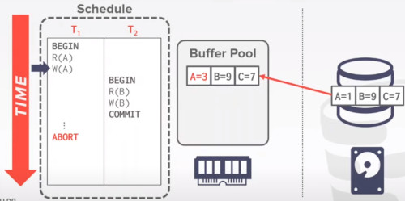
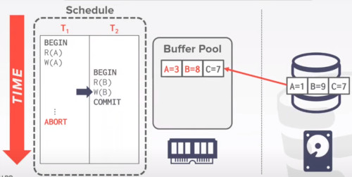
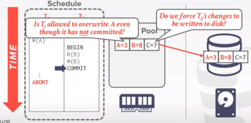

# LECTURE 19: DATABASE LOGGING

## OVERVIEW
The important properties the system database want to ensure for the programmers are
- the headache related with the data
- dirty write
- power failure
- concurrency control
  - Trying to achieve the isolation property
    
The system want to ensure the ACID property

Today we are going to talk about logging and recovering
- they are important to the DBMS achieve the rest of the ACIDs properties
- ATOMICITY
- DURABILITY
- CONSISTENCY (continue in the distributed DBMS lecture)

This logging and recovery component will touch many of the other components in the DBMS
- specially with the Buffer manager to achieve this Atomocity and Durability property

### MOTIVATION
Let's say we have a transaction with read and writes into a record
- we will show you the content of the buffer pool manager
- and what will be the content on disk

We first start with a read on A
- the first step for the database is to retrieve the block page of record A from disk
- and then read the value
  

Then we perform a write on A
- we change first the value in memory
  

Let's say that we commit, 
- but before it writes it on the disk. power gets turned off.
- erasing the data we just created.

### CRASH RECOVERY (I)
Recovery algorithms are techniques to ensure database consistency, transaction atomicity and durability despite failures

Recovery algorithms have 2 parts.
- LOGGING PART
  - Actions during normal txn processing to ensure that the DBMS can recover from a failure
- RECOVERY PART
  - Actions after a failure to recover the database to a state that ensures atomicity, consistency and durability
  - restore the data with the metadata logged

### CRASH RECOVERY (II)
What would be the different types of storage devices,
- that the DBMS could use

Based on the property of the storing device we are going to categorize the different types of failures
- what kind of failure we can encounter
- what kind of recovery we can address

### STORAGE TYPES
**VOLATILE STORAGE**
- Data does not persist after power loss or program exit.
- Examples (DRAM, SRAM)

**NON-VOLATILE STORAGE**
- Data Persists after power loss
- Examples (HDD, SDD)

**STABLE STORAGE**
- A non-existent form of non-volatile storage that survives all possible failures scenarios.
- hypothetical device that persist all kind of failures

### TODAY'S AGENDA
FAILURE CLASSIFICATION
- What kind of failures the logging can recover with
- if a fire burn the entire database system you just can't recover from that
  - unless you have some redundancy

BUFFER POOL POLICIES
- we actually would have to do some modifications to collaborate with the login and recovery part

Two specific methods for logging:
- SHADOW PAGING
- WRITE AHEAD LOG

We will talk about the content scheme:
- LOGGING SCHEMES
  - how do we actually are going to store that logging

CHECKPOINTS
- insight about checkpoints
  
## FAILURE CLASSIFICATION
**TYPE 1** - TRANSACTION FAILURES

**TYPE 2** - SYSTEM FAILURES

**TYPE 3** - STORAGE MEDIA FAILURES

The logging and recovery can deal with are the fist two
- the third type of failure is not something that the database could manage by itself
- it requires some type of redundancy

### TRANSACTON FAILURES
That would be the type of failure associated with the execution of transactions

**LOGICAL ERRORS**
- transaction cannot complete due to some internal error condition. (e.g. integrity contraint violation)

**INTERNAL STATE ERRORS**
- DBMS must terminate an active transaction due to an error condition (e.g. deadlock)

### SYSTEM FAILURES
**SOFTWARE FAILURES**
- Problem with OS or DBMS implementation (e.g. uncaught divide by zero exception)

**HARDWARE FAILURES**
- The computer hosting the DBMS crashes (e.g. power plug gets pulled)
- Fail to stop assumption, non-volatile storage contents are assumed to not be corrupted by system crash
  
### STORAGE MEDIA FAILURES
NON-REPAIRABLE HARDWARE FAILURE
- A head crash or similar disk failure destroys all or part of non-volatile storage
- Destruction is assumed to be detectable (e.g. disk controller use checksums to detect failures)

No DBMS can recover from this.
- Database must restored from archived version

you can use a redundant array of disk, 
- it can be done through a distributed DDBB

### OBSERVATION
The foundamental observation about DBMS is that
- they mostly deal with data stored on disk

Use volatile memory for faster access
- First copy target record into memory
- Perform the writes in memory
- Write dirty records back to disk

The DBMS needs to ensure the following guarantees
- The changes for any txn are durable once the DBMS has told somebody that is commited
- No partial changes are durable if the txn aborted (atomicity)

IF the transactions is aborted,
- we don't want to keep the effects of the uncommited txn

### UNDO vs REDO
UNDO. The process of removing the effects of an incomplete or aborted txn

REDO. The process of re-isntalling the effects of a commited txn for durability

How the DBMS supports this functionality depends on how it manages the buffer pool.

## BUFFER POOL POLICIES
At first when the DB starts it requires to bring the page into the buffer pool
- and then perform its read on A
  

Let's say T1 is trying to modify the contents of A

After that T2 is trying to read on B
- but luckly that record B is already in memory
- so we change the value of B

At this point T2 wants to commit.
- in order to ensure the ACID's Durability property
- we probably want to write this page onto the disk before this transaction is commit
- otherwise we could have hit the power failure scenario that we talked about earlier.

The problem here, is not only this page has a modification for the Record B, 
- but has a modification of record A
- we cannot flash this page right now

but let's say we do that

What if the transaction T1 later on hast to abort
- we need to rollback all the changes of A
- but we already written these records of B into the disk

we have to do a lot of work.
- get the page back onto buffer pool, make the changes and go back to disk.

### STEAL POLICY
We will talk about different ways to modify this buffer pool to allow us achieve durability and atomicity

The first decision we are going to talk about is called steal policy
- used to decide whether the system is going to be allowed to write the uncommited txn,
- overwrite the value of commited txn onto a number of storage devices

if we allow the uncommited txn T1
- to overwrite the value of A
- onto the non-volatile storage before T1 even commit
- we call this a STEAL POLICY

So we stole this page from the buffer manager before we even commited.

- STEAL is allwoed

- NO STEAL is not allowed
  - you don't even allow to write an uncommited record to write into the disk
 
  
### FORCE POLICY
Whether the DBMS requires that all updates made by a txn are reflected on non-volatile storage before txn can commit

FORCE is required

NO-FORCE is not required

Do we force the changes of all the commited transaction to be persistent before we tell the outside world we have commited.
- if we have
## SHADOW PAGING
## WRITE AHEAD LOG
## LOGGING SCHEMES
## CHECKPOINTS
