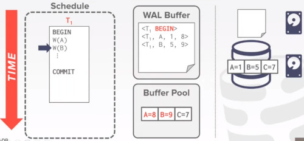

# LECTURE 19: DATABASE LOGGING

## OVERVIEW
The important properties the system database want to ensure for the programmers are
- the headache related with the data
- dirty write
- power failure
- concurrency control
  - Trying to achieve the isolation property
    
The system want to ensure the ACID property

Today we are going to talk about logging and recovering
- they are important to the DBMS achieve the rest of the ACIDs properties
- ATOMICITY
- DURABILITY
- CONSISTENCY (continue in the distributed DBMS lecture)

This logging and recovery component will touch many of the other components in the DBMS
- specially with the Buffer manager to achieve this Atomocity and Durability property

### MOTIVATION
Let's say we have a transaction with read and writes into a record
- we will show you the content of the buffer pool manager
- and what will be the content on disk

We first start with a read on A
- the first step for the database is to retrieve the block page of record A from disk
- and then read the value
  

Then we perform a write on A
- we change first the value in memory
  

Let's say that we commit, 
- but before it writes it on the disk. power gets turned off.
- erasing the data we just created.

### CRASH RECOVERY (I)
Recovery algorithms are techniques to ensure database consistency, transaction atomicity and durability despite failures

Recovery algorithms have 2 parts.
- LOGGING PART
  - Actions during normal txn processing to ensure that the DBMS can recover from a failure
- RECOVERY PART
  - Actions after a failure to recover the database to a state that ensures atomicity, consistency and durability
  - restore the data with the metadata logged

### CRASH RECOVERY (II)
What would be the different types of storage devices,
- that the DBMS could use

Based on the property of the storing device we are going to categorize the different types of failures
- what kind of failure we can encounter
- what kind of recovery we can address

### STORAGE TYPES
**VOLATILE STORAGE**
- Data does not persist after power loss or program exit.
- Examples (DRAM, SRAM)

**NON-VOLATILE STORAGE**
- Data Persists after power loss
- Examples (HDD, SDD)

**STABLE STORAGE**
- A non-existent form of non-volatile storage that survives all possible failures scenarios.
- hypothetical device that persist all kind of failures

### TODAY'S AGENDA
FAILURE CLASSIFICATION
- What kind of failures the logging can recover with
- if a fire burn the entire database system you just can't recover from that
  - unless you have some redundancy

BUFFER POOL POLICIES
- we actually would have to do some modifications to collaborate with the login and recovery part

Two specific methods for logging:
- SHADOW PAGING
- WRITE AHEAD LOG

We will talk about the content scheme:
- LOGGING SCHEMES
  - how do we actually are going to store that logging

CHECKPOINTS
- insight about checkpoints
  
## FAILURE CLASSIFICATION
**TYPE 1** - TRANSACTION FAILURES

**TYPE 2** - SYSTEM FAILURES

**TYPE 3** - STORAGE MEDIA FAILURES

The logging and recovery can deal with are the fist two
- the third type of failure is not something that the database could manage by itself
- it requires some type of redundancy

### TRANSACTON FAILURES
That would be the type of failure associated with the execution of transactions

**LOGICAL ERRORS**
- transaction cannot complete due to some internal error condition. (e.g. integrity contraint violation)

**INTERNAL STATE ERRORS**
- DBMS must terminate an active transaction due to an error condition (e.g. deadlock)

### SYSTEM FAILURES
**SOFTWARE FAILURES**
- Problem with OS or DBMS implementation (e.g. uncaught divide by zero exception)

**HARDWARE FAILURES**
- The computer hosting the DBMS crashes (e.g. power plug gets pulled)
- Fail to stop assumption, non-volatile storage contents are assumed to not be corrupted by system crash
  
### STORAGE MEDIA FAILURES
NON-REPAIRABLE HARDWARE FAILURE
- A head crash or similar disk failure destroys all or part of non-volatile storage
- Destruction is assumed to be detectable (e.g. disk controller use checksums to detect failures)

No DBMS can recover from this.
- Database must restored from archived version

you can use a redundant array of disk, 
- it can be done through a distributed DDBB

### OBSERVATION
The foundamental observation about DBMS is that
- they mostly deal with data stored on disk

Use volatile memory for faster access
- First copy target record into memory
- Perform the writes in memory
- Write dirty records back to disk

The DBMS needs to ensure the following guarantees
- The changes for any txn are durable once the DBMS has told somebody that is commited
- No partial changes are durable if the txn aborted (atomicity)

IF the transactions is aborted,
- we don't want to keep the effects of the uncommited txn

### UNDO vs REDO
UNDO. The process of removing the effects of an incomplete or aborted txn

REDO. The process of re-isntalling the effects of a commited txn for durability

How the DBMS supports this functionality depends on how it manages the buffer pool.

## BUFFER POOL POLICIES
At first when the DB starts it requires to bring the page into the buffer pool
- and then perform its read on A
  

Let's say T1 is trying to modify the contents of A

After that T2 is trying to read on B
- but luckly that record B is already in memory
- so we change the value of B

At this point T2 wants to commit.
- in order to ensure the ACID's Durability property
- we probably want to write this page onto the disk before this transaction is commit
- otherwise we could have hit the power failure scenario that we talked about earlier.

The problem here, is not only this page has a modification for the Record B, 
- but has a modification of record A
- we cannot flash this page right now

but let's say we do that

What if the transaction T1 later on hast to abort
- we need to rollback all the changes of A
- but we already written these records of B into the disk

we have to do a lot of work.
- get the page back onto buffer pool, make the changes and go back to disk.

### STEAL POLICY
We will talk about different ways to modify this buffer pool to allow us achieve durability and atomicity

The first decision we are going to talk about is called steal policy
- used to decide whether the system is going to be allowed to write the uncommited txn,
- overwrite the value of commited txn onto a number of storage devices

if we allow the uncommited txn T1
- to overwrite the value of A
- onto the non-volatile storage before T1 even commit
- we call this a STEAL POLICY

So we stole this page from the buffer manager before we even commited.

- STEAL is allwoed

- NO STEAL is not allowed
  - you don't even allow to write an uncommited record to write into the disk
 
  
### FORCE POLICY
Whether the DBMS requires that all updates made by a txn are reflected on non-volatile storage before txn can commit

Do we force the changes of all the commited transaction to be persistent before we tell the outside world we have commited.
- if we have to havea the DBMS to install all the changes of the commited txn to their corresponding change of pages on disk
- they will called forced to write before commit

**FORCE** TO WRITE CHANGES BEFORE COMMIT.
- force policy is only requiring the system to write the values
- to the specific page, corresponding to the content of this data

NO-FORCE is not required
- it just don't specify if the system has to write changes or not before commit.

### EXAMPLE
This example illustrate the combination of the NO-STEAL and FORCE policies.

So first we load the page to the Buffer pool
- and read record A
  

We then write on record A
- also T2 comes along and tries to read on B
- then write on B

Now T2 is going to commit
- under the **FORCE** policy, meaning that write right now
- also as the **NO-STEAL** policy is applied, meaning you just write the records changed by T2.

One way could be to make a copy of that page
- with only the modifications from the commited transactions
  

After a while, we reallize T1 is going to abort.
- then its really trivial to rollback its changes.
- just go back record A values

What would be the potential issues with this approach?
- Every time we are trying to write something into disk, we have to make a copy of this entire page.
- even though we have to write another tuple of the same page, we have to do multiple copies and writes.
- we need to keep pages of all the transaction changes in memory before to commit. a huge load to afford.
  - other systems would allow you to write multiple records simultaneously
 
**NO-STEAL** + **FORCE**
Is the easiest to implement
- Never have to UNDO changes of an aborted txn because the changes were not written on disk
- Never have to REDO changes of a commited txn because all changes are guaranteed to be written to disk at the commit time.

Previous examples cannot support **WRITE SETS** that exceeds the amount of physical memory available

## SHADOW PAGING
A variant of last approach is called shadow paging.
- esentially it is a way to extension of this simple copy mechanisms
- incremental copying approach

Maintain Two separate **copies** of the database.
- **MASTER**. contains only changes from commited txns
- **SHADOW**. Temporary database with changes made from uncommited txns.

Apply all the changes
- from the uncommited txn. to the shadow copy.
- and when a txn wants to commit you just flip those copies around
- and let the database point to the shadow page.

Txns only makea updates in the SHADOW copy.
- When a txn commits, atomically switch the shadow to become the new master.

BUFFER POOL POLICY: **NO-STEAL**+**FORCE**

it would make the recovery pretty easy
- no undo
- no redo.

### RUN THROUGH
At high level you just have a specific page, both in disk and in memory.
- to store the pointer of the root of the database.
- and choose that to control which version of the database (master or shadow)
- you are going to use
  

To install the updates,
- overwrite the root so it points to the shadow
  - thereby swapping the master and shadow
- Before overwritting the root, none of the txn's updates are part of the disk-resident database
- After overwritting the root, all the txn's updates are part of the disk-resident database.

Again, we are assuming that this database has this root page
- and then have several pages on the disk
- as the current page table, called 'master' page table
  - that are pointing to the corresponding pages onto disk
  - all the master versions are pointing one-by-one

Let's say a transaction T1 comes along
- it first need to make an entire copy of this shadow page table.
- At the beginning, because this transaction has not made any changes yet,
  - the root pointer is pointing into the original master copy.
    

When the transaction needs to install any changes
- it will apply them to that shadow copy

Lastly, when the transaction wants to commit
- it will update the database root page 
- and flip then flip the root pointer to the shadow copy

If the system happens to crash
- it will reclaim the old version of the database

A problem with Shadow paging is
- we only allow 1 writting transaction at a time.
  - it limits the concurrency controll
- you could allow multiple writting transactions
  - but you would need an additional mechanism, to track Transactions made which change

### UNDO / REDO
Supporting rollbacks and recovery is easy.
- it's easy to rollback changes of uncommited txns, usually blow away all the shadow page table
  - as well as the record or record page on the disk
- it's easy to come back from recovery after power failure. because all changes would be unaffected

**UNDO**, remove the shadow pages.
- leave the master and the DB root pointer alone

**REDO**, Not need at all.

### DISSADVANTAGES
Copying the entire page table is expensive:
- Use a page table structured like a B+Tree
- No need to copy entire tree, only  need to copy path in the tree that lead to updated leaf nodes

Commit overhead is high:
- Flush every updated page, page table, and root.
- Data gets fragmented
- Need garbage collection
- Only supports one writter txn at a time or txns in a batch

### SQLITE
Real based systems rarely uses this shadow page technique
- SQLite is an exception

When a txn modifies a page, the DBMS copies the original page to a separate journal file before overwritting master version

After restarting, if a journal file exists,
- then the DBMS restores it to undo changes from uncommited txns.

**journaling** technique
- you make a copy before you modify a page
- at a separate journalism file.
- an additional copy of the original version
- and then modify the values of the records on those pages in place-
- when txn commits

Let's say we have 3 pages in memory
- and many pages on disk
- and then there's a separate journalism file

Say we have a transaction, that wants to make a modification on page 2
- so you first copy in the journaling file
  

Then you can change Page 2 to page 2'
- similarly you repeat this process for page 3

Then let's say the Txn wants to commit.
- it will just write to the regular database page on the disk

Assume now, there's a power failure while writting page 2'
- after restart memory will be cleaned up

Then SQLite will recover the journalist pages, and write it back to disk

### OBSERVATION
Shadowing page requires the DBMS to perform writes to random non-contiguous pages on disk

we need a way for the DBMS convert random writes into sequential writes.

so we want to record the changes of different txn and metadata about those txns
- and write those changes as sequential as possible

an important limitation is that we are going to modify
- one page at a time

so even though you modify one record in a page
- at the end of the day you have to write the entire page out to disk
  
## WRITE AHEAD LOG
The techinique we are going to apply here is going to achieve the last observation made

Maintain a log file separate from data files that contains the changes that txns make to database
- assume that the log is on stable storage
- Log contains enough information to perform the necessary undo and redo actions to restore the database

DBMS must write to disk the log file records that correspond to changes made to a database object
- **before** it can flush that object to disk

If you want to rollback those changes,
- just go through the log file and restore from the end to the beginning

Buffer pool policy: **STEAL** + **NO-FORCE**

### WAL PROTOCOL
When the database is going to modify any record, instead of first making the modifications on the original page
- we first write that modification on a separate log file
- it doesn't really need to write the content of the entire page
- it only needs to write into the log record about whatever it changes

And then, before the transaction is trying to commit
- overwrite the changes of these modified records
- it will first make sure that all records are flashed onto the disk
- later on, if there's some crash, it can comeback and see what content is in the log record

when the txn is trying to commit
- it only need to make sure, that all the pages that contains the log records
- are flashed out

It doesn't need to ensure, that the modifications in the pages
- to be flashed upto the disk (NO-FORCE policy)

The DBMS stages all the txn's log records in volatile storage
- usually backed by buffer pool

All log records pertaining to an updated page are written to non-volatile storage 
- **before** the page itself is overwritten in non-volatile storage

A txn is not considered commited until all its log records have been written to stable storage

### WAL PROTOCOL (II)
Write a **<BEGIN>** record to the log for each txn to mark its starting point
- at this point the recorder would be in memory

when a txn finishes, the DBMS will:
- write a **<COMMIT>** record on the log
- Make sure that all log records are flushed before it returns an aknowledgment to application.

When a txn finishes, it will apply or append
- a log record at the end
- and then i'll need to ensure all the modifications
- all the log records changes are flushed into disk

### WAL PROTOCOL (III)
Each log entry contains information about the changes to a single object.
- Transaction ID
- Object ID
- Before Value (UNDO)
- After Value (REDO)

### EXAMPLE
Let's say we have 1 txn that is trying to write 2 values

Then we have a Write on A
- the log record would have <Txn ID, Object ID, before value, after value>

1. So the first step is to update the log record.
2. Then we update the buffer pool with the new values

And in the later on, we have this new write on B
- and similarly we are going to install that value in the log file as well into the buffer pool page

Later on, Txn commits
- we first store the commits records into the log file in the Disk.

so instead of doing all this random writes
- we apply all those changes into disk sequentially as command by the log file.

If the system crash, we still have the log records to recover.

### CLARIFICATIONS
When should the DBMS write log entries to disk?
- when the txn commits
- Can use group commit to batch **multiple log** flushes together to amorthize overhead

A disadvantage would be 
- each txn has to wait a little bit before commit
- before you write out the commit record, you cannot tell the outside world you have commited.

One thing to note, 
- if certain transaction did not commit
- you can still write your changes if the time window has passed
- or if you have written down a long record

## LOGGING SCHEMES
## CHECKPOINTS

## QUESTION
- What if power failure happens right when you are writting an array of tuples...
