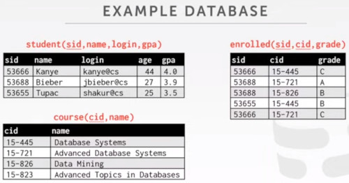
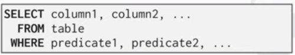
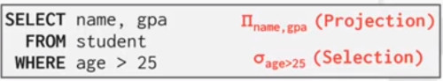
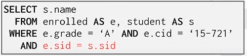
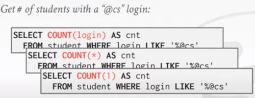

# Lecture 2

## Relational Languages
The main idea is to avoid having to tell, exatly to execute a query.
- Write a **declarative** specification of the query.
- The DBMS is responsible for efficient evaluation of the query.
- High end systems have a sophisticated __query optimizer__ that can rewrite queries and search for optimal execution strategies.


### SQL History
- IBM first called 'SQuare' (specify queries as relational expressions)
- Originally developed in 1974 as  'SEQUEL' if IBM system 'R' prototype DBMS
- 'Structured English Query Language' SEQL
- Adopted by Oracle in the 1970


IBM relases a commercial SQL-based DBMS
- system/38 (1979), SQL/DS (1981), DB2 (1983)

ANSI Standard in 1986. ISO in 1987
- Structured Query Language


Current standard is SQL:2016
-> SQL:2016 - Json, polymorphic tables
-> SQL:2011 - temporal DBs, pipelined DML
-> SQL:2008 - Truncation, Fancy Sorting
-> SQL:2003 - XML, Windows, Sequences, Auto-gen IDs
-> SQL:1999 - Regex, Triggers, OO

The minimum language syntax a system need  to say that it supports SQL is SQL:1992


### Relational Languages
**DATA MANIPULATION LANGUAGE (DML)**
- responsible for retrieving and modifying data
  
**DATA DEFINITION LANGUAGE (DDL)**
- How to specify objects, tables, indexes, triggers
  
**DATA CONTROL LANGUAGE (DCL)**
- used for security and access control, which user has which permisson to access and update.

Also includes
- View definition
- Integrity & Referential Constraints
- Transactions

Important: SQL is based on **bags algebra (multi sets)** (duplicated are allowed in the dataset) not **sets** (no-duplicates)
- List, allow duplicates but it has a definite order
- Sets, No duplicates but no order
- Bags, can't have duplicates also unordered


## Today Agenda
- Aggregations + group by
- String / Date / Time operations
- Output Control + Redirection
- Nested Queries
- Common Table expressions
- Window Functions

### Example database
Student - Course database.



Machine 1: **POSTGRESQL**
Machine 2: **MySQL**
Machine 3: **SQLite**

```
// Query
SELECT * FROM student;
SELECT * FROM course;
SELECT * FROM enrolled;
```
#### Basic Syntax: SELECT



The **SELECT** statement, maps to the **PROJECTION** operator.
- filter columns
While the **WHERE** statement, maps to the **SELECTION** operator.
- filter values
  


#### Basic Syntax: JOINS

Which students got an 'A' in 15-721?
- Without the last 'Join' operator, the result would be the carthesian product between grades 'A' and students enrolled in course '15-721'
  



#### AGGREGATES
They are functions that returns a single value from a bag of tuples.

**AVG(COL)**     -> Returns the average col value.
**MIN(COL)**     -> Returns the minimum col Value.
**MAX(COL)**     -> Returns the maximum col value.
**SUM(COL)**     -> Returns the sum of values in col.
**COUNT(col)**   -> Returns the number of values for col.


So the Aggregates Functions can only be used in the **SELECT** output list.


