# Lecture 2

## Relational Languages
The main idea is to avoid having to tell, exatly to execute a query.
- Write a **declarative** specification of the query.
- The DBMS is responsible for efficient evaluation of the query.
- High end systems have a sophisticated __query optimizer__ that can rewrite queries and search for optimal execution strategies.


### SQL History
- IBM first called 'SQuare' (specify queries as relational expressions)
- Originally developed in 1974 as  'SEQUEL' if IBM system 'R' prototype DBMS
- 'Structured English Query Language' SEQL
- Adopted by Oracle in the 1970


IBM relases a commercial SQL-based DBMS
- system/38 (1979), SQL/DS (1981), DB2 (1983)

ANSI Standard in 1986. ISO in 1987
- Structured Query Language


Current standard is SQL:2016
-> SQL:2016 - Json, polymorphic tables
-> SQL:2011 - temporal DBs, pipelined DML
-> SQL:2008 - Truncation, Fancy Sorting
-> SQL:2003 - XML, Windows, Sequences, Auto-gen IDs
-> SQL:1999 - Regex, Triggers, OO

The minimum language syntax a system need  to say that it supports SQL is SQL:1992


### Relational Languages
**DATA MANIPULATION LANGUAGE (DML)**
- responsible for retrieving and modifying data
  
**DATA DEFINITION LANGUAGE (DDL)**
- How to specify objects, tables, indexes, triggers
  
**DATA CONTROL LANGUAGE (DCL)**
- used for security and access control, which user has which permisson to access and update.

Also includes
- View definition
- Integrity & Referential Constraints
- Transactions

Important: SQL is based on **bags algebra (multi sets)** (duplicated are allowed in the dataset) not **sets** (no-duplicates)
- List, allow duplicates but it has a definite order
- Sets, No duplicates but no order
- Bags, can't have duplicates also unordered


## Today Agenda
- Aggregations + group by
- String / Date / Time operations
- Output Control + Redirection
- Nested Queries
- Common Table expressions
- Window Functions

### Example database
Student - Course database.


Machine 1: **POSTGRESQL**
Machine 2: **MySQL**
Machine 3: **SQLite**

```
// Query
SELECT * FROM student;
SELECT * FROM course;
SELECT * FROM enrolled;
```
#### Basic Syntax: SELECT


The **SELECT** statement, maps to the **PROJECTION** operator.
- filter columns
While the **WHERE** statement, maps to the **SELECTION** operator.
- filter values
  


#### Basic Syntax: JOINS

Which students got an 'A' in 15-721?
- Without the last 'Join' operator, the result would be the carthesian product between grades 'A' and students enrolled in course '15-721'
  


#### AGGREGATES
They are functions that returns a single value from a bag of tuples.

**AVG(COL)**     -> Returns the average col value.
**MIN(COL)**     -> Returns the minimum col Value.
**MAX(COL)**     -> Returns the maximum col value.
**SUM(COL)**     -> Returns the sum of values in col.
**COUNT(col)**   -> Returns the number of values for col.


So the Aggregates Functions can only be used in the **SELECT** output list.
- actually there are a few exceptions.
  


- The Percent symbol '%' means to match any regular expression, is the star '*' for re.
- Instead of a specific column, you are free to use the star operator to count all rows
- Also putting a count(1) means to use column number 1 to count.
- All things should be optimized later (specialy for the star operator), so you are safe to use it.

#### Multiple Aggregates
You can actually compute many agregates at a time


#### Distinct Aggregates
To depict which tuple columns are unique


#### Aggregates Notes

Output from other columns outside of an aggregate is undefined.
- e.cid is a table, while AVG is scalar. size missmatch.
  


#### GROUP BY operator
Let's try to fix the last undefined example.

We are going to project tuples into individual subsets
- and calculate aggregates against each subset.

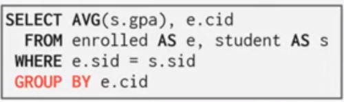

The way we compute this is,
- First compute the join operator
- and then we compute aggregates by those groups


So the rule is.
- Non-aggegated values in the **SELECT** clause must always appear in the group by clause.


#### HAVING CLAUSE
Filters results based on aggregation computation 
- (like a **WHERE** clause for a **GROUP BY**)

This for example would work
- The time the WHERE clause is evaluated, we're not going to know yet, what the avg_gpa is


Now this is basically saying to filter results after gruoped aggregation gets computed.
- Also this syntax isn't standard
  


So you have to duplicate the aggregation clause.


### STRING operations
- The only one that is case insensitive is MySQL
- Strings should be single quoted
  


#### PATTERN MATCHING
**LIKE** clause is used for  string matching.
- **'%'**, matches any substring (including empty ones)
- **'_'**, match any one character


#### SPECIFIC STRINGS OPERATIONS
Many DBMS have their own unique functions


is an empty string the same as null? almost always the answer is no.


#### STRING CONCATENATION
SQL standards defines the '||' operation to concatenate strings.


```
# postgresql also sqlite
SELECT 'data' || 'base' AS strcat;

strcat
------
database
(1 row)
```

```
# mysql
SELECT 'data' || 'base' AS strcat;
ERROR

SELECT 'data' + 'base' AS strcat;
ERROR

SELECT CONCAT('data', 'base') AS strcat;
+----------+
| strcat   |
+----------+
| database |
+----------+
```

## DATE TIME operations
Operations to manipulate and modify **DATE**/**TIME** attributes.
- can be used both in input and output predicates

DEMO: Get the number of days since the begining of the year.
- YYYY-MM-DD
```
# Postgres

SELECT NOW();
    now
-------------
2021-09-01 20:04:39.763535+00

SELECT EXTRACT(DAY FROM DATE('2021-09-01'))
     date_part
--------------------
             1
     (1 row)

SELECT DATE('2021-09-01') - DATE('2021-01-01') AS DAYS;
     DAYS
--------------------
     243
    (1 row)
```

MySQL date computation is weird, review this.

```
# MySQL
SELECT NOW();
+---------------------+
| NOW()               |
+---------------------+
| 2021-09-01 20:04:47 |

SELECT DATE('2021-09-01*) - DATE('2021-01-01') AS DAYS;
+----------+
|  DAYS    |
+----------+
|  800     |
+----------+

SELECT ROUND((UNIX_TIMESTAMP(DATE('2021-09-01')) -UNIX_TIMESTAMP(DATE('2021-01-01'))) / (60*60*24), 0) AS DAYS;
+----------+
|  DAYS    |
+----------+
|   243    |
|----------+

SELECT DATEDIFF(DATE('2021-09-01'), DATE('2021-01-01')) AS DAYS;
```


```
# SQLite
SELECT NOW(); ERROR

SELECT CURRENT_TIMESTAMP;
CURRENT_TIMESTAMP
-----------------------
2021-09-01 20:05:13

SELECT DATE('2021-09-01*) - DATE('2021-01-01') AS DAYS; ERROR

SELECT julianday(CURRENT_TIMESTAMP) - julianday('2021-01-01');

julianday(CURRENT_TIMESTAMP) - julianday('2021-01-01')
---------------------------------------------------------
243.839421296492


SELECT CAST(julianday(CURRENT_TIMESTAMP) - julianday('2021-01-01') AS INT) AS DAYS;
DAYS
------
243
```

## Output Redirection
Store query results in another table.
- **Table** must **not** already be **defined**.
- Talbe will have the same **number** of **columns** with the same types as the input.

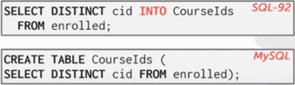

The **INTO** keyword in SQL-92 says, 
- Select all of the distincts course id cid, from enrolled.
- And put them into the **CourseIds** table.

The **MySQL** version is easier to follow.
- it just creates a new table, with same content as the cid selection statement.

There's also a version in SQL-92 to bulk insert:

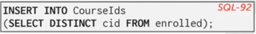

### Output Control
Allows you to format your new table.

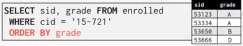

**ORDER BY <col*> [ASC|DESC]**, Order the output tuples by the values in one or more of their columns.
- allows you the ability of sorting.

Also the ORDER BY 1 is possible, it orders by the first colun

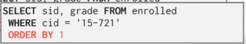

Also you can have a list of ordering criterion.


### LIMIT CONTROL

**LIMIT <count> [offset]**, limits the number of tuples returned in output
- can set an offset to return a 'range'

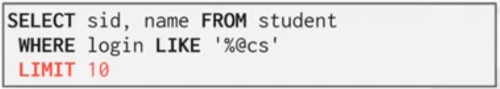


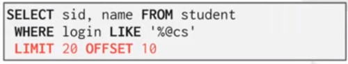

### NESTED QUERIES
They are queries containing other queries.

They are often difficult to optimize.

Inner Queries can appear (almost) anywhere in query.


This is kind what we want to do.

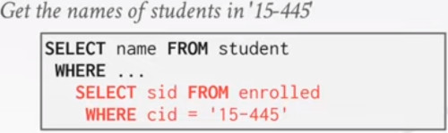

We use the clause **IN**
- Note the inner sid is for the enrolled student id
- while the outher sid is form the students record

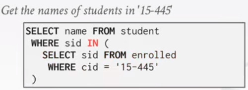

#### NESTED QUERIES OPERATORS
**ALL**, must satisfy for all rows in the sub-query

**ANY**, must satisfy for at least one row in the sub-query

**IN**, equivalent to '=ANY()'

**EXISTS**, at least one row is returned.


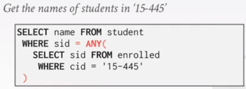


In this example, we try to find the highest id and his name
- But this statement only works in SQLite.
  
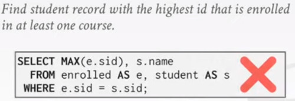

Actually we can do it so, by the means of the **IS** clause.
- which is doing an equal statement for the highest id.

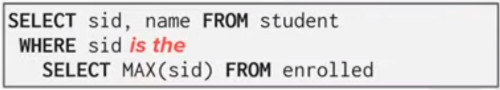

Actually it is handled by the **IN** statement
- it's an **IS** but for a table
  
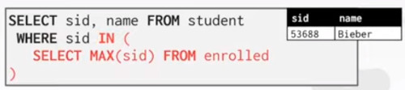


**NOT EXISTS** is giving you all courses with no enrolled student

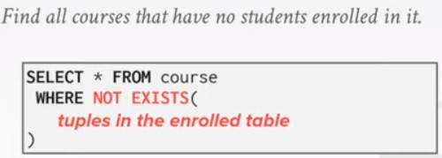

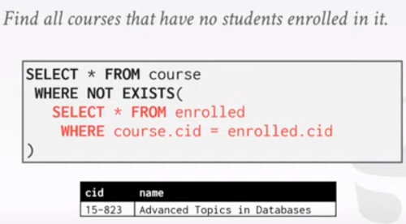


## WINDOW FUNCTIONS

Performs a Sliding calculation across a set of tuples that are related.
- Like an aggregation, but tuples are not grouped into a single value.


Useful for example to analyze time series.
- you can compute time-average, or sliding averages.

**FUNC-NAME**, are the special aggregation function
- same as we talked before (avg, min, max)
  
**OVER**, How to slice the data, can also sort.

**Special Window functions**, 
- **ROW_NUMBER()**, returns the number of the current row
- **RANK()**, returns the Order position of the current row.

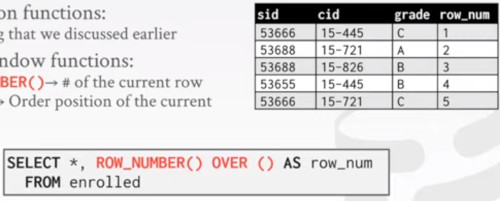


**OVER** keyword, specifies how to group together tuples, when computing the window function.
Use **PARTITION BY** to specify group.

In this example we can see how each c_id group gets its row_number

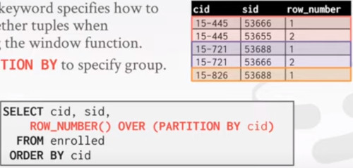

You can also specify an ordering with **ORDER BY**

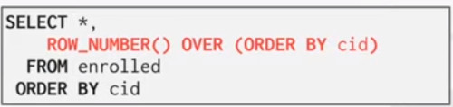

Now we want to find the student, with the second highest grade for each course

We have to combine a couple of things,
- the **RANK** is the local position of the partition for each record
- So you put a partition over course id cid
- So for each cid group, sort by grade, and get the second of each kind.


### COMMON TABLE EXPRESSIONS (CTE)
Provides a way to write auxiliary statements for use in a larger query.
- think of it as a temporary table that you can reference later.

Alternative to nested queries and vies.

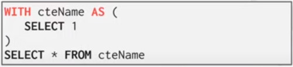

You can bind output columns to names before **AS** keyword

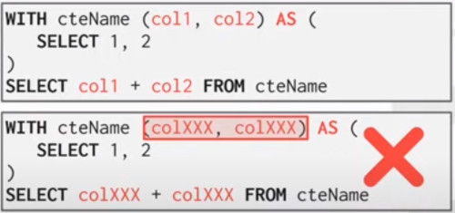

In this example we want,
- Find the student record, with the highest id, that is enrolled in at least one course.

Here the first part is just selecting the **max student id** 
- and get encapsulated into cteSource(maxId)
- Then it performs a basic selection to choose the student name with max id

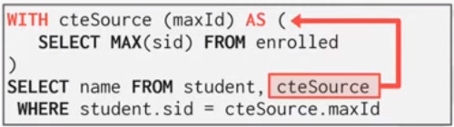

#### CTE RECURSION

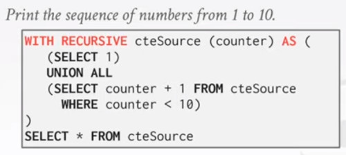


## CONCLUSION
- SQL is not a dead language
  - constantly evolving
- You should strive to compute your answers as a single SQL statement


## Homework
- Write SQL queries to perform basic data analysis on Northwind data from SFO
  - write queries locally using SQLite
