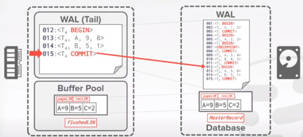
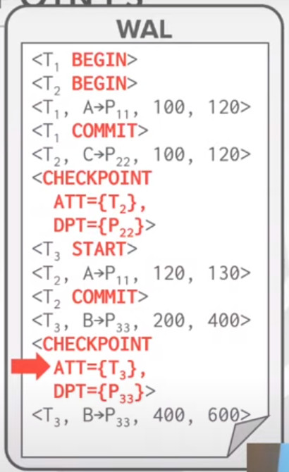

# LECTURE 20: DATABASE RECOVERY

## OVERVIEW
Last time we talked about logging and recovery mechanisms

Recovery mechanisms are techniques to ensure
- database consistency
- transaction atomicity
- durability despite failures

Recovery algorithms have 2 parts
- Actions during normal txn processing to ensure that the DBMS can recover from failure
- Actions after a failure to recover the database to a state that ensure atomicity, consistency and durability

### CHECKPOINTS
Last time we didn't finished talking about checkpoints

while you are writting the logs,
- to make sure that the database has enough information after a crash
- this logs kinds of grows forever

If the database doesn't do anything with it.
- you may have a year of loggings to recover then

one way to address this is called 'checkpointing'
- you take a consistent snapshot of the content of a database periodically
- you can throw much of the stuff after the checkpoint
- and after when you come back from a crash, then you don't need to look at everything either.

At a higher level you have to follow this 3 steps, the order is important
1. write all your logs currently running onto disk
2. write all the dirty pages into a buffer onto a disk as well
3. write a '<checkpoint>' entry to a log record

Assuming a simple checkpoint strategy
- when we are doing the checkpoint. we stop the entire database.

T1 has commited before the checkpoint, so nothing has to be done
- T2 we have to reapply all the canges of this transaction back to the system, just because it has commited. REDO.
- T3 just because it hasn't finished, you have to rollback all its progress. UNDO.
  

ISSUES
- The DBMS must stall txns when it takes a checkpoint to ensure a consistent snapshot
- Scanning the log to find uncommited txns can take a long time
- Not obvious how often the DBMS should take a checkpoint
  - too fast, degrade runtime performance
  - too slow, recovery time would be higher

### CRASH RECOVERY
Today we are going to talk about what are the recovery algorithms 

### ARIES
Algorithm for Recovery and Isolation Exploiting Semantics

Developed in 1990s for the DB2 DBMS

#### MAIN IDEAS
There are 3 main parts of the algorithm
- the logging part
- after crash aries would re-apply all the changes commited
- Undo phase, to reclaim all those changes that haven't been commited
 
**WRITE AHEAD LOGGING**
- Any change is recorded a in log on stable storage before the database change is written to disk
- Must use **STEAL**+ **NO-FORCE** buffer pool policies

**REPEATING HISTORY DURING REDO**
- On restart, retrace actions and restore database to exact state before crash

**LOGGING CHANGES DURING UNDO**
- record Undo actions to log to ensure action is not repeated in the event of repeated failures
- we have to record, what values has to been before and after.

### TODAY'S AGENDA
LOG SEQUENCE NUMBERS

NORMAL COMMIT AND ABORT OPERATIONS

FUZZY CHECKPOINTING

RECOVERY ALGORITHM

## LOG SEQUENCE NUMBERS (LSN)
**WAL RECORDS**
We need to extend our log record format from last class to include additional info.

Every log record now includes a globally unique **log sequence number** (LSN)

Various components in the system keep track of **LSN**s that pertain to them
- different components would encode itw own watermark of different versions

Both concurrency control and logging have to be coordintated

        NAME |  WHERE | DEFINITION
-------------+--------+----------------------------------------------
  flushedLSN | MEMORY | Last LSN in log in disk
     pageLSN | PAGE x | Newest update to page x
      recLSN | PAGE x | Oldest update to page x since it was flushed
     lastLSN | Ti     | Lastest record of txn Ti
MasterRecord | DISK   | LSN of latest checkpoint

**flushedLSN**, where would be the lastest log record that you have written on the disk

**pageLSN** and **recLSN**, asosiated with a page, indicate the lastest modification to this page

### WRITTING LOG RECORDS
Each data page contains a **pageLSN**
- the LSN of the most recent update to that page

System keeps track of **flushedLSN**
- The max LSN flushed so far

Before Page X can be written to disk, we must flush log at least to the point where
- pageLSN(x) <= flushedLSN

This last property is to ensure that before we write any change to a dirty page
- we want to make sure that the log record that contains that change will be on the disk first

#### RUN THROUGH
Here we have the tail of the write ahead log in memory
- on the right we have the write ahead log file on disk.
- also we have the pages, the master record number as well.

First of all, we depict the log sequence number both in memory and on disk.
- second of all, there is this page LSN associated with every page in the database

Then, every time we flush
- we are going to update the flash LSN, it would be 16 in this case

For the master record,
- is going to track the last checkpoint number

For example, say we have a dirty page, pointing at this record 12
- then it's safe to unpin because it's page LSN is lower than the flushedLSN of 16
  

But in the other hand, 
- let's say the page LSN is 19
- so we cannot flush this page yet
- because we haven't flushed the log record yet

### SUMMARY
All log records have a LSN

Update the pageLSN every time a txn modifies a record in the page

Update the flushedLSN in memory every time the DBMS writes out the WAL buffer on disk

## NORMAL COMMIT AND ABORT OPERATIONS

### NORMAL EXECUTION
An additional operation we have to maintain...
- instead of looking at the SQL query
- we are looking at the reads and writes
  - followed by a commit or an abort
  - for each single txn

Assumptions in this lecture
- All log records fit within a single page
- Disk writes are atomic
- Single-versioned tuples with Strict2PL
- **STEAL** + **NO-FORCE** buffer management with WAL

### TRANSACTION COMMIT
When a transaction commits,
- It writes a '<COMMIT>' in the record log

Ensure that all the log records up to the txn's commit are **flushed** to the disk
- log flushes are sequential, syncronous writes to disk
- **Many log records** per log page

When the commit succeds, write a special TXN-END record to the log
- for the purpose of book keeping.
- this does not need to be flushed immediately

### RUN THROUGH
When T4 commits, 
- if flushes all records onto disk

Then it updates the flushed LSN number to 15

Then after a while it may retain this records in memory for some additional tasks
- then it writes the txn-end and reclaim all the memory back

### TRANSACTION ABORT
Aborting a txn is a special case of the ARIES undo operation applied to only one txn.

We need to add another field to our log records
- **prevLSN** the previous LSN for the txn
- this maintains a linked list for each txn that makes it easy to walk through its records

Actually that prevLSN is not required but for efficiency reason

the prevLSN indicates which would be the previous LSN log record generated by this transaction.

Let's say we have this T4 txn that is aborting.
- we have to follow this linked list
- so you can undo all the changes of this transaction one-by-one

When we finish all the UNDO process we send a TXN-END token
- we have also to log the undo process 

### COMPENSATION (COMPOSITION LOG RECORDS
What do we need to record?

A **CLR** describes the actions taken to undo the actions of a previous update record

It has all the fields of an update log record plus the **undoNext** pointer (the next-to-be-undone LSN)

**CLR**s are added to log records but the DBMS does not wait for them to be flushed before notifying the application that the txn aborted

#### RUN THROUGH
After this txn aborts, we have to generate all this composition records

what is has are the reversed Before and after values

Then it has the 'undo-next'  pointing to the next step of the chain

As we reach at the beggining of the txn, we can generate the TXN-END token

### ABORT ALGORITHM
First we write the ABORT token to the log for the txn

Then play back the txn's updates in reverse order
- Write a CLR entry to the log
- Restore the old value

At the end, write TXN-END log record

Notice: **CLR**s never need to be undone

## NON-FUZZY CHECKPOINTS
The DBMS halts everything when it takes a checkpoint to ensure a consistent snapshot
- halt the start of any new txns
- Wait until all active txns finish executing
- Flushes dirty pages on disk

This is bad for runtime performance but makes recovery easy.

This checkpoints guarantees that everything that came before it, has successfully commited

### SLIGHTLY BETTER APPROACH
Pause modifyinga txns while the DBMS takes to the checkpoint
- prevent queries from acquiring write latch on table/index pages
- Don't have to wait until all txns finish before taking the checkpoint

So let the reading txn continue, while the Writting ones are in pause.

So you could have 2 separated threads
- one doing checkpointing
- the other one processing the transactions.

Let's say the transaction has modified page 3
- the checkpoint thread is immeadiately pausing all the txn execution

But you can use this checkpoint, to scan everything and write everything into the disk

After this writting on disk transaction finishes,
- you can continue the normal execution of those queries

The Obvious problem with this approach,
- is that now the disk has 3 pages flashed on disk
- two of them are consistent
- one is flushed into the disk, with values of an uncommited transaction

We need an additional mechanism to deal with those uncommited values
- so we must record the internal state at the beginning of the checkpoint
- **ACTIVE TRANSACTION TABLE (ATT)**
- **DIRTY PAGE TABLE (DPT)**

### ACTIVE TRANSACTION TABLE (ATT)
One entry per currently active txn
- **txnID**, Unique txn identifier
- **status**, the current 'mode' of the txn
- **lastLSN**, most recent LSN created by a txn

Entries removed after the txn commits or aborts.

Txn Status Codes:
- **R** Running
- **C** Commiting
- **U** Candidate for UNDO

### DIRTY PAGE TABLE (DPT)
Keep track of which pages in the buffer pool
- contains changes from uncommited transactions

One entry per dirty page in the buffer pool.
- **reclLSN**, the LSN of the log record that first caused the page to be dirty

### RUN THROUGH
At the first checkpoint T2 is still running and there is one dirty page **P22**

In this example, we did 2 checkpoints
- The first checkpoint, T1 has already finished
- T2 is still running
- So in the ATT would be just T2
- and in the DPT table would be the dirty page 22
  

At the second checkpoint
- T3 is active and there is one dirty page **P33**

The problem with this slighly better approach is
- you still need to stall all the current running writting transactions while checkpointing

## FUZZY CHECKPOINTING
A **Fuzzy checkpoint** is where the DBMS allows active txns to continue the run while the system flushes dirty pages to disk

New logs records to track checkpoint boundaries.

We are going to write 2 checkpoints records
- **CHECKPOINT-BEGIN** indicates start of checkpoint
- **CHECKPOINT-END** Contains ATT + DPT

### RUN THROUGH
The LSN of the CHECKPOINT-BEGIN record is written 
- to the database **MasterRecord** entry on disk when the checkpoint successfully completes

Any txn that starts after the checkpoint is excluded from the ATT in the CHECKPOINT-END record.

When the CHECKPOINT-BEGIN is flushed.
- the system would start to look at all the log records before that.
- in the meantime, some other transactions can start
- or existing transaction can still make modifications.
  

After the database has flushed everything before.
- it would record a CHECKPOINT-END that contains the
- Active Transaction Table
- and the Dirty Page Table

## ARIES RECOVERY PHASES
**PHASE 1**, ANALYSIS
- Read WAL from last **MasterRecord** to identify dirty pages in the buffer pool
- and active txns at the same time of the crash

**PHASE 2**, REDO
- Repeat all actions starting from an appropiate point in the log (even txn that will abort)

**PHASE 3**, UNDO
- Reverse the actions of txns that did not commit before the crash
