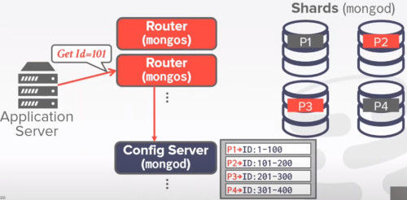
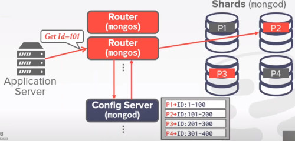
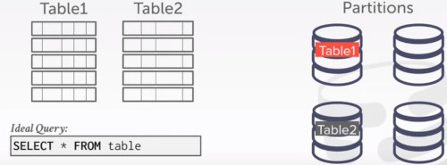
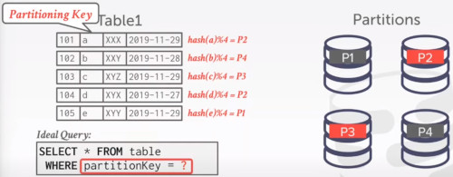
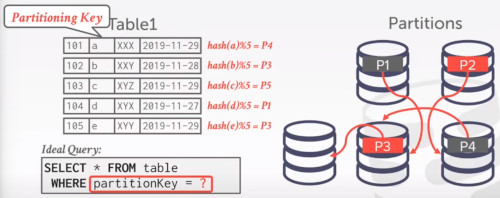
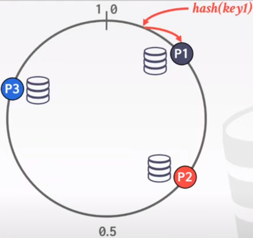
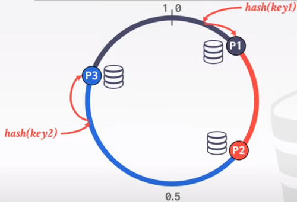
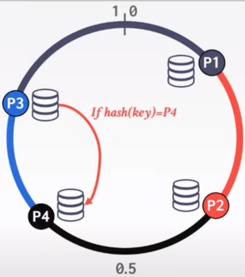
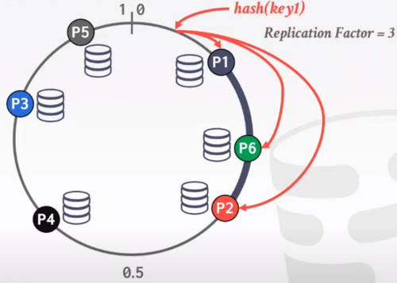
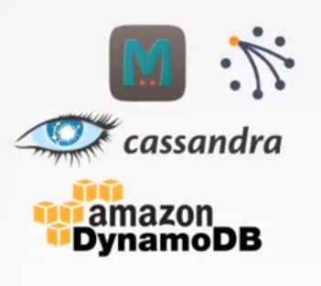

# LECTURE 21: INTRODUCTION TO DISTRIBUTED SYSTEMS

## PARALLEL VS DISTRIBUTED DATABASES

**PARALLEL DATABASES**
- Nodes are physically close to each other
- Nodes connected with high speed LAN
- Communication cost is assumed to be small

**DISTRIBUTED DATABASES**
- Nodes can be far from each other
- Nodes connected using public network
- Communication cost and problems cannot be ignored

### DISTRIBUTED DATABASES
One thing to notice for all the topics we talked about this class, we will still using those things
- Optimization and Planning
- Concurrency control
- Logging and Recovery

But everything would become harder.
- concurrency control has to consider communication cost

### TODAY'S AGENDA
SYSTEM ARCHITECTURES
DESIGN ISSUES
PARTITIONING SCHEMES
DISTRIBUTED CONCURRENCY CONTROL

## SYSTEM ARCHITECTURES
A distributed DBMS's System architecture specifies what shared resources are directly accessible to CPUs

This affects how CPUs coordinate with each other and where they retrieve/store objects in the database

**SHARED EVERYTHING**
The first architecture we are going to explain is called **SHARED EVERYTHING**
- everything is on the same machinea
- and the CPU can directly access both the **MEMORY** and **DISK** on the same machine.

The Resources or CPUs can be on different machines

**SHARED MEMORY**
Then we have our second scenario **SHARED MEMORY**
- CPUs can be on different machines
- but then we are going to assume,
  - that there is a __central mechanism__ or __unified chanel__ that allows these CPUs to access memories like a central place
  - either on a single machine or different machines.
  - Those mechanisms could be RDMA or infiniband
- the high level idea is that each CPU chip doesn't really know which chip is on which machine.
  - memory details are hidden from the interface
  - memory could be in a single location or at different places
  - each memory can access to a local disk attached to it
 

**SHARED DISK**
- the central interface that coordinates different systems is moved to coordinate the central disk
- Every CPU has local access to their own memory
- but then, below this memory
  - there is this uniffied channel that would allow this memory to read data from shared chunks of disk
  - either the disk is unified or within different machines.
- Common in the cloud era. Amazon S3
  - you might have different compute nodes, but at the end of the day you have a shared disk architecture
    

**SHARE NOTHING**
- Common before the cloud era
- every CPUs would have its own memory and disk, directly attached to the local machine
  

### SHARED MEMORY
CPUs have access to common memory address space via a fast interconnect
- Each processor has a global view of all the In-Memory data structure.
- Each DBMS instance on a processor has to 'know' about other instances

in practice no database would implement this architecture this way.
- in order to coordinate the cache coherency
- as well the cache consistency
- it's a pretty difficult and the overhead is often high

it's much easier to deal with this issue onto the lower layer
- or even use a shared nothing architecture

more common uses of this idea would be
- high performance computing
- where you have this giant machine, with lots of CPUs, and also a centralized location with a giant chunk of memory like terabytes

### SHARED DISK
All CPUs can access a single logical disk directly via an interconnect, but each have their own private memories.
- can scale execution layer independently from storage layer
- must send messages between CPUs to learn about their current state

Used in cloud systems
- data can be accessed to this centralized location with an unified channel
  
This architecture has its special property
- it can allow you to **scale** the **storage** and the **compute** independently

#### EXAMPLE
Let's say we have a distributed database like Amazon S3
- with 2 compute nodes (think about it like the amazon ec2 instance)
  - with a memory chip
  - and a CPU processor
- a centralized location where we store our data

Let's say that the application server want to get data with id=101

What this node would do, 
- go to this unified storage device
- found which page are you looking for for that ID
  

Similarly, if you have another query you can use another node to retrieve that information

with this scheme it's easy to note that you can scale independently
- memory storage from disk
- if you don't have enough computing power, you just can add another node

The problem of updating a record,
- is that another node could actually be reading it at the same time
- furthermore, that copy could be stored in the **buffer pool** of **another node**

**coordination**
An update through a node, should tell the other ones to clean that page.
- furthemore, you can actually share between nodes, who has which page.
- so they won't fetch the same page

you can also scale the amount of disk without touching the rest of stuff.

### SHARED NOTHING
Each DBMS instance has its own CPU, memory and disk

**disadvantages**
Nodes can only communicate with each other via network
- harder to scale capacity
- Harder to ensure consistency
- Better performance and efficiency
  

The advantage of this approach is 
- if a query or transaction needs to access data at this location, then it would be very fast
- each local CPU would have local disk, doesn't need to go to an advance network protocol

Every node has its own partition of the data.
- there's no centralized location storage

Still many of the systems before 2010 would still use this architecture 

#### EXAMPLE
Each node has a memory, cpu and storage
- let's say we have 2 nodes called 'partition'
- each partition has its unique ID range

If the application server wants to access to ID=200, it would have to access the second node

We need a mechanisms to figure out which query is going to each partition or node.

If another query wants to access 2 records,
- the first with ID 10
- the second one with ID 200

so the partition have to coordinate to handle the right ID

Say we now want to scale the resources up and down.
- we just have to add new compute nodes.

But then, one issue is that we have to redistribute the data
- so the new node can actually handle some workload

In actuallity that data moving can be very expensive and complex.
- it's just a giant transaction.
- you have to ensure that each of the single record is correctly inserted into this new node
- and while you do this, you have to handle the current transaction queries executing at the same time

## HISTORY
EARLY DISTRIBUTED DATABASE SYSTEMS
- MUFFIN - UC berkeley 1979 
- SDD-1 - CCA 1979
- System R* - IBM research 1984
- Gamma - U. Wisconsin 1986
- NonStop SQL - Tandem 1987
  
## DESIGN ISSUES
How does the application find data?

How to execute queries on distributed data?
- push query to data
- pull data to query

How does the DBMS ensure correctness?

Also, nodes can go down, how to deal with this.

### HOMOGENEOUS VS HETEROGENEOUS NODES
**APPROACH 1.** HOMOGENEOUS NODES
- Every node handles the same responsability.
  - reads/writes/txn
  - every node goes down, you can create a new node
- Every node in the cluster can perform the same set of tasks
  (albeit on potentially different partitions of data)
- Masks provisioning and failover 'easier'

**APPROACH 2** HETEROGENEOUS NODES
- you can specialize different nodes for specific scenarios
- Can allow a single physical node to host multiple 'virtual' node types for dedicated tasks
- the obvious challange is how to recover when a node goes down.

### MONGODB HETEROGENEOUS ARCHITECTURE
Mongo DB is actually a share nothing architecture

On the right, 
- the data, CPU and memory would be on this different nodes called 'SHARDS'
- think of it as partitions of the data

Beyond these shards we have two types of heterogeneous nodes
- Router
- Config server node

Let's say one query is trying to read a tuple with id 101
- the router has to first consolidate locations of different records with a centralized config server
- let's say we have 4 partitions

After the server figures it out,
- it will send this inforation about which partition or shard, the router should route this query

### DATA TRANSPARENCY
Users should not be required to know where the data is physically located
- hwo tables are partitioned or replicated

A query that works on a single node DBMS should work the same on a distributed DMBS

### DATABASE PARTITIONING
Split database across multiple resources:
- disk, nodes, processors
- often called 'sharding' in NoSQL systems

The DBMS executes query fragments on each partition and then combines the results to produce a single answer

## PARTITIONING SCHEMES
### NAIVE TABLE PARTITIONING
Assign an entire table to a single node
- Assumes that each node has **enough** storage **space** for an entire table

Ideal if queries **never join** data **across tables** stored on different nodes and access patterns are uniform

#### RUN THROUGH
MongoDB would let you choose this option

### HORIZONTAL PARTITIONING
Split a table's disjoint tuples across different nodes
- Choose columns that divides the database equally in terms of
  - size, load or usage
- Hash partitioning, Range Partitioning

The DBMS can partition a database **physically** (shared nothing) or **logically** (shared disk)

#### RUN THROUGH
Let's say we have this table, with this 4 attributes called 'partition key'

Then one simple strategy would be to hash the partition by 4

Assuming you have a WHERE clause that contains this partition key
- that you locate data on different machines

Its important to define which partition key would be.
- otherwise you have to broadcast those queries to all the shards and waste a lot of computation

What if we want to scale the database with a new partition?
- Then you would have to move data across machines into the new configuration

it would be very expensive and a challange happening in this case.

### CONSISTENT HASHING
The main idea is
- to allow incremental addition or removal of nodes
- without actually to move all the data around

Instead of having this function that **mods** by the number of nodes
- you actually have this ring ranged from 0 to 1,
- that would map all the hash values to.

Each partition, would be responsible for its range zone.

So first you hash this value between 0 and 1 no matter how many nodes you have
- then you would round up this value into the closes partition.

Then you decide for each partittion with the range that came before to that partition

What if now we add a new node?
- i just pick a new location of the ring (with the largest gap)
- and share data from the one partition zone it was before the addition

In the distributed DBMS world, often we would want to replicate the data as well
- if one node goes down, you want the other ones to reclaim its function

if we assume a replication factor of 3.
- then we could replicate the data in the 3 following systems after the current partition

#### CONSISTENCY ISSUES
Let's say we have 3 replication of this data.
- every time i update to this key,

1. i could either broadcast this update into those 3 different locations and wait to the partitions to come back
  - Strong consistent, but extra inefficient 
2. or Every time you want to write an update, you just return to the client after the first commit. even when the other systems are processing the txn
  - eventual consistent

Examples are 

## DISTRIBUTED CONCURRENCY CONTROL
