# LECTURE 22: DISTRIBUTED OLTP DATABASES

## OVERVIEW
- DISTRIBUTED OLTP SYSTEMS
- REPLICATION
- CAP THEOREM
- REAL-WORLD SCENARIOS

Last time we have talked about different architectures and design choices.

**SYSTEM ARCHITECTURES**
- Shared everything
- Shared memory
- Shared disk
- Shared nothing

**PARTITIONING / SHARDING**
- Hash
- Range
- Round Robin

- **TRANSACTION COORDINATION**
- Centralized / Decentralized
 
### OLTP VS OLAP
On line Transaction Processing (OLTP)
- Short lived read/write txn
- Small footprint
- Repetitive operations

On line Analytical Processing (OLAP)
- Long-running, read only queries
- Complex joins
- Exploratory queries

### DECENTRALIZED COORDINATOR
When the server application wants to begin a transaction
- a primary node is assigned
- that would handle different request
- as the commit txn as well
  
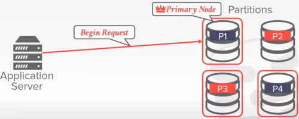

So how the distributed database is going to determine that its safe to commit.

**OBSERVATION**
We have not discussed how to ensure that all nodes agree to commit a txn 
- and then to make sure it does commit if we decide it should
- What happens if a node fails?
- What happens if our messages show up late with some delay?
- What happens if we don't wait for every node to agree?

### ASSUMPTION
We can assume that all nodes in a distributed DBMS are well behaved and under the same administrative domain
- if we tell a node to commit a txn, then it will commit the txn (if there's no failure)

If you do not trust other nodes in a distributed DBMS then you need to use a **Byzantine Fault Tolerant Protocol** for txns. (blockchain)

### TODAY'S AGENDA
ATOMIC COMMIT PROTOCOLS
REPLICATION
CONSISTENCY ISSUES (CAP)
FEDERATED DATABASES

## ATOMIC COMMIT PROTOCOLS
How a transaction commits in a distributed database

when a multi-node txn finishes, the DBMS needs to ask all the nodes involved whether it is safe to commit

Examples
- Two Phase commit
- Three phase commit (not used)
- Paxos
- Raft
- ZAB (Apache zookeeper)
- Viewstamped replication

### TWO PHASE COMMIT (SUCCESS)
Let's say the application server has finished all the operations that it wants to do, and then it wants to commit
- node 1 is the responsible of commit, named 'coordinator' or 'primary node'
- the other nodes are called participant

The first thing the coordinator would do
- is to send the **prepare** message
  
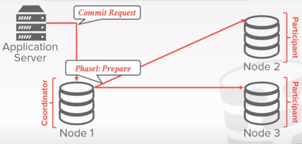

If each participant are ready to commit, they would send an ok message
  
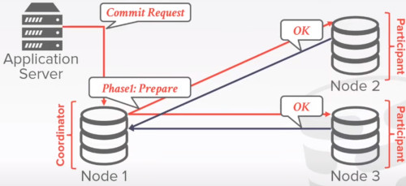

Only until then, the coordinator can start the second phase, 'the commit phase'
- the coordinator has to wait for all the participant to get a response

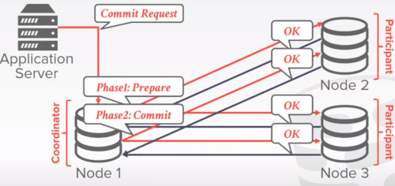

After that, the coordinator can send the commited message back to the client

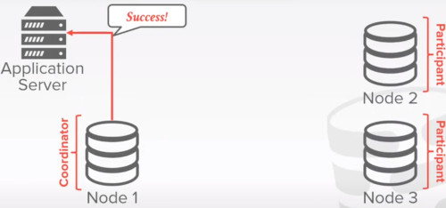

During every step of this 2 phase commit
- all the participants have to log out which phase it is.
- so it is fault tolerant

### TWO PHASE COMMIT (ABORT)
Suppose now that node 3 wasn't ready to commit
- so node 3 would send an abort request

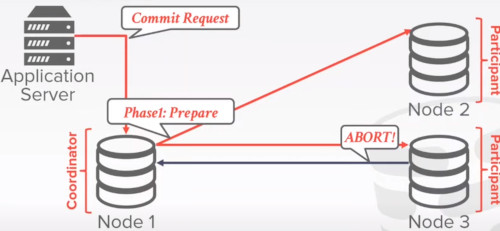

That would chain an abort on the participant as well as the application server

And finally all participants has to acknowledge the abort

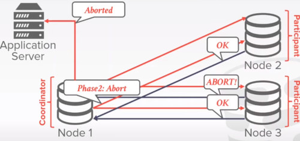

### 2PC OPTIMIZATIONS
**EARLY PREPARE VOTING**
- If you send a query to a remote node that you know will be the last one you execute there
- then that node will also return their vote for the prepare phase with the query result

After the prepare message was successful, you can tell the application server that txn has succeded

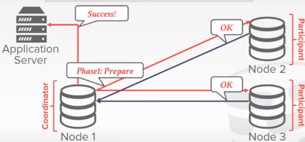

In the meantime, the commit phase is being taking place

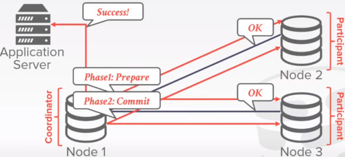

**EARLY ACKNOWLEDGEMENT AFTER PREPARE**
- if all nodes vote to commit a txn, the coordinator can send the client an acknowledgement that their txn was successful before the commit phase finishes

### CLARIFICATIONS
Each node records the outcome of each phase in a non-volatile storage log.

What happens if coordinator crashes?
- participants must decide what to do
  - for example set a timeout otherwise abort
- participants may choose a new leader
  
What happens if participants crashes?
- Coordinator assumes that it responded with an abort if it hasn't send an aknowledge yet.
- otherwise at come back you have to recover from the log file.

### PAXOS
Consensus protocol where a coordinator proposes an outcome (commit or abort)
- then the participants vote on whether that outcome should succeed

Does not block if a majority of participants are available and has probably minimal message delays in the best case.

The first paper was propposing this system is called
- The Part Time Parliament

When the application server wants to commit
- it designs a proposer = same as coordinator
- the participants are called 'aceptors'

After the proposer recieves the commit request.
- it will send to those a propose to all the acceptors

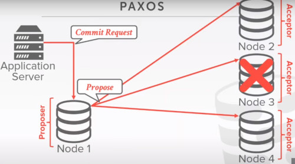

If one server is down, but the other ones agree.
- then the majority rules, and i can proceed the operation

The next step would be the commit step

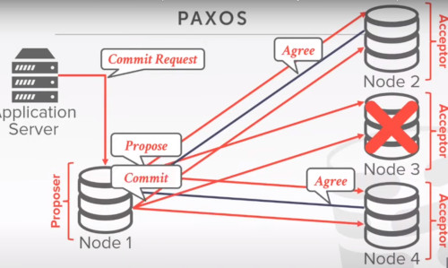

Then if the majority of the acceptors succesffully commited those changes
- then the operation is succesful

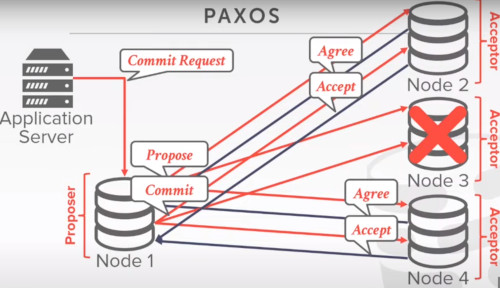

Because we allow the system to commit a transaction 
- **without the agreement of all the nodes**

we have to enforce additional rules on the commitement of the transaction to ensure that all these transaction would result
in a correct and consistem state of the entire system.

Let's say i have 2 transactions
- we have 2 proposers

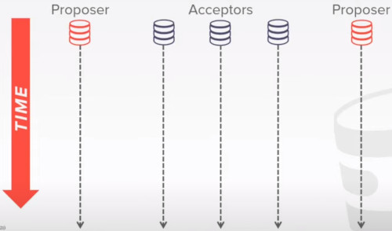

First proposer wants to propose on these 3 acceptors 
- both 3 accept that proposal
  
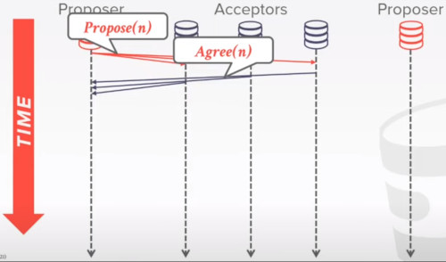

Then transaction n+1 comes along

But then the first proposal wants to commit

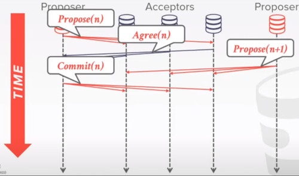

Transaction N cannot commit until Transaction N+1 does.
- future timestamped transactions have priority against older ones.

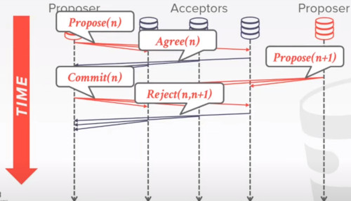

After some time, the Txn N+1 agrees to commit,
- but this time, they would agree to commit

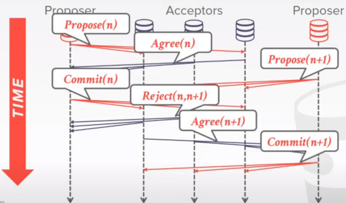

A problem here is Denial of Service.
- if you continuously submit a txn it will always block the older ones.
## REPLICATION
## CONSISTENCY ISSUES (CAP)
## FEDERATED DATABASES

## QUESTIONS
- What if the participant after 'commiting' is destroyed
- the commit would had not taken place
  
2 types of faults
- server down
- server destroyed
