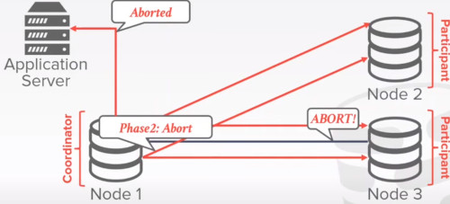
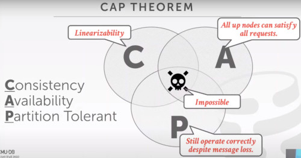
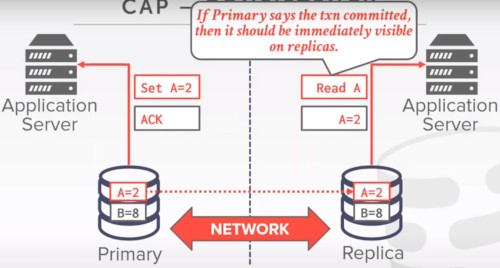

# LECTURE 22: DISTRIBUTED OLTP DATABASES

## OVERVIEW
- DISTRIBUTED OLTP SYSTEMS
- REPLICATION
- CAP THEOREM
- REAL-WORLD SCENARIOS

Last time we have talked about different architectures and design choices.

**SYSTEM ARCHITECTURES**
- Shared everything
- Shared memory
- Shared disk
- Shared nothing

**PARTITIONING / SHARDING**
- Hash
- Range
- Round Robin

- **TRANSACTION COORDINATION**
- Centralized / Decentralized
 
### OLTP VS OLAP
On line Transaction Processing (OLTP)
- Short lived read/write txn
- Small footprint
- Repetitive operations

On line Analytical Processing (OLAP)
- Long-running, read only queries
- Complex joins
- Exploratory queries

### DECENTRALIZED COORDINATOR
When the server application wants to begin a transaction
- a primary node is assigned
- that would handle different request
- as the commit txn as well
  

So how the distributed database is going to determine that its safe to commit.

**OBSERVATION**
We have not discussed how to ensure that all nodes agree to commit a txn 
- and then to make sure it does commit if we decide it should
- What happens if a node fails?
- What happens if our messages show up late with some delay?
- What happens if we don't wait for every node to agree?

### ASSUMPTION
We can assume that all nodes in a distributed DBMS are well behaved and under the same administrative domain
- if we tell a node to commit a txn, then it will commit the txn (if there's no failure)

If you do not trust other nodes in a distributed DBMS then you need to use a **Byzantine Fault Tolerant Protocol** for txns. (blockchain)

### TODAY'S AGENDA
ATOMIC COMMIT PROTOCOLS
REPLICATION
CONSISTENCY ISSUES (CAP)
FEDERATED DATABASES

## ATOMIC COMMIT PROTOCOLS
How a transaction commits in a distributed database

when a multi-node txn finishes, the DBMS needs to ask all the nodes involved whether it is safe to commit

Examples
- Two Phase commit
- Three phase commit (not used)
- Paxos
- Raft
- ZAB (Apache zookeeper)
- Viewstamped replication

### TWO PHASE COMMIT (SUCCESS)
Let's say the application server has finished all the operations that it wants to do, and then it wants to commit
- node 1 is the responsible of commit, named 'coordinator' or 'primary node'
- the other nodes are called participant

The first thing the coordinator would do
- is to send the **prepare** message
  

If each participant are ready to commit, they would send an ok message
  

Only until then, the coordinator can start the second phase, 'the commit phase'
- the coordinator has to wait for all the participant to get a response

After that, the coordinator can send the commited message back to the client

During every step of this 2 phase commit
- all the participants have to log out which phase it is.
- so it is fault tolerant

### TWO PHASE COMMIT (ABORT)
Suppose now that node 3 wasn't ready to commit
- so node 3 would send an abort request

That would chain an abort on the participant as well as the application server

And finally all participants has to acknowledge the abort

### 2PC OPTIMIZATIONS
**EARLY PREPARE VOTING**
- If you send a query to a remote node that you know will be the last one you execute there
- then that node will also return their vote for the prepare phase with the query result

After the prepare message was successful, you can tell the application server that txn has succeded

In the meantime, the commit phase is being taking place

**EARLY ACKNOWLEDGEMENT AFTER PREPARE**
- if all nodes vote to commit a txn, the coordinator can send the client an acknowledgement that their txn was successful before the commit phase finishes

### CLARIFICATIONS
Each node records the outcome of each phase in a non-volatile storage log.

What happens if coordinator crashes?
- participants must decide what to do
  - for example set a timeout otherwise abort
- participants may choose a new leader
  
What happens if participants crashes?
- Coordinator assumes that it responded with an abort if it hasn't send an aknowledge yet.
- otherwise at come back you have to recover from the log file.

### PAXOS
Consensus protocol where a coordinator proposes an outcome (commit or abort)
- then the participants vote on whether that outcome should succeed

Does not block if a majority of participants are available and has probably minimal message delays in the best case.

The first paper was propposing this system is called
- The Part Time Parliament

When the application server wants to commit
- it designs a proposer = same as coordinator
- the participants are called 'aceptors'

After the proposer recieves the commit request.
- it will send to those a propose to all the acceptors

If one server is down, but the other ones agree.
- then the majority rules, and i can proceed the operation

The next step would be the commit step

Then if the majority of the acceptors succesffully commited those changes
- then the operation is succesful

Because we allow the system to commit a transaction 
- **without the agreement of all the nodes**

we have to enforce additional rules on the commitement of the transaction to ensure that all these transaction would result
in a correct and consistem state of the entire system.

Let's say i have 2 transactions
- we have 2 proposers

First proposer wants to propose on these 3 acceptors 
- both 3 accept that proposal
  

Then transaction n+1 comes along

But then the first proposal wants to commit

Transaction N cannot commit until Transaction N+1 does.
- future timestamped transactions have priority against older ones.

After some time, the Txn N+1 agrees to commit,
- but this time, they would agree to commit

A problem here is Denial of Service.
- if you continuously submit a txn it will always block the older ones.

### MULTI-PAXOS

If we have to continue with this restriction of having to keep the serial order of commiting transaction.
- it's better to have just one person to propose. one proposer. No competetition

The leader would rotate between different nodes.
- for example every 10 sec.
- the leader would be chosen through another PAXOS round
  
If the system elects a single leader that oversees proposing changes for some period,
- then it can skip the **propose** phase
- fall back to full Paxos whenever there is a failure

The system periodically renews who the leader is using another Paxos round.
- Nodes must exchange log entries during leader election
- to make sure that everyone is up to date

### 2PC vs PAXOS
**Two Phase Commit**
- Blocks if coordinator fails after the prepare message is sent, until coordinator recovers.
- for an optimistic environment, failures are rare
  
**PAXOS**
- Non-Blocking if a majority participants are alive, provided there is a sufficiently long period without further failures.
- for a pessimistic environment where failures are frequently
  
## REPLICATION
The DBMS can replicate data across **redundant nodes** to increase avilability

Design decisions
- Replica configurations
- Propagation scheme
- Propagation timing
- Update method

### CONFIGURATION
**APPROACH 1**, PRIMARY-REPLICA
- All updates go to a designated primary for each object
- The primary propagates updates to its replicas without an atomic commit protocol
- Read only txns may be allowed to access replicas
- If the primary goes down, then hold an election to select a new primary

**APPROACH 2**, MULTI-PRIMARY
- Txns can update data objects at any replica
- Replicas must synchronize with each other using an atomic commit protocol

In Practice, most databases do fin in just one machine.

#### RUN THROUGH
**PRIMARY REPLICA SCENARIO**
- one primary and many replicas.
- all the writes go to the primary

After the primary completes all the writes, then it transfer that to the replicas.
- that would execute the reads

**MULTI-PRIMARY REPLICAS**
- all the reads and writes goes into those nodes
- when there is a conflict, you have to do some coordination between different copies of the data

### K-SAFETY
The number of data copies that should exits in the system.

K-Safety is a threshold for determining the fault tolerance of the replicated database.

The value **K** represents the number of replicas per data object that must always be available.

If the number of replicas goes  below this threshold,
- then the DBMS halts execution and takes itself offline.

### PROPAGATION SCHEME
How do the system propagates all the changes on a replicated database.

Whether you have to wait all the copies of the data,
- to be successfully written
- or you can return into the client while processing the replicas.

Propagation levels
- Synchronous (Strong consistency)
- Asynchronous (Eventual consistency)

Typically systems support both options to the usert to decide.

#### SYNCHRONOUS
The primary sends updates to replicas and then waits for them to acknowledge that they fully applied (logged) the chanes.

so you have the replica to flush into the disk

#### ANSYNCHRONOUS
The primary immediately returns the  acknowledgement without waiting the replicas to apply the changes

### PROPAGATION TIMING
When would be the time when you propagate such log records 

**APPROACH 1**, CONTINUOUS
- The DBMS sends log messages immediately as it generates them
- also need to send a commit/abort message

**APPROACH 2**, ON COMMIT
- The DBMS only sends the log messages for a txn to the replicas once the txn is commits
- do not waste time sending log records for aborted txns
- Assumes that a txn's log records fits entirely in memory

### ACTIVE VS PASSIVE
**APPROACH 1** ACTIVE-ACTIVE
- A txn executes at each replica inependently
- Need to check at the end whether the txn ends up with the same result at each replica

Instead of having one of the nodes making changes from the transactions and propagate those changes later.
- assuming you have 3 replicas
- you send 3 copies of the queries to each replica.
- instead of doing that computation in one machine and replicating results.

very unfrequently used

**APPROACH 2** ACTIVE-PASSIVE
- Each txn executes at a single location and propagates the changes to the replica
- Can either do physical or logical replication
- Not the same as Primary replica vs Multi-Primary

One primary a few replicas
- just propagate the results

## CONSISTENCY ISSUES (CAP)
**CAP THEOREM**
proposed by Eric Brewer that it is impossible for a distributed system to always be:
- Consistent
- Always available
- Network partition Tolerant

Proved in 2002 

Consistency would be similar to the linearizability
- at the end of the day, the state of the database would be equivalent to some serial executed schedule of transactions.

Availability would mean that,
- all the nodes available, are able to accept the request

Partition Tolerant would mean that,
- the system is going to still operate, even there is a network failure and some nodes cannot communicate with other nodes.

What would be the difference between linearizability and seriability?
- linearibility is from distributed databases, a set of txn would be scheduled at a specific serial order
- serializability, the execution of txn would be equivalent to some serial order

### EXAMPLE
**CAP CONSISTENCY**
Here we have 2 application servers
- we have 2 nodes in our database
- we have a good network

First we have our first update on record A
- it updates the primary database
- then tryies to update the replica one

Assuming we have a syncronous replication scheme
- the system would be consistent
- you would immediately propage the changes to the replica

After that a new read transaction comes along to read succesffuly the record A

**CAP AVAILABILITY**
Assume one node is down,
- Application 1 can read normally from primary
- and get its result back

If the other server wants to access the data it has to skip the replica server into the primary one

This would satisfy the availability requirement

**PARTITION TOLERANT**
- if there's a network failure
- those nodes cannot communicate each others

As nodes can't talk with each others,
- then we can't guarantee availability
- each node doesn't know if the other system is dead or not

The network would split into a separated network.

At some point later, when network comes back
- the two systems would be in an inconsistent state

### OBSERVATION
How a DBMS handles failure determines which elements of the CAP theorem they support

**TRADITIONAL/NewSQL DBMS** (in memory)
- Stop allowing updates until a majority of nodes are reconnected

**NoSQL DBMS**
- Provide mechanisms to resolve conflicts  after nodes are reconnected

## FEDERATED DATABASES
We have assumed that the nodes in our distributed systems are running the same DBMS software.

Bur organizations often run many different DBMS in their applications

it would be nice, if we could have a single interface for all our data

In a Bank, there could be diffent systems for different workloads.

**FEDERATED DATABASES**
Distributed architecture that connects together multiple DBMSs into a single logical system
- A query can access data from any location

This is hard and nobody does it well
- Different data models, query languages, limitations
- No easy way to optimize queries
- Lots of data copying

It can ve view as a coordinator
- the communication channels are called 'connectors'
  

Postgres actually gives you the option of using a federated database called 'FOREIGN DATA WRAPPER'
- you can hook up 'fake customized table' with an external database
- you can define a table using 'forwarding data wrapper' and this would be backed up by different DBMS systems

### CONCLUSIONS
We assumed that the nodes in our database distributed DBMS are friednly

Blockchain databases assume that the nodes are adversarial.
- this means you must use different protocols to commit transactions

If nodes behave maliciously, then it would be a complete different scenario
- you would use byzantine failure for tolerant protocol

### NEXT CLASS
DISTRIBUTE OLAP SYSTEMS

## QUESTIONS
- What if the participant after 'commiting' is destroyed
- the commit would had not taken place
  
2 types of faults
- server down
- server destroyed

