# LECTURE 23: DISTRIBUTED OLAP SYSTEMS

## BIFURCATED ENVIRONMENTS

OLTP to store data

OLAP to process data


## DECISION SUPPORT SYSTEMS 
- aka data warehousing
- aka as data lake (when data is huge)

Applications that serve the management, operation and planning levels of an organization,
- to help people make decisions about future issues and problems by analyzing historical data

Two models for OLAP systems
- **Star schema**
- **Snowflake schema**

### STAR SCHEMA
The data is organized, you have a single **FACT** table
- and many dimension tables, at one level to the fact table

you can actually copy your OLTP schema into the OLAP schema...
- but then it's often beneficial to reorganize your data and put them into a unified form
- so it would queried efficiently

In the star schema, you are only allowed to be 1 layer out of your fact table


One star in the center of the table, and many stars around it

**FACT TABLE**, they are usually recalls the events that are generating in your system.

Let's say you are running the database for sales for Amazon.
- the fact table would contain all the sales.
- This fact table would only have this basic information
  - Foreign references to the dimension table outside
 
For example the foreign keys to a product
- and only in those dimension tables you have those detailed information
  - for example for each product
  - you may have the category product,
  - product name

One benefit of this schema approach is that join would be relative simpler
- The joins would be at most joining 2 tables

There could be some redundancy in the dimension of the table as well


### SNOWFLAKE SCHEMA
In this schema, you have a central fact table that are going to record all the events generated in your system
- but don't have the limitation on how many dimension tables you would have


This way, as there are just a few categories,
- you can normalize that data and then extract the category information


### SUMMARY
**ISSUE 1** NORMALIZATION
- SNOWFLAKE schemas take up **less storage space**
- Denormalized data models may incur integrity and consistency violations

**ISSUE 2** QUERY COMPLEXITY
- Snowflake schemas require more joins to get the data needed for a query
- Queries on STAR schemas will (usually) be faster

### EXAMPLE
Let's say we have a distributed database with 4 partitions
- then we have the following simple join query
- Assuming the query land on the first partition
  - then it would need data from all partitions
  


In the NAIVE approach, 
- you copy all the data into the first partition
- then perform the join in there

Issues
- You have to move a lot of data around
- you might have not enough memory

## TODAY'S AGENDA
- EXECUTION MODELS, what would be the models
- QUERY PLANNING, how would we chain the query planning
- DISTRIBUTED JOIN ALGORITHMS
- CLOUD SYSTEMS


## EXECUTION MODELS
### PUSH VS PULL
The fundamental methods to execute an analytical query in a distributed system are:

**APPROACH 1** PUSH QUERY TO DATA
- Send the query (or a portion of it) to a node that contains the data
- Perform as much filtering and processing as possible where data resides before transmitting over network

**APPROACH 2** PULL DATA TO QUERY
- Bring the data to the node that is executing a query that needs it for processing

Where you use a share nothing or a share disk architecture
- it would be independent of which model you use
  
#### PUSH QUERY TO DATA
it's easy to explain in a shared nothing scheme.

First node potentially have R relations from 1 to 100, and relation S from 1 to 100 as well
- Partition 2, has similar relations but ranged from 100 to 200

For this simple example, we select the join between R and S ID

The first partition would send its first partition of the data to node 2


The second node would recieve this partial result, and retrieve its results


#### PULL DATA TO THE QUERY
Assume here we have a SHARED DISK architecture
- naturally those computing nodes have any data

So again, first node process first range of the query,
- and sends to the second node the query for him to retrieval its corresponding partial join result

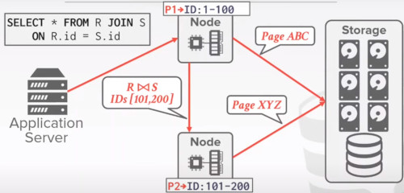

The computer node, has to pull data out of this centralized location.

Some modern cloud storage, would support some filtering at the centralized disk location.
- **AMAZON S3** is the most famous example

### OBSERVATION
The data that a node receives from remote sources are cached in the buffer pool
- this allows the DBMS to support intermediate results that are larger than the amount of memory available
- Ephemeral pages are not persisted after a restart

What happens to a long-running OLAP query if a node crashes during execution?

most of the analytics we perform are read only.
- they would commonly extract knowledge
- but rarely they are updating values
- so you wouldn't be much worry about the correctness of this issue.

However many of those analytical queries are long running

### QUERY FAULT TOLERANT
In practice what people do is query fault tolerant
- don't try to save intermediate results
  
Most shared-nothing distributed OLAP DBMS are designed to assume that nodes do not fail during query execution.
- if one fails, then the whole query fails

The DBMS could take a snapshot of the intermediate results for a query during execution to allow it to recover if nodes fail

some systems just log a lightweight metadata about this query.
- if a node fails

Assume you have this shared disk architecture with 2 nodes
- the query got sent to the first node
- then one part of the query will be sent to the second node

After the second node finished its portion the system would log some metadata
- drawing back those results to the shared disk storage


If now the second node fails,
- instead of recompute them, you can go and retrieve the result from the shared storage location


I.e. AMAZON REDSHIFT is kind of doing this.

## QUERY PLANNING
All the optimizations that we talked about before are still aplicable in a distributed environment
- predicate pushdown
- Early projections
- Optimal Join Orderings

Distributed query optimization is even harder because it must consider the physical location of data and network transfer costs.

The only extra consideration is to send data between the network.
- so in the query optimization of a distributed analytical query
- the optimizer would have to consider the network cost.

### QUERY PLAN FRAGMENTS
**APPROACH 1** PHYSICAL OPERATORS
- Generate a single query plan and then break it up into partition-specific fragments
- Most systems implements this approach

**APPROACH 2** SQL
- Rewrite original query into partition-specific queries
- Allows for local optimization at each node
- **single store** + **Vitess** are the only systems that i know about that uses this approach.

For example, assume you have this simple join query 
- and then you have 3 different partitions.
- so in the SQL approach, you first optimize this first query and get a query plan

But then you would re-write, those simple queries.
- but targeting different partitions.
- a WHERE clause has been appended
  


The benefit of this, is when you optimize a query
- you are largely rely on the statistic of the distribution of your data
- those statistics may be actually outdated
- when you optimize a query you would not have the best plan. The data may not be that local to you

So when you generate those queries to different machines,
- they have the oportunity to reoptimize them using the information directly available on their local disk
- with the most up-to-date statistics

After you finish execution, you have to join results and send them back to the client

### OBSERVATION
The efficiency of a distributed system join depends on the target tables' partitioning schemes

One approach is to put the entire table on a single node and then perform the join.
- You loose the parallelism of a distributed DBMS
- Costly data transfer over the network

## DISTRIBUTED JOIN ALGORITHMS
We need to make sure, that tuples in a 2 Join relation are executed in the same machine.

Once the data is at that node, the DBMS then executes the same join algorithms that we discussed earlier.

### SCENARIO (I)
One table is replicated at every node
- each node joins its local data in parallel and then sends their results to a coordinating node
```
SELECT * FROM R JOIN S
    ON R.id = S.id
```

Because the data is replicated, you can perform the join in both machines
- then you have to aggregate both results in order to output the final result


You don't need to move the data of the original values in any of the relations.


### SCENARIO (II)
Tables are partitioned on the join attribute. Each node performs the join on local data and then sends to a node for coalescing.

The both tables may be both pretty big.
- you would have not the luxury to replicate the table in both machines
- but then you might have the same partition key as the join key.

for all the data that resides in a particular node it would contain
- all the tuples from both relations
- that have the same range in terms of this join
- it's also a straightforward operation

it doesn't require the direct movement of tuples

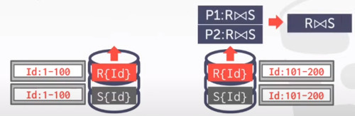


you can actually design the partition scheme to be the more beneficial to the common queries in the workload 

### SCENARIO (III) BROADCASTING
Both tables are partitioned on different keys.
- if one table is small then the DBMS 'broadcast' that table to all nodes

In this example table **S** was copied to both sides

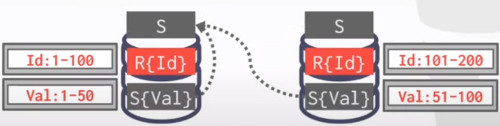

### SCENARIO (IV) SHUFFLING
Both tables are not partitioned on the join key.
- the DBMS copies the tables by 'shuffling' them across nodes.

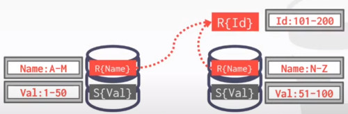

In this example you have to reshufle/repartition the both relations

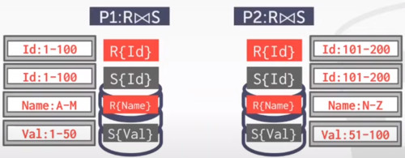

### SEMI-JOIN
Type of query after perform the join
- you actually require data from one side of the relationship

Distributed DBMS use SEMI-JOIN to minimize the amount of data sent during joins
- this is like a projection pushdown

```
SELECT R.id FROM R JOIN S
    ON R.id = S.id
 WHERE R.id IS NOT NULL
```

Here you just move data from S to R

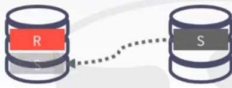

But instead of moving the entire tuple
- you just move the ids of that records

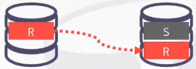

Some DBMS supports SEMI JOIN SQL syntax. otherwise you fake it with EXISTS

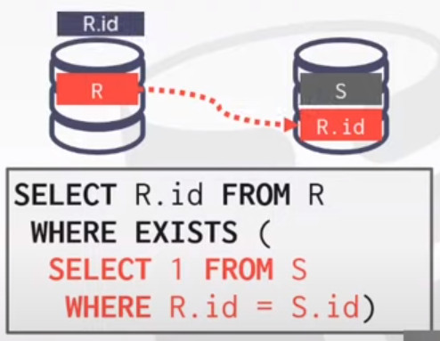

## CLOUD SYSTEMS
Vendors provide **database-as-a-service** (DBaaS) offerings that are managed DBMS environments.

Newer systems are starting to blur the lines between shared-nothing and shared-disk
- Example, you can do simple filtering in AMAZON S3, before copying data to compute nodes.

There are actually 2 types of CLUD SYSTEMS

**APPROACH 1** MANAGED DBMS
- No significant modification to the DBMS to be 'aware' that it is running in a cloud environment
- Examples: most vendedors

**APPROACH 2** CLOUD-NATIVE DBMS
- The system is designed explicitly to run in a cloud environment
- Usually based on a shared-disk architecture
- Examples: Snowflake, Google BigQuery, Amazon Redshift, Microsoft SQL Azure

### SERVERLESS DATABASES
Rather than alays maintaining compute resources for each customer, 
- a 'serverless' DBMS evicts tenants when they become idle.

Its like a pricing model, 
- resorces are withowed on demand
- i got billed by the amount of computation used when executing queries.

Then i go to sleep, go to rest
- and i don't need to access databases for now
- in order to save money,

The managed DBMS would charge you for the designed node.


Then in the cloud-native pricing model
- the DBMS evicts tenants when they become idle
- typically a shared-disk architecture

The system can choose rather to write content in the buffer pool, before go been evicted.
- or just shut the middle node down, you won't be charged by that writting
  
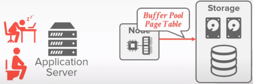

when the system comes back, it can optionally recover the buffer pool, and continue it's workload

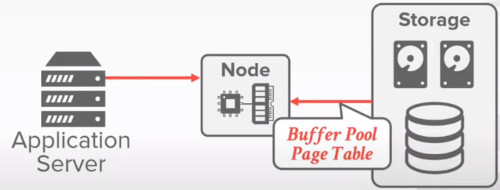

Implementations
- Amazon, Fauna, microsoft SQL azure, Google Big Query
  
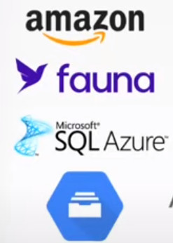

### DISSAGREGATED COMPONENTS
**SYSTEM CATALOGS**
- HCatalog, Google Data Catalog, Amazon Glue Data Catalog

**NODE MANAGEMENT**
- KUBERNETES, APACHE YARN, Clud vendor tools

**QUERY OPTIMIERS**
- Greenplum Orca, Apache Calcite
