# LECTURE 24: GOOGLE BIG QUERY
- Justin Levandoski
  
## OLAP AND OLTP IN THE CLOUD
How OLTP and OLAP are done in real systems in the cloud

We are going to talk about 3 systems
- MOVEMENT TO THE CLOUD
  - BIG QUERY, which is google cloud in the warehouse
- OLAP IN THE CLOUD
  - AMAZON AURORA
- OLTP IN THE CLOUD

## THE CLOUD
Once upon a time, companies like ORACLE, TERRADATA, PIED PIPER
- The hardware was stored in bussineses or data-centers and they work fine

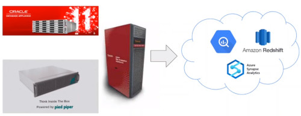

But clearly it's a shift now to the cloud
- customers are shipping their data and workloads
- BIG QUERY, AMAZON REDSHIFT, AWS, SYNAPSE, AZURE, SNOWFLAKE, DATABRICKS

There are multiple reasons
- Economics of Scale
- Innovation, Gravitron, TPUs, etc.
- Operations
- Security/Governance/Compliance
- Rich cloud Ecosystems
- Why should database students care?
  - Different assumptions, different architectures
  - The textbook basics will be re-written
  - An exciting era for the field

## BIG QUERY: OLAP IN THE CLOUD
Big query is
- A serverless
- highly scalable
- and cost-effective
- cloud-data warehouse

It's fully managed serverless and clusterless
- available 24/7

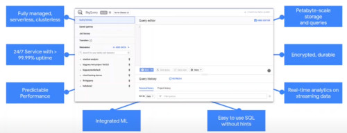

we really strike for protectible performance

key features
- integrated Machine learning
- easy to use SQL with hints
- petabytes-scale storage and queries, that can scale massively
- data is **encripted** and **durable**
- real time analytics on streaming data

### ARCHITECTURE
BigQuery separates Compute and storage in a unique way.
- it looks like a data warehouse from the right hand side.
  - SQL compliant
  - you can access data through REST APIs
  - you can issue queries
  - it also has web UI and CLI
  - and client libraries in several different languages

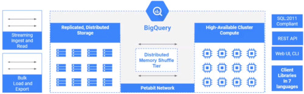

Highly available cluster for compute the components doing the query processing
- separated by storage by a **petabyte bisection bandwidth network**
- which data sits on **replicated durable storage**
- there's a **unique distributed memory shuffle tier** in between those components
  - for doing shuffles for massive queries
- also supports **streaming ingest and read** directly to storage, quite unique for BigQuery
- also **bulk load and export**

### DESIGN PRINCIPLES (I)
Storage and compute separation
- petabyte-scale
- High availability
- Serverless and multi-tenant
  
Colocation and Caching
- High performance at low cost

Integrated Hardware/Software stack
- Take advantange of hardware primitives when necessary 
- For High performance at low cost

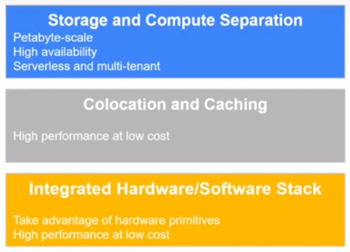

#### QUERY GRAPH
If you set a query in BigQuery you would set up a distributed kind of query graph
- where data rest at the distributed file system
  - scanned by a set of workers
- if it requires re-shuffling, there's a shuffle tier
  - another set of workers in the next stage will process it
- The final workers in stage 3 finilizes the query and writes the results into the distributed file system
- to be able coordinate this, there's a separate coordinator
  - and a scheduler to essentially provide the resources to answer the query.
    
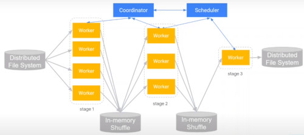

The life of the query starts in the coordinator who is going to plan
- and a set of resorces are provisioned

#### GOOGLE INFRASTRUCTURE
What BigQuery really is, is a set of infrastructure components built around the google's core infrastructure

The distributed storage tiers is called 'The Colossus'
- google scalable storage system
- all resources are provided by 'borg', paper 2015
  - it's also based on 'DREMEL', paper 2010
    - it's also relies on pieces of 'spanner' to store things as state
    - and the petabyte bandiwth network is based on 'jupiter' paper.
       
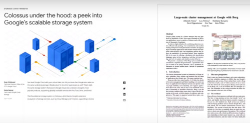

Borg enables us to have a trully serverless architecture at scale
- any compute or resouce allocation is up to borg
  - what set of primitives you want to use,
  - how much cpu
  - how much memory
  - some config about your package and container
- you place it for borg, and it will place a machine for you
- it would figure out exactly what you want
 
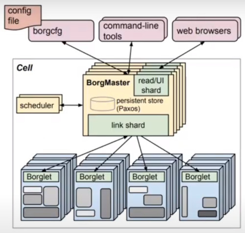

#### COMPARISON ACROSS HYPERSCALLERS
Usually you use a VM as a primitive
- in BigQuery you don't have to worry about that
- BigQuery is trully a serverless architecture relying on Borg for copute
  
We have a set of jobs for metadata
- for storage APIs, they **stream ingest**
- they storage manage, storage management tasks

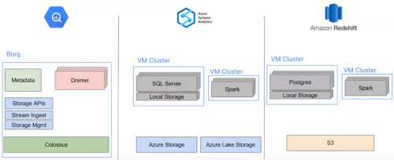

### DESIGN PRINCIPLES (II)
Disaggregation of compute, storage and memory
- on demand scaling of each resource
- on demand sharding of resources
- adapts well to **multi-tenant** usage at lower cost

Fault tolerance and restartability
- At scale assume everything is unrealiable/slow
- Query subtasks are deterministics and repeatable
- Multiple copies of same task dispatched to avoid stragglers

Compute is provided in what we call are 'slots'

virtual scheduling units
- Slots: abstract unit of compute and memory
- Maps well to Borg supporting flexible resource shapes
- Decouple customer visible resource from machines/VMs/etc

Centralized scheduling
- Global view of entire service state
- Makes best decisions for utilization, isolation, etc.

#### FLEXIBLE QUERY EXECUTION
**COORDINATOR**
- First to receive a query
- Builts execution plan (DAG of execution trees)
- Orchestrates execution with workers provided by the scheduler

**WORKERS**
- Allocated as a pool without predefined structure
- After Planning, coordinator sends workers ready-to-execute query plan (tree)


Let's say we have this query,
```
SELECT language, MAX(views) as views
  FROM 'wikipedia_benchmark.Wiki1B'
 WHERE title LIKE "G%O%"
 GROUP BY 1 ORDERa BY 2 DESC LIMIT 100
```

it gets executed in three stages
- the bottom workers would be scanning the data from distributed storage
- then go to shuffle that would provide dynamic partitioning for us
- into the next stage that would apply, GROUP BY, SORT and LIMIT
- piped into the final stage, which is doing the final sort and top k limit
  
  
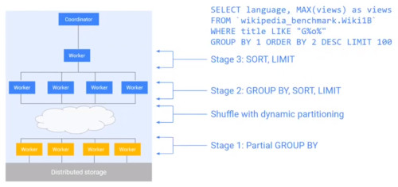

### IN MEMORY SHUFFLE
BigQuery uses a separated storage tier.
- a design decision described in the 10-best paper award for dremel
  

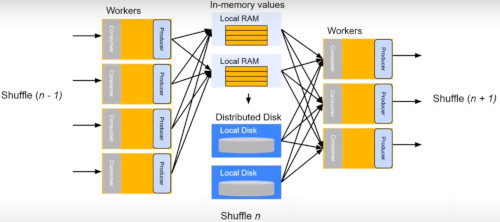

And the basis are as follows.

In Memory shuffle is not actually new.
- but coupled with compute presents bottlenecks
- it's hard to mitigate, quadratic scaling characteristics
- it leads to resource fragmentation, stranding, poor isolation

BigQuery implements in top of separate compute and storage
- disaggregated memory based shuffle
- this is RAM /disk managed separately from computer tier
- it found to reduce latency by an order of magnitude
- Enable order of magnitude larger shuffles
- Reduced resource cost by 20%

Persistence in the shuffle layer
- Checkpoint query execution state
- Allows flexibility in scheduling + execution (preemption of workers)

### DYNAMIC SCHEDULING
The Dynamic central scheduler allocates
- slots, the virtual compute unit
- workers

it's used to handle machine failures
- if a machine fails it's able to spin another one after the state is checkpointed

it allows the fair distribution of resources between queries

In this graph 
- Query 1, 2,3,4 are executed at a certain point
- the scheduler can reduce the resorces used to give arise another query
- so they call all finish roughly at the same time.

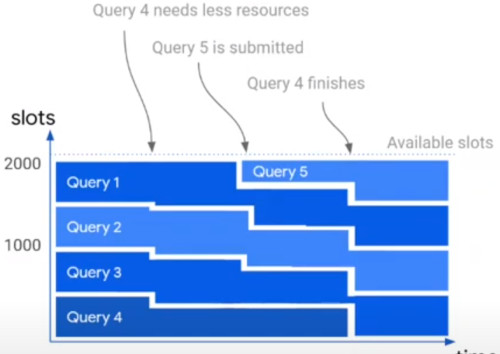

Why do you need dynamic query execution?
- it allows you for dynamic execution for optimizers

#### DYNAMIC PARTITIONING
The goal here is to Dynamically load balance and adjust parallelism while adapting to any query or data shape or size

So the planner optimizers are actually quite primitive
- we have to rely heavily on this dynamic query execution pieces for predictibility and performance

Say we have workers
- starting writing to partitions 1 and 2
- at a certain point the Query coordinator detects that there is too much data going to partition 2
- it will dynamically repartition on the fly to partition 3 and 4
- at that point workers stop writing to partition 2 and start writing to partition 3 and 4
- so data in partition 2 is repartitioned into 3 and 4

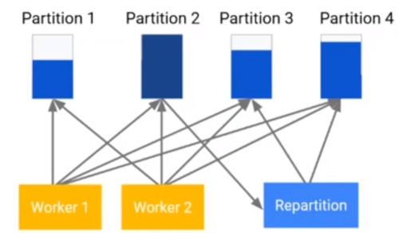

We also are going to use JOIN optimization
- A broadcast join
- one worker is getting one side of the table that is small enough to be broadcast to the other workers in the join

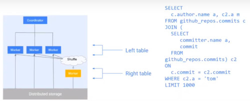

Shuffle join is when both sides of the join are large enough
- it will completely re-shuffle or re-partition to be able to execute the join
- in parallel after shuffling

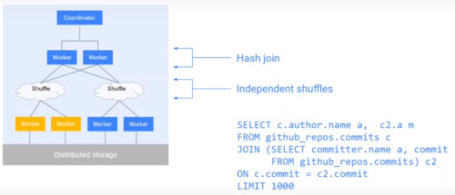

BigQuery takes advange of dynamic join processing

Start with hash join by shuffling the data on both sides
- Cancel shuffle one side finished fast and is below a broadcast size threshold
- Execute broadcast join instead (much less data transferred)

Decide the number of partitions/workers for parallel join based on input data sizes

ocassionally swap join sides in certain cases

and also there are star schema join organization
- Detect the star schema joins
- Compute and propagate constraint predicates from dimensions to fact table

#### CAPACITOR COLUMNAR FORMAT
It's the BigQuery format for read optimize

The Evaluation is embedded into the data access library
- to push compute as close to compute as possible

Partition/Predicate pruning

Vectorization

Skip indexes within file

Predicate re-ordering using heuristics
- dictionary useage
- Unique value cardinality
- Null density
- Expression complexity

#### CAPACITOR ROW REORDERING
Takes advantage of run length encoding

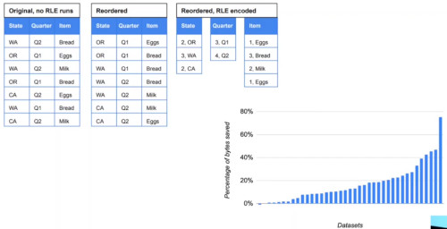

It can reorder the data behind the scene

#### CLUSTERING
Provides the ability to re-cluster the data
- if you define a table, you would be able to say
- i want to cluster the data by this column in this column

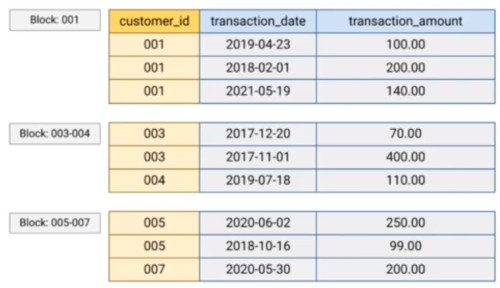

Advantages
- Data skipping
- Colocation for aggregates
- Joins over star schemas

#### BIG METADATA
There's a physical and logical metadata
- Logical (small): schema, row/column, access policies, etc
- Physical (big): file location, MVCC info, column stats, etc
- How big? paper references 10's of TB, adding tens of minutes latencies to load metadata for PB size tables

Main idea
- Treat metadata management as data management
- Organize physical metadata of each table as a set of system tables (columnar) that are derived from the original table
- Built for batch and streaming workloads

Query processing
- Defer reading of physical metadata for the tables until the actual dispatch of parallel partitions to workers
- Query planner first uses only the logical metadata to generate a query plan with constants folded and filters push down
- Query rewritten as a semi-join of the original query with metadata system table, producing list of block locators needed to answer query

#### APIS
BigQuery supports  read and write apis directly to the manage storage

So on top of Dremel which access data on colossus

we also have high throughput read and write apis in both directions
- so engines like spark, tensorflow, presto, or google dataflow can read and write data to and from storage directly
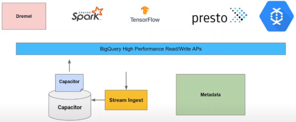

#### READ API
Multiple streams
- read disjoint set ofa rows in parallel
- Facilitates consumption from parallel processing frameworks
Column projection and filtering
- read only the data that is needed
- Query processing pushed close to data under API
Snapshot consistency
- Consistent point-in-time reads
- read as of session creation or prior snaptshots

#### WRITE API
Best in the industry stream ingest support at scale

Exactly once semantics

Stream-level and cross-stream transactions
- Stream and commit as a single transaction
- Retry on abort/failure
- Commit data across parallel streams

Schema update detection

#### EMBEDDED BI ENGINE
BI: Business intelligence
- dashboards

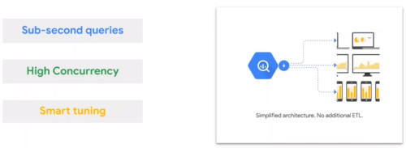

#### BIGQUERY CACHING AT MULTIPLE LAYERS

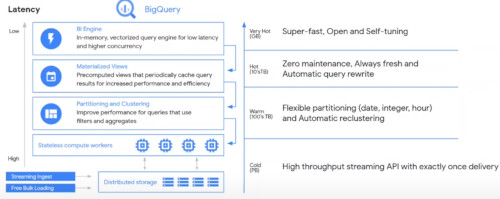

Query caching and advanced performance
- at the very base you can look at things like partitioning and clustering of the data
- being able to speed up queries

On top of that BigQuery provides materialized views
- for materializing sub queries or whole queries
- for use in query optimization

At the very top, we are able to cache data in what we call the BI engine
- in memory vectorized query engine for low latency and high concurrency

#### BI ENGINE ARCHITECTURE
You think about this as a set of stateful workers
- here is where data is cached in memory
- there's a vectorized query sitting close to data to be able to efficiently answer the queries that are memory bounded

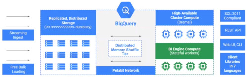

It is built on an existing BigQuery storage
- nothing is really changed there

The streaming ingest really needs to manage BI servers
- so there's a separate set of BI servers

and then you can eliminate things like ETL pipelines or complex extracts

no need to manage OLAP cubes

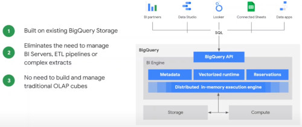

#### BIG QUERY ML
Another feature we have is big query ML
- CLASSIFICATION
  - logistic regression
  - DNN classifier (Tensorflow)
  - Boosted trees using XGBoost
  - AutoML tables
- REGRESSION
  - Linear regression
  - DNN regressor (Tensorflow)
  - Boosted trees using XGBoost
  - AutoML tables
- MODEL IMPORT/EXPORT
  - Tensorflow models for batch and online prediction
- OTHER MODELS
  - K-means clustering
  - Time series forecasting
  - Recomendation: Matrix factorization
    
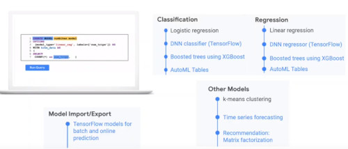


#### BIG QUERY OMNI
Is shipping within the cloud
- the control plane, able to talk to dremel, the distributed memory shuffler
- that lives on AWS itself

The setup would be customers with large data lakes on AWS

  
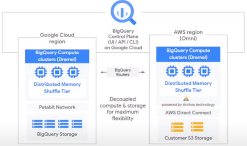


## AURORA OLTP IN THE CLOUD
Let's move on into a cloud data warehouse is architected

How some assumption change in an OLTP environment

Relational databases were not designed for the cloud
- monolithic architecture
- large failure blast radius

Databases in the cloud
- compute and storage have different lifetimes
- Instances fail/shutdown/scale up and down
- Instances added to a cluster

Compute and storage are best decoupled for scalability, availability and durability

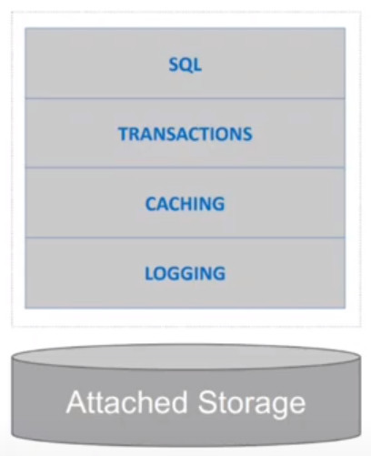

### IO FLOW
IO Flow is the major bottleneck
- databases write data twice
- first in the write ahead log, that provides the durability property
- then the data is rewritten when data is checkpointed back to storage
  
In this example
- you have a primary and a standby instance
  - The WAL is shipped to the secondary index
  - pages are checkpointed back to EBS, in this case attached cloud disk
  - underneath there's the EBS mirror
- there's a lot of IO
  

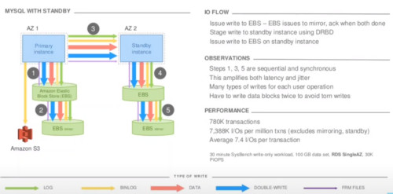

The architecture of AURORA
- is really looking at having a hosting (typically MySQL or Postgres instance)
- but really cutting out the extra need of write, optimizing the stream of IO

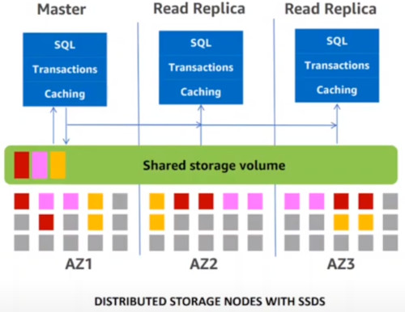

DATABASE TIER
- Writes REDO log to network
- No Chekpointing! the log is the database
- Pushes log application to storage
- Master replicates to read replicas for cache updates

STORAGE TIER
- Highly parallel, scale-out redo processing
- Data replicated 6 ways across 3 AZs
- Generates/Materialize database pages on demand
- Instant database redo recovery

4/6 WRITE QUORUM WITH LOCAL TRACKING
- AZ+1 failure tolerance
- Read quorum needed only during recovery

### AURORA READ SCALE
The advantage here is the read scale
- 

In the typicall high availability model
- log is shipped to the secundary
- data has to be rewritten
- transactions has to be reprocessed
- essentially remove this path

Just the page cache is updated on the read replicas
- these updates are physical using delta changes on top of the pages
- there's no writes on the replica
- it can read data directly from shared storage
- it needs to answer query as of some point in time
  

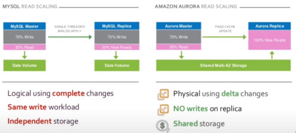

### AURORA QUORUM
AZ= availability zone

Why are 6 copies necessary

In a large fleet, failures are background noise

Need to tolerate AZ+1 failures

For 3 AZs replicate 6-ways with 2 copies per AZ
- Write quorum of 4/6
- Read quorum of 3/6 (only for repair)

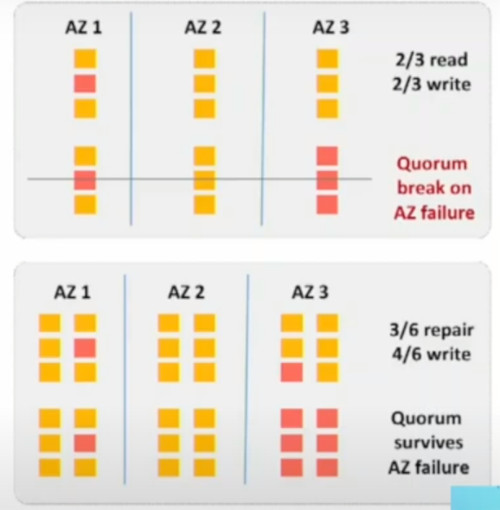

### SEGMENTED STORAGE
Storage essentially segments data into certain segments chunks

Partition volume into n segments each replicated 6 ways
- 6 replicas form  a **protection group (PG)**

What is the 'goldilocks' segment size?
- if segments are too small, then failures are more likely
- If segments are too big, then repairs take too long

Choose biggest size for 'fast enough' repair
- Aurora uses 10GiB segments
- can repair 10GB segments in ~10sec on a 10Gbps link

### QUORUM SETS FOR MEMBERSHIP CHANGES
At a certain point we have 6 replicas, all healthy.

Then at another point we have replica F that is unhealthy or in a suspect state
- you just define a new epoch and bring a new replica G
- where F and G are currently active

At a certain point in epoch 3,
- you reallize that F is no longer needed
- and start a new set G

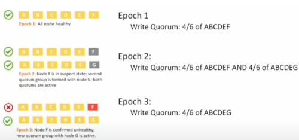

### OVERVIEW
SUMMARY:
- Manages 10GB page segments
- 10GB = right size for repair/fault tolerance
- use fault tolerance for host management/machine patching

IO FLOW
- Receive record and add in memory queue
- Persist record and ACK
- Organize records and identify gaps in logs
- Gossip with peers to fill in holes
- Coalesce log records into new data block versions
- Periodically stage log and new block versions to S3
- Periodically garbage collect old versions
- Periodically validate CRC codes on blocks

What aurora storage Node does:
- it's a replay machine
- it recieves the log records written from the primary instance
- it writes it into an incoming queue
- which is made durable at that point it ackownledges back to primary instance
- behind the scenes is doing coalescing the hot piece of the log,
- redoing on top of database pages and writting the pages back to storage for durability
- then also backing up the data for disaster recovery back to S3

OBSERVATIONS
- all steps are asynchronous
- only steps 1 and 2 are in the foreground latency path
- input queue is 46x less than MySQL (unamplified, per node)
- Favor latency-sensitive operations
- Use disk space to buffer against spikes in activity

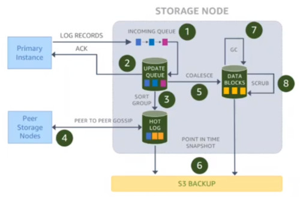

### STORAGE CONSISTENCY POINTS
