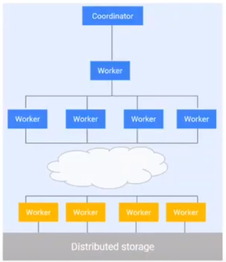

# LECTURE 24: GOOGLE BIG QUERY
- Justin Levandoski
  
## OLAP AND OLTP IN THE CLOUD
How OLTP and OLAP are done in real systems in the cloud

We are going to talk about 3 systems
- MOVEMENT TO THE CLOUD
  - BIG QUERY, which is google cloud in the warehouse
- OLAP IN THE CLOUD
  - AMAZON AURORA
- OLTP IN THE CLOUD

## THE CLOUD
Once upon a time, companies like ORACLE, TERRADATA, PIED PIPER
- The hardware was stored in bussineses or data-centers and they work fine


But clearly it's a shift now to the cloud
- customers are shipping their data and workloads
- BIG QUERY, AMAZON REDSHIFT, AWS, SYNAPSE, AZURE, SNOWFLAKE, DATABRICKS

There are multiple reasons
- Economics of Scale
- Innovation, Gravitron, TPUs, etc.
- Operations
- Security/Governance/Compliance
- Rich cloud Ecosystems
- Why should database students care?
  - Different assumptions, different architectures
  - The textbook basics will be re-written
  - An exciting era for the field

## BIG QUERY: OLAP IN THE CLOUD
Big query is
- A serverless
- highly scalable
- and cost-effective
- cloud-data warehouse

It's fully managed serverless and clusterless
- available 24/7


we really strike for protectible performance

key features
- integrated Machine learning
- easy to use SQL with hints
- petabytes-scale storage and queries, that can scale massively
- data is **encripted** and **durable**
- real time analytics on streaming data

### ARCHITECTURE
BigQuery separates Compute and storage in a unique way.
- it looks like a data warehouse from the right hand side.
  - SQL compliant
  - you can access data through REST APIs
  - you can issue queries
  - it also has web UI and CLI
  - and client libraries in several different languages


Highly available cluster for compute the components doing the query processing
- separated by storage by a **petabyte bisection bandwidth network**
- which data sits on **replicated durable storage**
- there's a **unique distributed memory shuffle tier** in between those components
  - for doing shuffles for massive queries
- also supports **streaming ingest and read** directly to storage, quite unique for BigQuery
- also **bulk load and export**

### DESIGN PRINCIPLES (I)
Storage and compute separation
- petabyte-scale
- High availability
- Serverless and multi-tenant
  
Colocation and Caching
- High performance at low cost

Integrated Hardware/Software stack
- Take advantange of hardware primitives when necessary 
- For High performance at low cost


#### QUERY GRAPH
If you set a query in BigQuery you would set up a distributed kind of query graph
- where data rest at the distributed file system
  - scanned by a set of workers
- if it requires re-shuffling, there's a shuffle tier
  - another set of workers in the next stage will process it
- The final workers in stage 3 finilizes the query and writes the results into the distributed file system
- to be able coordinate this, there's a separate coordinator
  - and a scheduler to essentially provide the resources to answer the query.
    


The life of the query starts in the coordinator who is going to plan
- and a set of resorces are provisioned

#### GOOGLE INFRASTRUCTURE
What BigQuery really is, is a set of infrastructure components built around the google's core infrastructure

The distributed storage tiers is called 'The Colossus'
- google scalable storage system
- all resources are provided by 'borg', paper 2015
  - it's also based on 'DREMEL', paper 2010
    - it's also relies on pieces of 'spanner' to store things as state
    - and the petabyte bandiwth network is based on 'jupiter' paper.
       


Borg enables us to have a trully serverless architecture at scale
- any compute or resouce allocation is up to borg
  - what set of primitives you want to use,
  - how much cpu
  - how much memory
  - some config about your package and container
- you place it for borg, and it will place a machine for you
- it would figure out exactly what you want
 


#### COMPARISON ACROSS HYPERSCALLERS
Usually you use a VM as a primitive
- in BigQuery you don't have to worry about that
- BigQuery is trully a serverless architecture relying on Borg for copute
  
We have a set of jobs for metadata
- for storage APIs, they **stream ingest**
- they storage manage, storage management tasks


### DESIGN PRINCIPLES (II)
Disaggregation of compute, storage and memory
- on demand scaling of each resource
- on demand sharding of resources
- adapts well to **multi-tenant** usage at lower cost

Fault tolerance and restartability
- At scale assume everything is unrealiable/slow
- Query subtasks are deterministics and repeatable
- Multiple copies of same task dispatched to avoid stragglers

Compute is provided in what we call are 'slots'

virtual scheduling units
- Slots: abstract unit of compute and memory
- Maps well to Borg supporting flexible resource shapes
- Decouple customer visible resource from machines/VMs/etc

Centralized scheduling
- Global view of entire service state
- Makes best decisions for utilization, isolation, etc.

#### FLEXIBLE QUERY EXECUTION
**COORDINATOR**
- First to receive a query
- Builts execution plan (DAG of execution trees)
- Orchestrates execution with workers provided by the scheduler

**WORKERS**
- Allocated as a pool without predefined structure
- After Planning, coordinator sends workers ready-to-execute query plan (tree)



Let's say we have this query,
```
SELECT language, MAX(views) as views
  FROM 'wikipedia_benchmark.Wiki1B'
 WHERE title LIKE "G%O%"
 GROUP BY 1 ORDERa BY 2 DESC LIMIT 100
```

it gets executed in three stages
- the bottom workers would be scanning the data from distributed storage
- then go to shuffle that would provide dynamic partitioning for us
- into the next stage that would apply, GROUP BY, SORT and LIMIT
- piped into the final stage, which is doing the final sort and top k limit
  
  


### IN MEMORY SHUFFLE
BigQuery uses a separated storage tier.
- a design decision described in the 10-best paper award for dremel
  


And the basis are as follows.

In Memory shuffle is not actually new.
- but coupled with compute presents bottlenecks
- it's hard to mitigate, quadratic scaling characteristics
- it leads to resource fragmentation, stranding, poor isolation

BigQuery implements in top of separate compute and storage
- disaggregated memory based shuffle
- this is RAM /disk managed separately from computer tier
- it found to reduce latency by an order of magnitude
- Enable order of magnitude larger shuffles
- Reduced resource cost by 20%

Persistence in the shuffle layer
- Checkpoint query execution state
- Allows flexibility in scheduling + execution (preemption of workers)

### DYNAMIC SCHEDULING
The Dynamic central scheduler allocates
- slots, the virtual compute unit
- workers

it's used to handle machine failures
- if a machine fails it's able to spin another one after the state is checkpointed

it allows the fair distribution of resources between queries

In this graph 
- Query 1, 2,3,4 are executed at a certain point
- the scheduler can reduce the resorces used to give arise another query
- so they call all finish roughly at the same time.


Why do you need dynamic query execution?
- it allows you for dynamic execution for optimizers

#### DYNAMIC PARTITIONING
The goal here is to Dynamically load balance and adjust parallelism while adapting to any query or data shape or size

So the planner optimizers are actually quite primitive
- we have to rely heavily on this dynamic query execution pieces for predictibility and performance

Say we have workers
- starting writing to partitions 1 and 2
- at a certain point the Query coordinator detects that there is too much data going to partition 2
- it will dynamically repartition on the fly to partition 3 and 4
- at that point workers stop writing to partition 2 and start writing to partition 3 and 4
- so data in partition 2 is repartitioned into 3 and 4


We also are going to use JOIN optimization
- A broadcast join
- one worker is getting one side of the table that is small enough to be broadcast to the other workers in the join


Shuffle join is when both sides of the join are large enough
- it will completely re-shuffle or re-partition to be able to execute the join
- in parallel after shuffling


BigQuery takes advange of dynamic join processing

Start with hash join by shuffling the data on both sides
- Cancel shuffle one side finished fast and is below a broadcast size threshold
- Execute broadcast join instead (much less data transferred)

Decide the number of partitions/workers for parallel join based on input data sizes

ocassionally swap join sides in certain cases

and also there are star schema join organization
- Detect the star schema joins
- Compute and propagate constraint predicates from dimensions to fact table
