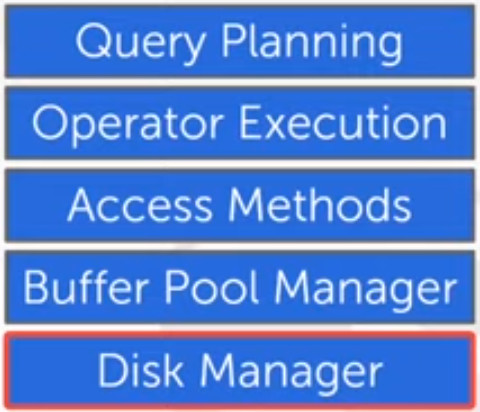

# Lecture 3

## OVERVIEW
- We now understand what a database looks like at a logical level
  - and how to write queries

- We will next learn how to build software that manages a database.

### COURSE OUTLINE
We will cover:
- Relational Databases
- Storage
- Execution
- Concurrency Control
- Recovery
- Distributed Databases
- Potpourri

Now we present the software **stack**
- The base layer is the **DISK MANAGER**
- and we build aditional layers on that.

Each of these blocks corresponds to a self-contained (modular) block of the system.
- Each of them represent an abstraction
- The **upper** levels can **interact** with the **lower** ones.

In this lecture, and the next one, we will deal with the **Disk Manager** block.

## DISK-BASED ARCHITECHTURE
The DBMS assumes that the primary storage location is on **non-volatile disk**.

The DBMS components manage the movement of data between non-volatile and volatile storage.

