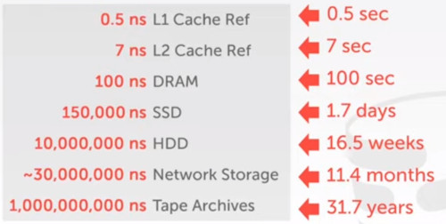
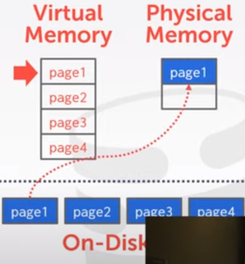

# Lecture 3

## OVERVIEW
- We now understand what a database looks like at a logical level
  - and how to write queries

- We will next learn how to build software that manages a database.

### COURSE OUTLINE
We will cover:
- Relational Databases
- Storage
- Execution
- Concurrency Control
- Recovery
- Distributed Databases
- Potpourri

Now we present the software **stack**
- The base layer is the **DISK MANAGER**
- and we build aditional layers on that.


Each of these blocks corresponds to a self-contained (modular) block of the system.
- Each of them represent an abstraction
- The **upper** levels can **interact** with the **lower** ones.


In this lecture, and the next one, we will deal with the **Disk Manager** block.

## DISK-BASED ARCHITECHTURE
The DBMS assumes that the primary storage location is on **non-volatile disk**.

The **DBMS** components **manage** the **movement** of data between **non-volatile** and **volatile** storage.


### STORAGE HIERARCHY
- The fastest storage are the **CPU Registers**, but also they are the most expensive ones.
- The **NETWORK STORAGE**, is a distributed file system like HDFS
  - Amazon S3

**VOLATILE**, you may loose your data at shutdown
- Random Access, you can access to any random data in one instruction

**NON-VOLATILE**, your data is safe if power is down
- Block Addressable, you can't access individual byte
- Sequential


### ACCEESS TIME
The CPU cache has the fastest access time.



You can actually compare the time scale with the human's second.

### SEQUENTIAL VS RANDOM ACCESS
**Random Access** on non-volatile storage is usually much **slower** than sequential access.

DMBS will want to maximize sequential access.
- Reduce the number of writes to random pages
- so data is stored ins contiguous blocks
- Allocating multiple pages at the same time is called an **extent**

### SYSTEM DESIGN GOALS
- Allow the DBMS to manage databases that **exceed** the amount of **memory available**.
- Reading and Writing to disk is expensive,
  - avoid **Stalls**
- Random Access on disk is usually much slower than sequential access, so the DBMS will want to maximize sequential access.

### DISK ORIENTED DBMS
So at the lower level, we have the disk
- And then we are going to represent this blocks or pages.


**IN-MEMORY**, we are going to have a Buffer Pool.


Also we have an **EXECUTION ENGINE** (or query engine)

---

So the **Execution Engine** is going to make our **request** to our **BUFFER POOL**,
- say hey, **i want to read page 2**

**Page 2** is **not in-memory**, 
1. so you have to look the **PAGE DIRECTORY** from disk to memory


2. Now i can find where is the page 2
- And send it to the Execution Engine to interpret it
  


So what we are focusing from now on is how to get from disk to memory.
- This lecture and the next one, we will focus on what data files goes to disk
- Then we will discuss the Buffer pool
- And finally we will discuss how to actually represent the directory.
  


## WHY NOT USE OS (I)
In OS, how would you make appear that you have **more memory** than you actually do.
- Virtual Memory.

So why would i let my DBMS **manage** all this **virtual memory** instead of letting the **OS** actually do it?

One can use **Memory Mapping** to store contents of a file into a process' address space
- syscall 'mmap'
- takes a **file** on disk, you tell the OS to **map** the file pages **into** the address space for my process.
  - Now i can read and write to those memory locations
  - and if it's not in memory the OS brings it in. (you can write to it)
  - then i can do an Nsync and write it back to disk.
- Essentially you are giving up control of the movement of memory to the operative system

On a high level it looks like this.
- we have a bunch of pages of disk-file
- we have a physical memory
- and the os has its own virtual page memory
  


The application says, hey i want to read **page 1**.
- it looks into the **virtual memory**
- we've got a vault and say this thing is not backed by physical memory
- we have to fetch it out from disk



And now update, our page table to now point to that memory location.


We then repeat the process for **page 3**


And now want **Page 2**, but there's a problem.
- there's no free physical space to put this particular page in.
- so i have to make a decision of which of these pages to remove.

And while i'm doing this, i eventually have the potential to stall the database system 
- i have to stall the thread who requested that old page
- install my new page

There are tricks to prevent to read something that is not in memory
- i have to mitigate the stalls

The OS doesn't know exactly what we are doing,
- it just sees a bunch of reads and writes into two pages.
- doesn't understand the query or the semantics

### WHY NOT USE OS (II)
What if we allow multiple threads to access the **mmap** file to hide page faults stalls?
- This works good enough for read-only access
- it's complicated when there are multiple writers

If we start writing things, it becomes problematic
- Now the **OS** doesn't know that certain pages have to be **flushed** out of disk, **before** other **pages** do.
- we talk about this when we talk about **logging** and **concurrency control**

The OS just says i need to write this out, go ahead and write that down.
- doesn't know if that's an okay thing to do

### WHY NOT USE OS (III)
You can get around this by giving out some hints.
**madvice**, Tell the OS how do you expect to read certain pages. 
- __Sequential__ or __Random access__
- How to prevent pages from the beginning to page out.
**mlock**, Tell the OS that memory ranges cannot be paged out.
- prevent pages to be getting written 
**msync**, Tell the OS to flush memory ranges out of disk
- Just flush

So even memory map is something we want to use in our system,
- many people question why should we have to do all this buffer pool stuff
- so you don't want to do this or you would have performance bottlenecks and correctness problems.

Systems that uses MMAP
- monetdb
- LMDB
- RAVENDB
- levelDB
- elasticsearch
Partially use of MMAP
- mongoDB
- MEMSQL
- SQLite

If i die, in my memorial just write 'andy hated mmap'

### WHY NOT USE OS (IV)
DBMS almost always wants to control things.
- Flushing dirty pages to disk in the right order
- Specialized prefetching
- Buffer replacement policy
- Thread/process scheduling

The OS is not your friend.

## DATABASE STORAGE
**Problem 1**, How the DBMS __represents__ the database in files on disk.
- Today
**Problem 2**, How the DBMS __manages__ its memory and move data from disk.
- Next lecture

## TODAY'S AGENDA
- FILE STORAGE
- PAGE LAYOUT
- TUPLE LAYOUT

How to **organize** the database as a **sequence of pages**?
How we actually are going to **store** inside these files?
What do the **tuples** actually **look like** inside those pages.

## FILE STORAGE
The DBMS stores a Database as one or more files in the disk.
- Like SQLite (1 file)
- postgreSQL (many files as it doesn't hit the file size limit of the OS)
- the file is unintelligible
- but nonetheless, it is saved in the OS format, ext3/ext4/NTFS. whatever OS writting system provides us.
  
Early systems in 1980 used custom filesystems on **raw** storage.
- So no NTFS, no EXT3/4... the file format was proprietary
- some enterprise DBMS still support this
- you can get as much as a 10% of improvement, but the maintenance cost rises as a rocket.

### STORAGE MANAGER
The storage Manager is responsiblea for maintaining a database's file.
- some do their own scheduling for reads and writes to improve spatial and temporal locality of pages.

Within these files, we are going to organize them as a collection of pages.
- Tracks data read/written to pages.
- Tracks the available space.

#### DATABASE PAGES (I)
A page is a **Fixed size** block of data.
- it can contain **tuples**, **meta-data**, **indexes**, **log records**.
- Most systems do **not mix** page **types**.
- Some systems require a page to be **self-contained**.

Each page is given a **unique identifier**, a page ID
- The DBMS uses an **indirection layer** to **map page ids** to **physical locations** at some offset.

If i lose one page, it doesn't affect any of the other pages.

#### DATABASE PAGES (II)
There are 3 different types of pages in DBMS
- Hardware Page (~3KB)
- OS Page (~4KB)
- **Database page (~512B-16kB)**

By hardware page, we mean at what level the device can guarantee a 'failsafe write'.


The main thing we are going to care about.
- the **harbor page** is the **lowest level** what we do **atomic writes**.
- typically 4kb

EXAMPLE,
- So if you are trying to write 16KB and the system crash in the middle of the operation.
- You might have 8 KB right.

## PAGE STORAGE ARCHITECTURE
Different DBMS manage pages in files on disk in different ways.
- **Heap File Organization** (most common one)
- Sequential/Sorted File Organization
- Hashing File Organization

At this point in the hierarchy we don't need to know anything about what is inside of the pages.

### DATABASE HEAP FILE
A **heap file** is an **unordered collection** of pages where **tuples** that are **stored** in random order.
- CREATE
- GET
- WRITE
- DELETE PAGE
- Must support also iterate over all pages

Need Meta-data to keep track of what pages exists and which ones have free space.

Two ways to represent a heap file.
- Linked list (dumb way, nobodoy uses it)
- Page Directory

Within my file i have a bunch of pages,
- where does this pages exists and whether they have free space or not.

#### HEAP FILE: LINKED LIST
Maintain a **HEADER PAGE** at the beginning of the file that stores **two pointers**.
- HEAD of the free page list.
- HEAD of the data page list.

Each page keeps track of number of free slots in itself


So again, this is a linked list.

It doesn't matter where those pages are stored, whether they're contiguous or not.

And because we need to go possible iterate in reverse order, we need pointers in the way back as well


If it's ordered you might search faster.

well this is a bad idea... going through the entire document for searching your data...


#### HEAP FILE: PAGE DIRECTORY
So we have a special **page directory** now, 
- in the Header of our File
- that's going to maintain the mapping from **Page IDs** to the location of data pages.


We can also maintain a meta-data in this directory.
- so track free space in a particular page

So now when i go to insert some data, i don't have to scan that list.
- i just look up the directory file and get everything that i need.


The DBMS has to make sure that the directory pages are in sync with the data pages.

My hardware can't actually guarantee that i can't write two pages at exactly the same time..
- so let's say that i delete a bunch of data here
- and i want to update my page directory, saying the new amount of free space.
- i write some stuff but **before i write** in down to my directory i **crash**.
- so i read this page is empty/full, but it was actually not.

So later on we will talk about a bunch of mechanisms.
- how to maintain a log
- write some special files so if we crash we would know how to recover from that.

I think this is implemented as a hash table.

Each page is exactly the same size.


-> So why different systems uses differnts pages?
- There are trade offs,
- internally, i have to have this page directory __in memory__.
- but now if i want to represent a larger amount of data with one page ID.
- then that size of that table goes down.

Think of it as the TLB, translation lookaside buffer from a CPU,
- if i'm trying to match all bunch of pages, but my page tables gets really large
- i'm gonna have cache misses.


Also you can put checksums to verify for corrupted pages.

## PAGE HEADER
Every page contains a __header__ of metadata about the page's content
- page size
- checksum
- DBMS version
- Transaction Visibility
- Compression information

Some systems require pages to be self-contained (e.g. Oracle)


### PAGE LAYOUT
well for any page, we can represent data in two different ways.
- Tuple oriented
- Log oriented

so what does it look like when we look inside the page.


#### TUPLE STORAGE
How to store tuples in a page?

Strawman Idea. 
- Keep track of the number of tuples in a page, and then just append a new tuple to the end.
- so you know quickly how many tuples have been already written


So this is a bad idea, why?
- if you delete a tuple, you have to move everything up.
- well, not necessary. You can keep the blank space... but you tuple counter will get mad.
  - so you could scan the document to find the first empty space
    


Instead what you do is

#### SLOTTED PAGES
The slots array map 'slots' to the tuples starting position offsets.
- The header, keeps track of:
  - The number of used slots
  - The offset of the starting location of the last slot used.
  - Also, it keeps tracks of basic meta-data: Checksums, access time
 


In this scenario, tuples can be fixed value, or variable-length.

The **slot array** is a mapping layer from a particular **slot** to some **offset** in the **page**.
- so now we can move the tuples around.
  


The **slot array** is going to grow from the **beginning** to the **end**.
And the **data** is going to grow from the **end** to the **beginning**.
- At some point we can't store any new information

We can do some 'vacuum' or 'compaction' or 'defragmentation'
- scan through and reorganize

**Question, how does information entropy changes as you write/delete data? defragmentation gives you minimal entropy**

### RECORD IDS
The **DBMS** way we identify tuples is through these **RECORD IDS**
- each tuple is assigned a unique record id
  - Most common are: **PAGE_ID** and **OFFSET/SLOT**
  - can also contain file location info.
- An application **cannot** rely on these ids to mean anything.

Other parts of the system like
- indexes
- log records
are going to address tuples, through these record Ids

Example.
Give me the professor record named Andy.
- I look in the index on the name
- something says, 'there's a professor named Andy'
- he has a record id of page 123
- slot 1

The advantage of this is
- if i start moving data around
- either moving the page around
- or moving within the page itself
- The index and all the stuff doesn't have to being updated

Systems metadata
- Postgres, has 4 bytes (actually 10 bits for extra metadata)
- SQLite has 8 bytes

## EXAMPLE
Postgres uses CTID to represent the physical location of the data.

```
# postgres
CREATE TABLE r (id INT PRIMARY KEY, val VARCHAR(6) );

INSERT INTO r VALUES(101, 'aaa'), (102,'bbb'), (103, 'ccc');

SELECT * FROM r;
 id | val
----+----
101 | aaa
102 | bbb
103 | ccc

SELECT r.ctid, r.* FROM r;
 ctid | id  | val
------+-----+------
(0,1) | 101 | aaa
(0,2) | 102 | bbb
(0,3) | 103 | ccc
```
So this is a pair, who has the Page ID and the offset.

Now let's delete the second row.
```
DELETE FROM R WHERE id=102;

SELECT r.ctid, r.* FROM r;
 ctid | id  | val
------+-----+------
(0,1) | 101 | aaa
(0,3) | 103 | ccc
```
Now i insert a new tuple.
- it goes not into slot 2, but into slot 4
```
INSERT INTO R VALUES (104, 'xxx');

SELECT r.ctid, r.* FROM r;
 ctid | id  | val
------+-----+------
(0,1) | 101 | aaa
(0,3) | 103 | ccc
(0,4) | 104 | xxx
```
Postgres has this 'VACUUM' as a garbage collection.
```
VACUUM FULL;
```

The same example in SQLite
```
CREATE TABLE r (id INT PRIMARY KEY, val VARCHAR(6) );

INSERT INTO r VALUES(101, 'aaa'), (102,'bbb'), (103, 'ccc');

SELECT sys.fn_PhysLocFormatter(%%physloc%%) AS [File:Page:Slot], r.* FROM r;
+----------------+-----+------+
| File:Page:Slot | id  | val |
+----------------+-----+------+
|   (1:74608:0)  | 101 | aaa |
|   (1:74608:1)  | 102 | bbb |
|   (1:74608:2)  | 103 | ccc |
+----------------+-----+------+

DELETE FROM r WHERE id=102;
SELECT sys.fn_PhysLocFormatter(%%physloc%%) AS [File:Page:Slot], r.* FROM r;
+----------------+-----+------+
| File:Page:Slot | id  | val |
+----------------+-----+------+
|   (1:74608:0)  | 101 | aaa |
|   (1:74608:2)  | 103 | ccc |
+----------------+-----+------+
INSERT INTO r a VALUES(104, 'xxx');
SELECT sys.fn_PhysLocFormatter(%%physloc%%) AS [File:Page:Slot], r.* FROM r;
+----------------+-----+------+
| File:Page:Slot | id  | val |
+----------------+-----+------+
|   (1:74608:0)  | 101 | aaa |
|   (1:74608:1)  | 103 | ccc |
|   (1:74608:2)  | 104 | xxx |
+----------------+-----+------+
```
So in SQLite, when you update the page, if you have free space it compacts it.


Same example in Oracle
- oracle uses rowid
```
CREATE TABLE r (id INT PRIMARY KEY, val VARCHAR(6) );
INSERT INTO r VALUES (101, 'aaa');
INSERT INTO r VALUES (102, 'bbb');
INSERT INTO r VALUES (103, 'ccc');

SELECT rowid, r.* FROM r;
ROWID                ID    VAL
------------------- ----- -----
AAAg2SAABAAAA16pAAA  101   aaa
AAAg2SAABAAAA16pAAB  102   bbb
AAAg2SAABAAAA16pAAC  103   ccc

DELETE FROM r WHERE id=102;
ROWID                OBJ ID   FILENUM   BLOCKNUM   ROWSLOT   ID   VAL
------------------- -------- --------- ---------- --------- ---- -----
AAAg2SAABAAAA16pAAA  134546     1       155305        0     101   aaa
AAAg2SAABAAAA16pAAC  134546     1       155305        2     103   ccc

INSERT INTO r VALUES (104, 'xxx');
ROWID                OBJ ID   FILENUM   BLOCKNUM   ROWSLOT   ID   VAL
------------------- -------- --------- ---------- --------- ---- -----
AAAg2SAABAAAA16pAAA  134546     1       155305        0     101   aaa
AAAg2SAABAAAA16pAAC  134546     1       155305        2     103   ccc
AAAg2SAABAAAA16pAAD  134546     1       155305        3     103   ccc
```
So ORACLE doens't compact the page after update.

Why do they expose this into the API to the user?
- people are paid a ton for this piece of software, so companies decides to do that way.
```
# postgres
SELECT r.ctid, r.* FROM r WHERE ctid = '(0,1)';
```
You can actually do this, but its not relieable all

Also you cannot name a column table with the 'ctid'
```
CREATE TABLE aaa (id INT, ctid INT);
ERROR ctid conflicts with a system col id.
```


## TUPLE LAYOUT
A tuple is sequence of bytes.
- its the job of DBMS to interpet those bytes into attributes types and values.

### TUPLE HEADER
It looks like this:
- Each tuple is prefixed with a header that contains meta data about it.
- Visibility info (concurrency control)
- Bit Map for null values


We don't need to store meta-data about the schema
- The types for example are stored within the page or within a catalog of pages.

You have to this in JSON databases or schemas databases like MongoDB,
- because every single tuple could be different.
- so you have to store the metadata of what's actually inside.

### TUPLE DATA
**Attributes** are typically **stored** in the **order** that you specify them when you **create** the table.


In memory systems you want to be cache efficient, 
- you might want to order to be word aligned.

### DENORMALIZED TUPLE DATA
Last thing we are going to talk is about:
- STORING DATA from different TABLES inside the SAME PAGE.

Most systems don't do this
- break self-cointainment
- We don't want different meta-data from different tables

Where it does show up is when we **denormalize** tables, or **prejoin** tables.
- We are not talking about __normal forms__
- or __functional dependencies__ in this class

**Normalization** is how do we **split** our **database** across different **tables**
- and this naturally happens when you have foreings keys (artists and albums)
 


There're some cases where we actually want to 
- embed one table inside another.

If you want to avoid the overhead it may be doing a join.
- so you might want to inline all albums and artists in the same tuple.

In that case we could have data packed into 2 different tables beside the same page


Normally i would store my tuples like this:


But if most of the time i want to join these tables together.
So maybe what i want to do is to embed on table inside the other.


This is called **Denormalization**. (i think about of it as a pre-joining)


Can physically **denormalize** related tuples and store them together in the same page.
- Potentially reduces the amount of I/O for common workload patterns
- Can make updates more expensive


Old Idea
- R IBM 1970 uses (but then abandon it as it becomes so hard to maintain)
- Several NoSQL DBMS do this without calling it physical denormalization.

Is found in:
- Google's Cloud Spanner (proto bufs)
- arkaban (had done this automatically)
  - they got bought by foundation BB then bought by apple
  - so this not exists anymore
- mongoDB,
  - when you define a JSON document you can pre-join a pack in with related attributes within the JSON document itself.
 
## CONCLUSION
Database is organized in pages
Different ways to track pages
Different ways to store pages
Different ways to store tuples

Next class:
- Value representation
  - going inside the byte tuples
- Storage Models
  - how we organize tuples within a table itself


