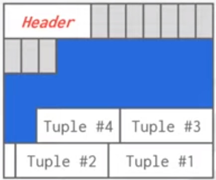
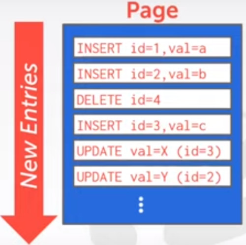
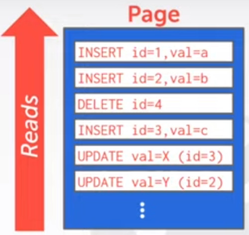
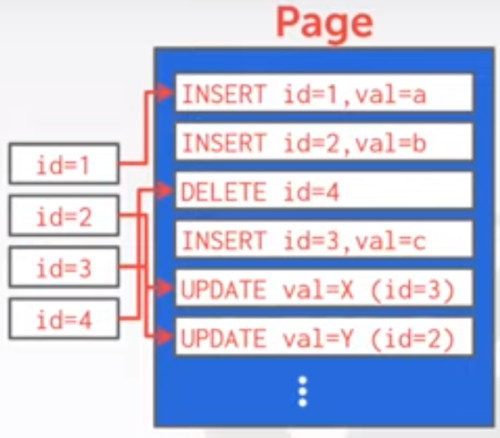
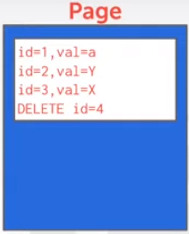
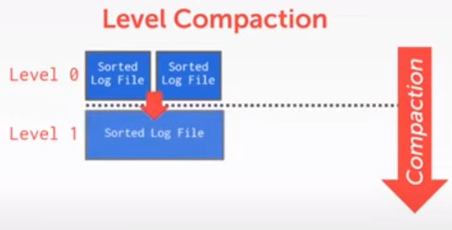
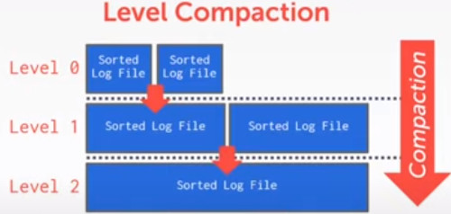
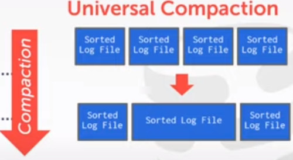

# Lecture 4

## DISK ORIENTED ARCHITECTURE
We assume the DBMS has its primary storage is on a non-volatile hard disk.

The DBMS component manage the movement of data between non-volatile and volatile storage.
- instead of letting the OS handle this for us.

The idea of slotted pages where you are going to map individual tuples in a page to those slots.
- tuples and slots grows against each others
- tuples can be of variable length
  

An alternative Storage Approach of the slotted array is log structured file organization

### LOG STRUCTURED FILE ORGANIZATION
So rather than storing the tuples directly in the pages,
- the DBMS is only going to store **log records**

By Log Records, we mean:
- **logs** of **what data** we are inserting
- and How we are **updating** the data in the system.

So every time we insert a new tuple,
- we are going to store that as a log record in a page.
- If we want to delete a tuple, all we do is we mark that tuple and all the page is deleted.
- And if we want to update something, we just add a log record to the page that specifies which is the data value we updated.

So we are going to have a page,
- and we're going to go through and start appending these new entries as we make changes to our data.

So why this is better than the slotted version?
- This is really **fast** to **write**. You don't have to search your tuples, you just append a new change.
- It's also great for Disk I/O, in this case we get a better sequential performance.

To read a record, what we have to do is:
- to **scan** this log **backwards** in order to recreate the tuple we want to query.

So in order to record id=2, we get the last update and keep forming the complete attribute table.

So **Write is fast**, **read is slow**

We can do different optimizations, 
- we can build an index, that would allow us jump into the logs to find the different logs records that apply to each of the tuples.
- so we don't have to do a full scan into the records.

For example, we want to find all records that apply 'id=2'
-it's ok, but now you have to have this additional data structure, where you are maintaining this offsets.

Scan Forward vs scan Backwards,
- If you scan forwards you have to scan the entire document.
- But if you scan backwards you stop the moment you find the INSERT clause.

The other option to build indexes, may be to **COMPACT THE LOG**.
- you can do this periodically
- you may want to lock the page so noone can do anything concurrently

System that takes this approach are:
- Apache HBASE
- Cassandra
- google levelDB
- facebook RocksDB (they ripped the mmap from levelDB)

### LOG STRUCTURED COMPACTION
Compaction coalesces (squash together) larger log files into smaller files 
- by removing unnecesary records.

It is done in a sequence of levels.
- Level 0, we keep writing files until both pages get filled up.

over time we want to perform a periodic compaction.
- So we squash them up into the next level

We keep repeating this process, compacting the files into smaller single files.

There's an alternative, called **UNIVERSAL COMPACTION**
- where you choose two adjacents blocks and merge them together
  

Instead of merging top-down, this is merging in an adjacent fashion.

Used in facebook's rockdb

## TODAY'S AGENDA
- DATA REPRESENTATION, at the level of the tuple
- SYSTEM CATALOGS, how does the DBMS store information the schema, relations
- STORAGE MODELS, a talk about high level storage alternativs

### TUPLE REPRESENTATION
A tuple is esentially a **sequence of bytes**
- it's the job of DBMS to interpret those bytes into attributes types and values.

The DBMS's catalog contains the schema information about tables that the system uses to figure out the tuple's layout.

The various pieces of the DBMS are going to tell us how to extract individual data values from the sequence of bytes.

