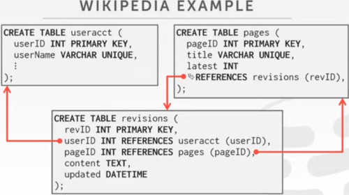

# Lecture 4

## DISK ORIENTED ARCHITECTURE
We assume the DBMS has its primary storage is on a non-volatile hard disk.

The DBMS component manage the movement of data between non-volatile and volatile storage.
- instead of letting the OS handle this for us.

The idea of slotted pages where you are going to map individual tuples in a page to those slots.
- tuples and slots grows against each others
- tuples can be of variable length
  

An alternative Storage Approach of the slotted array is log structured file organization

### LOG STRUCTURED FILE ORGANIZATION
So rather than storing the tuples directly in the pages,
- the DBMS is only going to store **log records**

By Log Records, we mean:
- **logs** of **what data** we are inserting
- and How we are **updating** the data in the system.

So every time we insert a new tuple,
- we are going to store that as a log record in a page.
- If we want to delete a tuple, all we do is we mark that tuple and all the page is deleted.
- And if we want to update something, we just add a log record to the page that specifies which is the data value we updated.

So we are going to have a page,
- and we're going to go through and start appending these new entries as we make changes to our data.

So why this is better than the slotted version?
- This is really **fast** to **write**. You don't have to search your tuples, you just append a new change.
- It's also great for Disk I/O, in this case we get a better sequential performance.

To read a record, what we have to do is:
- to **scan** this log **backwards** in order to recreate the tuple we want to query.

So in order to record id=2, we get the last update and keep forming the complete attribute table.

So **Write is fast**, **read is slow**

We can do different optimizations, 
- we can build an index, that would allow us jump into the logs to find the different logs records that apply to each of the tuples.
- so we don't have to do a full scan into the records.

For example, we want to find all records that apply 'id=2'
-it's ok, but now you have to have this additional data structure, where you are maintaining this offsets.

Scan Forward vs scan Backwards,
- If you scan forwards you have to scan the entire document.
- But if you scan backwards you stop the moment you find the INSERT clause.

The other option to build indexes, may be to **COMPACT THE LOG**.
- you can do this periodically
- you may want to lock the page so noone can do anything concurrently

System that takes this approach are:
- Apache HBASE
- Cassandra
- google levelDB
- facebook RocksDB (they ripped the mmap from levelDB)

### LOG STRUCTURED COMPACTION
Compaction coalesces (squash together) larger log files into smaller files 
- by removing unnecesary records.

It is done in a sequence of levels.
- Level 0, we keep writing files until both pages get filled up.

over time we want to perform a periodic compaction.
- So we squash them up into the next level

We keep repeating this process, compacting the files into smaller single files.

There's an alternative, called **UNIVERSAL COMPACTION**
- where you choose two adjacents blocks and merge them together
  

Instead of merging top-down, this is merging in an adjacent fashion.

Used in facebook's rockdb

## TODAY'S AGENDA
- DATA REPRESENTATION, at the level of the tuple
- SYSTEM CATALOGS, how does the DBMS store information the schema, relations
- STORAGE MODELS, a talk about high level storage alternativs

### TUPLE REPRESENTATION
A tuple is esentially a **sequence of bytes**
- it's the job of DBMS to interpret those bytes into attributes types and values.

The DBMS's catalog contains the schema information about tables that the system uses to figure out the tuple's layout.

The various pieces of the DBMS are going to tell us how to extract individual data values from the sequence of bytes.

## DATA REPRESENTATION
Those one are the typical datatypes, at different types you may expect working with.

INTEGER / BIGINT / SMALLINT / TINYINT
- C/C++ Representation
FLOAT / REAL vs NUMERIC / DECIMAL
- IEEE-754 standard / Fixed point decimals
VARCHAR / VARBINARY / TEXT / BLOB
- Header with length, followed by  data bytes
TIME / DATE / TIMESTAMP
- 32/64 bit integer of (micro) seconds since Unix epoch

### VARIABLE PRECISION NUMBERS
Inexact, uses the native c/c++ types.
- FLOAT, REAL / DOUBLE

Store directly as specified by IEEE-754

Typically faster than arbitrary precision numbers but may have rounding errors

### FIXED PRECISION NUMBERS
Numeric Data types with potentially arbitrary precision and scale. Used when rounding errors are unaceptable.
- NUMERIC / DECIMAL
- we guarantee specific precision.
  
There are many different implementations.
- Store in an exact, variable-length binary representation with additional meta-data
- Can be less expensive if you give up arbitrary precision

Example, Postgres: Numeric.
- ndigits, how many precision digits
- weight, is where is the decimal point given your array
- scale, is by how much your weighted array should be multiplied
- sign, could positive, negative or NaN
- *digits, its a char array.
  

This is more expensive than using simple float values.
- they are fast, and there're dedicated hardware.

Example, MySQL: Numeric
- intg, number of digits before the decimal point.
- frac, number of digits adter the decimal point.
- len, number of bytes
- sign, positive/negative
- buf, int32 array
  

Note that the buffer here is int32

### LARGE VALUES
Most DBMS don't allow a tuple to exceed the size of a single page.
- what if a single tuple exceeds a single page?
- a long string for example

To store values that are larger than a page, the DBMS uses separate **OVERFLOW** storage pages.
In this case we pick the overflowed value, to point to a **overflowed page**.
- it can also span into multiple pages
  

It takes different names in different systems
- postgres: TOAST (>2KB)
- MySQL: Overflow(>0.5 size of page)
- SQL server: Overflow (>size of page)

#### LARGE VALUES: EXTERNAL STORAGE
An alternative way of handling these large objects is
- store externally to the DBMS

They are treated as a **BLOB** type.
- Oracle: BFILE data type
- Microsoft: FILESTREAM data type

The DBMS **cannot manipulate the contents of an external file**.
- No durability protections, if the file dissapears / changes directory the DBMS cannot recover from that.
- No Transactions protections, if other's is trying to modify this file. there's no guarantee of inconsistences.

External files are for media, like videos, images, music.
- it doesn't fit into the datamodel other than an attribute

PAPER:
- To BLOB or Not To BLOB. Large Database Storage in a Database System

## SYSTEM CATALOGS (I)
A DBMS stores meta-data about databases in its internal catalogs, 
- how to encode and decode tuples
- Tables, columns, indexes, views
- Users, Permissions
- Internal statistics

Almost every DBMS stores the database's catalog inside itself. (i.e. as tables)
- wrap object abstraction around tuples
- Specialized code for 'bootstrapping' catalog files

### SYSTEM CATALOGS (II)
you can **query** the DBMS internal **INFORMATION_SCHEMA** catalog to get information about the database
- ANSI standard set of read-only views that provide info about all the tables, views, columns and procedures in the database.

DBMS also have non-standard shortcuts to retrieve this information

### ACCESSING TABLE SCHEMA
For listing all tables in the current database

For listing all tables in the student table

## DATABASE WORLOADS
The different types of database workloads are as follow:

**ONLINE TRANSACTION PROCESSING (OLTP)**
- Fast **SHORT RUNNING** Operations that only read/update a small amount of data each time
- i.e. reading your bank account, deposit, etc... it's a small transaction.
  
**ONLINE ANALYTICAL PROCESSING (OLAP)**
- Complex queries that read a lot of data to compute aggregates
- Analytical tables, requiring to scan a lot of tables, they produce aggregates, joins
- used in business intelligenca, decision support
- they are 'ad-hoc' not usually repeated queries

  
**HYBRID TRANSACTION + ANALYTICAL PROCESSING (HTAP)**
- OLTP + OLAP together on the same database instance

The spectrum that we have is:
- in the x-axis is the workload focus on writting/reading
- in the y-axis we have the operation complexity.
  - simple: insert/delete new values
  - complex: joins, complex aggregation, windowing functions
    

If you order a product (OLTP) you want to write fast.
The analytical approach usually performs multiple reads from many tables. (i.e. for computing aggregates)

### BIFURCATED ENVIRONMENT
The way it usually looks in practice is.
- a set up of two separated environments

In one side, you have multiple **OLTP silos**, all these databases accepting concurrent workloads
In the other end, you have a really big **OLAP warehouse** where you dump all data for analysis.

In the middle we have this process called **EXTRACT TRANSFORM LOAD (ETL)**, where we take all this data from different silos,
maybe formatting differently, maybe there are redundant data (two students stored in multiple databases by different names 'andy and andrew')

Based on the result that we get from the warehouse, we may take action in the data silos.
- what products are the most sold? recommend more of that

This idea is called **HTAP** hybrid transactional and analytical processing

### OBSERVATION
Why it's important those types of workloads?
- The relational model doesn't specify that we have to store all of a tuple's attributes together in a single page.
- This may not actually be the best layout for some workloads

The notion of **row**, different from **tuple** or **record** is 
- The row storage layout, assumes that all different attributes in a tuple are stored consecutively

### WIKIPEDIA EXAMPLE
SCHEMA
- We have an **user account**, with userID and name
- we have the different **pages**, with pageID, title and revision history (who has edited the page)
- and we have the **revision** data, with revID, userID, pageID, content and date
  

There's one reference that's an optimization wikipedia does 
- to get the most recent version for a page

#### WIKIPEDIA EXAMPLE: OLTP 
On-Line Transaction Processing
- Simple queries that read/update a small amount of data that is related to a single entity in the database.

This is usually the kind of application that people build first
- Simple aspects of the application.

#### WIKIPEDIA EXAMPLE: OLAP
On the other side, when your app grows, 
- you might want to do some analytical insighta

These example searches the amount of people with an '.gov' account
- there were a Wikipedia scandal of governaments erasing their embarrassing archive

## DATA STORAGE MODELS
DBMS can store tuples in different ways that are better for OLTP or OLAP
- we have been assuming the **n-ary storage model** (aka. row storage) so far.

### N-ARY STORAGE MODEL (NSM)
Ideal for OLTP workloads where queries tend to operate only on an individual entity and insert heavy workloads.

So we have the Header, and then the contiguously arranged attributes in a page.

And if we want to execute a query.
- we send the query into the system
- it's going to hit an **INDEX**,
  - like a page directory where the page directory maps pages ids to physical locations
  - The index is mapping values (i.e. username or something) to a **page id** and **record id** pair.
  

Well that was the OLTP side, what if we get all of those logins from '.gov' hosts.
- we have to scall through all the pages,
- we have to perform first the filtering 'U.hostname'

- The next thing is to look for the U.lastlogin piece
- to do the extract and the count part

So what's going to happen with all of the other columns that we don't touch?

### NSM SUMMARIZE
**ADVANTAGES**
- Fast inserts, updates, deletes
- Good for queries that need the entire tuple

**DISADVANTAGES**
- **Not good** for scanning large portions of the table and/or a **subset of attributes**

### DECOMPOSITION STORAGE MODEL (DSM)
The DBMS stores the values of a **single attribute** for **all tuples** contiguously in **a page**.
- also known as a 'column store'

Ideal for OLAP workloads where read-only queries perform large scans over a subset of the table's attributes

For example searching for the host-name, we get all of those values in one page,
we are going to do the same for the others attributes.

So now, we just need the logname and the hostname to solve our query.

#### TUPLE IDENTIFICATION
How do we reconstruct the record?

CHOICE 1: Fixed length Offsets
- each value is the same length for an attribute

CHOICE 2: Embedded Tuple Ids
- Each value is stored with its tuple id in a column

----
The key idea is that if you split things into columns, 
- you can use these positional offsets to jump directly
- to the offsets you need to reconstruct the tuples

If you have variable length strings,
- you can pad out strings to a particular length
- if you have a lot of repetition, you migth use a dictionary code (compression techinique)

----

The other option is to store the ids together with the value.
- in the picture everything is ordered, but any column could be sorted out differently

it may allow you to apply a better compression.
- i.e. rather to store dates, you can store deltas of time.

#### DSM: SUMMARY
**ADVANTAGES**,
- Reduces the amount of wasted I/O because the DBMS only reads the data that it needs
- Better Query processing and data compression

**DISADVANTAGES**,
- Slow Point queries, inserts, updates and deletes
- because of tuple splitting/stitching

#### DSM: HISTORY
1970s - CANTOR DBMS
1980s - DSM PROPOSAL
1990s - SybaseIQ (in-memory only)
2000s - Vertica, VectorWise, MonetDB
2010s - Everyone

## CONCLUSION
The storage manager is not independant of the DBMS

It is important to choose the right storage model for the target workload
- OLTP = ROW STORE
- OLAP = COL STORE

Today we have dealt with:
- How the DBMS represents the database in files on disk
  
Next class we will deal with the other problem.
- How the DBMS manages its memory and move data from disk

