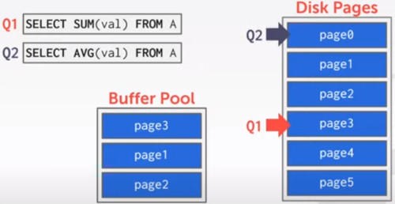
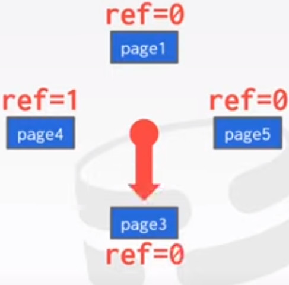

# Lecture 5: BUFFER POOLS
Will there be a database containing all the databases and features of each one?

# INTRODUCTION
How the DBMS manages its memory and move it back-forth from the disk

### DATABASE STORAGE
**SPATIAL CONTROL**,
- Where to write pages on disk
- The goal is to keep pages that are used together often physically close together as possible on disk

**TEMPORAL CONTROL**
- When to read pages into memory, and when to write them on the disk
- The goal is to minimize the number of stalls from having to read data from disk.

### ACCESS TIME 
It's important to find an efficient way to keep things in-memory as much as possible.

### DISK ORIENTED DBMS
- the database file is splitted into a bunch of pages
- there were a directory page who stores all mapings from page ids to physical locations in the file

And there it appears the Buffer pool, to load the pages from disk.
- but first it loads the directory.

### TODAY'S AGENDA
- BUFFER POOL MANAGER, responsible for managing the buffer pool (aka buffer cache)
  - which pages to read in, which pages to evict
- REPLACEMENT POLICIES,
- OTHER MEMORIES POOLS

Types of buffer pools that can exists in the DBMS.

## BUFFER POOL ORGANIZATION
Memory Region organized as an Array of fixed-size pages.

An array entry is called a **FRAME**

When the DBMS **request a page**, an exact **copy** is placed into one of these **frames**

We need one more level of indirection so we now are able to access these pages.
- this is called the **PAGE TABLE**

The **Page Table**, keeps track of pages that are currently in memory.
- also **maintains** additional **meta-data** for each of the pages:
  - Dirty Flag, boolean to mark if the page modified?
  - Pin/Reference Counter, if we want a particular page to remain in memory so you keep track the time

While Page directory keeps track of where the pages resides on disk
The Page Table is going to keep track of where those pages resides in the buffer pool in memory.

If one concurrent query wants to fetch another page, we can run into some concurrency issues.
- so a latch on a position in the page table prevents a concurrent modification

- Once latched, you can ask to the page to be loaded in
- then we can release the latch
  

## LOCKS VS LATCHES
**LOCKS**
- **Protects** the database's logical **contents** from **other transactions**
- Held for transaction duration
- Need to be able to rollback changes

**LATCHES** (aka **MUTEX**)
- Protectst the critical sections of the **DBMS** internal **data structure** from other threads
- Held for operation duration
- Do not need to be able to rollback changes

## PAGE TABLE VS PAGE DIRECTORY
The **page directory** is the mapping from **Paged ids** to **page locations** in the database file.
- all changes must be recorded on disk to allow the DBMS to find on restart.

The **Page Table** is the mapping from **Page IDs** to a copy of the page in **buffer pool** frames.
- This is an in-memory data structure that does not need to be stored on disk.

A transaction is when your query has finished computing and it's commited to disk.

PAGE TABLE is in memory
PAGE DIRECTORY is persisted on disk

### ALLOCATION POLICIES
How are we going to decide which pages are going to exists in our Buffer Pools.

**GLOBAL POLICIES**, make decisions for all active transactions.
- it sees al transactions on one time and going to figure out who are kept and who doesn't

**LOCAL POLICIES**, 
- Allocate Frames to a specific transaction without considering the behavior of concurrent transactions
- still needs to support sharing pages.

Individual transactions are going to allocate/deallocate on a per query basis.
- they are going to think about their own execution plan.

### BUFFER POOL OPTIMIZATIONS
**Multiple Buffer Pools**, utilizes multiple concurrent buffer pools at the same time
**Pre-Fetching**
**Scan Sharing**, across multiple queries
**Buffer Pool Bypass**, bypass buffer pool for individual queries.

#### MULTIPLE BUFFER POOLS
**Logically** the DBMS have just **one Buffer Pool**, but **Physically**, it can be **implemented** **multiple Buffer pools**, with different strategies.
- **Multiple buffer pool instances**, running independently in different machines
- **Per-database buffer pools**, each database can have its own buffer pool
- **Per-page** type **buffer pool**, you can even have different buffer pool at the level of individual pages.

It helps to reduce latch contention and improve locality,
- **less fighting** over managing a single page table.
- Allows you to **specialize** for the needs of individual queries/databases/pages

What the **problem** might be that instead of a **single** Buffer Pool we have **multiple** ones?
- How do you decide how many **space** to allocate each buffer pool?
  - many databases have some know so you can **tune** some parameters.
- Could you have **multiples** of the **same pages** in different buffer pools?
  - yes, tipically one **make sure** that **pages** are **mapped** to a **single buffer pool**
- How do you figure out, which buffer pool the page is going to go to.

Suppose we have 2 buffer pools. 
**APPROACH 1**, Object ID
- When you're storing pages, you store some kind of object id assosiated with it.
- by an object id we mean:
  - Type of page (tuples in a table, page that stores part of the index datastructure, log records)

This way you can split types of pages, into different buffer pools.

**APPROACH 2**, Hashing
- Hash the page id to select which buffer pool to access

so we take the hash function with the 'n' modulo, where 'n' is the number of independent buffer pools we have.

## PRE-FETCHING
The DBMS can also prefetch pages based on a query plan.
- Sequential Scans
- Index Scans

### SEQUENTIAL SCAN

So far we have discusesed that the **Buffer Pool** is going to **fetch** the page once it's **needed**.
- but you can also, **pre-fetch** the **page** in advance.

Imagine we have a query Q1 that wants to start accessing Page 0.
- you fetch page 0 into the buffer pool

Then it moves on to fetch page 1 into the Buffer pool.

Now if this is a sequential scan, 
- Q1 is going to need access to page 2 and 3

So why not allow the DBMS to map thesee pages ahead of time.

We keep this pattern up, and Q1 is never having to wait the disk to end as it's a sequential scan.

### INDEX SCAN
In this query we are asking for values between 100 and 250.
- so we are going to get all the tuples from the pages.

we can use a datastructured called an 'index'
- B trees or B+ trees (binary tree)
- This tree is organized based on the value that we are searching.
- then all values are sorted as follows for that particular attribute.

Rather than having to scan all of the pages in the file, we can just traverse the tree.
- which is going to tell us which pages we need to go and look at.
- all of the leaf nodes have pointers connecting to the pages.

So we do a more intelligent pre-fetching

The difference here against sequential scan,
- we have to know, what are the **accessing patterns** for the query. Requires **High level knowledge**

If we treated the same as the sequential scan, we ended reading pages that we are not actually using it.

How do you know how many resources you should allocate to doing pre-fetching vs normal work?
- there are strategies to mitigate allocating too many pre-fetching resources

There should be pre-fetching in both dimensions?
- both database pages as well as the index pages

if you have just one buffer pool,
- the manager still has to figure out how to balance resources between database files and index files.

you can answer queries entirely by looking at the indexes, not need going to go to the database files.

So what is the number at the bottom of the tree?
- the query was asking for the attribute value between 100 and 250

Is the index built specifically for this query?
- no, indexes are maintained by the system,
- but they can be built to answer many queries.

## SCAN (CURSOR) SHARING (I)
The idea is that **queries** can **reuse** the **data** that is retrieve from storage or computations.
- also called 'syncronized scans'
- This is different from result caching

Queries are reading pages from disk and putting them into memory,
- and another queries need to use the same page, so

Allows multiple queries to attach to a single cursor that scans a table.
- queries do not have to be the same
- can also share intermediate representations

The **Cursor** is just an iterator over the pages in the table
- If a query wants to scan a table, and another query is already doing this,
- then the DBMS will **attach** the **second** query's **cursor** to the existing cursor.
  
Examples:
- Fully supported in IBM DB2, MSSQL and postgres
- Oracle only supports __cursor sharing__ for identical queries.

### SCAN SHARING (II)
So how this works, Suppose we have this query:
- Select the sum of all of the values from some table A.

So we fetch page 0,
- then page 1,
- then page 2,
- then we have to evict something, lets say its page 0
- then fetch page 3.

Then it comes a new query, 
- to do the average to the same page.
- so we could start Q2 up there

and start scanning from the begining, but we have already look at those pages for Q1.
- an alternative is to attach Q1 and Q2 cursors
- and start from the same position in the scan

And finally **Q2** has to **back** to the **beginning** to cover those first pages alone.

This is possible, just because SQL is not an ordered model.

The **LIMIT** clause can cause a problem, 
- because now, issuing this query multiple times i potentially get multiple answers
  

## BUFFER POOL BYPASS
It's an optimization technique that:
- fetches the page
- uses that page
- evict that page right away.

The sequential scan operator is not going to **persist** the fetched pages in the buffer pool to avoid overhead.
- Memory is local to running queries
- Works well if operator needs to read a large sequence of pages that are contiguous on disk
- Can also be used for temporary data (sorting, joins)

Called 'Light Scans' in Informix

Well, those are all the optimizations that we are going to talk about at the level of buffer pool.

## OS PAGE CACHE
The next piece are strategies for replacing pages in the Buffer Pool it this fills up.

Most Disk Operations go through the OS API.
- mmap
unless you tell it not to, the OS maintains its own filesystem cache (i.e. the page cache).
- basically it is, when you request to read a page from disk,
- that request is going to go to the OS
- if it's not already loaded is going to fetch it from disk
- load into the page cache,
- and return a pointer to that page.

You are ending up with a redundant copy of the page here.
- one stored in the OS page cache.
- one in the Buffer Pool implemented.

So what most DBMS do is this I/O **DIRECT** flag, to bypass the OS's page cache.
- Redundant copies of page
- Different eviction policies
- Loss of control over file I/O

## BUFFER REPLACEMENT POLICIES
When The DBMS needs to free up a frame to make room for a new page, 
- it must decide which page to **evict** from the Buffer Pool

There are many strategies to consider.
- Correctness
- Accuracy
- Speed
- Meta-data overhead

### LEAST RECENTLY USED POLICY (LRU)
The most straightforward optimization strategy.
- is evict the oldest.
  
Maintain a single timestamp of when was last accessed each page

When the DBMS needs to evict a page, select the one with the oldest timestamp.
- Keep pages in sorted order to reduce the search time on eviction.

### CLOCK STRATEGY
A variation of LRU, that doesn't need a separate timestamp per page.
- each page has a reference bit.
- When a page is accessed, is se to 1.

Organize the page in a **circular buffer** with a 'clock hand'
- upon sweeping, check if page's bit is set to 1.
- if yes, set to zero. if no, then evict.

Suppose those are our pages in our Buffer Pool
- we are going to access this page 1
- so we update that bit to 1
  

and we are going to have this clock hand, that's going to sweep around the pages
- if the hand is pointed to a reference 1, then it changes to zero.
  

and we move to the next step.
- we found a reference 0, so page 2 is evicted.
  

The argument is,
- if it was not used recently, so it's not important for us to keep around.

Suppose we replaced it for page 5, 
- and in the meantime
- page 3 and page 4 got accesse
- so we update their reference bits.

And we keep moving the clock around

When a page is added, the clock is on that spot.
- we don't need to place that bit to 1
- the reference bit if for knowing if the page was visited again while was waiting the other pages.

for simplicity we are going to say that we evict pages on demand
- but if you are going to pre-fetch, then you might want to evict ahead of time

### PROBLEMS
There are some issues with **LRU** and **CLOCK** replacement policies.
- They are susceptible to **Sequential Flooding**

A query performs a secuential scan that reads every page
- this pollutes the buffer pool with pages that are read once and never again.

In some workloads the most recently page used is the most unneeded one.

As said before,
- Pages that are recently used are going to be used again soon.
- is good for skewed access patterns
- but bad for sequential scans

### BETTER POLICIES: LRU-K
Track the history of last K references to each page as timestamps and compute the interval between subsequent accesses.

The DBMS then uses this history to estimate the next time that a page is going to be accessed

So rather to tracking the most recent timestamp that something is accessed.
- we are going to look the history of the last K references.
- let's assume k is 2 for now.
- Then you compute the interval between subsequent accesses
- if it's a long time it's safe to throw it out.
- if it's a much shorter time, we might want to keep it around

There's this trade off between how much meta-data we're storing vs the precision of measuring those intervals.

### BETTER POLICIES: LOCALIZATION
The DBMS chooses which pages to evict on a per transaction/query basis.
- This minimizes the **pollution** of the buffer pool from each query.
- keep track of the pages that a query has accessed

global optimization vs single query decision

Example, Postgres maintains a small ring buffer that is private to the query.

### BETTER POLICIES: PRIORITY HINTS
different, Priority hints based on access patterns. 
- if we think back into the index example,
- the DBMS knows the access patterns for accessing a sorted attribute

The DBMS knows about the context of each page during quering execution

It can provide hints to the buffer pool on whether a page is important or not

For example, if our query is always going to increase, then we just have to keep track of the last leaf.
- Conversely if we have Q2, then the scan we want to perform might have a different access path

The thing both have in common, is that both starts in that root page.
- so one hint you were able to provide is
- to keep that root page around, both types of queries are going to need it

### DIRTY PAGES
**FAST**, If a page in the buffer pool is __not dirty__, then the DBMS can simply 'Drop' it.

**SLOW**, If a page is dirty, then the DBMS must write back to disk to ensure that its changes are persisted.

Trade off between fast evictions vs dirty writting pages that will not be read again in the future.

### BACKGROUND WRITING
The DBMS can periodically  walk through the page table and write dirty pages to disk.

When a dirty page is safely written, the DBMS can either evict the page or just unset the dirty page.

Need to be careful that we don't write dirty pages before their log records have been written.

### OTHER MEMORY POOLS
The DBMS needs **memory** for things **other things** than just tuples and indexes.

These other memory pools may not always backed by disk. Depends on implementation.
- Sorting + Join Buffers
- Query Caches
- Maintainance Buffers
- Log buffers
- Dictionary Caches

## CONCLUSION
The DBMS can almost always manage memory better than OS

Leverage the semantics about the query plan to make better decisions:
- Evictions
- Allocations
- Pre-fetching

-> Next class
we are going to talk about **HASH TABLES**

## PROJECT Nº 1
Build your first component of your storage manager.
- LRU replacement policy
- Buffer Pool Manager Instance
- Parallel Buffer Pool Manager

We will provide you the disk manager and page layouts

### TASK 1 - LRU REPLACEMENT POLICY
Build a data structure that tracks the usage of pages using the LRU policy

General Hints
- your LRUReplacer needs to check the 'pinned' status of 'Page'
- If there are no pages touched since last sweep, then return the lowest page id

It's important to remember the 
- Pin status of the page, you don't want to evict pinned pages

### TASK 2 - BUFFER POOL MANAGER
Use your  LRU Replacer to manage the allocation of pages
