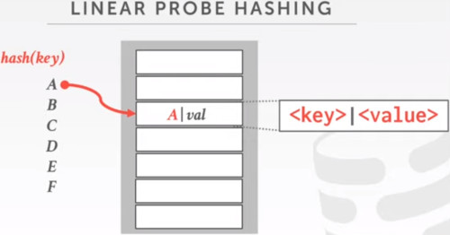
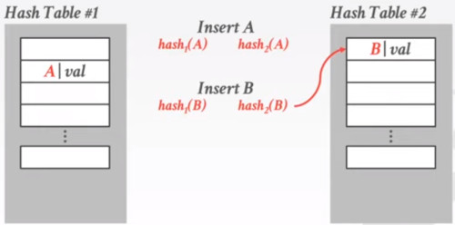
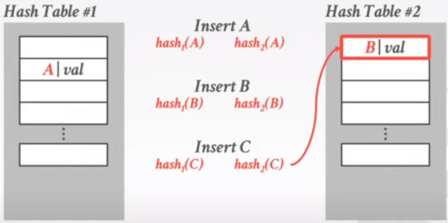

# LECTURE 6: HASH TABLES

Tech talks: google napa, tiledb, bodoSQL

## INTRODUCTION
So today's lecture is going to be about Hash tables and how to use in the DBMS

How to support DBMS execution engine to support read and write data from pages

Two types of data structures
- Hash Tables
- Trees

### DATA STRUCTURES
Many data structures can be used in different places.
- Internal Meta-Data
- Core Data Storage
- Temporary Data Structures
- Table Indexes

Can be used to map pages/tuples into physical locations

You could have group of pages organized into a hash table

They could be used as a temporary datastructure, like during query execution.

There are some operations that you might want to build data structures on the fly, and then use it temporaly.
- for example in a hash join

### DESIGN DECISIONS
**DATA ORGANIZATION**, 
- how is the data physically layed out

**CONCURRENCY**,
- you might have multiple queries running in your system

## HASH TABLES
A hash table implments an **unordered assosiative array** that maps KEYS to VALUES.

It uses a Hash function, to compute an offset into the array for a given key, from which the desired value can be found.

- Space Complexity: O(n)
- Time Complexity:
  - Average O(1)
  - Worst O(n)
 
### STATIC HASH TABLES
The simplest hash table that you can think is:
- Allocate a giant array that has one slot for every element you need to store
- To find an entry, mod the key by the number of elements in the array to find the offset on that array

#### ASSUMPTIONS
You **know** the **number** of **elements** **ahead of time**

Each **key** is **unique**

Perfect Hash Function
- __IF__ KEY_1 != KEY_2 __THEN__ hash(KEY_1) != hash(KEY_2)

#### PRACTICAL HASH TABLE

DESIGN DECISION 1, HASH FUNCTIONS.
- How to map a large KEY space into a smaller domain.
- Trade off between being fast vs collision rate.

DESIGN DECISION 2, HASHING SCHEME-
- How to handle KEY collisions after hashing
- Trade off between allocating a largea hash table vs additional instructions to find/insert KEYS.

## TODAY'S AGENDA
HASH FUNCTIONS
STATIC HASHING SCHEMES
DYNAMIC HASHING SCHEMES

## HASH FUNCTIONS
For any input **Key**, return an **integer** representation of that key.

We don't want to use cryptographic hash functions.

We want something fast with low collision rate.

Examples.
**CRC-64 (1975)**
- used in networking for error detection
**MURMUR HASH (2008)**
- Designed as a fast, geral purpose hash functions
**GOOGLE CITY HASH (2011)**
- Designed to be faster to short keys (<64 bytes)
**FACEBOOK XXHASH (2012)**
- From the creator of zstd compression
**GOOGLE FARM HASH (2014)**
- Newer version of CityHash with better collision rates

## HASH FUNCTIONS: BENCHMARK
- the x-axis is the KEY size
- the y-axis is the throughput

|

## STATIC HASHING SCHEMES
What hashing schemes are you going to use

APPROACH 1. Linear Probe Hashing

APPROACH 2. Robin Hood Hashing

APPROACH 3. Cuckoo Hashing

### LINEAR PROBE HASHING
Single giant table of slots.

Resolve collisions by linearly searching for the next free slot in the table.
- To determine whether an element is present, hash to a location in the index and scan for it
- Must store the key in the index to know when to stop scanning.
- Insertions and deletions are generalizations of lookups.

#### INSERTIONS.

Suppose we have the KEY = A with value 'val'
- it's common to store the keys contiguous with the value.
  

When we reach KEY = C,
- we found a collision
- the way we are going to resolve it is by **linear-pro-hashing**.
  i.o.w. Scan linearly forward.
  

You don't need any latches for this operation.
- just do an atomic, swap operation.
- if you fail, just go to the next slot
- the slots are circular
  
#### DELETIONS.

Let's suppose we want to delete C
- but hash(C) points to A
- so move to next slot
- if it matches, then delete C

Suppose now we want to delete D.
- but D was coliding with A,
- then colliding with C
- As C does not loger exits
- you cannot find the position of D, as there are a free slot in the middle of the path
  

There's an issue here.
- How do we know if KEY D doesn't exists or it was bypassed by a deleted key

There are 2 strategies to deal with this.
- APPROACH 1. Tombstone, you insert some reserved value when you delete a key

- APPROACH 2. Movement, you just compact, sliding all values up
But when to stop sliding?
Which key, values moves and which don't?

#### REHASHING
So what you do is to perform a,
- **REHASHING**,
- Basically you reinsert each of the key:values you want to slide.
- so you rehash everything below your deletion.

#### NON-UNIQUE KEYS
Choice 1. **Separated Linked List**
- store values in separate storage area for each key

Choice 2. **Redundant Keys**
- store duplicated keys entries together in the hash table

### ROBIN HOOD HASHING
Variant of linear probing that steals slots from 'rich' keys to give them to 'poor' keys.
- Each key is going to track, the number of positions from where should have been inserted in first place.

If we have a colision we have to scan forward to look for the next empty slot.
- on insert, a key will take the slot of another key,
- if the first key is farther away from its optimal position than the scond

Note we are storing now  the number of jumps from the first position.

Here we have moved KEY D, just because E has a higher number of jumps

Usually this is not as very efficient,
- due to all the branch misses collisions
- with the comparison
- with the excessive copying

## CUCKOO HASHING
Use multiple hash tables with different hash functions seeds.
- on insert, check every table and pick anyone that has a free slot.
- if no table has a free slot, evict the element from one of them and then re-hash it find a new location.

**Looks-ups** and **deletions** are always **O(1)** because only one location per hash table is checked.
- Best open-source implementation is from CMU.

The cuckoo bird will lay their eggs in another bird's nest

Writes are more expensive (multiple hashing)
- but we have faster reads.

For simplicity we are showing 2 hash tables.
- insert A

Suppose now we have a collision
- insert B
- well no problem use table 2
  

Now unlucky us, it present to us a new collision in both tables
- insert B
- but it collides in table 1 and table 2.
- so fix it in table 2, and the value you replace use the other table.

So you are trying to backtrace each register to the other table with the other seed to test luck.

But what happen if the new position for A was taken?
- you end up in a loop,

The solution might be to create a new table with a new seed,
- maybe rehash everything back with that new seed.

you have to keep track of your path, to check if there were a cycle in there
