# LECTURE 7: TREE INDEXES

## INTRODUCTION

Data structures:
- Internal Meta-Data
- Core Data Storage
- Temporary Data Structure
- Table Index

Today's we are focusing about Table index.
- Specifically why we don't want to use a hash table for this.

### TABLE INDEXES (I)
A table index is a replica of a **subset** of a table's **attributes** that are **organized** and/or stored for **efficient access**.
- The alternative will be the perform a sequential scan.
  

If you have an OLTP, you have to rely in low latency access.

The DBMS ensures that the contents of the table and the index are logically syncronized

### TABLE INDEXES (II)
During Runtime, its the DBMS's job to figure out the best indexes to execute each query.

There's a trade off regarding to the number of indexes to create per database.
- Storage Overhead
- Maintenance Overhead.

The process of picking these correct indexes is called **Query Optimization**

## TODAY's AGENDA
- B+ TREES OVERVIEW
- Use in DBMS
- Design Choices
- Optimizations

### B+ TREES OVERVIEW
The B+ Trees are by far the most commonly used type of index for DBMS.

Naming Scheme.
- B-Tree (1971)
- B+Tree (1973)
- B*Tree (1977)
- Blink-Tree (1981)
  - Efficient looking for concurrent operations
  - some ideas, where the leaf nodes have this pointers between them, as we will see.
 
  The Modern B+Tree borrows ideas from all these others structures.

  The B in the trree might be for 'balanced'

## B+ TREES
Is a self-balancing tree data structure, that keeps data sorted and allows searches, sequential access, insertions and deletions.
- O(log n)

- You can think of it as generalization of a bynary tree, with multiple childrens.
- **Optimized** for systems that **read** and **write** **large blocks** of data.

There's no original B+Tree paper, but there's an IBM technical report.

### B+ TREES: PROPERTIES
A B+Tree is an M-way search tree with the following properties.
- It is perfectly balanced (i.e. each leaf node is at the same depth in the tree)
- Every node other than the root is at least half-full
  $\frac{M}{2}-1 \leq #keys \leq M-1$
- Every inner node with K keys has K+1 non-null childrens

double line is a node pointer, 
- referencing to a child pointer
  
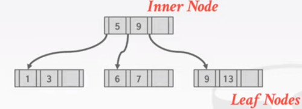

Also we are going to have this sibling pointers
- They turn the leaf nodes into a linked list or double linked list
- so you can traverse the leaf nodes.
   
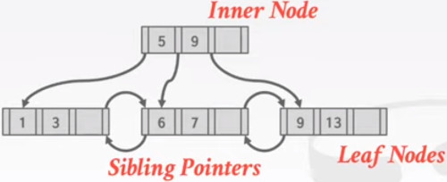

The way KEYS are stored in the nodes are,
- The key is stored next to the child pointer
- pay attention to the red square

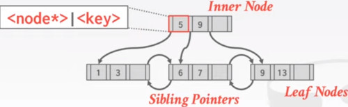

So the structure is 'child node'|key |'child Node'|Key ...

Also the keys are stored in ascending order
- everything to the left is smaller than the node
- everything to the right is greather or equeal to that node.

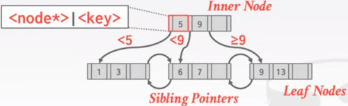

In the Leaf nodes we are storing the actual keys along with their values.

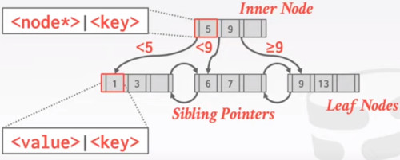

### B+TREES: NODES
Every B+Treea is comprised of an array of key/value pairs.
- The Keys are derived from the attributes that the index is based on
- The values will differ based on whether the node is classified as an **inner node** or a **leaf node**.

The arrays are usually kept sorted.

#### B+TREE LEAF NODSE
- In the beginning there's a pointer to the previous node,
- In the end we have a pointer to the next node.
- Key and Values are stored together
  
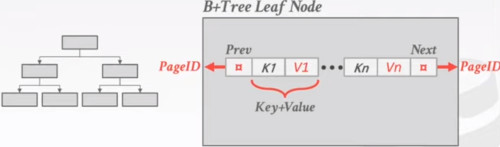

The other option is to replace the value with a pointer. (or a reference id)

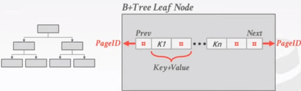

Another way, we can possible layout.
- you store some header of meta-data.
  - number of level of the tree
  - number of slots that it has
  - previous and next pointer
- and then you store the sorted keys in some kind of contiguous array.

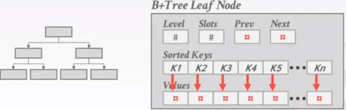

So there are many ways to store the values in the leaf node.

APPROACH 1. RECORD IDS,
- A pointer to the location of the tuple to which the index entry corresponds

APPROACH 2. TUPLE DATA, (aka cluster index)
- The leaf nodes store the actual contents of the tuple
- Secondary indexes must store the Record ID as their values.
-> As you don't want duplicated tuples, this is only going to work for one attribute, the primary index.

### B-TREES vs B+TREES
The original B+Tree from 1972 stored keys and values in **all nodes** in the tree.
- more space-efficient, since each key only appears once in the tree.

The difficulty is that its harder to support **concurrent access** to the key.
- you have to concurrently **update** nodes, anywhere in the tree.
- it gets trickier for insertions and deletions
- 
The other problem is the **Access patterns**, we prefer sequential access patterns instead of some random access.

A B+Tree only stores values in the leaf nodes. Inner nodes only guide the search process.
- the infotmation is contiguous

### SELECTION CONDITIONS
The DBMS can use a B+Tree index if the query provides any of the attributes of the search key.

Example: Index of <a, b, c>
- supported: (a=5, AND b=3)
- supported: (b=3)

Not all DBMSs support this.

For a hash index, we must have all attributes in search key.

### EXAMPLE

**B+TREE - SELECT**
Let's find key=(a,b)

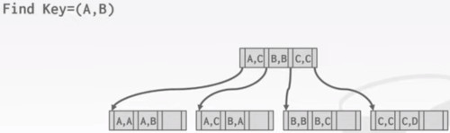

So we compare each tuple index at a time.

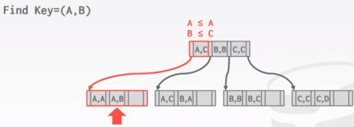

Now, suppose we want to perform a wildcard (star) search.
- first Key is A, second key anything.
- Remember the leaf nodes are connected, so you travel all at once.

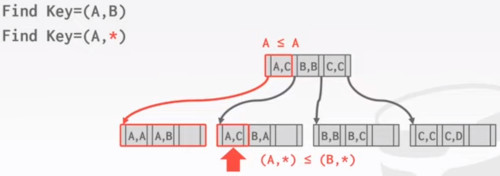

**B+TREE - INSERT**

- Find correct leaf node **L**, that the key belongs in.
- Put the data into **L** in sorted order.
- If **L** has enough space, done!
- Otherwise,
  - Split **L** Keys into 2 nodes, some goes to the original **L** node and the others to a new node **L2**
  - Redistribute entries evenly, copy until middle key.
  - Insert index entry pointing to **L2** into present **L**
 

To split  inner node, redistrtribute entries evenly, but push up middle key.
