# LECTURE 7: TREE INDEXES

## INTRODUCTION

Data structures:
- Internal Meta-Data
- Core Data Storage
- Temporary Data Structure
- Table Index

Today's we are focusing about Table index.
- Specifically why we don't want to use a hash table for this.

### TABLE INDEXES (I)
A table index is a replica of a **subset** of a table's **attributes** that are **organized** and/or stored for **efficient access**.
- The alternative will be the perform a sequential scan.
  

If you have an OLTP, you have to rely in low latency access.

The DBMS ensures that the contents of the table and the index are logically syncronized

### TABLE INDEXES (II)
During Runtime, its the DBMS's job to figure out the best indexes to execute each query.

There's a trade off regarding to the number of indexes to create per database.
- Storage Overhead
- Maintenance Overhead.

The process of picking these correct indexes is called **Query Optimization**

## TODAY's AGENDA
- B+ TREES OVERVIEW
- Use in DBMS
- Design Choices
- Optimizations

### B+ TREES OVERVIEW
The B+ Trees are by far the most commonly used type of index for DBMS.

Naming Scheme.
- B-Tree (1971)
- B+Tree (1973)
- B*Tree (1977)
- Blink-Tree (1981)
  - Efficient looking for concurrent operations
  - some ideas, where the leaf nodes have this pointers between them, as we will see.
 
  The Modern B+Tree borrows ideas from all these others structures.

  The B in the trree might be for 'balanced'

## B+ TREES
Is a self-balancing tree data structure, that keeps data sorted and allows searches, sequential access, insertions and deletions.
- O(log n)

- You can think of it as generalization of a bynary tree, with multiple childrens.
- **Optimized** for systems that **read** and **write** **large blocks** of data.

There's no original B+Tree paper, but there's an IBM technical report.

### B+ TREES: PROPERTIES
A B+Tree is an M-way search tree with the following properties.
- It is perfectly balanced (i.e. each leaf node is at the same depth in the tree)
- Every node other than the root is at least half-full
  $\frac{M}{2}-1 \leq #keys \leq M-1$
- Every inner node with K keys has K+1 non-null childrens

double line is a node pointer, 
- referencing to a child pointer
  

Also we are going to have this sibling pointers
- They turn the leaf nodes into a linked list or double linked list
- so you can traverse the leaf nodes.
   

The way KEYS are stored in the nodes are,
- The key is stored next to the child pointer
- pay attention to the red square

So the structure is 'child node'|key |'child Node'|Key ...

Also the keys are stored in ascending order
- everything to the left is smaller than the node
- everything to the right is greather or equeal to that node.

In the Leaf nodes we are storing the actual keys along with their values.

### B+TREES: NODES
Every B+Treea is comprised of an array of key/value pairs.
- The Keys are derived from the attributes that the index is based on
- The values will differ based on whether the node is classified as an **inner node** or a **leaf node**.

The arrays are usually kept sorted.

#### B+TREE LEAF NODSE
- In the beginning there's a pointer to the previous node,
- In the end we have a pointer to the next node.
- Key and Values are stored together
  

The other option is to replace the value with a pointer. (or a reference id)

Another way, we can possible layout.
- you store some header of meta-data.
  - number of level of the tree
  - number of slots that it has
  - previous and next pointer
- and then you store the sorted keys in some kind of contiguous array.

So there are many ways to store the values in the leaf node.

APPROACH 1. RECORD IDS,
- A pointer to the location of the tuple to which the index entry corresponds

APPROACH 2. TUPLE DATA, (aka cluster index)
- The leaf nodes store the actual contents of the tuple
- Secondary indexes must store the Record ID as their values.
-> As you don't want duplicated tuples, this is only going to work for one attribute, the primary index.

### B-TREES vs B+TREES
The original B+Tree from 1972 stored keys and values in **all nodes** in the tree.
- more space-efficient, since each key only appears once in the tree.

The difficulty is that its harder to support **concurrent access** to the key.
- you have to concurrently **update** nodes, anywhere in the tree.
- it gets trickier for insertions and deletions
- 
The other problem is the **Access patterns**, we prefer sequential access patterns instead of some random access.

A B+Tree only stores values in the leaf nodes. Inner nodes only guide the search process.
- the infotmation is contiguous

### SELECTION CONDITIONS
The DBMS can use a B+Tree index if the query provides any of the attributes of the search key.

Example: Index of <a, b, c>
- supported: (a=5, AND b=3)
- supported: (b=3)

Not all DBMSs support this.

For a hash index, we must have all attributes in search key.

### EXAMPLE

**B+TREE - SELECT**
Let's find key=(a,b)

So we compare each tuple index at a time.

Now, suppose we want to perform a wildcard (star) search.
- first Key is A, second key anything.
- Remember the leaf nodes are connected, so you travel all at once.

**B+TREE - INSERT**

- Find correct leaf node **L**, that the key belongs in.
- Put the data into **L** in sorted order.
- If **L** has enough space, done!
- Otherwise,
  - Split **L** Keys into 2 nodes, some goes to the original **L** node and the others to a new node **L2**
  - Redistribute entries evenly, copy until middle key.
  - Insert index entry pointing to **L2** into present **L**
 

To split  inner node, redistrtribute entries evenly, but push up middle key.

**B+TREE - DELETE**
- Start at the root,
- Find leaf **L** where entry belongs.
- Remove this entry
- If **L** is at least half-full, then done.
- If **L** has only **M/2-1** entries, then
  - Try to redistribute, borrowing from silbing (same parent as **L**)
  - If re-distribute fails, merge **L** and silbing.
- If Merge Ocurred, must delete entry (pointing to **L** or silbing) from parent **L**.

**B+TREE - DUPLICATE KEYS**
APPROACH 1. APPEND RECORD ID.
- Add the tuple's unique Record ID as part of the key to ensure that all keys are unique
- The DBMS can still use partial keys to find tuples

APPROACH 2. OVERFLOW LEAF NODES
- Allow Leaf nodes to spill into overflow nodes that contains the duplicated keys.
- This is more complex to maintain and modify.

**B+TREE - APPEND RECORD ID**
- we are storing the key and the record ID
- now if we are going to insert '6'
- we really are inserting '<6, (page, slot)>'

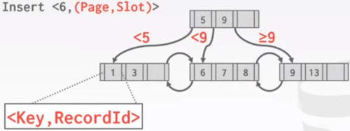

First we are going to split the bin.

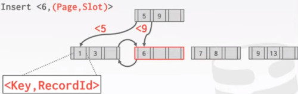

We update the pointers
- we move parent key up
- we insert the '6'
  
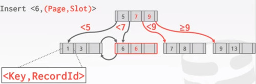

Actually you didn't even have to update the pointers, we can just look at the first element of the bucket, to know the range.

The alternative was OVERFLOW LEAF NODES:

So again we are inserting a 6.

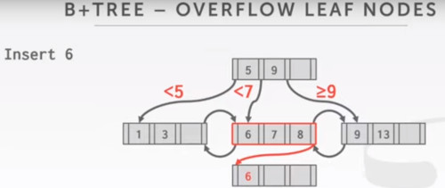

Then we fill it up with additional values.

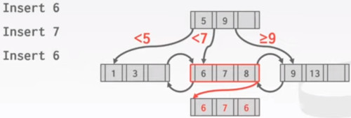

But we can't do binary search now, the order was broken.

### CLUSTERED INDEXES
The table is stored in the sort order specified by the primary key.
- can be either heap or index organized storage.

Some DBMS always use a clustered Index.
- If a table does not contain a primary key, the DBMS will automatically make a hidden primary key.

Other DBMS cannot use them at all.

#### CLUSTERED B+TREE

If we want to perform a search,
- we're going to traverse the leftmost leaf page.
- and that's going to give us, tuples from all leaf pages.

So this is an index structure,
- here we are going to direct our search.
- we have the data entries at the bottom.
- and below, we refer to these data records which are stored in pages.
- this is going to give us a sorted order for the table.

If it's clustered, then our pages are going to be organized, or sorted,
- based on the primary key.
- This is going to be better than an external sorting algorithm,
- because it's already sorted in the index.

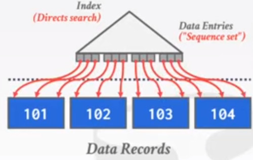

You can imagine the pointers, going in increasing order across these pages.
- and our scan direction is going to be left to rigth

In the other hand,
- if we don't have a clustered index.
- So the table is not sorted by whatever the key is.
- so we are retrieving tuples from the index look up
- in the order that they appear in the page layout.

And this could be very inefficient, because it may lead to a bunch of random accesses in the data.

This time the pointer would look like a mess

The keys are in sorted order, but the pointers are our of order.
- we might end up fetching pages multiple times

it's not very efficient scaning a range.
- have a look of how the access patter would look like.

So one way to get around this is, 
- if the DBMS rather than accessing tuples immediately,
- performs some kind of scan to accumulate
- all of the pages we are going to need in advance
- and then we are going to sort them based on the PAGE ID

### B+TREE DECISION CHOICES
Book: Modern B+TREE Techniques
- Node Size
- Merge Threshold
- Variable Length Keys
- Intra-Node Search

#### NODE SIZE
There's this rule for choosing the node size.

The **slower** the storage device is, the larger the optimal node size for a B+Tree
- HDD: 1MB
- SSD: 10KB
- In-Memory: 512B

Optimal sizes can varya depending on the workload.
- Leaf nodes scans vs Root to Leaf Traversals

So slower devices have better sequential read performance. The larger node size maximizes the secuential reading.

#### MERGE THRESHOLD
Some DBMS do not always merge nodes when they are half full.

Delaying a merge operation may reduce the amount of reorganization.

It may also be better to just let smaller nodes exist and then periodically rebuild the entire tree.

#### VARIABLE LENGTH KEYS
APPROACH 1, POINTERS,
- Store the keys as pointers to the tuple's attribute

APPROACH 2, VARIABLE LENGTH NODES,
- The size of each node in the index can vary
- Requires careful memory management

APPROACH 3, PADDING,
- Always pad the key to be max length of the key type.

APPROACH 4, KEY MAP/INDIRECTION,
- Embed an array of pointers that map to the key + value list within the node.

#### INTRA NODE SEARCH
Once we are inside a node, how we actually find the keys in the node.

APPROACH 1, LINEAR
- Scan node keys from beginning to end.

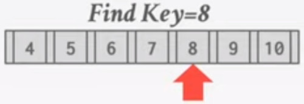

APPROACH 2, BINARY, (requires keys, to be sorted)
- Jump to middle key, pivot left/right depending on comparison

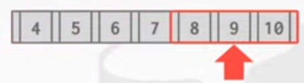

APPROACH 3, INTERPOLATION,
- Approximate location of desired key based on known distributions of keys.
- knowing the edges, we can linear interpolate the location of our key 8
  
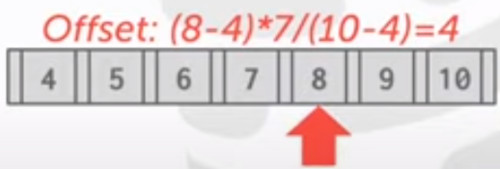

## OPTIMIZATIONS
- PREFIX COMPRESSION
- DEDUPLICATION
- BULK INSERT
- MANY MORE...

### PREFIX COMPRESSION
If we have sorted keys in the same leaf node, they are likely to have the same prefix.
- instead of storing the 3 keys,
- we can extract the prefix instead
  
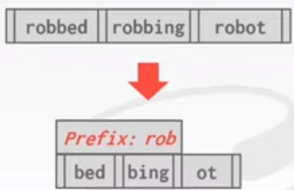

Instead of sorting the entire key each time,
- extract the common prefix and store uniquely suffix for each key.
- many variations
  
### DEDUPLICATION
Non-uniquely indexes we can end up storing multiple copies of the same key in leaf nodes.

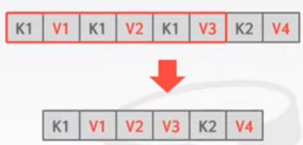

The leaf node can store the key once and then maintain a list of tuples with that key.

### BULK INSERT
The fastest way to build a new B+Tree for an existing table,
- is to first sort the keys
- and then build the index from the bottom up.

Suppose we have this pre-existing data.
- first step is to sort the keys.

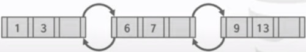

And then we build the upper levels based on these values.

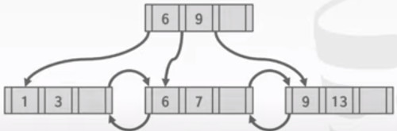

This Bulk insert / bulk load, allow us to be more efficient than other method.

Are there efficient ways to merge B+Trees?
- yes, starting with the leaf layer, we already have 2 ordered key sets.
- so you can pull it and merge.

Does the Bulk insert, mean inserting in the table?
- a bulk insert means, a bulk insert into a B+Tree
- a pre-existing data you want to insert into the tree.
- better than inserting one key at a time.
    
## CONCLUSION
The venerable B+Tree is (almost) always good choice for your DBMS.
- both as clustered and non-clustered secondary index.

Next class.
- Index concurrency control.
- concurrent inserting and deletions indexes.
