# Lecture 8: INDEX CONCURRENCY CONTROL

## INTROUDCTION
Today's lecture is going to be about index concurrency control.

Questions from last class.
1. Non-prefix lookups in multi-attribute B+Trees

2. Efficiently merging B+Trees
   -  Approach 1. Offline, blocks all operations until done merging
   -  Approach 2. Eager, access both merge, move batches eagerly
   -  Approach 3. Background, copy+merge in background; apply missed updates
   -  APproach 4. Lazy, designate one as many and other as secondary. if leaf in main not yet updated, merge correspondly key range from secondary.


### SHARE NOTHING SYSTEMS
Observation.
- We have assumed that all the data structure are single threaded
- But we need to allow multiple threads to safely access our dataa structures to take advantage of additional CPU cores and hide disk I/O stalls.

The following don't do this: (they are primarily in-memory systems)
- REDIS
- VOLTDB
- H-STORE


If you are in memory then you don't need to worry about disk I/O stalls.
- so you can get rid of concurrency control.
- and the way that we'll avoid any kind of concurrency errors is by particioning the dbms into disjoint sub-ranges.
for example, 
- keys you could split up into the k keys from 'a' to 'd', 'e' to 'j'
- partitioning the range in this way, let each partition operate in a single thread.


### CONCURRENCY CONTROL
A concurrency control protocol is the method that the DBMS uses to ensure 'correct' results to concurrent operations on a shared object.

A protocol's correctness criteria can vary,
- **LOGICAL CORRECTNESS**, can a thread see the data that it is supposed to see?
   - if i write a 5, then i want to read it, i have to be able to read my own writes.
- **PHYSICAL CORRECTNESS**, is the internal representation of object sound?
   - we have to protect the internal representation
   - the pointers, tuple layout
 

### TODAY's AGENDA
- LATCHES OVERVIEW
- HASH TABLE LATCHING
- B+TREE LATCHING
- LEAF NODE SCANS

## LOCKS VS LATCHES
**LOCKS**, 
- Protects the database's logical contents from other's transactions
- Held for transactions duration
- Need to be able to rollback changes (undo chamges in case of error)

It protects, tuples, pages, tables or abstractions.
- they are not low level physical detail
Ensures consistent and atomic transaction.


**LATCHES**,
- Protects the critical sections of the DBMS's internal data structurea from other's threads
- Held for operation duration (as short as possible)
- Do not need to be able to rollback changes. (if some occur happened, nothing has to be done)

BOOK:
- Modern B+TREE Techniques.

In latches we have no notion of deadlocks.
- also latches are embeded in the data structure
  
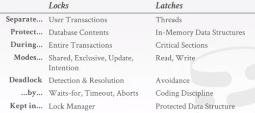

We will review this at lecture 16

### LATCH MODES
**READ MODE**, 
- Multiple Threads can read the same object at the same time
- A thread  can acquire the read latch if  another thread has it in  read mode.

**WRITE MODE**,
- Only one thread can access the object
- A thread cannot acquire a write latch if another thread has it in any mode.

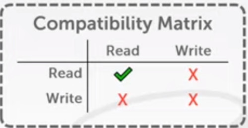


### LATCH IMPLEMENTATION
- BLOCKING OS MUTEX
- TEST-AND-SET-SPIN LATCH
- READER-WRITER LATCHES

#### BLOCKING OS MUTEX
- Simple to use
- Non scalable (about 25ns per lock/unlock invocaton)
- example std::mutex

Example 
- In linux, its a typedef which is something called a futex.
   - Fast User space Mutex.
 
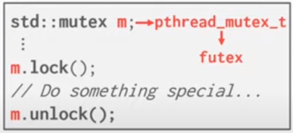

It has 2 latches inside.
- Fast user space Spin Latch
- This heavyweight blocking OS Latch

Imagine we have 2 concurrent threads, they both want to acquire this locks.
- they first are going to go to the **fast user space latch**
- let's say that the left one wins
  
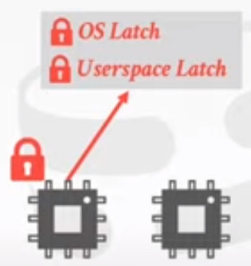

- the other one, is going to  have to block and wait to the heavy weight latch.

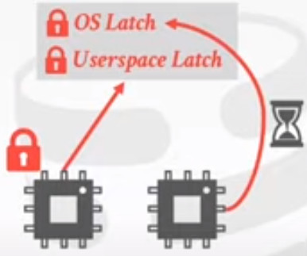

One the first thread is done, is going to unlock and woke up the next thread.

#### TEST-AND-SET-SPIN LATCH (TAS)
- Very Efficient (sinlge instruction to latch/unlatch)
- non-scalable, non cache friendly, not OS-friendly
- example std::atomic<T>

Entirely in the user space code. doesn't rely into the OS

Issues.
- cache coherence, multiple threads that need to cross memory boundaries in order to  acquire the same latch.
- you can also run into this contention problem, if you have lots of threads that all trying to have the same latch,
  what you end up doing is just looping forever.

Every time i call latch.test_and_set(),
- if i don't get the latch, then i drop into this loop

There's no visibility about what  instructions i'm actually executing.
- is just me looping for something.
- the os doesn't know what i'm doing
  
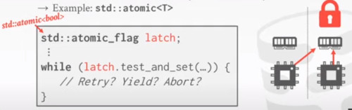


#### READER-WRITTER LATCHES
- Allows for  concurrent readers
- Must manage read/write queues to avoid starvation
- can be implemented on top of spin latches

Think about the first 2 approaches as primitives, and this is like a higher level construct.

Imagine a separate read-write latch inside our big read-write latch.
- we have two counters
   - The number of threads that have successfully acquired (either read or write latch)
   - and the number of threads that are waiting (either read or write latch)

Our first thread show up, and wants to acquire a read latch.
- we are going give it out,
- and increment our count of active read latches by 1

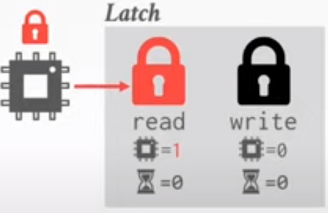

Another thread shows up, also wants a read latch.
- there's no problem here, we are going to give it out
- increment the count by one
  
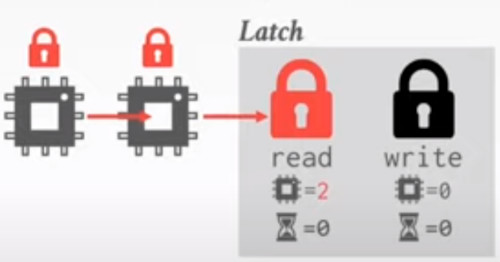

Let's say another thread shows up, but this want a write latch.
- we are going to block that thread, as we have stuff being read
- increment the waiting queue by 1.

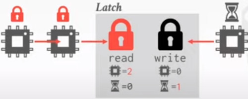

Imagine another reader shows up.
- it requires a read latch.

what do we do?
- wait the writter to finish?
- Prioritize the reader stack?
- Timestamp criterion,
- we don't care the order, as we are consistent.

To prevent starvation, we are putting the reader to wait.

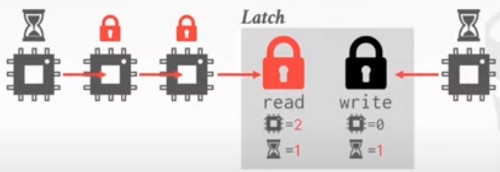


## HASH TABLE LATCHING
Easy to support concurrent access due to the limited ways threads access the data structure.
- all threads move in the same direction and only access a single page/slot at a time
- Deadlocks are not possible

To resize the table, take a global write latch on the entire table 
- e.g. in the header page

Two approaches, 
- PAGE LATCHING
  SLOT LATCHES

If i have more latches that i need to store,
- in slot latches they're fine grainer than the page level.
- i'm trading storage for more fine-grained access


Two threads might need to access different slots, 
- but only one will be able to proceed
- if there's a lock on the page.

Higher congestion choose slot latches, low congestion is faster to latch the page
  
### PAGE LATCHES
- Each page has its own reader-writter latch that protects its entire contents
- Threads acquire either a read or write latch before they access a page.

Imagine we have transaction 1, that wants to find the key 'D'
- so we are going to hash(D)
- we have to acquire a latch on that page to read
- now you begin to scan
  
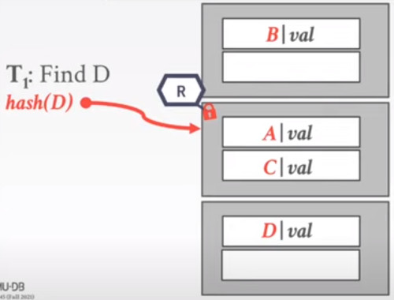

In the meantine, some other transaction T2 appear saying trying to insert E.
- But T1 already has a latch on that page
- so we are going to block T2

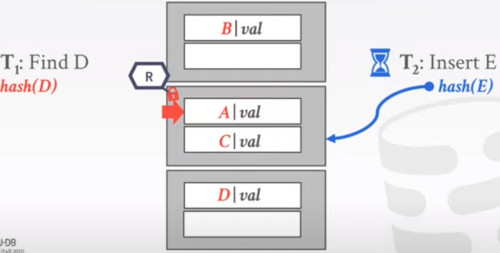


So now, T1 have scaned page 1, and is ready to move into page 2.
- so he releases that latch on page 1
- and we are going to request a latch on page 2 for T1.

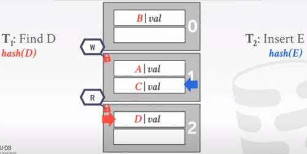

If you perform a deletion involving shifting, 
- do you need to acquire latches into multiple pages?
- Yes, you have to acquire latches in all pages in order.
- if you are doing tombstones you don't need latches.


  
### SLOT LATCHES
- Each slot has its own latch
- Can use a single-mode latch to reduce meta-data and computational overhead.


Again T1 is trying to find D.
- instead of acquiring a latch for the entire page, we do it for a slot.
While T2 is trying to insert E.
- also in page 1.
  
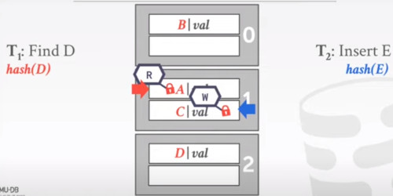

Now when T1 tryies to read the next slot is hold in wait.

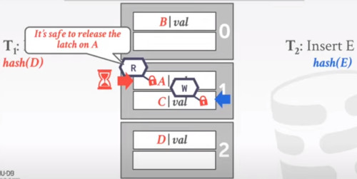

So on untill both finish their jobs

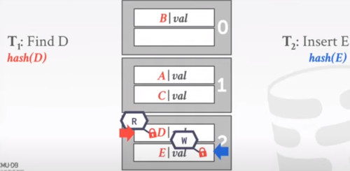

### COMPARE AND SWAP
Instead of using latching, you could use the Hardware instruction.
- COMPARE AND SWAP

```
_sync_bool_compare_and_swap(address=&M, compare_value = 20, new_value=30)
```

- if values are equal, installs new given value
- otherwise operation fails.


## B+TREE CONCURRENCY CONTROL
We want to allow multiple threads to read and update a B+TREEa at the same time

We need to protect against two types of problems.
- Threads trying to modify the contents of a node
- One thread traversing the tree while the another thread splits/merges the nodes.


Imagine you have a transaction T1, that wants to delete Key 44.
- basically we traverse from the root to the inner nodes to the leaf.
- and we are going to delete key 44.
    
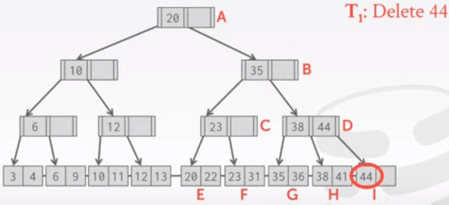

But now, the last leaf node is empty.
- we have to rebalance the tree.
- we are going to borrow a key from our sibling 'H'
- and move it over
- and also update the higher nodes values.
  
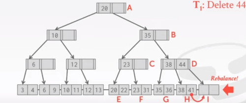


But let's say that before we actually rebalance the tree, 
- we go to sleep.

Now Thread 2 is coming, and wants to find key 41.
- but thread 1 is going to move over that value.
- Thread 2 is about to find value 41 in node 'H'
  
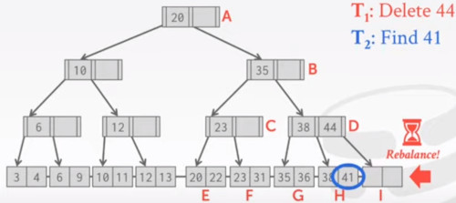

Now let's say Thread 2 is going to sleep.
- and Thread 1 is awake, and continues to rebalance key 41 into the 'I' bucket.

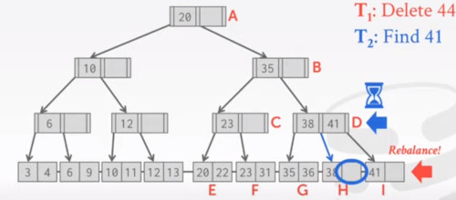

And now Thread 2 is going to wake up,
- and move to bucket 'H'
- but he doesn't find his key.
- because it was moved to 'I' by T1.

This is showing one kind of problem, if we don't use any latches or protections around.


### LATCH CRABBING/COUPLING
it's a protocol to allow multiple threads to access or modify a B+TREE at the same time.

**BASIC IDEA**,
- Get Latch for parent
- Get Latch for child
- Releas latch for parent if 'safe'

A SAFE NODE is one that will not split or merge when updated.
- not full (on insertion)
- More than half-full (on deletion)

It improves concurrency substancially vs allowing one thread at a time.

**FIND**, start at the root node and go down, repeatedly.
- Acquire **R** latch on child
- Then unlatch parent

**INSERT/DELETE**, start at root and go down, obtaining **W** latches as needed.
Once child is latched, check if it is safe.
- if child is safe, release all latches on ancestors


### EXAMPLES

Example 1: FIND 38

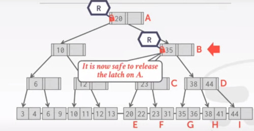

Example 2: DELETE 38
 
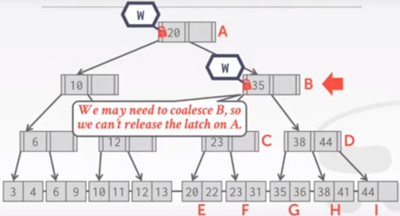

- we can't release the latch on A now.
- we don't know if we have to change something

As we know that we are not merging with C, we can release locks on 'A' and 'B'
- in which order we should release them?
- it doesn't matter
- but it's faster to release them in the order they were asked
   - releasing first 'A', allows half tree to be used.
   - then releasing 'B' you release the entire tree.

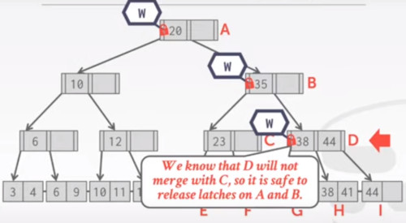

Ofc, then you delete 38 from the leaf node.

EXAMPLE 3. INSERT 45
In this case, we know that if 'D' needs to split, 'B' has enought room.
- so it's safe to release the latch on 'A'
  
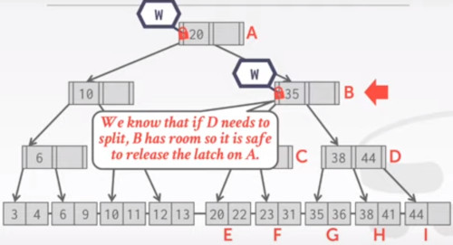

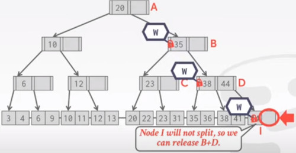

EXAMPLE 4. INSERT 25.
Now we have a problem.
- we have to split 'F'

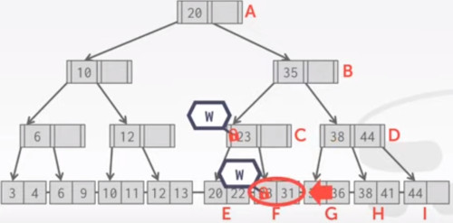

so we need to hold the latch on the parent node, to prevent someone else from accessing.

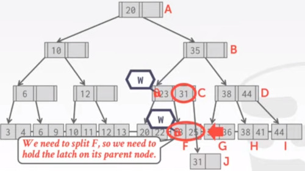

#### OBSERVATION
What was the first step that all the update examples did on the B+TREE?

- All of these cases,
- we are taking a right latch,
- we are always taking a right latch on the root node.

this can become a bottleneck if you have a lot of concurrent threads they're trying to access to the tree.

Next time we will talk about an improved version of this algorithm
