# LECTURE 9: SORTING & AGGREGATIONS

## B+TREE CONCURRENCY CONTROL.

We want multiple threads to read and update a B+TREE at the same time.

We need to protect against two types of problems.
- Threads trying to modify the contents of a node at the same time
- One Thread traversing the tree while the another thread splits/merges nodes.

An observation was, that the first step in our latching algorithm,
- to protect the content of the B+TREE,
- was that we are alwayis going to take this right latch on the **root** node of the tree.
- no matter what you do, you are latching the first node.
- as you scale up the number of threads. it becomes a performance bottleneck.
  
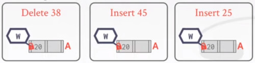

### BETTER LATCHING ALGORITHM
Takes into account the following assumptions,
- Most modifications of the B+TREE will not require a split/merge.
- Instead of assuming that we are going to split/merge, optimistically traverse the tree using read latches.
- If you guess wrong, repeat traversal with pessimistic algorithm

How does this work comparing to the original algorithm.
SEARCH: Same as before.
INSERT/DELETE: 
- Set latches as if for search, get to leaf, and set **W** latch on leaf.
- If leaf is not safe, release all latchesa, and restart the thread using previous insert/delete protocol with write latches.

This approach optimistically assumes that only leaf node will be modified; if not **R** latches set on the first pass to leaf are wasteful.

EXAMPLE 2. DELETE 38.
As sooner we go deep into the tree, we keep getting **R** read latches.
- and release them as sooner you go on step deeper.
- when you get to the leaf, get your **W** write latch,
- and it's safe to delete the value.
  
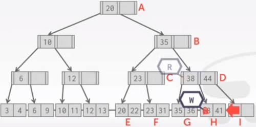

EXAMPLE 4. INSERT 25
This time, 
- there's no space for key 25 to be inserted.
- we have to split node F.
  
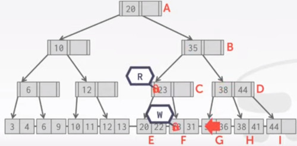

DEADLOCKS ARE NOT ALLOWED, so we have to be careful with our algorithm

### LEAF NODE SCAN
Threads so far, have acquireda latches in a 'top-down' manner.
- A thread can only acquirea a latch from a node that is below its current node.
- If the desired latch is unavailable, the thread must wait until it becomes available

But what if we want to move from one leaf node to another leaf node?

EXAMPLE, T1 wants to find keys less than 4
- we start scanning the root node, and putting a **R** latch on it.
- we move to the C node getting a **R** latch and then releasing the A's one

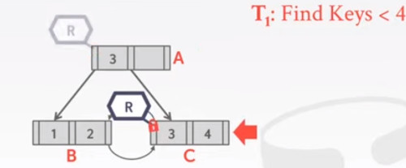

Now we scan across the leaf nodes to find our final range.

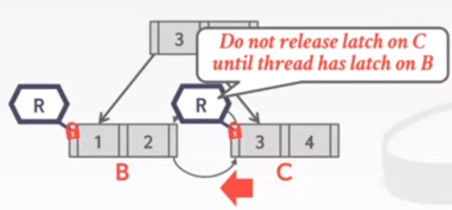

Now have T2, that wants to find keys greather than 1 at the same time T1.

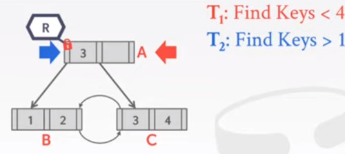

So T1 wants to scans before, 
- while T2 wants to scan forwards
- Each thread wants a latch on the other one.
  
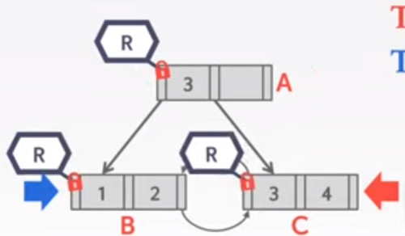

As they are both **R** latches, there's no incompatibility,
- both of them get their respective reading latch

This example works out, 
- but if we have now, arbitrary number of readers and writters at the same time
- you can pretty easily run into these kind of deadlocks.
- in this top-down fashion.

1. Latches do not support **deadlock detection** or avoidance.
  - the only way we can deal with this problem is through coding discipline.

2. The leaf node sibling latch acquisition protocol must support a 'no-wait' mode.

3. The DBMS's data structures must cope with failed latch acquisitions.

Conclusion.
Making a data structure thread-safe is notoriously difficult in practice

We focused on B+TREES, but the same high level techniques are applicable to other data structures

## INTRODUCTION
Course status.
- today we are going to start talking about how to execute queries.

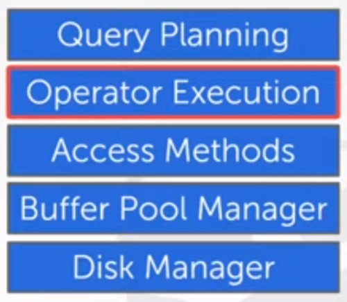

Next four lectures will be.
- Operator Algorithms
- Query Processing Models
- Runtime Architectures

## QUERY PLAN 
The operators are arranged  in a tree.

Data Flows from the leaves of the tree up towards the root.

The output of the root node is the result of the query.

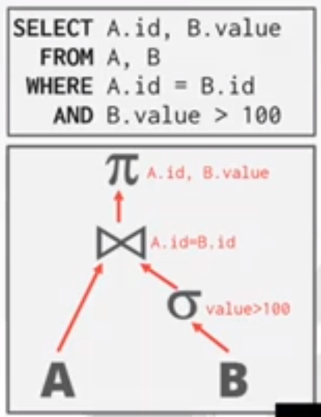

### DISK ORIENTED DBMS
We cannot assume that,
- a table fits entirely in memory,
- intermediate results are going to fit entirley in memory.

We are going to rely on the buffer pool to implement algorithms that need to spill on disk.

We are also going to prefer algorithms that maximize the amount of sequential I/O.

## TODAY'S AGENDA

- **EXTERNAL MERGE SORT**, sorting algorithm for external memory sort
- **AGGREGATIONS**, different aggregation operations. (divide and conquer)

### WHY TO SORT?
Why do we need to sort?
- Relational model/SQL is a set algebra unsorted.

Queries may request that tuples are sorted in a specific way.
- ORDER BY.

Even if the query doesn't explicity specify an order, we may still want to sort, to do the following.
- Trivial support **duplicate** elimination (DISTINCT)
- **Bulk Loading** sorted tuples into a B+TREE index is faster
- Aggregations (GROUP BY)

### SORTING ALGORITHMS
IF THE DATA **FITS IN MEMORY**, THEN WE CAN USE **ANY** STANDARD SORTING ALGORITHM'S
- like quick sort

IF DATA DOESN'T FIT IN MEMORY, then we have to use a technique that is aware of the cost of reading and writting to disk-pages.

## EXTERNAL MERGE SORT
Divide and Conquer algorithm that splits data into separate runs, sorts them individually and then combines them into longer sorted runs.

**PHASE 1**, sorting
- Sort chunks of data that fit in memory
- then write back the sorted chunks to a file on disk.

**PHASE 2**, Merging
- Combine sorted runs into larger chunks.

### SORTED RUN
A run is a list of key/value pairs.

KEY: 
- The attributes to compare to compute the sort order

VALUE:
- Tuple (early materialization)
- Record ID (late materialization)

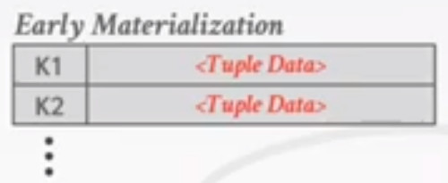

Instead of storing all the tuple data,
- we are going to store the key along with a pointer (record id)
  
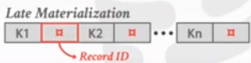

### TWO WAYS EXTERNAL MERGE SORT
we are going to merge 2 runs into a new run for each pass

Data is broken up into **N** pages

The DBMS has a finite number of **B** buffer pool pages to hold input and output data.

this quantities are customizable (postgres, MySQL, ...)

EXAMPLE, 2 ways external merge sort
- Suppose we have a dataset with 2 pages, stored in disk.

PASS 0, 
- read all **B** pages of the table into memory.
- sort pages into runs and write them back to disk.

So we have the original page on disk unchanged, 
- and we have our first sorted page on disk

The next step is to read page number 1,
- do our sort
- and save on disk.

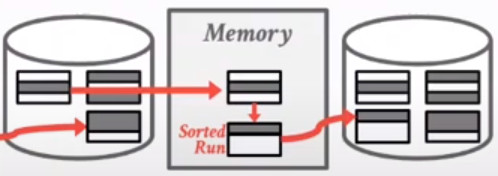

PASS 1, 2, 3, ...
- The next step is to recursively merge pairs of runs into runs twice as long
- we are going to use 3 buffer pools (2 for input pages and 1 for output)

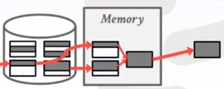

Once that page fills up,
- we are going to reuse the same output buffer pool slot.
- and we are going to fill it up with the remainder of those 2 pages.

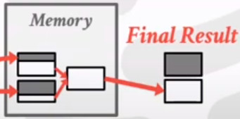

If we have more pages, we just keep repeating the process recursively

We may see a more concrete example here.
- in each pass we read and write every page in the file.

Number of passes.
- 1 for the initial pass.
- then ceiling of log_2(N), by splitting the dataset in half each time

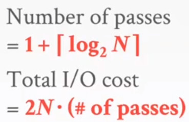

So we have this array we want to sort.
- in the pass 0, we have sorted each page run.
  
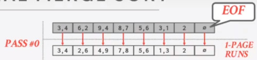

In the next step,
- we are merging consecutive runs.
- we take the minimal value of both pages
  
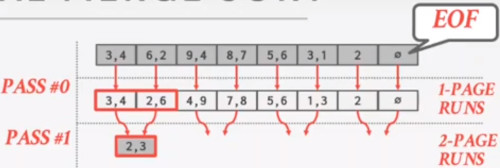

and continue the process.
- we are writting the page as soon as we fill it up
  
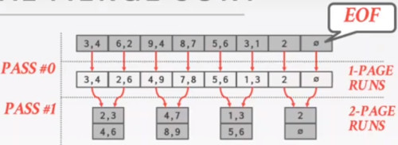

The process continues until we fill it up all the pages.

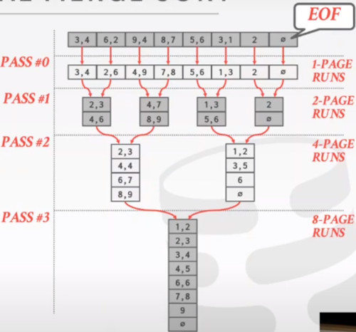

It's a divide and conquer strategies, were we split and merge.

Are these merge  phases being performed sequentially?
- or do you have multiple threads running concurrently?
- many systems partition up the work into multiple threads.

If instead of 2 buffer pools, 
- you have 4-way parallellism
- you have 4 times the number of buffer pools.

SUMMARY
- This algorithm only requires 3 buffer pools pages to perform sorting.
  - 2 inputs - 1 output
- But even if we have more buffer space available,
  - **B**>3, it does not effectively utilize them if the worker must block on disk I/O.
 
### DOUBLE BUFFER OPTIMIZATION
Prefetch the next run in the background,
- and store it in a second buffer while the system is processing the current run.
- Reduces the wait time for I/O requests at each step by continuously utilizing the disk.

While one thread is sorting page 1, 
- page 2 is being fetched ahead of time

### GENERAL EXTERNAL MERGE SORT
Now we have **B** buffer pages rather than 2,
- We produce **B/N** sorted runs of size **B**
- in each pass we are going to merge B-1 pass

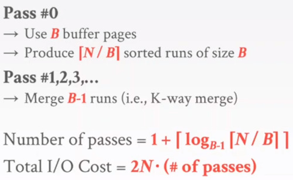

Example,
- Determine how many passes it takes to sort 108 pages with 5 buffer pool pages:
  - **N=108, B=5**
- Pass 0: 108/5 = 22 sorted runs on 5 pages each (last run is only 3 pages)
- Pass 1: 22/4  = 6 sorted runs of 20 pages each (last run is only 8 pages)
- Pass 2: 6/4   = 2 sorted runs, first one has 80 pages and second one has 28 pages.
- Pass 3: sorted file of 108 pages

so $1+[log_{B-1}(N/B)] = 1+[log_4(22)] = 1+[2.229] = 4 passes$

## USING B+TREES FOR SORTING
Instead of doing a MERGE SORT from scratch, 
- if we already have stored a B+TREE Index on the sort attributes,
- then when we can use that to accelerate sorting.

Retrieve tuples in desired sort order by simply traversing the leaf pages of the tree.

Cases to consider:
- Clustered B+TREE
- Unclustered B+TREE

### CLUSTERED B+TREE
Traverse to the left-most leaf page, and then retrieve tuples from all leaf pages

It's better than External sorting because,
- there is no computational cost, and all disk access is sequential.

So we have a bunch of pages,
- which is indexed by a B+TREE

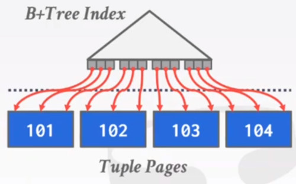

### UNCLUSTERED B+TREE
Chase each pointer to the page that contains the data.

This is almost always a bad idea, in general one I/O per data record.

It end up doing 'random access' instead of sequential

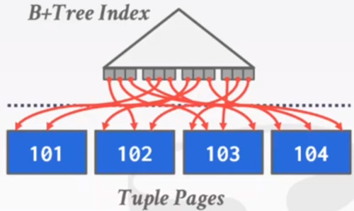

## AGGREGATIONS
Collapse values for a single attribute from multiple tuples into a single scalar value.

Two implementation choices.
- Sorting
- Hashing, this is going to be better in a lot of cases

### SORTING AGGREGATION
Image that we want to get all distinct course ids where some student get either an 'A', a 'B' or 'C'

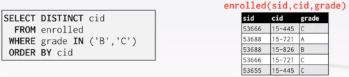

First step in our query planning is 
- to filter only grades 'B' or 'C'
- Then we remove the columns we are not going to need.
- Then we sort
- and finally we remove duplicates
  
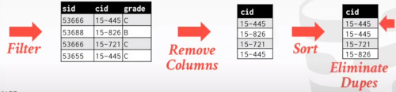

### ALTERNATIVES TO SORTING
What if we do not need the data to be ordered?
- Forming groups in **GROUP BY** (no ordering)
- Removing duplicates in **DISTINCT** (no ordering)

HASHING, is a better alternative in this scenario.
- Only need to remove duplicates, no need for ordering
- Can be computationally cheaper than sorting

### HASHING AGGREGATE
Populate an ephemeral hash table as the DBMS scans the table.
- for each record, check whether there is already an entry in the hash table.
- DISTINCT, Discard duplicate
- GROUP BY, Perform aggregate computation

If everything fits in memory, then this is easy.
- If the DBMS must spill data to disk, then we need to be smarter.

### EXTERNAL HASHING AGGREGATE
PHASE 1. PARTITION,
- Divide tuples into buckets based on hash key.
- Write them out to disk when they get full.

PHASE 2. ReHASH
- Build in-memory hash table for each partition and compute the aggregation
