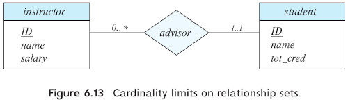

# DATABASE SYSTEM CONCEPTS (A. Silberchatz)

## PART 2: DATABASE DESIGN
### CHAPTER 6: DATABASE DESIGN USING THE E-R MODEL

#### 6.1.1: DESIGN PHASES
1. Specification of user **REQUIREMENTS**
  - There are techniques for diagrammatically represent user requirements 
2. **DATA MODEL**, (aka conceptual design)
  - Translate the requirements into a database schema
  - Typically it is a graphic representation of the schema
3. Specification of the **FUNCTIONAL REQUIREMENTS**
  - types of operations, types of transactions
  - modifying/updating data, searching and retrieve data
The following 2 steps translate the abstract model into its implementation
4. **LOGICAL DESIGN**
  - the designer maps the conceptual schema onto the data model (typically relational)
  - mapping the conceptual schema defined with the Entity-Relation model into a **relation schema**
5. **PHYSICAL DESIGN**
  - The designer uses the system specific database schema
  - the physical features of the database are specified
    - Indexes structures, File Organization
**Note**
- The Physical schema can be changed relatively easy after an application has been built
- However changes to the logical schema are usually harder to carry out,
  - may affect a number of queries, updates

#### 6.1.2 DESIGN ALTERNATIVES
**ENTITY**: Is the type representation of an object
  - people, places, products
  - They are distinct

In designing a database schema, we must ensure that we avoid 2 major pitfails.
1. **REDUNDANCY**, don't repeat yourself
  - i.e. don't repeat attribute 'title' in 'book' and 'sold' entities, use a foreign relation instead
  - ISSUE: redundancy may lead to inconsistencies
2. **INCOMPLETNESS**,
    - bad design may lead to certain aspects of the enterprise unmodeled
    - i.e. entity 'courses offered' may be a bad design for representing all courses available. a better entity would be just 'courses'

Other decisions
- Consider a customer buying a product.
  - is the sale itself an entity?
    - that is related both the customer and the produc

#### 6.2 THE ENTITY-RELATIONSHIP MODEL
Developed to facilitate the logical design of an enterprise schema.

##### 6.2.1**ENTITY SETS**
- Distinguishable object
- Each entity has a set of properties
- The values for some set of properties must uniquely identify an entity
The entity may be concrete (book, person) or it may be abstract (course, flight reservation)

An entity set is a set of entities of the same type
- that shares the same set of properties

**Extension** is used to refer to the actual collection of individual entities belonging to the entity set.

Entity sets don't need to be disjoint
- it is possible to define the entity set 'person' consisting of all people in the university.
  - but also a student or instructor may be related to a person.

An Entity is represented by a set of **attributes**
- Attributes are descriptive properties possesed by each member of an entity set.
- The designation of an attribute, expresses to the database, to store similar information of each entity.
- However each entity may have different values for each attribute
- i.e. ID, name, dept_name, salary
- in section 6.3 we discuss attributes that are composited like 'full name' or multivalued

Each entity has a **value** for each of its attributes
- Historically the governament ID was used to identify persons in companies
- but it is considered a bad practice for security and privacy reasons
- for instance, each company has to define its own identification number.

**REPRESENTATION**
- An entity set is represented in the E-R diagram with a **rectangle**
- which is divided into 2 parts, 1. the name of the entity set. 2. the name of all the attributes
- Attributes that are assosiated with the primary key are underlined.


##### 6.2.2 **RELATIONSHIP SETS**
A **relationship** is an association among several entities.
- for example an 'advisor' may asociate instructor 'Katz' with student 'Shankar'

A **Relationship set** is a set of relationships of the same type.

A **Relationship instance** is an E-R schema 
- representing an association between the named entities in the real world enterprise that is being modeled


A relationship set is represented by a **DIAMOND** in the E-R diagram.
- which is linked with lines to a number of different entity sets.
  


Formally, a **relationship set**
- Let $E_1 .. E_n$ be entity sets that **participate** into the relation.
- Then a Relationship set **R** is a subset of $\{(e_1 .. e_n ) | e_1\in E_1 .. e_n \in E_n\}$
  
$R \subseteq E_1 \times \cdots \times E_n$

The Function that an entity plays in a relationship is called a **ROLE**
- Since the __participation__ of __entity sets__ into a __relationship__ is generally distinct, roles are not specified.
- However, when the same __entity set__ __participate__ more than once into the same __relation__, **explicit roles** have to be given.
  - aka **recursive relationship set**
  - There has to be specified, how an entity participates in a relationship instance.

Consider the entity set '__course__'.
- some couse C1 may be prerequisite for another course C2.
- so we define a relationship set 'prereq',
  - characterized by pairs (C1, C2)

In the E-R diagram, Roles are **labels** into the relationship lines


A relationship may also have **descriptive attributes**
- Consider the relation set '__takes__' which relates entity sets 'student' and 'course'
- we may wish to store a descriptibe attribute named 'grade' altogether with the relationship
- An attribute of a relationship set is represented by an **undivided rectangle** connected with a **dashed line** to its diamond representation.


A relationship set may have multiple descriptive attributes
- for example 'for_credit' to record whether a student is section for credit or it's just auditing it.

**NOTE**, about multi-page diagrams
- It is a common practice to specify __relationship sets__ attributes in a diagram different from the __entity set__ one.
- Attributes of entities are specified first, but then they are ommited to avoid inconsistencies.


**NOTE**, about relationship sets.
- it is possible that many relationships apply to the same set of entities sets.
- for example 'teaching_asistant' may be also a relation between 'student' and 'courses'

In the formal definition we saw that a set cannot have duplicates,
- if follows that a particular student, can only have one association with a particular 'course'
- so that student can have only one 'grade' for that particular course.

However, if we want to allow the student to have multiple grades to the same course,
- we may have the attribute 'grade' to actually be a 'set of grades'
- souch attributes are called **MULTIVALUED ATTRIBUTES**


**DEGREE OF THE RELATIONSHIP SET**, the number of entity sets involved in the relationship set.
- **BINARY RELATIONSHIP SET**, relationships that involves 2 entity sets
- **TERNARY RELATIONSHIP SET**,
  - Consider the entity sets 'instructor', 'student' and 'research_project'
  - Each 'research_project' can have multiple 'students' and multiple associated 'instructors'
  - Furthermore, each student working in a 'research project' must have an associated 'instructor'
  - we can relate all three relationships through a ternary relationship called 'proj_guide'
    - A particular 'student' is related to a particular 'instructor' to work on a particular 'project'
      


**LUCID CHART NOTATION**
- UML standard

In this notation, we keep attributes inside the entity set.
- note that you can also include constraints (FK, PK) to a particular attribute
- The data type (int, varchar, float) are also possible to be included in the diagram


##### 6.3 COMPLEX ATTRIBUTES
For each attribute there is a set of permitted values, called **DOMAIN** or **value set** of that attribute.
- The domain of attribute 'course_id' might be the set of all text strings of certain length.
- The domain of attribute 'semester' might be strings from the set {'fall', 'winter', 'spring', 'summer'}

An attribute can be characterized by the following types.
1. **SIMPLE** and **COMPOSITE** attrutes.
   - They are **simple** attributes if they cannot be divided into subparts.
   - **composites** attributes can be divided into subparts.

For example 'name' could be structured as a composite attribute consisting of
- first_name
- last_name
Or the 'address' may be composed from
- street
- city
- state

Composite attributes help us group related attributes, making the modeling cleaner.

Note also, that a composite attribute may appear as a hierarchy.
- Street can be split into
  - street_number
  - street_name
  - apartment_number


3. **SINGLE VALUED** and **MULTI VALUED** attributes.
- **single valued**, student_id refers to only one student ID
- **multi valued**, an 'instructor' may have zero, one or multiple phone numbers.
  - and different 'instructors' may have different number of phones
  - Another example is the amount of 'departments' assigned to that instructor
    
5. **DERIVED ATTRIBUTES**
  - The value of this attribute, can be derived from the values of other related attributes or entities.
  - for example, the 'instructor' might have the attribute 'assigned students',
    - so we can derive this attribute by counting the number of 'student' entities associated to that instructor.
  - Another example is when computing the age, derived from the 'date_of_birth'
The value of the derived attributes, are not stored, but computed when required.


In the following example we show how to represent those attributes in the E-R diagram.
- **composite attribute** 'name' has 'first_name', 'middle_initial' and 'last_name'
- the composite attribute 'address' is defined through a **'hierarchy process'**
  - the 'street' is a composite attribute itself
- **{'phone number'}** denoted in brackets denotes a **multivalued** attribute
- while **'age()'** denotes a **derived** attribute.
  


An attribute takes a **'NULL'** value, when an entity does not have a value for it.
- the 'Null' value may also mean 'not applicable' or does not exists for that entity
  - for example, a person without a 'middle_inital' attribute may have that attribute set to Null.
- 'Null' may also designate that an attribute is unknown
  - it may be missing (we don't know it yet)
  - or not known (we don't know even if there exists souch a value)

##### 6.4 MAPPING CARDINALITIES
The idea is to express the number of entities that can be related to another entity
- it can be also used not only to describe binary relationship set, but any number of entities contributing to a relation.

For a binary relationionship set **R**, between sets **A** and **B** the mapping cardinality might be.

- **ONE-TO-ONE**, An entity in **A** is associated AT MOST with one entity in **B** and viceversa.


We draw a line from the relationship set to both entities sets.
- an 'instructor' may advice at most one 'student', and a 'student' may have at most one 'instructor'
  


- **ONE-TO-MANY**, An entity in **A** is associated with ANY NUMBER of entities in **B**.
  - However, An entity **B** can be associated with AT MOST ONE entity in **A**


An instructor may advice many students, but a student may have at most one advisor


- **MANY-TO-ONE**, An entity in **A** is associated with AT MOST one entity in **B**,
  - However, an entity **B** can be associated with ANY NUMBER of entities in **A**


An 'instructor' may advice at most one 'student', but a 'student' may have many instructors


- **MANY-TO-MANY**, An entity in **A** is associated with ANY NUMBER of entities in **B**.
  - Also an entity in **B** is associated with ANY NUMBER of entities in **A**

 

An 'instructor' may advice many 'students', and a 'student' may have many 'advisors'


NOTE, that the 'advisor' relationship set can be
- many-to-many, if Any number of students can be advised by any number of instructors
- one-to-one, if the university sets the constraint one advisor per student.
- many-to-one, if one instructor can be avice many students
Thus, the mapping cardinalities can vary on real-world constraints.

**NOTATION**
- We indicate cardinality contraints on a relationship by drawing either a directed line (-->), or an undirected line (---)


The participation of an entity set **E** in a relationship **R** is said to be **TOTAL**
- if every entity in **E** must participate in at least one relationship in **R**
- if every 'student' has to have at least one 'advisor', the participation would be total.
    
The participation of an entity set **E** in relationship **R** is said to be partioal
- if it's possible that some entities **E** do not participate in **R**
- if some 'student' are related with some 'advisor', the participation would be partial.

We indicate total representation by a double line
- each student has to have one advisor.


A minimum and a maximum cardinality can also be specified.
- a minimum value of 1,
  - indicates total participation of the entity set in the relationship set
  - each entity occur in at least one for that relationship.
- a maximum value of 1, indicates that the entity partcipates in at most one relationship.
  -  while a maximum value of * means no limit.
  


The line between advisor and student 1..1 means that each student must have exactly one advisor.
- the line between 'advisor' and 'instructor' indicates that an instructor can have 0 or more students.
- so the relationship is **one to many** with **total** participation of advisor over 'student'

It's easy to misinterpret that the relation 0..* being 'many to one' while the opposite is correct.

The figure 6.13, could alternatively have been drawn with a **double line** from 'student' to 'advisor'
- and an **arrow** from 'advisor' to 'instructor' in place of the cardinality constraint

In the case of nonbinary relationship sets, we can specify some types of 'many-to-one' relationship
- 'student' can have at most 1 'instructor' on a project
- This constraint must be specified by an arrow pointing to 'instructor' on the edge of 'proj_edge'
- we permit at most one arrow out of a nonbinary relationship set, since more may be misinterpreted. refer to section 6.5.2

##### 6.5 PRIMARY KEY
We must have a way to specify how entities and relationships are distinguished.

###### 6.5.1 ENTITY SETS
Conceptually, **individual entities** are **distinct**.
- However, the **differences** among them must be expressed **in terms** of their **attributes**.
- No two entities in an entity set are allowed to have exactly the same value for all attributes.

The notion of a **key** for a **relation schema**, applies directly to **entity sets**. 
- **a key** for an **entity** is a **set of attributes** that suffice to distinguish entities from each other. 
- **superkey**, **candidate key**, and **primary key** are **applicable** to **entity sets**
  - just **as** they are applicable to **relation schemas**.

###### 6.5.2 RELATIONSHIP SETS
We need a mechanism to distinguish the various relationships of a relationship set.

Let **R** be a relationship set involving entity sets $E1 , ... , En$
- Let $primary-key(Ei)$, denote the **set of attributes** that forms the **primary key** for Ei. 
- Assume that all primary keys attributes names are unique.
- The **composition** of the **primary key** for a **relationship set** depends on the **set of attributes** associated with **R**.

If the **R** has **no attributes** associated with it, 
- then the **set of attributes** describes an individual relationship in set **R**

$superkey(R) = primary-key(E1 ) \cup \cdots \cup primary-key(En)$

If the **R** **has attributes** $a1 .. am$ associated with it, 
- then the **set of attributes** describes an individual relationship in set **R**

$superkey(R) = primary-key(E1 ) \cup \cdots \cup primary-key(En) \cup \{a1 ... am \}$

If the **attribute names** of **primary keys** are **not unique** across entity sets, 
- the **attributes** are **renamed** to distinguish them;
- the **name** of the **entity set** combined with the **name** of the **attribute** would form a unique name.
- If an **entity set** **participates more than once** in a relationship set,
- the **role name** is **used** instead.

**MANY-TO-MANY**
The choice of the 'primary key' for a binary relationship set 
- depends on the **mapping cardinality** of the relationship set.
- For **many-to-many** relationships, the preceding **union** of the **primary keys**
  - is chosen as the **primary key**.

As an illustration, consider the entity sets 'instructor' and 'student', and the relationship set 'advisor', 
- Suppose that the relationship set is many-to-many.
- Then the 'primary key' of 'advisor' consists of the 'union' of the 'primary keys' of 'instructor' and 'student'.

**ONE-TO-MANY**
The **primary key** of the “many” side is a minimal superkey and is used as the primary key. 
- For example, if the relationship is many-to-one from 'student' to 'instructor'
  - that is, **each student can have at most one advisor**
  - then the **primary key** of **advisor** is simply the **primary key** of **student**.

**ONE-TO-ONE**
The **primary key** of **either one** of the participating entity sets forms a minimal superkey, 
  - if an 'instructor' can 'advise' only **one** 'student' and each 'student' can be 'advised' by only one 'instructor'
  - then the **primary key** of either 'student' or 'instructor' as the primary key for advisor.


For **nonbinary relationships**, 
if **no cardinality constraints are present**, 
- then the **superkey** formed as described earlier in this section is the only candidate key and it is chosen as the primary key.

If **cardinality constraints are present**. 
- we permit at most **one arrow** out of a relationship set.
- We do so because an E-R diagram with **two** or **more arrows** out of a nonbinary relationship set
  - can be **interpreted** in the **two ways** we describe below.

Suppose there is a relationship set **R** between entity sets **E1, E2, E3, E4**
- and the **only arrows** are on the **edges** to entity sets **E3** and **E4** .
- Then, the **two possible interpretations** are:
1. A particular combination of entities from **E1, E2** can be **associated**
  - with AT MOST **one** combination of entities from **E3, E4**.
  - Thus, the **primary key** for **R** can be constructed by the **union** of the **primary keys** of **E1** and **E2**

2. A particular combination of entities from **E1, E2, E3** can be associated
   - with AT MOST **one** combination of entities from **E4**,
   - and further a particular combination of entities from **E1, E2, E4** can be associated
   - with AT MOST **one** combination of entities from **E3**
   - Then the **union** of the **primary keys** of **E1, E2, E3** forms a
   - candidate key, as does the **union** of the primary keys of **E1**, **E2** and **E4**.

Each of these interpretations has been used in practice and **both are correct** 
- Thus, **to avoid confusion**, we **permit** only **one arrow out** of a **nonbinary relationship set**,
- in which case the two interpretations are equivalent.

In order to **represent** a situation where one of the **multiple-arrow** situations holds,
- the E-R design can be modified
- by replacing the **non-binary relationship set** with an **entity set**.

Then we can **relate** each of **those entities** to corresponding **instances** of **E1, E2, E4** 
  - via separate relationship sets.

Or a simpler approach is to use functional dependencies, 
- They allow either of these **interpretations** to be **specified** simply in an unambiguous manner.
- The primary key for **R** is then the **union** of the **primary keys** of **those participating entity sets Ei**
- that **don't have an incoming arrow** from **R**.


###### 6.5.3 WEAK ENTITY SETS
Consider a 'section', which is uniquely identified by
- a 'course id', 'semester', 'year', and 'section id'.
- 'section' entities are related to 'course' entities.
- Suppose we create a relationship set 'sec_course' between 'section' and 'course'.


Now, observe that the information in 'sec_course' is redundant, 
- since 'section' already has an attribute 'course id', which identifies the 'course' with which the 'section' is related.
- One option to deal with this 'redundancy' is to 'get rid' of the relationship 'sec_course'
- however, by doing so the relationship between 'section' and 'course' becomes 'implicit' in an attribute, which is not desirable.

An alternative way to deal with this redundancy is 
- to not store the attribute 'course id' in the section entity
- and to only store the remaining attributes sec_id, year, and semester.

However, the entity set 'section' then does not have enough attributes to 'identify' a particular section entity uniquely
- although each section entity is distinct, sections for different courses may 'share' the same 'sec_id', 'year', and 'semester'.
- To deal with this problem, we treat the relationship 'sec_course' as a special relationship
- that provides extra information,
- in this case the 'course_id', required to identify section entities uniquely.

A **weak entity set** is one whose existence is **dependent** on **another entity set**, 
- called its **identifying entity set**
- instead of associating a **primary key** with a **weak entity**, we **use** the primary key of the **identifying entity**
- along with **extra attributes**, called **discriminator attributes** to uniquely identify a weak entity.
- An **entity set** that **is not a weak entity set** is termed a **strong entity set**.
  
The weak entity set is said to be **existence dependent** on the **identifying entity set**.
- The **identifying entity set** is said to **own** the **weak entity set** that it **identifies**.
- The **relationship** associating the **weak entity set** with the **identifying entity set** is called the **identifying relationship**.
- The **identifying relationship** is **many-to-one** from the **weak entity set** to the **identifying entity set**
- and the **participation** of the **weak entity set** in the **relationship** is **total**.

The **identifying relationship set** should **not have** any **descriptive attributes**, 
- since any such **attributes** can instead **be associated** with the **weak entity set**.

In our example, the **identifying entity set** for 'section' is **'course'**, 
- and the relationship 'sec_course' which associates 'section' entities, with their corresponding 'course' entities is the identifying relationship.
- The **primary key** of 'section' is **formed** by the **primary key** of the **identifying entity set** 'course',
- **plus** the **discriminator** of the **weak entity set** 'section'.
Thus, the **primary key** is **{course id, sec id, year, semester}**.

**Note** that we could **have chosen** to make 'sec_id' globally unique across all courses offered in the university, 
- in which case the 'section' would have had a primary key.
- However, conceptually, a 'section' is still dependent on a course for its existence,
- which is made **explicit** by making it a **weak entity set**.
  
In E-R diagrams, a weak entity set is depicted via a **double rectangle** 
- with the **discriminator** being **underlined** with a **dashed line**.
- The relationship set connecting the **weak entity set** to the **identifying strong entity set** is depicted by a **double diamond**.

In Figure 6.14, the **weak entity set** 'section' depends on the **strong entity set** 'course' via the relationship set 'sec_course'.
- The figure also illustrates the use of **double lines** to indicate that the **participation**
- of the (weak) entity set section in 'sec_course' is **total**,
- meaning that **every section** must be **related** via **sec course** to some **course**.
- Finally, the **arrow** from 'sec_course' to 'course' indicates that **each section** is **related** to a **single course**.

In general, a **weak entity set** must have a **total participation** in its **identifying** relationship set,
- and the **relationship** is **many-to-one** toward the **identifying** entity set.
- A **weak entity set** can **participate** in **relationships** other than the **identifying relationship**.
- For instance, the **section entity** could **participate** in a **relationship** with the **time slot** entity set,
- identifying the **time** when a **particular** class **section** meets.
- A **weak entity set** may **participate** as **owner** in an **identifying relationship** with **another weak entity set**.

It is also **possible** to have a **weak entity set** with **more** than **one identifying entity set**.
- A particular **weak entity** would then be **identified** by a **combination of entities**,
- **one** from each **identifying entity set**.
- The **primary key** of the **weak entity set** would consist of the **union**
- of the **primary keys** of the **identifying entity sets**,
- **plus** the **discriminator** of the **weak entity set**.

###### 6.6 REMOVING REDUNDANT ATTRIBUTES IN ENTITY SETS
When designing a database using the E-R model, 
1. identify entity sets
  - For example, 'student' and 'instructor'
2. choose the appropriate attributes
  - for 'instructor', we will include the attributes ID , name, dept name, and salary
  - We could have added the attributes phone number, office number, home page, and others.
  - The choice of what attributes to include is up to the designer
3. Form the relationship sets among the various entities
  - Redundancies are possible and need to be removed.
  - Consider the entity sets 'instructor' and 'department':
    - 'instructor' includes the attributes ID, name, **dept_name**, and salary
    - 'department' includes the attributes **dept_name (PK)**, building, and budget
    - Since it is the **primary key** for 'department', it is **redundant** in 'instructor' and needs to be removed.
  - Treating the connection between 'instructors' and 'departments' uniformly as a **relationship** instead of an attribute
    - the attribute 'dept_name' in fact gets added, if each instructor has at most one associated department
    - also, it helps avoid a premature assumption that each 'instructor' is associated with only **one department**
    - also, the 'student' entity set is related to the 'department' through the relationship set 'student_dept'    
      - and thus there is **no need** for a 'dept_name' attribute in 'student'.
  - a good entity-relationship design, does not contain redundant attributes


In our university database, 
- we have a **constraint** that each 'instructor' must have EXACTLY ONE associated 'department'. 
  - As a result, there is a **double line (TOTAL participation)** between 'instructor' and 'inst_dept',
- there is an **arrow** from 'inst_dept' to 'department',
  - indicating that each 'instructor' can have AT MOST ONE associated 'department'

Similarly, entity set 'course' has a **double line** to relationship set 'course_dept', 
- indicating that every 'course' must be in some 'department',

'student' has a **double line** to relationship set 'stud_dept',
- indicating that every 'student' must be majoring in some department.
- In each case, an **arrow** points to 'department' to show that a 'course' (and 'student')
  - can be related to ONLY ONE 'department'

The relationship set 'takes' has a descriptive attribute 'grade', 
- and that each 'student' has at most one advisor. 
The figure also shows that 'section' is a **weak entity** set, 
  - with attributes 'sec_id', 'semester', 'year' forming the **discriminator**
  - 'sec_course' is the **identifying relationship set** relating **weak entity set** 'section' to the **strong entity set** 'course'.

#### 6.7 REDUCING E-R DIAGRAM TO RELATIONAL SCHEMAS
In this section, we describe how an E-R schema can be represented by relation schemas and 
- how constraints arising from the E-R design can be mapped to constraints on relation schemas.

##### 6.7.1 REPRESENTATION OF STRONG ENTITY SETS
Let **E** be a **strong entity set** with only simple **descriptive attributes** **a1 .. an**. 
- We **represent** this entity with a **schema** named **E** with **n** **distinct** attributes.
- Each **tuple** in a **relation** on this **schema** corresponds to ONE entity **E**.
- **primary key** of the entity set serves as the **primary key** of the resulting schema 
  - 'student' has 'ID', 'name', 'tot_cred' will be represented as:
  - student (ID, name, tot cred)
```
# FIG. 6.16
classroom(BUILDING, ROOM_NUMBER, capacity)
department(DEPT_NAME, building, budget)
course(COURSE_ID, title, credits)
instructor(ID, name, salary)
student(ID, name, tot_cred)
```

##### 6.7.2 REPRESENTATION OF STRONG ENTITY SETS WITH COMPLEX ATTRIBUTES
When a **strong entity set** has **complex attributes**
- we create a **separate attribute** for each **component**
- we do not create a separate attribute for the composite attribute itself.
- 'instructor' has composite attribute 'name',
  - the schema generated for instructor contains the attributes
    - first_name, middle_initial, last_name
```
instructor (ID, first_name, middle_initial, last_name,
                street_number, street_name, apt_number, city, state, postal_code,
                date_of_birth)
```
**Derived attributes** 
- can be represented as **stored procedures**
  
**Multivalued attributes**
- new relation schemas are created for these attribute.
- 'instructor', includes the multivalued attribute 'phone_number'.
  - The **primary key** of instructor is ID.
  - For this multivalued attribute, we create a relation schema
- In addition, we create a **foreign-key** referencing the newly created schema
```
instructor_phone (ID, phone_number)
```


##### 6.7.3 REPRESENTATION OF WEAK ENTITY SETS
Let **A** be a **weak entity set** with attributes **a1 .. am** 
Let **B** be the **strong entity set** on which **A** depends. 
  - Let the primary key of B consist of attributes b1 .. bn.

The combination of the **primary key** of the strong entity set and the **discriminator** of the weak entity set serves as the primary key of the schema.
$\{a1 .. am\} \cup \{b1 .. bn \}$
  
In addition to creating a **primary key**, we also create a **foreign-key** constraint on the relation A,
- specifying that the attributes **b1 .. bn** reference the **primary key** of the relation **B**.
- ensures that each tuple representing the weak entity, there is a corresponding tuple representing the strong entity.

The **primary key** of the 'course' entity set, on which 'section' depends, is 'course_id'.
- Thus, we represent 'section' by a schema with the following attributes:
  - section (COURSE_ID, SEC_ID, SEMESTER, YEAR)
  
##### 6.7.4 REPRESENTATION OF RELATIONSHIP SETS
Let **R** be a relationship set, 
- let **a1 .. am** be the attributes formed by the **union** of the **primary keys** of the entity sets participating in R
- let the descriptive attributes (if any) of **R** be **b1 .. bn**
  
We **represent** this relationship set by a **relation schema** called **R** 
- with **one attribute** for each member of the set
  $\{a1 .. am \} \cup \{b1 .. bn \}
- consider the relationship set 'advisor' involving 'instructor' and 'student'
  - the advisor schema has two attributes, the **primary keys** of 'instructor' and 'student'.
  - Since both attributes have the **same name**, we rename them 'i_ID' and 's_ID'. 
  - Since the 'advisor' relationship set is **many-to-one** from 'student' to 'instructor'
    - the **primary key** for 'advisor' is 's_ID'
  - we create a **foreign-key** referencing the **primary key** of Ei in **R**
    - we thus create two foreign-key constraints on the 'advisor' relation,
    - **'i_ID'** referencing the **primary key** of 'instructor'
    - **'s_ID'** referencing the **primary key** of 'student'.

Applying the preceding techniques we get the relational schemas depicted in Figure 6.17. 
```
# Figure 6.17
teaches (ID, COURSE_ID, SEC_ID, SEMESTER, YEAR)
takes (ID, COURSE_ID, SEC_ID, SEMESTER, YEAR, grade)
prereq (COURSE_ID, PREREQ_ID)
advisor (S_ID, i_ID)
sec_course (COURSE_ID, SEC_ID, SEMESTER, YEAR)
sec_time slot (COURSE_ID, SEC_ID, SEMESTER, YEAR, time_slot_id)
sec_class (COURSE_ID, SEC_ID, SEMESTER, YEAR, building, room_number)
inst_dept (ID, dept_name)
stud_dept (ID, dept_name)
course_dept (COURSE_ID, dept_name)
```

Observe that for the case of the relationship 'set_prereq', 
- the **role** are used as **attribute names**,

Foreign keys are not shown in Figure 6.17, 
- but for each of the relations in the figure there are two foreign-key constraints,
- Thus, for example, 'sec_course' has **foreign keys** referencing 'section' and 'classroom',
  - 'teaches' has **foreign keys** referencing 'instructor' and 'section'
  - 'takes' has **foreign keys** referencing 'student' and 'section'.
 
##### 6.7.5 REDUNDANCY OF SCHEMAS
A relationship set linking a **weak entity set** to the corresponding **strong entity set** is redundant.
- **many-to-one** and **have no descriptive attributes**
- The **primary key** of weak 'section' is {'course_id', 'sec_id', 'semester', 'year'},
- The **primary key** of strong 'course' is 'course_id'.
- Since sec_course has no descriptive attributes,
  - the sec_course schema has attributes 'course_id', 'sec_id', 'semester', 'year'
  - The schema for 'section' includes 'course_id', 'sec_id', 'semester', 'year'
  - Every (course id, sec id, semester, year) combination in a 'sec_course' relation would also be present in 'section'
    - and vice versa.
    - Thus, the 'sec_course' schema is redundant.

##### 6.7.6 COMBINATION OF SCHEMAS
Consider a **many-to-one** relationship set **AB** from entity **A** to **B**
- Using our algorithm, we get three schemas:
  - A, B, and AB.
  - Suppose total participation of A, every entity in A must participate in relationship AB.
  - Then we can combine the schemas A and AB into the union of attributes of both schemas.
In the case of **one-to-one** relationships, the combined schemas can be either of the entity sets.
- We can combine schemas even if the participation is partial by using null values. 

#### 6.8 EXTENDED E-R FEATURES
In this section, we discuss the extended E-R features of 
- specialization
- generalization
- higher/lower-level entity sets,
- attribute inheritance
- aggregation

##### 6.8.1 SPECIALIZATION
A **subset** of entities may have **attributes** that are **not shared** by all the entities.
- As an example, 'person' may be further classified as 'employee' or 'student'
  - 'employee' may have 'salary', whereas 'student' 'tot_cred'.   
  - The specialization of 'person' allows us to distinguish among person entities.
    - in general, a person could be an employee, a student, both, or neither.
  - We can apply specialization repeatedly to refine a design
    - The university could create two specializations of 'student', namely 'graduate' and 'undergraduate'.


An entity set may be specialized by more than one distinguishing feature. 
- In our example, the distinguishing feature among employee is the job the employee performs.
- Another, coexistent, specialization could be based on whether the person is a temporary or permanent employee 

When more than one specialization is formed on an entity set, 
- a particular entity may belong to **multiple specializations**.
- a given 'employee' may be a 'temporary employee' who is a 'secretary'

In terms of an E-R diagram, **specialization** is depicted by a **hollow arrow-head** pointing 
- **from the specialized entity** to the other entity
- We refer to this relationship as the ISA relationship, which stands for “is a” and represents,
  - for example, that an instructor “is a” employee.

We depict specialization in an E-R diagram based on whether an entity belong to one or multiple specialized entity sets
- one specialized entity, is called **disjoint specialization**
  - a **single arrow** is used
  - as is the case for 'instructor' and 'secretary' as **specializations** of 'employee'
- multiple specialized entity, is called **overlapping specialization**
  - two **separate arrows** are used.
  - as is the case for 'student' and 'employee' as **specializations** of 'person'
  
The specialization relationship may also be referred to as a **superclass-subclass** relationship. 
- Higher- and lower-level entity sets are depicted as regular entity sets
  - that is, as rectangles containing the name of the entity set.
    
##### 6.8.2 GENERALIZATION
The design process may also proceed in a bottom-up manner,
- in which multiple entity sets are synthesized into a higher-level entity set on the basis of common features.

The database designer may have first identified:
- 'instructor(ID, name, salary, rank)'
- 'secretary(ID, name, salary, hours per week)'
- Note similarities between attributes

For all practical purposes, generalization is a simple inversion of specialization.
- we apply both processes, in the designing the E-R schema
- we do not distinguish between specialization and generalization.
  - New levels of entity representation are distinguished (specialization) or synthesized (generalization)

Differences in the two approaches may be characterized by their starting point and overall goal.
- Specialization emphasizes differences among entities 
- Generalization proceeds from the recognition that a number of entity sets share some common features

##### 6.8.3 ATTRIBUTE INHERITANCE
The **attributes** of the higher-level entity sets are said to be **inherited** by the lower-level entity sets. 
  - 'student' and 'employee' inherit the attributes of 'person'. 
  - 'student(ID, name, street, city, **tot_credit**)'
  - 'employee(ID, name, street, city, **salary**)'

Attribute inheritance applies through all tiers of lower-level entity sets; 
- 'instructor' and 'secretary', which are **subclasses** of 'employee'
- inherit the attributes ID, name, street, and city from person, in addition to inheriting salary from employee.

A lower-level entity set (or subclass) also inherits **participation** which participates. 

##### 6.8.4 CONSTRAINTS OF SPECIALIZATIONS
Constraint on specialization, 
- we saw earlier whether a specialization is **disjoint** or **overlapping**
  - **Disjoint Specialization**
    - Each entity instance of the superclass belongs to exactly one of the subclases
    - 'CAR' and 'MOTORCYCLE' are disjoint as each instance is either a car or a motorcycle, never both.
  - **OVERLAPPING**
    - Allows the specialization to belong to more than one subclass.
    - 'ELECTRIC VEHICLE' and 'SPORTS VEHICLES' where a vehicle could be both specialized at the same time.
- Another type of constraint is a **completeness** constraint,
  - **Total specialization**
    - EACH higher-level entity has to belong to AT LEAST one lower-level entity set.
    - 'VEHICLE' can be specialized in 'CAR' and 'MOTORCYCLE'
      - There cannot exist a 'VEHICLE' that is neither a 'CAR' or a 'MOTORCYCLE'
    - We specify total specialization by adding the keyword “total” in the diagram
      - and drawing a **dashed line** to the corresponding **hollow arrowhead** to which it applies
  - **Partial specialization**
    - Some higher-level entities may not belong to any lower-level entity set
    - There can exists a 'VEHICLE' that is neither a 'CAR' nor a 'MOTORCYCLE'
    - is the default.
    
Thus, specializations may be partial-overlapping, partial-disjoint, total-overlapping, and total-disjoint.

When a total completeness constraint is in place, 
- an entity inserted into a higher-level entity set must also be inserted into at least one of the lower-level entity sets. 
An entity that is deleted from a higher-level entity set
- must also be deleted from all the associated lower-level entity sets to which it belongs

##### 6.8.5 AGGREGATION
One **limitation** of the E-R model is that it cannot express **relationships** among **relationships**. 
- Consider the ternary relationship proj_guide, between an 'instructor', 'student' and 'project'
- Now suppose that each 'instructor' guiding a 'student' on a 'project'
  - is required to file a monthly evaluation report. 
  - We model the **evaluation report** as an entity 'evaluation(ID)'
    


One alternative for recording the (student, project, instructor) combination
- is to create a quaternary (4-way) relationship 'eval_for' between 'instructor', 'student', 'project', and 'evaluation'. 


It appears that 'proj_guide' and 'eval_for' can be combined.
- Nevertheless, some 'instructor', 'student', 'project'  may not have an associated 'evaluation'.

There is redundant information in the resultant figure, however, since every instructor, student, project combination in eval for must also be in proj guide. 

If 'evaluation' was modeled as a **value** rather than an **entity**, 
- we could instead make **evaluation** a **multivalued composite attribute** of 'proj_guide' 
- not be an option if an 'evaluation' may also be related to **other entities** 
  - for example, each **evaluation report** may be associated with a 'secretary' responsible of scholarship payments.

**Aggregation**
- is an abstraction through which **relationships** are treated **as** higher-level **entities**. 
- 'proj_guide' treated in the same manner as is any other entity set. 
  - then create a **binary relationship** 'eval_for' between 'proj_guide' and 'evaluation'
  -  to represent which (student, project, instructor) combination an evaluation is for. 


##### 6.8.6 REDUCTION TO RELATION SCHEMAS
We now describe how the extended E-R features into relation schemas.

###### 6.8.6.1 REPRESENTATION OF GENERALIZATION
**METHOD 1. Create a schema for the higher-level entity set**
For each lower-level entity set,
- create a schema, that includes an **attribute** for each of the attributes of that **entity** set
- plus the **primary key attributes** of the **higher**-level entity set.

Thus, for the E-R diagram of Figure 6.18 (ignoring the 'instructor' and 'secretary' entity sets) we have three schemas:
```
person (PERSON_ID, name, street, city)
employee (PERSON_ID (FK), salary)
student (PERSON_ID (FK), tot_cred)
```
In addition, we create **foreign-key** constraints on the lower-level entity sets.

**METHOD 2. If the generalization is disjoint and complete**
Here, we **do not create** a schema for the **higher**-level **entity** set. 
- Instead, we duplicate the superclass attributes into the lower-level.
```
employee (PERSON_ID, name, street, city, salary)
student (PERSON_ID, name, street, city, tot_cred)
```

One drawback of the second method lies in **defining foreign-key** constraints. 
- we do not have a single relation to which a foreign-key can refer
  
To avoid this problem, 
  - we need to create a relation schema 'person' containing at least the **primary-key** attributes of the 'person' entity.
    
If the second method were used for an **overlapping** generalization, 
- some values would be stored multiple times, unnecessarily.
- if a 'person' is **both** an 'employee' and a 'student', 
  - values for 'street' and 'city' would be stored twice.
  
If the generalization were **disjoint** but **not complete**
- that is, if **some person** is neither an **employee** nor a **student**—
- then an extra schema would be required to represent such people. 
```
person(PERSON_ID, name, street, city)
```

However, the problem with **foreign-key** constraints mentioned above would remain. 
- suppose 'employees' and 'students' are additionally **represented** in the 'person' relation.
- 'name', 'street', and 'city' would then be stored redundantly in the **'person'** relation
The result is exactly the first method we presented. 

###### 6.8.6.2 REPRESENTATION OF AGGREGATION
Consider Figure 6.20. 
- The schema for 'eval_for' between the aggregation of 'proj_guide' and 'evaluation'
  - includes an attribute for each attribute in the primary keys of 'evaluation' and 'proj_guide'
  - It also includes the attributes of 'eval_for'

#### 6.9 ENTITY-RELATIONSHIP DESIGN ISSUES
The notions of an **entity set** and a **relationship set** are not precise, 
- it's possible to define a set of entities and the relationships among them in a number of ways.
  
##### 6.9.1 COMMON MISTAKES IN E-R DIAGRAMS
A **common mistake** when creating E-R models 
- is using the **primary key** of an entity as an **attribute** of another entity, instead of using a **relationship**
- it's incorrect to have **'dept_name'** as an attribute of 'student'
- even though it is present as an attribute in the relation schema for student.
- **'stud_dept'** is the **correct** way to represent this information in the E-R model, 


Another related mistake that people sometimes make is to designate the primary-
key attributes of the related entity sets as attributes of the relationship set. For example,
ID (the primary-key attributes of student) and ID (the primary key of instructor) should
not appear as attributes of the relationship advisor. This should not be done since the
primary-key attributes are already implicit in the relationship set.6
A third common mistake is to use a relationship with a single-valued attribute in
a situation that requires a multivalued attribute. For example, suppose we decided to
represent the marks that a student gets in different assignments of a course offering
(section). A wrong way of doing this would be to add two attributes assignment and
marks to the relationship takes, as depicted in Figure 6.21b. The problem with this
design is that we can only represent a single assignment for a given student-section pair,
since relationship instances must be uniquely identified by the participating entities,
student and section.
One solution to the problem depicted in Figure 6.21c, shown in Figure 6.22a, is to
model assignment as a weak entity identified by section, and to add a relationship marks
in between assignment and student; the relationship would have an attribute marks. An
alternative solution, shown in Figure 6.22d, is to use a multivalued composite attribute
{assignment marks} to takes, where assignment marks has component attributes assign-
ment and marks. Modeling an assignment as a weak entity is preferable in this case,
since it allows recording other information about the assignment, such as maximum
marks or deadlines.
When an E-R diagram becomes too big to draw in a single piece, it makes sense
to break it up into pieces, each showing part of the E-R model. When doing so, you
may need to depict an entity set in more than one page. As discussed in Section 6.2.2,
attributes of the entity set should be shown only once, in its first occurrence. Subse-
quent occurrences of the entity set should be shown without any attributes, to avoid
repeating the same information at multiple places, which may lead to inconsistency.
##### 6.9.2 USE OF ENTITY SETS VS ATTRIBUTES
##### 6.9.3 USE OF ENTITY SETS VS RELATIONSHIP SETS
##### 6.9.4 BINARY VS n-ARY RELATIONSHIP SETS
#### 6.10 ALTERNATIVE NOTATIONS FOR MODELING DATA
##### 6.10.1 ALTERNATIVE E-R NOTATIONS
##### 6.10.2 THE UNIFIED MODELING LANGUAGE (UML)
#### 6.11 OTHER ASPECTS OF DATABASE DESIGN
##### 6.11.1 FUNCTIONAL REQUIREMENTS
##### 6.11.2 DATA FLOW, WORKFLOW
##### 6.11.3 SCHEMA EVOLUTION
#### 6.12 SUMMARY
### CHAPTER 7: RELATIONAL DATABASE DESIGN
