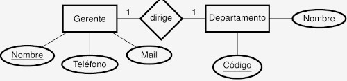

# Resumen de la materia de base de datos.

## NOMENCLATURA
             (min_2, max_2)                       (min_1, max_1)
[ENTIDAD_1] -------------------------@-------------------------- [ENTIDAD_2]
1. La cardinalidad se expresa en el lado opuesto
2. si el min = 0, significa participación parcial, ya que es optativo
3. si el min=1 y max=1, significa participación total, es decir hay un A para cada B y viceversa
4. si el min=1 y max=4, significa participación parcial, conociendo el destino no es posible reconstruir el origen.

## MODELO RELACIONAL

**DOMINIO**: Conjunto de valores homogéneos (mismo tipo)
  - D1 = {Barcelona, Sevilla, Bs As}
**PRODUCTO CARTESIANO**: Todas las combinaciones que pueden obtenerse con el dominio de 2 atributos
  - $\{(a, b) : a\in A, b\in B \}
  - $D1\times D2$ = {(Barcelona, Argentina), (Barcelona, España), ... (Bs As, España)}
**RELACION**: Subconjunto del producto cartesiano
  - R = {(Barcelona, España) .. (Bs As, Argentina)}

--- 

**ESQUEMA DE RELACION**: Nombre de relación seguido por lista de atributos
  - R(A1 .. An)
  - Peliculas(nombre, año, num. oscars)
**DOMINIO DE ATRIBUTO**: Los valores que dicho atributo puede tomar
  - D(nombre) = string
  - D(año) = datetime
  - D(num. oscars) = Naturales
**ESQUEMA DE BASE DE DATOS**: Conjunto de esquemas de relación junto a Conjunto de restricciones de integridad
  - S = {R1 .. Rm}
  - **Cine** = {**Peliculas**(nombre, año, oscars), **Actores**(nombre, pais), **Actuaciones**(nombre_actor)}

---

**TUPLA**: una instancia de la relación
  - (kill bill, 2003, 0)
**VALOR**: instancia de un atributo de una tupla
  - t[A]=t.A
  - t[nombre] = t.nombre = "kill bill"
**CARDINALIDAD**: Cantidad de tuplas que posee la relación
  - n(R)
  - n(Peliculas) = 4 (si guardaste 4 peliculas)

### RESTRICCIONES
**Nota.** Los atributos deben ser atómicos, no se permite compuestos o multivaluados

**RESTRICCIONES DE DOMINIO**: el valor del A de una tupla t debe pertenecer al dom(A)
  - t_1[nombre] = 8. MAL
  - t_2[nombre] = Kill bill. BIEN
  - t_3[nombre] = NULL. Nulo era o no parte del dominio?
**RESTRICCIONES DE UNICIDAD**: No pueden existir t_1 y t_2 que coincidan en los valores de todos sus atributos
  - t_1=(Kill Bill, 2003, 0)
  - t_2=(Kill Bill, 2003, 0) . MAL
  **SUPERCLAVE**: subconjunto de atributos que identifican unicamente a la tupla
    - {nombre, año, oscars} . BIEN (nombre unico)
    - {nombre, oscars}      . BIEN
    - {oscars}              . MAL, sabiendo num. oscars no sabes que peli era
    **CLAVE PRIMARIA**: El conjunto minimal de superclaves
      - {nombre}            . Con esto ya identifico a la pelicula

**RESTRICCION DE INTEGRIDAD**
  **DE ENTIDAD**: La clave primaria no puede tomar el valor nulo
    - Pelicula("", 2000, 0) . mal, debe tener un nombre
  **REFERENCIAL**: Los atributos de la clave foránea deben referir a entidades existentes
    - Si un actor interpretó Star Wars, dicha película debe existir
    - Sean R(A1 .. An) y S(B1 .. Bm) dos relaciones de entidad
      - $FK \subset \{A1 .. An\}$ . Sea FK la **clave foranea** de S en R
      - $PK \subset \{B1 .. Bm\}$ . Sea Pk la **clave primaria** de S
      - Entonces: 
        - para todas las tuplas t_i no nulas, existe una tupla s que puede ser referenciada por FK
         $\forall t \in R: t[FK]\neq Null \rightarrow \exists s\in s : s[PK]=t[FK]$

      
### OPERACIONES
- Operaciones de consulta (Read)
  - Al no modificar nada, no violan restricciones
- Operaciones de actualización (Write)
  - Inserción: al insertar una tupla se puede violar
    - Restricciones de dominio
    - Restricciones de unicidad
    - Restricciones de integridad de entidad
    - Restricciones de integridad referencial
    - SOLUCION: RECHAZAR OPERACION
  - Eliminación: Puede violar
    - Restricciones de integridad referencial
    - SOLUCION:
      - RECHAZAR OPERACION
      - ELIMINAR EN CASCADA (todos los que me hacían referencia, desaparecen)
      - PONER EN NULO (a todos los que me hacían referencia)
  - Modificación:
    - Clave Foránea: verificar integridad referencial
    - Clave Primaria:
      - Verificar restriccion de integridad de entidad
      - Verificar restriccion de integridad referencial
     

**TRANSACCIONES**: Conjunto ordenado de operaciones que o se ejecutan todas o ninguna
  - En caso de violar alguna restriccion, se deben deshacer los cambios

### PASAJE DE MODELOS
- Silberchatz 6.8.6
  
**CASO 1** Entidad con atributos

```
Pais(Nombre PK, poblacion, area)
```
**CASO 2** Atributos Multivaluados
- los atributos multivaluados se modelan con una tabla o relación aparte
  


```
Medicos(legajo PK, nombre)
Telefonos(legajo FK PK, telefono PK)
Mails(legajo FK PK, mail PK)
```

**CASO 3** Atributos Compuestos
- los sub-atributos se incluyen como si fuesen atributos normales


```
Tarjeta(MII PK, issuer_subid PK, cuenta PK, checksum PK, fecha_venc)
```

**CASO 4** ENTIDADES DEBILES
- En este caso no es necesario representar la interrelación 'tiene'
- La entidad débil tiene como FK la PK que lo identifica y su atributo privado
  


```
Hoteles(nombre_hotel PK, direccion)
Habitaciones(numbero_habitacion PK, nombre_hotel FK PK, capacidad)
```

**CASO 5** INTERRELACION CON CARDINALIDAD ARBITRARIA
- Aprobaciones necesita ambas claves foráneas para definirse,
  - entonces tanto padrón como código son PK


```
Alumnos(padron PK, nombre) #Entidad 1
Asignaturas(codigo PK, nombre) #Entidad 2
Aprobaciones(padron PK FK, codigo PK FK, fecha) #Interrelación
```

**CASO 6** INTERRELACION CON CARDINALIDAD 1:1
- Cuando la cardinalidad es 1, saber el gerente sabe el dpto.
  - sólo una PK es necesaria para definir la relación
- El viceversa también es válido
  


```
Gerentes(nombre_gerente PK, tel, mail)
Departamentos(codigo PK, nombre)
Dirige(nombre_gerente FK PK, codigo FK)
```

**CASO 7** INTERRELACION CON CARDINALIDAD 1:1 Y PARTICIPACION TOTAL DE UNA ENTIDAD
- Si además una entidad tiene participación total,
  - se escoje esa entidad como clave primaria de la relación
- En este caso Gerente tiene participación total
  - cada gerente tiene un departamento, pero además existen dptos sin asignar.
- En este caso nos ahorramos la tabla 'dirige'
  - y gerente toma la FK del dpto
    


```
Gerentes(nombre_gerente PK, telefono, mail, codigo_dpto FK)
Departamentos(codigo PK, nombre_dpto)
```
**CASO 8** INTERRELACION CON CARDINALIDAD 1:1 Y PARTICIPACION TOTAL DE AMBAS ENTIDADES
- En este caso particular, definir al gerente define al dpto y viceversa.
- Es posible ahorrarse dos tablas,
- luego una sóla PK (gerente o dpto) es suficiente para definir una super tupla.
  


```
GerentesDepartamentos(nombre_gerente PK, tel, mail, codigo_dpto, nombre_dpto)
```
**CASO 9** INTERRELACION CON CARDINALIDAD 1:N 
- El caso general usa 3 tablas
- Determinar el futbolista, determina el club
- Así que la tabla usa como PK el que tiene cardinalidad 1
  


```
Futbolistas(nombre_fut PK, f_nac, pais)
Clubes(nombre_club PK, pais PK, division)
JuegaEn(nombre_fut FK PK, nombre_club FK, pais FK)
```

**CASO 10** INTERRELACION CON CARDINALIDAD 1:N Y PARTICIPACION TOTAL
- Aqui nos ahorramos una tabla
- En este caso existen clubes vacíos
- Pero cada jugador pertenece a un único club.
  - Determinar al futbolista determina el club,
    - el recíproco, conocer el club puede tener jugadores nulos y la tupla queda mal formada
  - El futbolista tiene el FK del club
    


```
Futbolistas(nombre_fut PK, f_nac, pais_fut, nombre_club FK, pais_club FK)
Clubes(nombre_club PK, pais_club PK, division)
```

**CASO 11** INTERRELACION TERNARIA N:N:N
- A veces un mismo actor puede interpretar varios personajes en una misma película
- o un personaje de una película ser interpretado por muchos actores
- También existen personajes que existen en múltiples películas (han solo en star wars 1,2,3)

- Simplemente se crea una tabla extra para modelar esta interrelación entre personajes, películas y actores.
  - Las 3 primary keys son también PK de la interrelación
    


```
Actores(nombre_actor PK, pais)
Peliculas(nombre_pelicula PK, año)
Personajes(nombre_personaje PK)
Interpreta(nombre_actor FK PK, nombre_pelicula FK PK, nombre_personaje FK PK)
```

**CASO 12** INTERRELACION TERNARIA 1:N:N
- En una escuela, docentes enseñan asignaturas (matematica, historia)
- Los cursos son los grados (3ºA, 3ºB)
- Cada asignatura en cada curso es enseñada por un único docente
  - el mismo docente puede dar la misma asignaturas en distintos cursos
  - el mismo docente puede dar distintas asignaturas en el mismo curso
- 1 docente puede enseñar N pares (curso, asignatura)
- N asignaturas pueden ser asignadas a (1 docente, en N cursos)
- La cardinalidad determina la cantidad de instancias que pueden aparecer, fijadas las instancias de las otras entidades
  - Si conozco el curso y la asignatura, automáticamente sé que docente es
  - Así que el nombre del docente no es PK de Enseña
    


```
Docentes(nombre_docente PK)
Cursos(nombre_curso PK)
Asignaturas(nombre_asignatura PK)
ENSEÑA(nombre_curso FK PK, nombre_asignatura FK PK, nombre_docente FK)
```

**CASO 13** INTERRELACION TERNARIA 1:1:N
En un hipódromo, se corren varias carreras,
- participan hockeys y caballos
- En una carrera, cada Jokey está asociado a un caballo
- y el caballo solo es montado por un único hockey.
- en distintas carreras un jockey puede variar de caballo
- y un mismo caballo ser montado por distintos jockeys.

En este caso, se puede elegir cual de las dos PK caballo o hokey no es necesario determinar


```
Carrera(dia PK, hora PK, largo)
Caballo(nombre_caballo PK)
Jokey(nombre_jockey PK, peso)
Corre(dia FK PK, hora FK PK, nombre_caballo FK PK, nombre_hokecy FK)
Corre(dia FK PK, hora FK PK, nombre_caballo FK   , nombre_hokecy PK FK) #Alternativa
```

**CASO 14** INTERRELACION TERNARIA 1:1:1
- En este caso hay diferentes alternativas
- Supongamos que en vez de I, usamos A, para que quede una interrelación entre A, B, C 1:1:1


**Opción 1**, definir la tabla entera
- con alguna clave foránea como primaria
```
A(idA PK, A1)
B(idB PK, B1)
C(idC PK, C1)
Ternary(idA FK PK, idB FK   , idC FK   ) #alternativa 1
Ternary(idA FK   , idB FK PK, idC FK   ) #alternativa 2
Ternary(idA FK   , idB FK   , idC FK PK) #alternativa 3
```
**Opción 2**, definir la relación ternaria en alguna tabla 
```
A(idA PK, A1)
B(idB PK, B1)
C(idC PK, C1, idA FK, idB FK) # alternativa 1 de 3
```


**CASO 15** ESPECIALIZACION TOTAL SUPERPUESTA
La especialización puede ser
  - **Total**, Toda instancia está especializada (toda persona es o docente o estudiante)
  - **Parcial**, Existen instancias no especializadas (personas que no son ni docentes ni estudiantes)
  - **Superpuesta**, una subclase puede ser miembro de otra (Uno puede ser docente y secretario)
  - **Disjunta**, las subclases son únicas (o sos persona jurídica o sos persona física)
    
- Las subclases heredan el PK y se referencia FK a la superclase


```
Personas(DNI PK, nombre_persona) #General
Alumnos(DNI PK FK, padron) #particular
Docentes(DNI PK FK, legajo, fecha_alta) 
```

**CASO 16** ESPECIALIZACION PARCIAL DISJUNTA
- En este caso debemos crear una clase sustituta para identificar a los clientes
  - el id del cliente, se transforma en DNI o CUIT
    


```
Clientes(id_cliente PK, nombre_cliente)
PersonasFisicas(DNI PK, f. nacimiento, id_cliente FK)
PersonasJuridicas(CUIT PK, f. constitucion, id_cliente FK)
```

**CASO 17** ESPECIALIZACION TOTAL DISJUNTA
- Cada entidad es una subclase (total)
- Cada entidad es miembro de una sóla especialización, no ambas (disjunta)

Este es el único caso que uno puede ahorrarse la relación de la superclase
- Pero los atributos de la superclase, los repetimos en las subclases


```
Empleado(DNI PK, nombre, **salario**)
Estudiante(DNI PK, nombre, **creditos**)
```
**NOTA**. Si la superclase tiene relación foránea con otra entidad, 
- entonces no es posible ahorrarse la relación
```
Persona(DNI PK, nombre)
```

## ALGEBRA Y CALCULO RELACIONAL
Para interactuar con un **MODELO** es necesario utilizar un **LENGUAJE**
- **PROCEDURALES**, indican un proceso a seguir (bajo nivel)
- **DECLARATIVOS**, especifican qué resultado final se espera (alto nivel)

**DATA MANIPULATION LANGUAGES (DML)**, sirven para extraer información de un modelo de datos
  - **lenguajes prácticos**:
    - **SQL** (y es declarativo)
  - **lenguajes formales**: 
    - **algebra relacional (procedural)**
    - **cálculo relacional (declarativo)**

### ALGEBRA RELACIONAL
Provee un marco formal de operaciones
- ayuda a optimizar la ejecución de consultas
- especifica los procedimientos de consulta a partir de un conjunto de **operaciones**

**OPERACION**, función cuyos operandos son una o mas relaciones y cuyo resultado también es una relación
  $O: R_1 \times \cdots R_n \mapsto S$

**Aridad**, cantidad de operandos que toma operación

**EXPRESION**, combinación de operadores

---

**Condiciones atómicas**, símbolos de comparación e igualdad
  - Ai cond Aj                (ej. salario > productividad)
  - Ai cond $c \in dom(Ai)$   (ej. salario > 1000)
**Condición**, combinación de condiciones atómicas mediante operadores
  - **AND (∧)**
  - **OR (∨)**
  - **NOT (¬)**

**SELECCION ($\sigma_{cond}$)**, operador UNARIO que selecciona tuplas cuya condición es verdadera
- $\sigma_{cond}(R): R \mapsto S$
  - $\sigma_{cant_oscars \gte 1} (Peliculas) = \{(Django, 2012, 2), (Coco, 2017, 2)\}

**PROYECCION ($\pi$)**, operador UNARIO que filtra atributos
- $\pi_L(R): R \mapsto S,\ con\ L\in \{Ai .. An\}$
  - $\pi_{(año, nombre_director)}(Peliculas) = \{(2003, Quentin Tarantino), (2012, Quentin Tarantino), (2005, George Lucas)\}
- El **orden** de atributos en la relación, coincide con el orden de atributos de L
- La proyección remueve tuplas **duplicadas**

**ASIGNACION (←)**, es una secuencia de operaciones
- Temp ← $\sigma_{oscars > 0}(Peliculas)$
- director_oscar ← $\pi_{nombre_dicrector}(Temp)$

**REDENOMINACIÓN (ρ)**, sólo renombra atributos
- $\rho_{S(B1 .. Bn)}(R(A1 .. An)$
- $\rho_{Film (name, year, n_oscars) }(Peliculas) = Film(name, year, n_oscars)$

**OPERADORES DE CONJUNTO**, operadores binarios, Union, Intersección y Diferencia

**UNION (∪)**, Concatena relaciones
- R ∪ S contiene todas las tuplas de R y todas las de S
- Requiere
  - R(A1 .. An) y S(B1 .. Bn) mismo grado
  - dom(Ai) = dom(Bi) mismo dominio por atributo o **Compatibilidad de tipo**
- El nombre de los atributos finales los define R

**INTERSECCIÓN (∩)**, 
- R ∩ S Conserva tuplas que están en R y en S
- Requiere **compatibilidad de tipo** y grado

**DIFERENCIA (-)**
- R - S Conserva las tuplas de R que no están en S
- Requiere **compatibilidad de tipo** y grado
  
**PRODUCTO CARTESIANO (×)**, produce todas las combinaciones de atributos
- R(A1 .. An) × S(B1 .. Bm) = T(A1 .. An, B1 .. Bm)
- Si algún Ai tiene el mismo nombre que Bj, uno se llamará R.Ai y el otro S.Bj
  - Si se hace R × R entonces, uno se llamará R1.Ai y el otro R2.Ai
- No requiere compatibilidad de tipo
Ejemplo
- Pelicula(nombre, director) × Actuaciones(nombre, nombre_actor) = pel_act(Pelicula.nombre, director, Actuaciones.nombre, nombre_actor)
- Luego se puede filtrar $\sigma_{Peliculas.nombre=Actuaciones.nombre} (Pelicula × Actuaciones)$

**ARBOL DE CONSULTA**, arbol de prioridad de operadores

**JUNTA (⨝)**, combina producto cartesiano con selección
- R ⨝_cond S
- Selecciona las tuplas que cumplen la **cond**ición del producto carseiano entre R × S
  - La condición debe ser entre atributos de ambas relaciones (Ai >= Bj)
  - No valen condiciones del tipo Ai cond $c\in dom(Ai)$
- Peliculas ⨝_{nombre=nombre} Actuación = pel_act (Peliculas.nombre, director,Actuaciones.nombre, nombre_actor)

**THETA JOIN**, el caso más general
**EQUIJOIN**, cuando la condición es de igualdad
  - Pero genera redundancia de atributos ya que 2 van a coincidir
**NATURAL JOIN (∗)**, es equijoin pero sin el atributo redundante
  - No se especifica condiciones
  - Requiere que las relaciones tengan el mismo nombre de atributo para su juntura (**Atributos de juntura**)
  - Peliculas ∗ Actuaciones = pel_act(nombre_pelicula, director, nombre_actor)

**DIVISION (÷)**
- T = R ÷ S, son los valores de R que están asociados con todos los valores de S
  - Requiere que los atributos de S(B1 .. Bm) sean subconjunto de R(A1 .. An)
  - El resultado tiene los atributos de **R** que no están en **S**  
- Propiedad: $T∗S \subset R$
  - para mí es un error, debe ser T cartesiano S
  - o R ÷ T = S
    


**CONJUNTOS COMPLETOS DE OPERADORES**, es un conjunto de operadores que pueden formar el resto de operadores
- Con {σ, π, ρ, ∪, −, ×} puede construirse el resto de operadores
  
### CALCULO RELACIONAL
