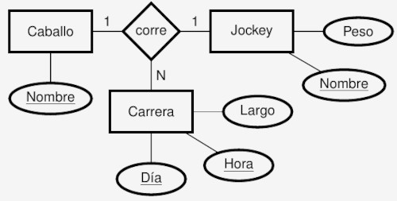
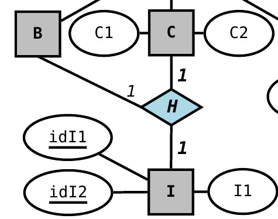
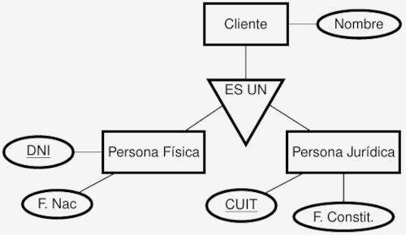

# Resumen de la materia de base de datos.

## NOMENCLATURA
             (min_2, max_2)                       (min_1, max_1)
[ENTIDAD_1] -------------------------@-------------------------- [ENTIDAD_2]
1. La cardinalidad se expresa en el lado opuesto
2. si el min = 0, significa participación parcial, ya que es optativo
3. si el min=1 y max=1, significa participación total, es decir hay un A para cada B y viceversa
4. si el min=1 y max=4, significa participación parcial, conociendo el destino no es posible reconstruir el origen.

## MODELO RELACIONAL

**DOMINIO**: Conjunto de valores homogéneos (mismo tipo)
  - D1 = {Barcelona, Sevilla, Bs As}
**PRODUCTO CARTESIANO**: Todas las combinaciones que pueden obtenerse con el dominio de 2 atributos
  - $\{(a, b) : a\in A, b\in B \}
  - $D1\times D2$ = {(Barcelona, Argentina), (Barcelona, España), ... (Bs As, España)}
**RELACION**: Subconjunto del producto cartesiano
  - R = {(Barcelona, España) .. (Bs As, Argentina)}

--- 

**ESQUEMA DE RELACION**: Nombre de relación seguido por lista de atributos
  - R(A1 .. An)
  - Peliculas(nombre, año, num. oscars)
**DOMINIO DE ATRIBUTO**: Los valores que dicho atributo puede tomar
  - D(nombre) = string
  - D(año) = datetime
  - D(num. oscars) = Naturales
**ESQUEMA DE BASE DE DATOS**: Conjunto de esquemas de relación junto a Conjunto de restricciones de integridad
  - S = {R1 .. Rm}
  - **Cine** = {**Peliculas**(nombre, año, oscars), **Actores**(nombre, pais), **Actuaciones**(nombre_actor)}

---

**TUPLA**: una instancia de la relación
  - (kill bill, 2003, 0)
**VALOR**: instancia de un atributo de una tupla
  - t[A]=t.A
  - t[nombre] = t.nombre = "kill bill"
**CARDINALIDAD**: Cantidad de tuplas que posee la relación
  - n(R)
  - n(Peliculas) = 4 (si guardaste 4 peliculas)

### RESTRICCIONES
**Nota.** Los atributos deben ser atómicos, no se permite compuestos o multivaluados

**RESTRICCIONES DE DOMINIO**: el valor del A de una tupla t debe pertenecer al dom(A)
  - t_1[nombre] = 8. MAL
  - t_2[nombre] = Kill bill. BIEN
  - t_3[nombre] = NULL. Nulo era o no parte del dominio?
**RESTRICCIONES DE UNICIDAD**: No pueden existir t_1 y t_2 que coincidan en los valores de todos sus atributos
  - t_1=(Kill Bill, 2003, 0)
  - t_2=(Kill Bill, 2003, 0) . MAL
  **SUPERCLAVE**: subconjunto de atributos que identifican unicamente a la tupla
    - {nombre, año, oscars} . BIEN (nombre unico)
    - {nombre, oscars}      . BIEN
    - {oscars}              . MAL, sabiendo num. oscars no sabes que peli era
    **CLAVE PRIMARIA**: El conjunto minimal de superclaves
      - {nombre}            . Con esto ya identifico a la pelicula

**RESTRICCION DE INTEGRIDAD**
  **DE ENTIDAD**: La clave primaria no puede tomar el valor nulo
    - Pelicula("", 2000, 0) . mal, debe tener un nombre
  **REFERENCIAL**: Los atributos de la clave foránea deben referir a entidades existentes
    - Si un actor interpretó Star Wars, dicha película debe existir
    - Sean R(A1 .. An) y S(B1 .. Bm) dos relaciones de entidad
      - $FK \subset \{A1 .. An\}$ . Sea FK la **clave foranea** de S en R
      - $PK \subset \{B1 .. Bm\}$ . Sea Pk la **clave primaria** de S
      - Entonces: 
        - para todas las tuplas t_i no nulas, existe una tupla s que puede ser referenciada por FK
         $\forall t \in R: t[FK]\neq Null \rightarrow \exists s\in s : s[PK]=t[FK]$

      
### OPERACIONES
- Operaciones de consulta (Read)
  - Al no modificar nada, no violan restricciones
- Operaciones de actualización (Write)
  - Inserción: al insertar una tupla se puede violar
    - Restricciones de dominio
    - Restricciones de unicidad
    - Restricciones de integridad de entidad
    - Restricciones de integridad referencial
    - SOLUCION: RECHAZAR OPERACION
  - Eliminación: Puede violar
    - Restricciones de integridad referencial
    - SOLUCION:
      - RECHAZAR OPERACION
      - ELIMINAR EN CASCADA (todos los que me hacían referencia, desaparecen)
      - PONER EN NULO (a todos los que me hacían referencia)
  - Modificación:
    - Clave Foránea: verificar integridad referencial
    - Clave Primaria:
      - Verificar restriccion de integridad de entidad
      - Verificar restriccion de integridad referencial
     

**TRANSACCIONES**: Conjunto ordenado de operaciones que o se ejecutan todas o ninguna
  - En caso de violar alguna restriccion, se deben deshacer los cambios

### PASAJE DE MODELOS
- Silberchatz 6.8.6
  
**CASO 1** Entidad con atributos

```
Pais(Nombre PK, poblacion, area)
```
**CASO 2** Atributos Multivaluados
- los atributos multivaluados se modelan con una tabla o relación aparte
  


```
Medicos(legajo PK, nombre)
Telefonos(legajo FK PK, telefono PK)
Mails(legajo FK PK, mail PK)
```

**CASO 3** Atributos Compuestos
- los sub-atributos se incluyen como si fuesen atributos normales


```
Tarjeta(MII PK, issuer_subid PK, cuenta PK, checksum PK, fecha_venc)
```

**CASO 4** ENTIDADES DEBILES
- En este caso no es necesario representar la interrelación 'tiene'
- La entidad débil tiene como FK la PK que lo identifica y su atributo privado
  


```
Hoteles(nombre_hotel PK, direccion)
Habitaciones(numbero_habitacion PK, nombre_hotel FK PK, capacidad)
```

**CASO 5** INTERRELACION CON CARDINALIDAD ARBITRARIA
- Aprobaciones necesita ambas claves foráneas para definirse,
  - entonces tanto padrón como código son PK


```
Alumnos(padron PK, nombre) #Entidad 1
Asignaturas(codigo PK, nombre) #Entidad 2
Aprobaciones(padron PK FK, codigo PK FK, fecha) #Interrelación
```

**CASO 6** INTERRELACION CON CARDINALIDAD 1:1
- Cuando la cardinalidad es 1, saber el gerente sabe el dpto.
  - sólo una PK es necesaria para definir la relación
- El viceversa también es válido
  


```
Gerentes(nombre_gerente PK, tel, mail)
Departamentos(codigo PK, nombre)
Dirige(nombre_gerente FK PK, codigo FK)
```

**CASO 7** INTERRELACION CON CARDINALIDAD 1:1 Y PARTICIPACION TOTAL DE UNA ENTIDAD
- Si además una entidad tiene participación total,
  - se escoje esa entidad como clave primaria de la relación
- En este caso Gerente tiene participación total
  - cada gerente tiene un departamento, pero además existen dptos sin asignar.
- En este caso nos ahorramos la tabla 'dirige'
  - y gerente toma la FK del dpto
    


```
Gerentes(nombre_gerente PK, telefono, mail, codigo_dpto FK)
Departamentos(codigo PK, nombre_dpto)
```
**CASO 8** INTERRELACION CON CARDINALIDAD 1:1 Y PARTICIPACION TOTAL DE AMBAS ENTIDADES
- En este caso particular, definir al gerente define al dpto y viceversa.
- Es posible ahorrarse dos tablas,
- luego una sóla PK (gerente o dpto) es suficiente para definir una super tupla.
  


```
GerentesDepartamentos(nombre_gerente PK, tel, mail, codigo_dpto, nombre_dpto)
```
**CASO 9** INTERRELACION CON CARDINALIDAD 1:N 
- El caso general usa 3 tablas
- Determinar el futbolista, determina el club
- Así que la tabla usa como PK el que tiene cardinalidad 1
  


```
Futbolistas(nombre_fut PK, f_nac, pais)
Clubes(nombre_club PK, pais PK, division)
JuegaEn(nombre_fut FK PK, nombre_club FK, pais FK)
```

**CASO 10** INTERRELACION CON CARDINALIDAD 1:N Y PARTICIPACION TOTAL
- Aqui nos ahorramos una tabla
- En este caso existen clubes vacíos
- Pero cada jugador pertenece a un único club.
  - Determinar al futbolista determina el club,
    - el recíproco, conocer el club puede tener jugadores nulos y la tupla queda mal formada
  - El futbolista tiene el FK del club
    


```
Futbolistas(nombre_fut PK, f_nac, pais_fut, nombre_club FK, pais_club FK)
Clubes(nombre_club PK, pais_club PK, division)
```

**CASO 11** INTERRELACION TERNARIA N:N:N
- A veces un mismo actor puede interpretar varios personajes en una misma película
- o un personaje de una película ser interpretado por muchos actores
- También existen personajes que existen en múltiples películas (han solo en star wars 1,2,3)

- Simplemente se crea una tabla extra para modelar esta interrelación entre personajes, películas y actores.
  - Las 3 primary keys son también PK de la interrelación
    


```
Actores(nombre_actor PK, pais)
Peliculas(nombre_pelicula PK, año)
Personajes(nombre_personaje PK)
Interpreta(nombre_actor FK PK, nombre_pelicula FK PK, nombre_personaje FK PK)
```

**CASO 12** INTERRELACION TERNARIA 1:N:N
- En una escuela, docentes enseñan asignaturas (matematica, historia)
- Los cursos son los grados (3ºA, 3ºB)
- Cada asignatura en cada curso es enseñada por un único docente
  - el mismo docente puede dar la misma asignaturas en distintos cursos
  - el mismo docente puede dar distintas asignaturas en el mismo curso
- 1 docente puede enseñar N pares (curso, asignatura)
- N asignaturas pueden ser asignadas a (1 docente, en N cursos)
- La cardinalidad determina la cantidad de instancias que pueden aparecer, fijadas las instancias de las otras entidades
  - Si conozco el curso y la asignatura, automáticamente sé que docente es
  - Así que el nombre del docente no es PK de Enseña
    


```
Docentes(nombre_docente PK)
Cursos(nombre_curso PK)
Asignaturas(nombre_asignatura PK)
ENSEÑA(nombre_curso FK PK, nombre_asignatura FK PK, nombre_docente FK)
```

**CASO 13** INTERRELACION TERNARIA 1:1:N
En un hipódromo, se corren varias carreras,
- participan hockeys y caballos
- En una carrera, cada Jokey está asociado a un caballo
- y el caballo solo es montado por un único hockey.
- en distintas carreras un jockey puede variar de caballo
- y un mismo caballo ser montado por distintos jockeys.

En este caso, se puede elegir cual de las dos PK caballo o hokey no es necesario determinar



```
Carrera(dia PK, hora PK, largo)
Caballo(nombre_caballo PK)
Jokey(nombre_jockey PK, peso)
Corre(dia FK PK, hora FK PK, nombre_caballo FK PK, nombre_hokecy FK)
Corre(dia FK PK, hora FK PK, nombre_caballo FK   , nombre_hokecy PK FK) #Alternativa
```

**CASO 14** INTERRELACION TERNARIA 1:1:1
- En este caso hay diferentes alternativas
- Supongamos que en vez de I, usamos A, para que quede una interrelación entre A, B, C 1:1:1



**Opción 1**, definir la tabla entera
- con alguna clave foránea como primaria
```
A(idA PK, A1)
B(idB PK, B1)
C(idC PK, C1)
Ternary(idA FK PK, idB FK   , idC FK   ) #alternativa 1
Ternary(idA FK   , idB FK PK, idC FK   ) #alternativa 2
Ternary(idA FK   , idB FK   , idC FK PK) #alternativa 3
```
**Opción 2**, definir la relación ternaria en alguna tabla 
```
A(idA PK, A1)
B(idB PK, B1)
C(idC PK, C1, idA FK, idB FK) # alternativa 1 de 3
```


**CASO 15** ESPECIALIZACION TOTAL SUPERPUESTA
La especialización puede ser
  - **Total**, Toda instancia está especializada (toda persona es o docente o estudiante)
  - **Parcial**, Existen instancias no especializadas (personas que no son ni docentes ni estudiantes)
  - **Superpuesta**, una subclase puede ser miembro de otra (Uno puede ser docente y secretario)
  - **Disjunta**, las subclases son únicas (o sos persona jurídica o sos persona física)
    
- Las subclases heredan el PK y se referencia FK a la superclase


```
Personas(DNI PK, nombre_persona) #General
Alumnos(DNI PK FK, padron) #particular
Docentes(DNI PK FK, legajo, fecha_alta) 
```

**CASO 16** ESPECIALIZACION PARCIAL DISJUNTA
- En este caso debemos crear una clase sustituta para identificar a los clientes
  - el id del cliente, se transforma en DNI o CUIT
    


```
Clientes(id_cliente PK, nombre_cliente)
PersonasFisicas(DNI PK, f. nacimiento, id_cliente FK)
PersonasJuridicas(CUIT PK, f. constitucion, id_cliente FK)
```

**CASO 17** ESPECIALIZACION TOTAL DISJUNTA
- Cada entidad es una subclase (total)
- Cada entidad es miembro de una sóla especialización, no ambas (disjunta)

Este es el único caso que uno puede ahorrarse la relación de la superclase
- Pero los atributos de la superclase, los repetimos en las subclases


```
Empleado(DNI PK, nombre, **salario**)
Estudiante(DNI PK, nombre, **creditos**)
```
**NOTA**. Si la superclase tiene relación foránea con otra entidad, 
- entonces no es posible ahorrarse la relación
```
Persona(DNI PK, nombre)
```

## ALGEBRA Y CALCULO RELACIONAL
Para interactuar con un **MODELO** es necesario utilizar un **LENGUAJE**
- **PROCEDURALES**, indican un proceso a seguir (bajo nivel)
- **DECLARATIVOS**, especifican qué resultado final se espera (alto nivel)

**DATA MANIPULATION LANGUAGES (DML)**, sirven para extraer información de un modelo de datos
  - **lenguajes prácticos**:
    - **SQL** (y es declarativo)
  - **lenguajes formales**: 
    - **algebra relacional (procedural)**
    - **cálculo relacional (declarativo)**

### ALGEBRA RELACIONAL
Provee un marco formal de operaciones
- ayuda a optimizar la ejecución de consultas
- especifica los procedimientos de consulta a partir de un conjunto de **operaciones**

**OPERACION**, función cuyos operandos son una o mas relaciones y cuyo resultado también es una relación
  $O: R_1 \times \cdots R_n \mapsto S$

**Aridad**, cantidad de operandos que toma operación

**EXPRESION**, combinación de operadores

---

**Condiciones atómicas**, símbolos de comparación e igualdad
  - Ai cond Aj                (ej. salario > productividad)
  - Ai cond $c \in dom(Ai)$   (ej. salario > 1000)
**Condición**, combinación de condiciones atómicas mediante operadores
  - **AND (∧)**
  - **OR (∨)**
  - **NOT (¬)**

**SELECCION ($\sigma_{cond}$)**, operador UNARIO que selecciona tuplas cuya condición es verdadera
- $\sigma_{cond}(R): R \mapsto S$
  - $\sigma_{cant_oscars \gte 1} (Peliculas) = \{(Django, 2012, 2), (Coco, 2017, 2)\}

**PROYECCION ($\pi$)**, operador UNARIO que filtra atributos
- $\pi_L(R): R \mapsto S,\ con\ L\in \{Ai .. An\}$
  - $\pi_{(año, nombre_director)}(Peliculas) = \{(2003, Quentin Tarantino), (2012, Quentin Tarantino), (2005, George Lucas)\}
- El **orden** de atributos en la relación, coincide con el orden de atributos de L
- La proyección remueve tuplas **duplicadas**

**ASIGNACION (←)**, es una secuencia de operaciones
- Temp ← $\sigma_{oscars > 0}(Peliculas)$
- director_oscar ← $\pi_{nombre_dicrector}(Temp)$

**REDENOMINACIÓN (ρ)**, sólo renombra atributos
- $\rho_{S(B1 .. Bn)}(R(A1 .. An)$
- $\rho_{Film (name, year, n_oscars) }(Peliculas) = Film(name, year, n_oscars)$

**OPERADORES DE CONJUNTO**, operadores binarios, Union, Intersección y Diferencia

**UNION (∪)**, Concatena relaciones
- R ∪ S contiene todas las tuplas de R y todas las de S
- Requiere
  - R(A1 .. An) y S(B1 .. Bn) mismo grado
  - dom(Ai) = dom(Bi) mismo dominio por atributo o **Compatibilidad de tipo**
- El nombre de los atributos finales los define R

**INTERSECCIÓN (∩)**, 
- R ∩ S Conserva tuplas que están en R y en S
- Requiere **compatibilidad de tipo** y grado

**DIFERENCIA (-)**
- R - S Conserva las tuplas de R que no están en S
- Requiere **compatibilidad de tipo** y grado
  
**PRODUCTO CARTESIANO (×)**, produce todas las combinaciones de atributos
- R(A1 .. An) × S(B1 .. Bm) = T(A1 .. An, B1 .. Bm)
- Si algún Ai tiene el mismo nombre que Bj, uno se llamará R.Ai y el otro S.Bj
  - Si se hace R × R entonces, uno se llamará R1.Ai y el otro R2.Ai
- No requiere compatibilidad de tipo
Ejemplo
- Pelicula(nombre, director) × Actuaciones(nombre, nombre_actor) = pel_act(Pelicula.nombre, director, Actuaciones.nombre, nombre_actor)
- Luego se puede filtrar $\sigma_{Peliculas.nombre=Actuaciones.nombre} (Pelicula × Actuaciones)$

**ARBOL DE CONSULTA**, arbol de prioridad de operadores

**JUNTA (⨝)**, combina producto cartesiano con selección
- R ⨝_cond S
- Selecciona las tuplas que cumplen la **cond**ición del producto carseiano entre R × S
  - La condición debe ser entre atributos de ambas relaciones (Ai >= Bj)
  - No valen condiciones del tipo Ai cond $c\in dom(Ai)$
- Peliculas ⨝_{nombre=nombre} Actuación = pel_act (Peliculas.nombre, director,Actuaciones.nombre, nombre_actor)

**THETA JOIN**, el caso más general
**EQUIJOIN**, cuando la condición es de igualdad
  - Pero genera redundancia de atributos ya que 2 van a coincidir
**NATURAL JOIN (∗)**, es equijoin pero sin el atributo redundante
  - No se especifica condiciones
  - Requiere que las relaciones tengan el mismo nombre de atributo para su juntura (**Atributos de juntura**)
  - Peliculas ∗ Actuaciones = pel_act(nombre_pelicula, director, nombre_actor)

**DIVISION (÷)**
- T = R ÷ S, son los valores de R que están asociados con todos los valores de S
  - Requiere que los atributos de S(B1 .. Bm) sean subconjunto de R(A1 .. An)
  - El resultado tiene los atributos de **R** que no están en **S**  
- Propiedad: $T∗S \subset R$
  - para mí es un error, debe ser T cartesiano S
  - o R ÷ T = S
    


**CONJUNTOS COMPLETOS DE OPERADORES**, es un conjunto de operadores que pueden formar el resto de operadores
- Con {σ, π, ρ, ∪, −, ×} puede construirse el resto de operadores

**OPERACIONES ADICIONALES**, estos operadores no pueden ser expresados con el álgebra relacional básica.
- **Proyección generalizada**
- **Agregación**
- **Junta externa**

**JUNTA EXTERNA**
- En la **Junta interna**, se descartaban las tuplas que no matcheaban en la selección.
  - Esto no pasa en la junta exterior
        


- **LEFT OUTER JOIN (R ⟕ S)**,
- incluye todas las tuplas de la relación de la izquierda, independientemente si existen coincidencias en la derecha
**R(A,B)**        |         **S(B,C)**      |  **R LEFT OUTER JOIN S ON B**
 A | B            |           B | C         |          A | R.B | C
---+----          |          ---+----       |        ----+-----+-----
 1 | a            |           a | X         |          1 |  a  | X 
 2 | b            |           c | Y         |          2 |  b  | NULL
 3 | c            |           d | Z         |          3 |  c  | Y

- **RIGHT OUTER JOIN (R ⟖ S)**, R RIGHT OUTER JOIN S es identico a S LEFT OUTER JOIN R,
- lo que cambia es como se ordenan las columnas
**R RIGHT OUTER JOIN S ON B**   |  **S LEFT OUTER JOIN R ON B**
    A |  R.B | C                |      S.B | C | A
------+------+---               |     -----+---+---
    1 |    a | X                |       a  | X | 1
    3 |    c | Y                |       c  | Y | 3
 NULL | NULL | Z                |       d  | Z | NULL
- **FULL OUTER JOIN (R ⟗ S)**, Es una combinación de ambas
**R FULL OUTER JOIN S ON B**    |  **S FULL OUTER JOIN R ON B**  
       A |  R.B | C             |   S.B |    C | A
     ----+------+-----          |   ----+------+-----
       1 |    a | X             |     a |    X | 1
       2 |    b | NULL          |  NULL | NULL | 2 
       3 |    c | Y             |     c |    Y | 3 
    NULL | NULL | Z             |     d |    Z | NULL

### CALCULO RELACIONAL
Es un lenguaje declarativo, no especifica orden de operaciones a realizar
- basado en lógica de predicados
- Variante 1. **CALCULO RELACIONAL DE TUPLAS**. (SQL)
- Variante 2. **CALCULO RELACIONAL DE DOMINIOS**

**PROPOSICIONES**
  - "pepe" gano el torneo 2009
  - "andy" gano el campeonato 2021
Un conjunto de proposiciones con identica estructura pueden tifica
**PREDICADO**, estructura que tipifica un conjunto de proposiciones
  - [tenista] gano [torneo] [año]
  - Es una función cuyo resultado en un valor de verdad V o F
    - Tenista(pepe, torneo, 2009) = V
    - Tenista(lucas, campeonato, 2021) = F

Los **esquemas de relación** pueden pensarse como predicados
- las bases de datos sólo almacenan proposiciones verdaderas

**Lógica de predicados de primer orden**
- Predicados: p(m,n). 
- Operadores: ∧, ∨, ¬, ← | P(m, n) ∧ ¬Q(m)
- Cuantificadores:
  - Universal (∀m)q(m), es verdadero si el predicado es verdadero para todo m
  - Existencial (∃m)q(m), es verdadero si al menos un valor de m consigue que q lo sea

**CALCULO RELACIONAL DE TUPLAS**, las variables representan tuplas
**PREDICADO SIMPLE**, es una función de una tupla o atributos, cuyo resultado es un valor de verdad V o F.
- R(t): la tupla de la relación R
- t1.Ai cond t2.Aj
- t.Ai cond c $\in dom(Ai)$
**EXPRESION**, tiene la forma
  { t1.A1 .. tn.An | p(t1 .. tn+m) }
  - { p.name | Player(p) AND p.date_birth<1980 }  #Lista los jugadores nacidos antes del 80
  - { p.name | Player(p) AND (∃s)(Score(s) AND s.player_id = p.id}
  - { p.name | Player(p) AND (∀θ)(¬Player(θ) OR θ.birth_date ≥ p.birth_date)} #El jugador más anciano, la negación es necesaria
  - Notar que una variable que no fue cuantificada, no puede aparecer en el lado izquierdo de la barra
    - Las variables cuantificadas se llaman **ligadas**
    - Las variables no cuantificadas se llaman **libres**

**EXPRESION SEGURA**, garantiza una cantidad finita de tuplas
  - {p.name | ¬ Player(p) } #genera todos los strings y numeros posibles
  - Probar es garantizar que los valores de los atributos del resultado son parte del dominio de la expresión.

**CALCULO RELACIONAL DE DOMINIOS**, las variables representan dominios que hacen referencia a atributos
- un predicado simple es una función de un conjunto de dominios cuyo resultado es un valor de verdad V o F
- { n | (∃i)(∃g)(∃s)(∃c)(Equipo(i, n, g, s, c)) } #Lista los nombres de los paises de cada equipo

**COMPLETITUD RELACIONAL** hay equivalencia entre el **algebra relacional** y el **calculo relacional**
- ambos lenguajes tienen el mismo poder expresivo

## SQL
Los lenguajes son herramientas para interactuar con un modelo.
En el contexto de base de datos definimos.
- **lenguaje de DEFINICION DE DATOS (DDL)**
    - expresa la estructura y restricciones del modelo
- **lenguaje de MANIPULACION DE DATOS (DML)**
    - permite ingresar, modificar, eliminar y consultar datos del modelo
- **lenguaje de CONTROL DE DATOS (CDL)**
    - Manejan los permisos de acceso

SQL es
- DDL y DML
- no procedural
- basado en calculo de tuplas
- **Gramática libre de contexto**, su sintaxis puede definirse por reglas de producción
  - ej. Backus-Naur
    
Estandar SQL
- ISO/IEC 9075-1: Framework (SQL/framework)
- ISO/IEC 9075-2: Foundation (SQL/Foundation) -> CORE SQL
- ISO/IEC 9075-3: Call level interface (SQL/CLI)
- ISO/IEC 9075-4: Persistent Stored Modules (SQL/PSM)
- ISO/IEC 9075-9: Management of external data (SQL/MED)
- ISO/IEC 9075-10: Object Language Bindings (SQL/OLB)
- ISO/IEC 9075-11: Information and definition schemas (SQL/schemata) -> CORE SQL
- ISO/IEC 9075-13: SQL Routing and types using Java (SQL/JRT)
- ISO/IEC 9075-14: XML Related Specifications (SQL/XML)

Gramatica

![https://jakewheat.github.io/sql-overview/sql-2011-foundation-grammar.html]

```
<query specification > ::=
    SELECT [ <set quantifier > ] <select list > <table expression >
<set quantifier > ::=
    DISTINCT
    | ALL
<select list > ::=
    <asterisk >
    | <select sublist > [ { <comma > <select sublist > }... ]
<table expression > ::=
    <from clause >
    [ <where clause > ]
    [ <group by clause > ]
    [ <having clause > ]
    [ <window clause > ]
```

### DEFINICION DE DATOS (DDL)
Creación de esquema
- AuthId identifica al dueño del esquema

**CREATE SCHEMA** nombre_schema [**AUTHORIZATION** AuthId];

Los esquemas se agrupan en colecciones llamados **CATALOGOS**
- Todo catalogo tiene un esquema llamado **INFORMATION_SCHEMA**, que describe el resto de esquemas

**TIPOS DE VARIABLES**
- NUMBERS
    - **INTEGER**, **INT**
    - **SMALLINT**
    - **FLOAT(n)**, n es la precision
    - **DOUBLE PRECISION**, numerico de alta precision (n=53, e=11, IEEE 754)
    - **NUMERIC(i, j)**, tipo numerico exacto. Precision(i) (digitos totales) y Escala(j)(digitos decimales)
- STRINGS
    - **CHARACTER(n=1)**, **CHAR(n=1)**. Longitud fija
    - **CHARACTER VARYING(n)**, **VARCHAR(n)**
- DATE
    - **DATE**, precision de días. Formato 'YYYY-MM-DD' (ISO8601)
    - **TIME(i)**, Precisión de hasta microsegundos. Formato 'HH:MM:SS.[0-9]^i' (ISO8601), tantos digitos decimales como i
    - **TIMESTAMP(i)**, Combina un **DATE** y un **TIME**
- BOOLEANOS
    - **BOOLEAN**, lógica de 3 valores **TRUE, FALSE, UNKNOWN**
- OBJETOS
    - **CLOB**, Character large object, para documentos de texto largos
    - **BLOB**, Binary Large Object, para archivos binarios grandes

**TIPOS DEFINIDOS POR EL USUARIO**
- Facilitan la realización de cambios
  
**CREATE DOMAIN** nombre_dominio **AS** TIPO_BASICO;
  - ej. CREATE DOMAIN codigo_pais AS CHAR(2);

**CREACION DE UNA TABLA**

**CREATE TABLE** T1 (
    A1 TYPE1 [NOT NULL] [CHECK condition1] [PRIMARY KEY] [DEFAULT] [AUTO_INCREMENT],
    ...
    An TYPEn [NOT NULL] [CHECK conditionn] [PRIMARY KEY] [DEFAULT] [AUTO_INCREMENT],

    [**PRIMARY KEY** (A1 .. Ap)]
    {**UNIQUE** (A1 .. Au)}
    {**FOREIGN KEY** (A1 .. Ah) **REFERENCES** T2(B1 .. Bm)}
    [**ON DELETE** SET NULL | RESTRICT | CASCADE | SET DEFAULT]
    [**ON UPDATE** SET NULL | RESTRICT | CASCADE | SET DEFAULT]
    );
Ejemplo:
CREATE TABLE Persona (
  dni INT CHECK(dni<93000000) PRIMARY KEY, -- No considera DNI extranjero (mayores a 93 millones)
  nombre VARCHAR(255) UNIQUE,
  nacimiento DATE
  );

#DML
El esquema básico es

**SELECT** A1 .. An 
**FROM** T1 .. Tm
[**WHERE** condition];

**SELECT** es equivalente a **proyectar**
y **WHERE** es equivalente a **seleccionar** o filtrar.

Las condiciones dentro de where son:
- **Ai cond Aj**, comparacion entre dos atributos
- **Ai cond cte**, idem con cte
- **Ai [NOT] like pattern**, expresion regular
- **(Ai .. Ak) [NOT] IN multiset**, si el atributo es miembro de un conjunto
- **Ai [NOT] BETWEEN a AND b**, con a<= Ai <= b
- **Ai IS [NOT] NULL**, equivalente a la igualdad
- **EXISTS table**
- **Ai cond [ANY|ALL] table**
- **AND, OR, NOT**, combina expresiones

**ALIAS**
**FROM** persona [AS] p1, persona p2

También se puede cambiar el nombre de la tabla y sus columnas
**FROM** persona **AS** p1(dni_1, nombre_2)

También se puede cambiar los nombres en el resultado
**SELECT** p1.nombre AS nombre_padre ...

También se pueden realizar operaciones entre las columnas 
**SELECT** Producto.precio *0.9 AS precioDescontado
- Las operaciones pueden ser
  - Numericas + - * /
  - Concatenación ||
  - DATE + -
  - Funciones LN, EXP, POWER, LOG, SQRT, FLOOR, CEIL, ABS

**FUNCIONES DE AGREGACION**
- **SUM(A)**, para la columna A, suma sus filas
- **COUNT(A)**, cuenta cantidad de filas no nulas de A
    - COUNT([DISTINCT] A), cuenta cantidad de valores distintos en A
    - COUNT(*), Cuenta cantidad de filas en el resultado
- **AVG(A)**, promedio
- **MAX(A)**, solo para dominios ordenados
- **MIN(A)**

**EXPRESIONES REGULARES**
- WHERE attrib LIKE pattern;
- **_**, representa caracter arbitrario
- **%**, representa cero o mas caracteres arbitrarios


**JUNTA THETA**
- **FROM** R **INNER JOIN** S **ON** condition...
- **FROM** R **INNER JOIN** S **USING**(attribute)...

**JUNTA NATURAL**
- **FROM** R **NATURAL JOIN** S
- Los nombres de las columnas deben coincidir en ambas tablas

**JUNTA EXTERNA**
- **FROM** R **[LEFT|RIGHT|FULL] OUTER JOIN** S **ON** condition

**OPERACIONES DE CONJUNTOS**
- R **UNION [ALL]** S
- R **INTERSECT [ALL]** S
- R **EXCEPT [ALL]** S, diferencia

R y S
- pueden provenir de una subconsulta
- Deben ser compatible en atributos
- La palabra [ALL] incluye tuplas repetidas

**ORDENAMIENTO Y PAGINACION**
**SELECT** A1 .. An
**FROM** T1 .. Tm
[**WHERE** condition]
[**ORDER BY** Ak [ASC|DESC], Al [ASC|DESC]] -- ASC es por defecto

**PAGINACION**
[**OFFSET** nro **ROWS**] **FETCH FIRST** nro **ROWS ONLY**;
[**LIMIT** nro]

**AGRUPAMIENTO**
SELECT A1.. An, f1(B1), .. fp(Bp)
FROM T1 .. Tm
[WHERE condition]
**GROUP BY** A1 .. An
[HAVING condition_2]
[ORDER BY Ak [ASC|DESC]]

La clausula 'Having' permite filtrar algunos grupos del resultado
```
# Liste los tags cuyo primer uso ocurrió después del 01/01/2018.

SELECT t. TagName
  FROM Tags t, PostTags pt , Posts p
  WHERE t.Id = pt.TagId
  AND pt. PostId = p.Id
  GROUP BY t. TagName
  HAVING MIN(p. CreationDate )>=’2018 −01 − 01’;
```

**SUBCONSULTAS**
- El resultado de una subconsulta es una tabla, excepto que tenga una sola columna y una sola fila, lo cual sera una constante
**SELECT ...**
**WHERE** A **IN** (**SELECT X FROM ...**) --debe devolver 1 sola columna
**WHERE** A = (**SELECT X FROM ...**)      --debe devolver 1 sola fila
**WHERE** (A,B)= IN(**SELECT X, Y FROM ...**) --Debe devolver 2 columnas
**WHERE** A < [SOME|ALL] (**SELECT X FROM ...**)
**WHERE** [NOT] EXISTS (**SELECT ... FROM ...**) --Devuelve True/False dependiendo si la tabla esta vacia o no


### DATA MANIPULATION LANGUAGE
**INSERSIONES**
 
**INSERT** **INTO** T[(A1 .. An)] **VALUES**
  (a11 .. a1n),
  (ap1 .. apn);

No se inserta si:
- Se asigna una columna por fuera de su dominio
- Se omitio columna que no podía ser null
- Se puso en null una columna que no podía serlo
- la clave asignada ya existe en la tabla
- Una clave foránea hace referencia a una clave inexistente

**ELIMINACIONES**

**DELETE** FROM T [WHERE condition];

Si la clave foránea se asignó como
- ON DELETE CASCADE, se eliminan las filas que hacían referencias a ella
- ON DELETE SET NULL, Se pone en null las filas que hacian referencia a ella
- ON DELETE RESTRICT, No se elimina la tupla

**MODIFICACIONES**
- se pueden modificar muchas tuplas a la vez
  
**UPDATE** T 
**SET** A1 = c1, A2=c2
**WHERE** condition;

Falla si
- Se modifica una columna con un valor fuera de su dominio
- Se puso a Null una columna que no podía serlo
- Se asignó una clave primaria un valor que ya existía
- Se modificó una clave foránea a una clave inexistente

Se propaga con
- ON UPDATE CASCADE, se modifican las filas que hacían referencia a ella
- ON UPDATE SET NULL, idem null
- ON UPDATE RESTRICT, no modifica la tupla

**ELIMINACION DE TABLA**

**DROP TABLE**  T [**RESTRICT**|**CASCADE**]
**DROP SCHEMA** S [**RESTRICT|CASCADE**]

**MANIPULACION DE STRING**
- **SUBSTRING(string FROM start FOR length)**, selecciona un substring desde la posicion start y de largo length
- **UPPER(string)/LOWER(string)**, convierte a mayúsculas o minusculas
- **CHAR_LENGTH(string)**, Devuelve la long del string

- **CAST(attr AS type)**, conversiones entre tipos
- **EXTRACT(campo FROM attr)**, extrae información de una columna de fecha/hora. EXTRACT (DAY FROM fecha)
- **COALESCE(expr1 .. exprn)**, devuelve la primera expresión no nula de izquierda a derecha
  - **SELECT COALESCE(domicilio, 'desconocido') FROM ...**


**CASE**, añade cierta logica estructurada
- selecciona distintas salidas en función de distintas condiciones

SELECT padron, apellido, nombre 
CASE WHEN primera_op>=4 OR primer_rec>=4 OR segundo_rec>=4
  THEN 'APROBO'
  ELSE 'DESAPROBO'
  END AS situación_parcial
FROM notass_parcial;


## SQL PARTE II

**WITH**, permite construir una tabla auxiliar.

**WITH** T[(A1 .. An)] **AS** (subquery) --La tabla T, será el subquery
query;

**RECURSIVE**, permite encontrar la clausula transitiva
- Dada una tabla T_0 inicial, que no dependa de T
- se encuentra T_{t+1} = subquery(T_{t}a)
- hasta que T_{t+1}=T_t
  
**WITH RECURSIVE** T[(A1 .. An)]
**AS** (<initial_value_query> **UNION** <subquery>)
<continue_the_T_query>;

```
WITH RECURSIVE DestinosAlcanzables(ciudad)
AS ( VALUES ('Paris')
    UNION
    SELECT v. ciudadHasta AS ciudad
    FROM DestinosAlcanzables d, Vuelos v
    WHERE d. ciudad = v. ciudadDesde
    )
SELECT ciudad FROM DestinosAlcanzables ;
```

### FUNCIONES DE VENTANA
Permiten aplicar un procesamiento final a los resultados de una consulta.
1. Dividiendos en grupos, llamados **particiones**
2. Ordenando internamente cada partición.
3. Cruzando información entre las filas de cada partición

A cada atributo **SELECT** se le puede aplicar una función de ventana distinta

**SELECT** .. [f(Ai) | w( [Ai] )] **OVER** ({**ORDER BY** Aj [ASC|DES]}) **FROM** ..
- Esto ordena el resultado por el atributo Aj
- Y para cada fila muestra el resultado de una **función de agregación**, o **función de ventana**

Hasta acá f(Ai) no parece nada que ya no podamos hacer con **GROUP BY**
- La novedad son las **funciones de ventana**
- https://www.postgresql.org/docs/9.1/functions-window.html.
- **RANK()**, asigna un puntaje, según una estrategia de ordenamiento
```SELECT Vendedor, Ventas, RANK() OVER (ORDER BY Ventas DESC) AS Posicion FROM Ventas;```
VENDEDOR | VENTAS | POSICION
---------+--------+---------
     Ana |  500   | 2
    Luis |	300   | 3
   Marta |	700   | 1
    Jose |  500   | 2
    
- **ROW_NUMBER()**, idem rank, pero asignando posiciones distintas a numeros iguales,
    - ayuda a crear una nueva 'clave primaria' pero con valores ordenados
```SELECT Vendedor, Ventas, ROW_NUMBER() OVER (ORDER BY Ventas DESC) AS Posicion FROM Ventas;```

VENDEDOR | VENTAS | POSICION
---------+--------+---------
   Marta |	700   | 1
     Ana |  500   | 2
    Jose |  500   | 3
    Luis |	300   | 4

- **LAG(Ai, offset)**, permite acceder al valor de una fila anterior
```SELECT Mes, Ventas, LAG(Ventas, 1) OVER (ORDER BY Mes) AS VentasMesAnterior FROM VentasMensuales;```
    MES | VENTAS | VENTAS MES ANTERIOR
--------+--------+--------------------
  Enero |	   500 | NULL
Febrero |	   600 | 500
  Marzo |	   550 | 550
  Abril |	   700 | 700
   Mayo |	   650 | 650

Observaciones
- La función de ventana se aplica una por **columna**
- La función de ventana se aplica **antes** del ordenamiento
- A diferencia de GROUP BY, OVER no cambia la cantidad de filas del resultado
- A diferencia de GROUP BY, OVER se calcula sobre la particion y repite este valor en cada columna

La ventana puede renombrarse con **WINDOW**
```SELECT RANK() OVER mi_ventana AS Posicion FROM VentasMensuales
WINDOW mi_ventana AS (ORDER BY Ventas DESC);
```

**PARTICIONES MULTIPLES**, permiten 'agrupar' atributos antes de aplicar la función de ventana

SELECT  [f(Ai) | w([Ai]) ] OVER (**PARTITION BY** Ak {ORDER BY Aj [ASC|DESC]}) FROM ..


```SELECT Vendedor, Ventas, Region, ROW_NUMBER() OVER (PARTITION BY Region ORDER BY Ventas DESC) AS Posicion FROM Ventas;```
VENDEDOR | VENTAS | REGION | POSICION
---------+--------+--------+----------
   Marta |	  700 |  NORTE | 1
     Ana |    500 |  NORTE | 2
   Pedro |	  300 |  NORTE | 3
    Jose |    500 |    SUR | 1        <- Notar que aquí empieza la particion sur
    LUIS |    300 |    SUR | 2

## OPTIMIZACION DE CONSULTAS
Las bases de datos, registran ciertas estadísticas en su catálogo para optimizar consultas.
- **n(R)**, denota la cantidad de tuplas en R
- **B(R)**, la cantidad de bloques de almacenamiento en R (**B=ceil(n/F)**)
- **V(A,R)**, la cantidad de valores distintos que adopta atributo A en R, (variabilidad)
- **F(R)**, cantidad de tuplas en R que entran en un bloque. (factor de bloque = n/B)

También sobre los indices se recupera cierta información
- **Height(I(A,R))**, profundidar del índice de búsqueda **I** por el atributo **A** de R
- **Length(I(A,R))**, cantidad de bloques que ocupan las hojas del índice **I**

Observaciones.
- Se suelen actualizar las estadísticas
    - con cierta periodicidad,
    - cuando se indica explícitamente
    - cuando los recursos están ociosos

**ESQUEMA DE PROCESAMIENTO**
- [SQL Query] -> [PARSER] -> [RELATIONAL ALGEBRA EXPRESSION] -> [OPTIMIZER(Statistics)] -> [EXECUTION PLAN] -> [EVALUATION ENGINE (data files)] -> [RESULT]

**OPTIMIZACION**
- comienza con una expresión en álgebra relacional
- se optimiza mediante heurísticas o reglas de equivalencia, generando un **plan de consulta**
- Se estima el costo de distintos planes de consulta y el óptimo se materializa en un **plan de ejecución** (estructuras de datos, índices, algoritmos)
    - Se estima el costo de acceso al disco (de lectura y de escritura)
    - Se estima el costo de procesamiento
    - Se estima el uso de memoria
    - Se estima el uso de red

**INDICES**, son estructuras que agilizan la búsqueda para un atributo.
  - Implementaciones de árboles (binario, B, B+, B*)
  - Implementaciones de tablas de Hash

Tipos de índices
  - **INDICE PRIMARIO**, cuando el índice se construye sobre un atributo clave de ordenamiento (Solo uno es posible)
  - **INDICE DE CLUSTERING**, cuando el ordenamiento se realiza sobre los bloques físicos (Solo uno es posible)
  - **INDICE SECUNDARIO**, cuando el índice se realiza sobre atributos que no son clave de ordenamiento (Muchos son posibles)

**CREATE** [**UNIQUE**] **INDEX** nombre_indice **ON** tabla_1(A1..An) ;

En postgresql
- Para claves múltiples (varios atributos), sólo se permite BTREE
- **ON** tabla_1 [**USING BTREE | GiST | HASH**] (A1 ..)
- El comando **CLUSTER** tabla_1 [**USING** nombre_indx] la reorganiza físicamente

En DB2
- **ON** tabla (A1 .. An) [**CLUSETER**]
- La opción 'cluster' indica  que el índice será de ordenamiento

En SQLServer
- **CREATE INDEX** nombre_ix **ON** tabla_1(A1 .. An) --Indice secundario
- **CREATE CLUSTERED INDEX** nombre_ix **ON** tabla_1(A1 .. An) --Indice de ordenamiento, primario o clustering
- **CREATE UNIQUE INDEX** nombre_ix **ON** tabla_1(A1..An) --Indice de no-ordenamiento sobre atributo clave

En MySQL
- **CREATE [UNIQUE | FULLTEXT | SPATIAL] INDEX** name_ix **[USING BTREE | HASH]**
- **FULLTEXT**, permite indexar tablas con datos tipo 'text', para búsquedas con **MATCH .. AGAINST**
- **SPATIAL**, permite indexar tipos de datos espaciales (**PONT** y **GEOMETRY**)


### COSTOS DE OPERADORES

**SELECCION**, partimos de $\sigma_{cond}(R)$
    - para condición de igualdad (**=**), pero pueden extenderse para el resto
**METODOD FILE SCAN**, se recorren los archivos en busca de registros que cumplan la condición
  - **BUSQUEDA LINEAL**, se explora cada registro. **COST(S)=B(R)**
**METODO INDEX SCAN**, hacen uso eficiente de un índice de búsqueda
  - **BUSQUEDA CON INDICE PRIMARIO** (sobre clave Aj),sólo una tupla puede satisfacer la condición
      - Arbol de búsqueda: **COST(S)=Height(I(Aj, R))+1**
      - Hash: **COST(S)=1**
  - **BUSQUEDA CON INDICE DE CLUSTERING** (sobre no-clave Aj), las tuplas se encontrarán contiguas en bloques disjuntos
      - **COST(S)=Height(I(Aj, R)) + ceil(n(R) / (V(Aj, R)·F(R)) )
  - **BUSQUEDA CON INDICE SECUNDARIO** (sobre Aj)
      - **COST(S)=Height(I(Aj, R)) + ceil( n(R) / V(Aj, R) )**
- **CONJUNCION (AND) DE CONDICIONES**
    - Si **uno** de los **atributos** tiene un **índice** asociado, se aplica primero esta condición. Luego se filtran las otras condiciones.
    - Si hay un **indice compuesto** entre atributos, se le da prioridad.
    - Si hay indices para **varios** atributos, se utilizan los índices por **separado** y finalmente se intersectan los resultados
- **DISYUNCION (OR) DE CONDICIONES**, simplemente se unen los resultados
    - si uno de los resultados no posee índice, se aplica fuerza bruta. (recorrer todas las opciones)
 
**PROYECCION**, partimos de $\pi_{X}(R)$
- **CASO X ES SUPERCLAVE**, no es necesario eliminar duplicados
    - **COST(P) = B(R)**
- **CASO X NO ES SUPERCLAVE**, debemos eliminar duplicados
    1. **ORDENAR la tabla** si el bloque entra en memoria $B(R)<M$
       - si no, **COST(P)=cost(sort_M(R))=2·B(R)·ceil(log_{M-1}(B(R))) - B(R)**
       - ceil(log_{M-1}(B(R))), representa la cantidad de etapas del sort
    2. **TABLA HASH**, si entra en memoria el costo será **B(R)**
       - si no, **COST(P)=B(R)+2*B($\hat{\pi}_X(R)$R)**
 - Si la consulta no usa **DISTINCT**, el resultado es un multiset y su costo será siempre B(R)

**UNION E INTERSECCION**
- Primero **ordenamos** las tablas R y S, si alguna no entra en memoria, usamos sort externo.
    - Asumimos que no se devuelven repetidos (default en sql)
- Procesamos ambas tablas ordenadas haciendo un **merge** que avanza conjuntamente por filas ri y sj
    - **COST(R [∪ | ∩] S)=Cost(sort_M(R)) +cost(sort_M(S)) +2·B(R)+2·B(S) **
- Para la **unión**, devolver todas las tuplas.
    - si **ri=sj**, devolver una de ellas y avanzar ambas tablas hasta que cambien de valor
    - sino, devolver la menor y avanzar sobre su tabla hasta que cambie de valor
    - cuando alguna tabla termine, devolver todo lo que quede de la otra sin duplicados.
- Para la **intersección**, devolver tuplas en ambas tablas
    - si **ri != sj**, avanzar sobre la tabla de la menor de ellas un lugar sin devolver nada
    - si **ri == sj**, devolver una de ellas y avanzar sobre ambas tablas hasta que cambien de valor
    - Cuando alguna termine, finalizar
- Para la **diferencia**, devuelve las que están en R pero no en S
    - Si **ri > sj**, avanzar sobre la tabla S hasta cambio de valor
    - Si **ri < sj**, devolver ri y avanzar R hasta cambio de valor
    - Si **ri == sj**, avanzar sobre ambas tablas hasta cambio de valor
    - Cuando R termine, finalizar. Cuando S termine, devolver todo lo que resta de R.

**JUNTA**
- **METODO ANIDADOS POR BLOQUE**, toma cada par de bloques de ambas relaciones y compara las tuplas entre sí
    - Por cada bloque **R**, se leen todos los bloques de **S** con costo de **1+B(S)**, asumiendo que B(R) < B(S)
        - Peor caso con Memoria de dos bloques, **COST(R ∗ S) = B(R)(1+B(S))**
        - Si alguna tabla quepa en memoria, **COST(R ∗ S) = B(R) + B(S)**
- **METODO DE UNICO LOOP**, requiere de un índice en **R**
    - Recorrer las tuplas de **S** y buscar por índice de **R** en qué atributo coincide
    - Si el índice es primario, **COST(R ∗ S)=B(S)+n(S)·(Height(I(A,R)) + 1)**
    - Si el índice es clustering, puede haber varias coincidencias, **COST(R ∗ S)=B(S)+n(S)·(Height(I(A,R)) + ceil(n(R)/(V(A,R)·F(R))))
    - Si el índice es secundario, **COST(R ∗ S)=B(S)+n(S)·(Height(I(A,R))+ceil(n(R)/V(A,R)))
- **METODO SORT-MERGE**
    - ordena los archivos de cada tabla por los atributos de la junta
    - Si entran en memoria, el ordenamiento puede hacerse con **quicksort** con un costo de **B(R)+B(S)**
    - Sino, **sort externo**.
        - El costo de ordenar y guardarlo en disco es:
             **2·B(R)·ceil(log_{M-1}(B(R)))** log estima cantidad de etapas del sort
    - Una vez ordenados, se hace un **Merge** de ambos archivos, que sólo selecciona aquellos pares de tuplas que coinciden en atributo de junta.
        - costo de **B(R)+B(S)** por unica vez
    - **COST(R ∗ S)=B(R)+B(S)+2·B(R)·ceil(log_{M-1}(B(R))) + 2·B(S)·ceil(log_{M-1}(B(S)))**
- **METODO DE JUNTA HASH (VARIANTE GRACE)**, particiona las tablas **R** y **S** en **m** grupos, utilizando función hash **h(X)** X: Atributo junta.
    - Obs. que dos tuplas **h(r.X)=h(s.X)**, no implica que **r.X=s.X**
    - Costo del particionado: **2·(B(R)+B(S))**, es necesario leer todos los bloques y reescribirlos en otro orden.
    - Cada par de grupos **Ri** y **Si** se combina verificando si se cumple la condición de junta con fuerza bruta.
        - Obs. No es necesario combinar Ri con Sj para i != j
        - si r.X=s.X luego h(r.X) = h(s.X)
    - Hipótesis. **m** fue escogido para que cada par (**Ri, Si**), al menos uno entre en memoria.
    - Costo de la combinación: **B(Ri)+B(Si)**
        - F(Ri)=F(R) y F(Si)=F(S)
        - $\sum_{i=1}^m n(Ri) = n(R)$ idem para Si
    - **COST(R ∗ S) = 3·(B(R)+B(S))**

**PIPELINING**, evita materializar toda la salida
- En muchos casos, el costo de un operador puede ser procesado por el operador siguiente en forma parcial.(sin terminar de generar tuplas)
- El costo de operaciones anidadas $O_2(O_1(R))$ debemos considerar que el pipeling, no necesita todos los O_1 para calcular el O_2

**ESTIMACION DE LA CARDINALIDAD**, Estima el tamaño de las relaciones intermedias
- se espera que la estimación: sea precisa, fácil de calcular, independiente de cómo se calculó la relación intermedia
- **PROYECCIÔN**, reduce cantidad de atributos
    - Persona(DNI, nombre, f_nac, genero)
    - 40 millones de tuplas
    - DNI: INT (4 bytes)
    - nombre: VARCHAR(15 bytes)
    - f_nac: TIMESTAMP(4 bytes)
    - genero: CHAR(1 byte)
    - Bloques de 1024 bytes - header de 24 bytes
    Entonces la cantidad de bloques que ocupa la relación es:
    - B(Persona) = 40E6 ·(4+15+4+1) / (1024-24) = 960 000 bloques
    Ahora estimamos la proyección
    - B(Persona.DNI) = 40E6 · 4 / 1000 = 160 000 bloques
- **SELECCION**, reduce cantidad de tuplas
    - n($\sigma_{Ai=c}$(R)) = n(R) / V(Ai, R)
    - donde V(Ai, R) es la cantidad de valores distintos que toma Ai en dicha relación, su inversa se llama selectividad.
    - n($\sigma_{genero=F}(Persona)$)=40E6 / 2 generos = 20E6
    - B(Persona.F)=20E6 tuplas ·(4+15+4+1) / (1024-24) = 480 000 bloques
    Limitaciones
    - estimar otros operadores es más dificil (>,<, neq)
    - la estimación asume que c se toma al azar
    **HISTOGRAMA**, estimar la distribución del atributo Ai
       - ejemplo Pelicula(id, nombre, genero)
       - n(Pelicula)=728
       - V(genero, Pelicula)=9
                       | drama | comedia | suspenso | otros
       ----------------+-------+---------+----------+-------
       Pelicula.genero |   150 |     140 |      128 |  310
       - n(sigma_genero=comedia) = 140
       - n(sigma_genero=terror) = (n(Peliculas) - (#drama+#comedia+#suspenso)) / (V(genero, Pelicula) - 3) = 728-418 / 9-3 = 52
- **JUNTA**
  - en principio 0<= **n(R ∗ S)**<=n(R)·n(S)
  - asumiremos que los valroes del atributo en común B,  en la relación con menor variabilidad V(B,S) o V(B,R) están incluidos en la otra relación
      - si el atributo de junta es clave primaria en una relación y foránea en otra, esto se cumple
  - Supongamos que **V(B,R)>=V(B,S)**, como ts.B está incluido en los valores que toma B en R
      - luego **P(ts.B=tr.B)=1/V(B,R)**
      - luego **n(R ∗ S)=n(R)·n(S)/V(B,R)**
  - Para estimar el factor de bloque,
      - asumiremos que si una tupla R ocupa 1/F(R) bloques, idem para S
      - entonces una tupla del resultado ocupa menos de 1/F(R)+1/F(S)
      - **F(R ∗ S) = (1/F(R)+1/F(S))^-1**
      - subestimando el factor de bloque, atributos de junta se repiten
  - La cantidad de bloques será (sobre estimado)
      - **B(R ∗ S)=js·n(R)·n(S)/F(R ∗ S)=js·B(R)·B(S)·(F(R)+F(S))**
  - Estimación con **HISTOGRAMA**
      - sea R(A,B), con V(B,R) = 18
      - sea S(B,C), con V(B,S) = 15
      - sea el histograma de los k valores mas frecuentes de B en cada relación
            |      4 |     12 |     14 |     20 |     22 |   30 | otros
        ----+--------+--------+--------+--------+--------+------+-------
        R.B |    200 | **43** |    320 |    120 |    150 |   65 | 550 (507)
        S.B |    150 |    100 | **41** |    180 |    210 |   85 | 410 (369)
        ----+--------+--------+--------+--------+--------+------+-------
        R∗S | 30 000 |        |        | 21 600 | 31 500 | 5525 |        <- Para cada valor que conozcamos ambos, n($\sigma_{B=xi}(R))·n(\sigma_{B=xi}(S))
        R∗S |        |  4 300 | 13 120 |        |        |      |        <- cuando sólo conocemos uno sólo, estimamos el faltante con la columna 'otros'
                                                                            fs(xi)=fs(otros)/(V(B,S)-k)
        R∗S |        |        |        |        |        |      | 15 590 <- Estimamos la columna otros con f(otros)=fR(otros)·fS(otros)/max(V(B,R),V(B,S))-k'
        La estimación final
          - **n(R∗S)=sum_i f_{r∗s}(xi) = 121635
          - la estimación sin histograma daba, 88594

### REGLAS DE EQUIVALENCIA
Selección
  - **CASCADA**, σ (c1 AND c2 .. AND cn) R = σ c1 (σ c2 (.. σ(cn) R ))
  - σ(c1 OR c2 .. OR cn) R = σ c1 R UNION .. UNION σ(cn) R
  - **CONUMTATIVIDAD** σ c1 (σ c2 (R)) = σ c2 (σ c1 (R))
Proyección
  - **CASCADA** π x1 (π x2 R) = π x1 (R)
  - **CONMUTIVIDAD CON σ** π x1 (σ cond (R)) = σ cond (π x1 (R))
Producto cartesiano y junta
  - **CONMUTATIVIDAD**, R × S = S × R
  - R ∗ S = S ∗ R
  - **ASOCIATIVIDAD**, (R × S) × T = R × (S × T)
  - (R ∗ S) ∗ T = R ∗ (S ∗ T)
Operadores de conjuntos
  - **CONMUTATIVIDAD**, R ∪ S = S ∪ R
  - R ∩ S = S ∩ R
  - **ASOCIATIVIDAD**, (R ∪ S) ∪ T = R ∪ (S ∪ T)
  - (R ∩ S) ∩ T = R ∩ (S ∩ T)
Otras mixtas
  - **DISTRIBUCION DE LA SELECCION DE JUNTA**, σ [cr, cs] (R ∗ S) = σ cR (R) ∗ σ cS (S). con cr y cs todos los atributos de R y S
  - **DISTRIBUCION DE LA PROYECCION EN LA JUNTA**, π X (R ∗ S) = π xr (R) ∗ π xs (S). con xr y xs incluido en X, que son todos atributos de junta

### HEURISTICAS DE OPTIMIZACION
 **OPTIMIZACION ALGEBRAICA**, utilización de reglas para obtener una expresión de menor costo
   - realizar la selección lo más temprano posible
   - Reemplazar productos cartesianos por juntas
   - Proyectar para descartar atributos lo antes posible (entre selección y proyección, se prioriza la selección)
   - En caso de varias juntas, empezar por la más restrictiva (arboles left-deep o right-deep acota posibilidades)
