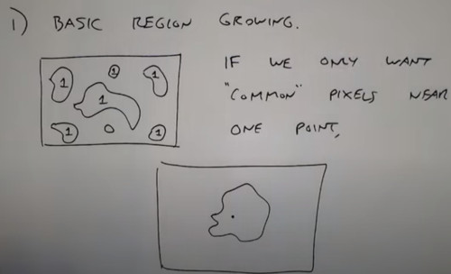
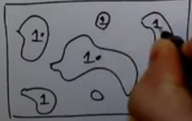
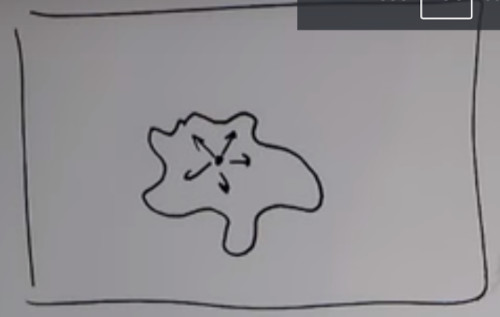
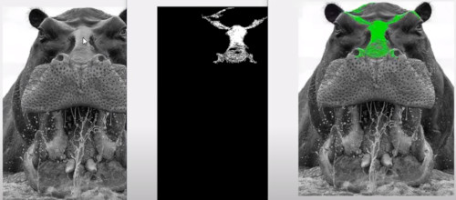
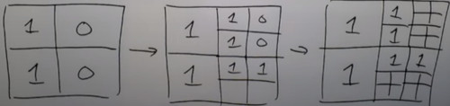
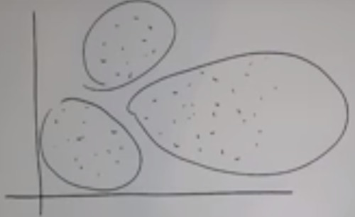
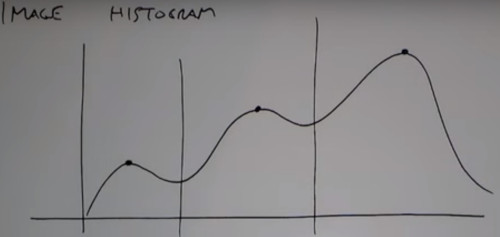
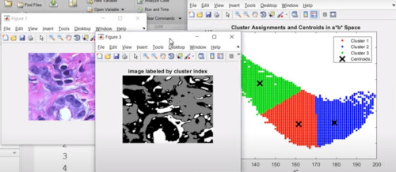
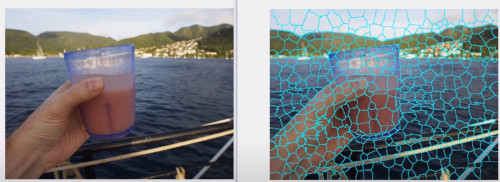
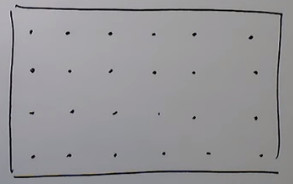

```
Author: Eichenbaum Daniel
Email: eichenbaum.daniel@gmail.com
```
This is a practical demo to understand the theory behind:
```
DIP Lecture 12a: Image Segmentation ¬Rich Radke
    https://www.youtube.com/watch?v=ZF-3aORwEc0&list=PLuh62Q4Sv7BUf60vkjePfcOQc8sHxmnDX&index=14

Textbook: 10.4-10.6 Digital Image Processing
  Gonzalez and Woods, 4th ed.  
  https://www.amazon.com/-/es/Rafael-Gonzalez/dp/0133356728  
```

# Lecture 13: Image segmentation

Introduction
  - Basic Region Growing
  If you threshold the whole image, what you may get is a disconnected regions that are above the threshold.
  You can clean some of this stuff with what its called "morphological image processing" where you can select the region you care so on.
  
  

  Basic algorithm to shrink each region to one point.

  1. From input image I(x,y), get a **Binary "Seed Image"** $S(x,y)S for locations of interest. (e.g. thresholding)
  There're ways to shrink them automatically.
    
  2. Reduce the seed image down to a single point (centroid) each blob of the seed. (e.g. erosion)
  3. Let new image $T(x,y)=1\ if\ I(x,y)\ satisfies some predicate$.
     e.g. all points connected to a given seed point $(x_i, y_i)$ and $|I(x,y) - I(x_i, y_i)|\le T$.

     For example given a point, find all intensities closer to that value.
      - keep growing the contour.
     

    ` matlab: grayconnected `
    


---

Region Split and Merge
    1. Specify a condition/rule Q
    2. Split into four dijoint quadrants any region $R_i$ for which $Q(R_i)=True$
    3. When no further splitting is possible, merge any adjacent regions $R_j$ and $R_k$ for which $Q(R_j \cap R_k)=True $
    4. Stop when no further merging is possible.
    



---

## Clustering and Superpixels.

In this section we discuss two related approaches to region segmentation. The first is a classical approach based on seeking clusters in data, related to such variables as intensity and color.  The second approach is based on using clustering to extract 'superpixels' from an image.



The idea of K-Means cluster is to gather N-dim data into a natural number of clusters K.
- you have to guess how many clusters $K$ there is going to be

    
1. Specify an initial set of cluster centers $\{m_1 .. m_k \}\in R^{d}$
2. For each $X_i\in R^{d}$ in dataset, assign it to the closest cluster $x_i\in cluster\ j\ \ \  if\ ||x_i - m_i||<||x_i - m_k||\ k\notin j$
3. Update the means $m_j$ to the average value of all $x_i$ in cluster $j$. $m_j=\frac{|C_j|}{1}\sum_{x\in C_j}\ j=1...K$
4. Keep alternating 2. and 3. until convergence, $m_j$ stop changing.

For example, given a grey histogram, you can run k-means with K = 3, and get the clusters.





Here K-means is used to cluser similar color pixels, however it doesn't consider the spatial allocation of neighboring pixels. 

## SLIC SUPERPIXELS: Simple, linear iterative clustering

Superpixels are a modification of K-means where regions that are contiguous and have smilar intensity or color.
- It represent a compact representation of the image
- Keeps things together better for subsequent segmentation
- A modification of K-means where you include spatial information



Idea:
- Clustering in 5D: [R G B X Y]
1) Initialize superpixel centers by sampling N locations on a regular grid
    - Move slightly to a 3x3 neighborhood to lie on the lowest gradient position (doesn't want to start on an edge)



2) For each cluster center $\mu_i$ compute distance (To be determined) between $\mu_i$ and each pixel and each pixel in a neighborhood of $\mu_i$ of size S
    - Assign those pixels to cluster $i$ if its distance is better than its current value.
    
3) Update the cluster centers like K-means
4) Repeat until convergence
5) [Optional] Replace colors of pixels in each cluster with the average color.

What is the distance function?
 - combination of color distance $d_c = || [R\ G\ B]_i^T - [r\ g\ b]_j^T||$
 - and the spatial distance $d_s = || [X\ Y]^T_i - [x\ y]^T_j|| $
 - So the final distance is computed as $D=\sqrt{\frac{d_c}{C}^2 + \frac{d_s}{S}^2}$
    Where C: Max color Distance
    Where S: Max Spatial distance
 - Use $C$ to tune tradeoff. C big: Superpixels compact, favor color distance small

Applications:

    - Compression 
    - Neural Network reconstruction
