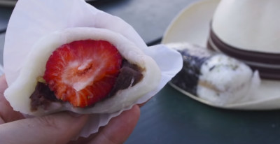
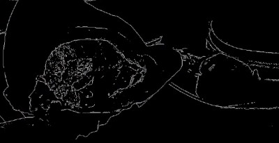
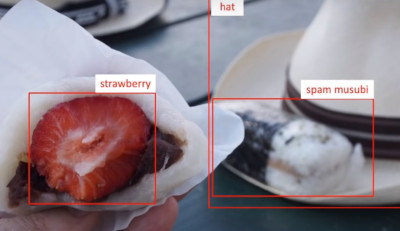

**NOTES of the Digital Image Processing course by Ruch Radke**

Source:
  Rich Radke Youtube channel:
  https://www.youtube.com/watch?v=UhDlL-tLT2U&list=PLuh62Q4Sv7BUf60vkjePfcOQc8sHxmnDX
  
  
  
## Lecture 1. Introduction

What is a digital Image?

Image Sources:
- Gamma Ray Imaging (High Energy)
    Patient get injected some sort of isotope, the gamma rays get detected by a detector
    - Medical, Cargo

- X-Ray (low energy)
    - Mendical, Cargo

- Computer Tomography

- Ultraviolet Imaging
  Sample with a fluorescent dye
- Measuring densities

Visible-Band Energy:
- Smartphones
- Light Microscope
- Satelite Imaging
- Infra Red (How hot something is)
- Manufacturing / Industrial inspection
- License plate recognition
- Biometrics
- Spacecraft Imaging
  

Micro-wave / Milimiter-wave (THz):
- Radar Image (RPI)
     

Radio-wave:
- MRI Magnetic Resonance Imaging (detail)
- Functional MRI (can detect certain proteins)

Non-photon-related imaging:
- Ultrasonic
- Electron Microscope (throwing electrons)
    

Synthetic Images
- Polution Map / weather map

## Types of Image Processing

### Low-Level Image Processing

- Preprocessing to 
    - remove Noise
    - Sharpen images
    - Enhance

    INPUT: IMAGE
    
    OUTPUT; IMAGE
 ### Mid-Level Image Processing
 
 - Segmenting an image into Regions/Objects describing an image
    - Diferenciate Cells

    INPUT: IMAGE
    
    OUTPUT: Attributes (edges, lines, regions)

 ### High-Level Image Processing
 
- Making sense of an image
- Understanding
- Computer Vision
- Object Recognition / Face Recognition

    INPUT: IMAGE
    
    OUTPUT: TASK
    

### Major Acquisition

- How Humans Brain & Eye & visual system works
- How do we represent image & color
- Biology
- How does Camaras adquire
- Cascade

### Image Manipulations & Enhancements

How to maje images betters to me
- Subjective Process like Photoshop
- Rotations 
- Brightness

### Image Restoration

How Much an image was alterated?
Can we undo the process?
- If we know an image has been blured, can we estimate how much?
- Near filter, Estimation filter

### Image Reconstruction from projections

### Image Compression

- Lossless formats (raw)
- Lossy formats (Jpeg)

### Image Segmentation

- Edges, Lines, Objects
- Detecting Primitives

### Image Understanding & Computer Vision

- Object Recognition

### Advanced Topics

- How do you compose objects
- A movie is a compositions of many objects
- Image Watermarking
- Visual Effects
