**NOTES of the Digital Image Processing course by Ruch Radke**

Source:
  Rich Radke Youtube channel:
  https://www.youtube.com/watch?v=UhDlL-tLT2U&list=PLuh62Q4Sv7BUf60vkjePfcOQc8sHxmnDX
  
  
  
## Lecture 1. Introduction

What is a digital Image?

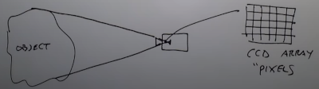

Image Sources:
- Gamma Ray Imaging (High Energy)
    Patient get injected some sort of isotope, the gamma rays get detected by a detector
    - Medical, Cargo

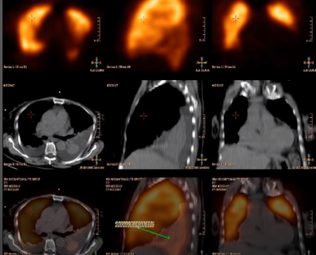
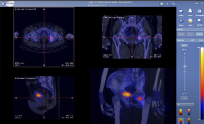

- X-Ray (low energy)
    - Mendical, Cargo

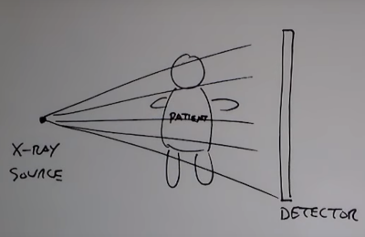
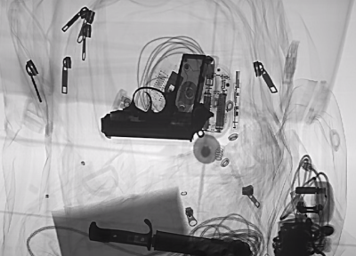

- Computer Tomography

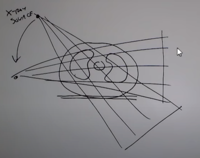

- Ultraviolet Imaging
  Sample with a fluorescent dye
  - Measuring densities

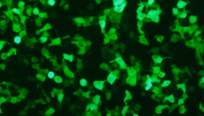
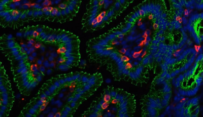
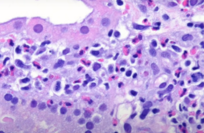

Visible-Band Energy:
  - Smartphones
  - Light Microscope
  - Satelite Imaging
  - Infra Red (How hot something is)
  - Manufacturing / Industrial inspection
  - License plate recognition
  - Biometrics
  - Spacecraft Imaging
  
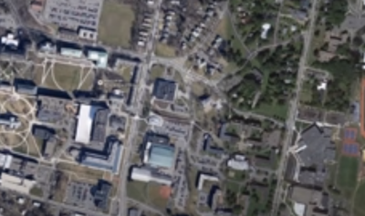
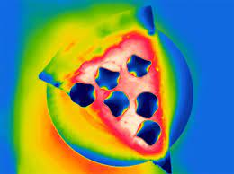

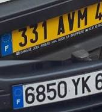
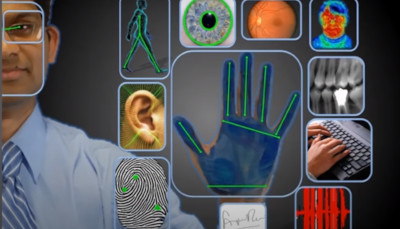

Micro-wave / Milimiter-wave (THz):
    - Radar Image (RPI)
     
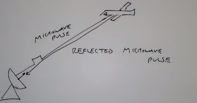

Radio-wave:
    - MRI Magnetic Resonance Imaging (detail)
    - Functional MRI (can detect certain proteins)

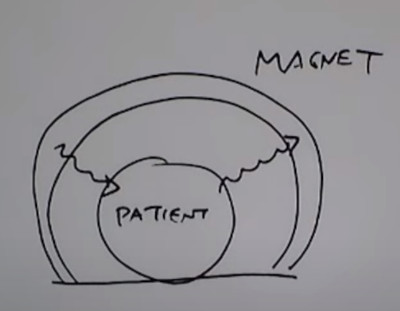
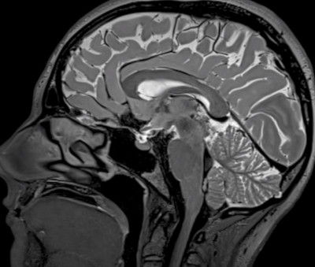
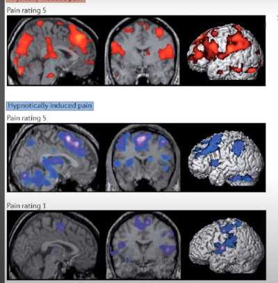

Non-photon-related imaging:
    - Ultrasonic
    - Electron Microscope (throwing electrons)
    
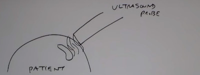
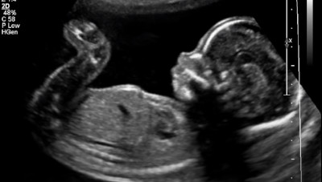
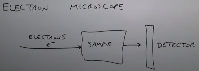

Synthetic Images
     - Polution Map / weather map

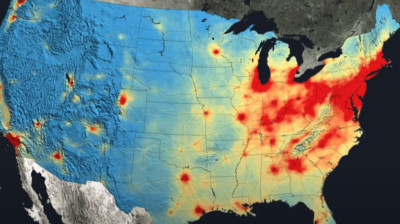
