# Lecture 10: Edge Detection
```
edge('sobel', 'prewitt', 'roberts', 'log','zerocross', 'canny',
```
- Spatial 2D filters do edge detection


# Edge definition
- Ideal edge
- Transition from one intensity to another intensity
  - Step Edge
  - Ramp edge
- You can look points where the first derivative is large
- Also you can check the second derivative, the center between a high rising flank and high falling flank

Ideal Edge


Real world Edge
- Noise is amplified


Low pass filter & Derivative
- Sobel, first smooth in one direction then derivative in the other


So Edge detection is related with derivatives (gradients) of the image
- Different ways to approximate the derivative
- Gradients points in the direction of thes highest rate of change of the function


Gradient is perpendicular to the edge direction
- Also you can describe it by its magnitude and angle

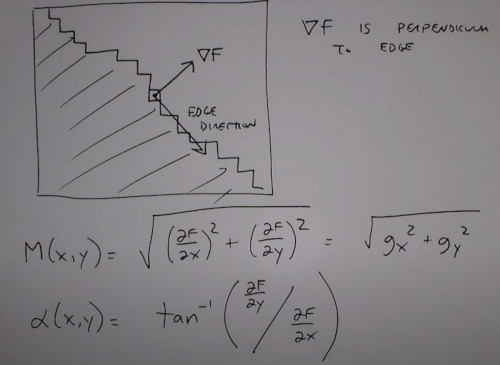

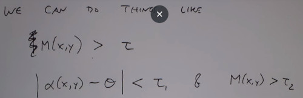

(in the next lecture, how to continue the edge line)

### Gradient operators

Laplacian of a Gaussian
- Aka Mexican Hat filter, Marr Hildreth
- An Edge operator that can be tuned to edges at different scales
- **Big Operators**: Large scale/Blurry edges
- **Small Operators**: Small scale/Fine detail

Gaussian Filter
- Sigma controls how wide my Gaussian is.
- small/big sigma narrow/spread out.

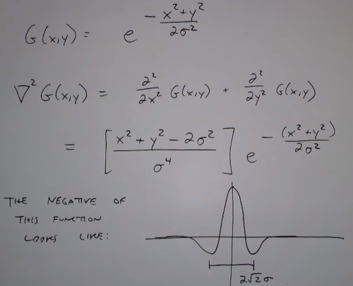

```
fspecial('log', [101, 101], 10) #laplacian of gaussian
```

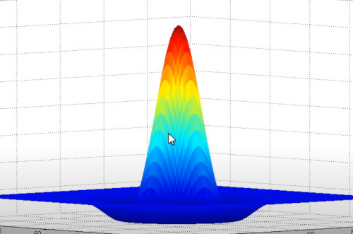

Idea
- Smooth the image down to a certain scale
- Find edges at that scale
- Look for zero-crossings of LoG operator (since its a second order derivative)

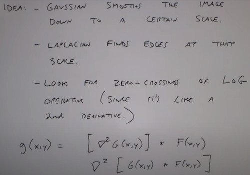

In the picture
- sigma = 3 you can see the detail of the nose
- sigma = 10 you can see the shape of the nose

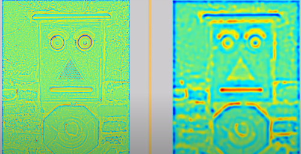

Difference of Gaussian (DoG)
- Can approximiate to the mexican hat
- Used in computer vision

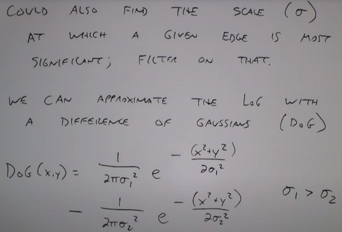

Scale-invariant feature transform (SIFT)
- Automatically finding good features in the image (corners, blobs)
- Uses DoG

Canny Edge detector
- Find the edge center, the sourroundings have no trivial magnitude. 
- Supress neighbors but keep the center

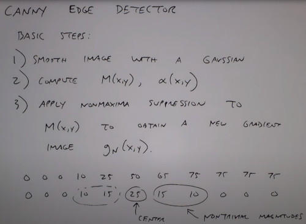

Idea
- Picking points which are locally greater than my neighbors
- in the estimate direction of my edge

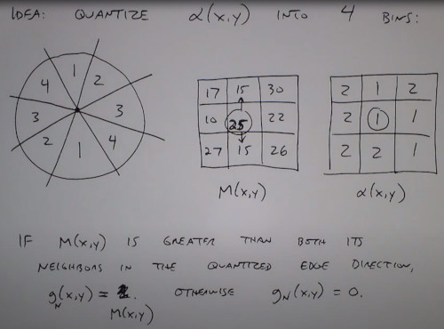

Then connect edges through a threshold
- You have a strong map and a weak map & 2 thresholds
- g_h: all strong pixels are in
- g_l: all edges adjacent to some strong pixel of g_h

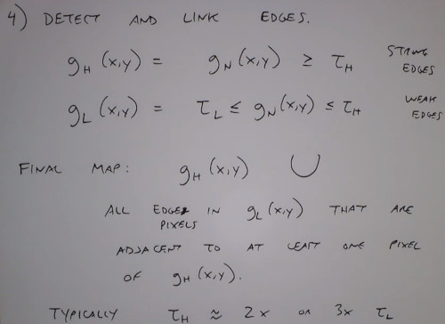

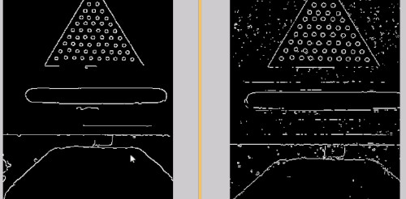

(Usefull for next lecture on connecting edges and finding bounds)
