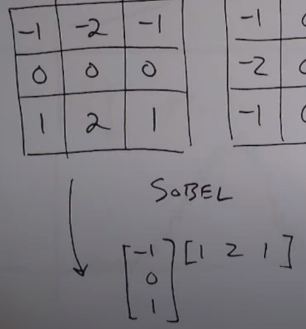

# Lecture 10: Edge Detection

- Spatial 2D filters do edge detection

# Edge definition
- Ideal edge
- Transition from one intensity to another intensity
  - Step Edge
  - Ramp edge
- You can look points where the first derivative is large
- Also you can check the second derivative, the center between a high rising flank and high falling flank

Ideal Edge

Real world Edge
- Noise is amplified

Low pass filter & Derivative
- Sobel, first smooth in one direction then derivative in the other

So Edge detection is related with derivatives (gradients) of the image
- Different ways to approximate the derivative
- Gradients points in the direction of thes highest rate of change of the function

